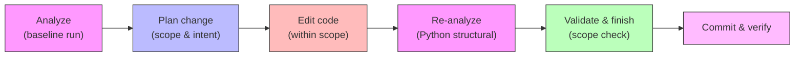

# Development guide

## What it is

CodeClone's development workflow combines structural analysis of Python code with a change-control layer that guards repository edits. The core `codeclone` package provides CLI tools and structural metrics. An optional MCP surface adds AI-assisted workflow support through controlled edit cycles.

## When to use it

Use this guide if you are:
- Contributing code or documentation to CodeClone
- Setting up a development environment to work on the codebase
- Learning how CodeClone's structural contracts work in practice
- Preparing changes for review or release

## Basic workflow

The workflow ensures your changes respect structural boundaries and contract versions. For documentation-only changes, the cycle is lighter. For Python code changes, full structural verification is required.

## Key commands

| Task | Command | Notes |
|------|---------|-------|
| Install (base) | `uv sync` | Base package without MCP support |
| Install (with MCP) | `uv sync --all-extras` | Includes optional MCP surface |
| Analyze repository | `codeclone .` | Baseline structural run |
| Run tests | `uv run pytest -q` | Full test suite |
| Run pre-commit | `uv run pre-commit run --all-files` | Lint and format checks |
| View reports | Open `.codeclone/report.html` | Visual metrics and findings |

The MCP surface (when installed) provides additional workflow commands through your IDE or agent interface. It is optional; the base `codeclone` CLI works independently.

## Common mistakes

| Mistake | Impact | Prevention |
|---------|--------|-----------|
| Skipping analysis before editing | Undetected structural drift | Always run baseline analysis first |
| Editing files outside declared scope | Scope violation on finish | Declare full scope up front; expand only with approval |
| Using stale structural data | Missed regressions | Re-analyze after code changes before finishing |
| Mixing edit paths for Python files | Incomplete verification | Use workflow tools (not atomic) for Python structural changes |
| Hardcoding tool/contract counts | Version lockstep failures | Derive from source of truth (test fixtures, contract imports) |
| Trusting a green test as proof | Hollow tests that never fail on the defect they claim to guard | Mutate the pinned behavior and confirm the test reds (see Mutation evidence below) |

The MCP surface fails closed: if not installed, edit-cycle tools are unavailable (the base CLI continues working). Do not assume MCP tools are present.

## Mutation evidence

Writing a test that passes is not the same as proving the test would fail if the code broke. Red-first shows a test was red once; **mutation** shows it dies when the exact behavior it pins breaks. In this project, every load-bearing fix or claim must ship *mutation evidence*: revert or corrupt the exact production behavior the test pins, and confirm the test turns red. A test that stays green when its behavior is reverted is a hollow test — strengthen it until it dies. Where a fix corrects a value or classification, mutate in both directions; each opposite error must red under a different test.

Three hollow-test classes are worth naming, because a passing suite hides all three:

- **Relative-invariant hole.** Tests that only assert relationships (`prose <= its measure`, `A > B`) stay green for any value of the underlying constant. Pin the rule that *derives* the number — re-derive or re-measure it — so that changing the literal constant reds the test, instead of writing `assert x == 780`, which just moves the magic number into the test.
- **Guard unreachable in every configuration.** A guard whose protected path can never fire in any configuration is structurally dead. If reverting the guarded behavior changes nothing observable, the guard never ran. When you add a guard, prove by mutation that some input reaches and trips it.
- **Success masked by a sibling.** A run can look green because a parallel mechanism did the work, not the one under test. Isolate and probe each mechanism alone; "the batch was green" is not "this rule fired".

"Informal" here means targeted manual mutations — revert-the-behavior probes covering the defect class — not necessarily a mutation-testing framework. For the full normative statement, see [Mutation evidence in the contribution guide](https://github.com/orenlab/codeclone/blob/main/CONTRIBUTING.md).

## Next steps

For detailed contribution requirements, validation commands, code style, and commit conventions, see the [normative contribution guide](https://github.com/orenlab/codeclone/blob/main/CONTRIBUTING.md) at the repository root. That guide covers:
- Full validation and test commands
- Commit message format and scopes
- Code style expectations
- Pre-commit hook requirements

Start with `uv sync`, review the current structural metrics with `codeclone .`, then work through your changes using the workflow above.
