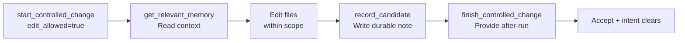

## What it is

Engineering Memory is a persistent, evidence-linked record of repository facts: decisions, rationales, risks, and lessons learned from changes. It lives in a local SQLite database and uses semantic indexing and temporal tracking to answer "what did we learn?" and "what must the next agent know?"

Unlike chat history (ephemeral, context-limited), Engineering Memory survives session boundaries and powers retrieval across edits, branches, and agents.

## When to use it

Write to Engineering Memory when your edit involves:

- **Incident or workaround**: verification surprise, scope violation recovery, blocked step, foreign intent friction
- **Non-obvious complexity**: multi-file debug, near boundary code, stale memory acted upon
- **Decision or tradeoff**: design choice, integration quirk, "next agent must not repeat X"

Skip for trivial changes (typo, one obvious line).

## Basic workflow

## Key commands

| Action | Command | Notes |
|--------|---------|-------|
| Retrieve context | `get_relevant_memory(root=..., scope=... \| intent_id=...)` | After edit_allowed=true. Read corroboration_status. |
| Write a note | `manage_engineering_memory(action=record_candidate, record_type=risk_note \| change_rationale, statement=..., subject_path=...)` | Before finish. Max 1000 chars. Target ≤300. |
| Search memory | `query_engineering_memory(mode=for_path \| search \| stale \| trajectory_*)` | Read-only inspection; use get_relevant_memory for edits. |
| Approve drafts | VS Code Memory view (human only) | Agents cannot approve via MCP; use UI. |

## Common mistakes

- **Treating chat as memory**: Text summaries evaporate at context shrink. Use MCP to persist.
- **Ignoring corroboration_status**: "path_only" = background framing only, not fresh confirmation. "unverified" = do not assert as current behavior.
- **Expanding scope silently**: If the fix touches files outside declared scope, stop and ask for approval before editing.
- **Forgetting record_candidate before finish**: MUST NOT finish non-trivial cycles without memory write. Incident, complexity, or decision triggers apply → record first.
- **Stale memory as gospel**: contradiction_note alerts mean context changed. Re-verify stale records before acting.

## Next steps

- Read the Engineering Memory concepts guide: `docs/concepts/engineering-memory.md`
- Review tests: `tests/test_cli_memory_*.py` for CLI workflow, `tests/test_mcp_memory_*.py` for MCP integration
- For detailed mode reference: `query_engineering_memory(mode=...)` help in codeclone CLI
