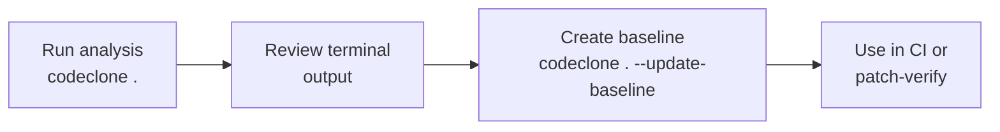

# Run the first analysis

## What it is

CodeClone's **analysis** scans your Python repository for code structure patterns: duplicated logic (clones), complexity metrics, dependency cycles, and dead code. The analysis produces a baseline cache file and structured reports you can review on the command line, in HTML, or via JSON.

## When to use it

Run an analysis when you:
- Start using CodeClone in a new repository (establish a baseline)
- Review changes in a pull request (verify no new structural issues)
- Set up CI gating on code quality metrics
- Export findings for integration with other tools

## Basic workflow



Start with a basic analysis pointing to your repository root:

```bash
codeclone .
```

This scans all Python files, detects clones and metrics, and prints a summary to the terminal. On first run, no baseline exists yet—findings are reported without baseline comparison.

To save results for future comparisons, create a baseline:

```bash
codeclone . --update-baseline
```

The baseline is stored in `codeclone.baseline.json` at the repository root and used to identify new findings in subsequent runs.

## Key commands

| Command | Purpose |
|---------|---------|
| `codeclone .` | Run full analysis in current directory |
| `codeclone . --json [FILE]` | Export results as JSON (default: `.codeclone/report.json`) |
| `codeclone . --html [FILE]` | Generate interactive HTML report (default: `.codeclone/report.html`) |
| `codeclone . --update-baseline` | Create or update `codeclone.baseline.json` |
| `codeclone . --patch-verify` | Verify current working tree against baseline (for PR review) |
| `codeclone . --processes N` | Run analysis with N parallel workers (default: 4) |

For more options, see `codeclone --help`.

## Common mistakes

**Mistake 1: Running analysis in CI without a committed baseline**
If you push code without committing `codeclone.baseline.json`, CI cannot detect new findings. Always commit the baseline file to git.

**Mistake 2: Ignoring threshold warnings in the terminal**
CodeClone prints warnings for complexity, coupling, and clone counts that exceed defaults. Set explicit thresholds with `--fail-threshold`, `--fail-complexity`, etc., to gate CI.

**Mistake 3: Treating the first analysis as complete quality assessment**
Initial findings reflect the current state, not regression. After creating a baseline, new findings indicate changes. Establish your baseline before declaring quality targets.

## Next steps

- **Integrate into CI:** Use `codeclone . --ci --patch-verify` to gate pull requests on new findings.
- **Review the HTML report:** Run `codeclone . --html --open-html-report` to inspect findings interactively.
- **Set quality gates:** Configure fail conditions with `--fail-complexity`, `--fail-cycles`, `--fail-dead-code` for your project's standards.
- **Enable Engineering Memory:** Use `codeclone memory init` to track structural decisions and incident notes alongside code changes.
