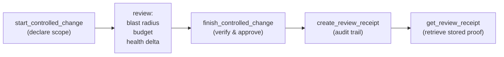

## What it is

A review is a bounded, auditable assessment of a code change: scope, risk, structural health, and decision. CodeClone captures the full forensic trail—from intent declaration through verification—as immutable audit events. Review receipts document what was reviewed, what found, and what was decided.

## When to use it

- Before merging a pull request, validate that changes stay within scope and meet structural health gates
- Document why a change was approved despite warnings or findings
- Retrieve exact evidence of what was reviewed (blast radius, patch health, coverage gaps)
- Prove that a decision was made with deterministic structural evidence, not gut feel

## Basic workflow

The workflow is:

1. **Declare intent**: run `start_controlled_change` with scope (files, packages) and intent description
2. **Inspect risk**: fetch blast radius, budget burn, and patch health
3. **Verify & approve**: run `finish_controlled_change` with evidence (after-run ID for Python structural changes)
4. **Create receipt**: generate audit-backed markdown or JSON proof of the review decision
5. **Retrieve later**: fetch stored receipts from the audit trail by run ID or digest

## Key commands

| Task | Tool | Notes |
|------|------|-------|
| Declare what you're changing | `start_controlled_change` | Returns intent_id, budget, blast radius. Requires prior analysis run. |
| Check scope & health impact | `get_blast_radius` | Summarizes direct dependents, coverage gaps, do-not-touch paths. |
| Verify after edit | `finish_controlled_change` | Runs structural checks for Python patches. Returns status (accepted/violated/unverified). |
| Generate proof | `create_review_receipt` | Produces markdown or JSON receipt: scope, findings, decision, timestamp. |
| Retrieve review trail | `get_review_receipt` | Fetch stored receipt from audit trail by run or digest. |
| Validate review text | `validate_review_claims` | Checks that your review claim matches report semantics (e.g., "no new regressions" requires before/after evidence). |
| Inspect patch trail | `get_patch_trail` | Full forensic log: declared files, changed files, untouched files, verification details. |

## Common mistakes

**Forgetting to declare scope.** Calling `finish_controlled_change` without a prior `start_controlled_change` returns "Unknown change intent id." Always start first.

**Changing files outside declared scope.** If you edit a file not listed in scope, `finish_controlled_change` returns a scope violation. Either expand scope via a new `start` call or revert the out-of-scope changes.

**Skipping the after-run for Python changes.** If you modify any `.py` or `.pyi` file, `finish_controlled_change` requires `after_run_id`. Run `analyze_repository` after edits and pass the run ID.

**Starting a second intent without finishing the first.** MCP sessions track only one active intent. Starting again evicts the previous one with no recovery. Always call `finish` or `manage_change_intent(action="clear")` before starting a new change.

**Claiming "no regressions" without evidence.** `validate_review_claims` will detect if you claim no patch-local regression but your before/after runs show a negative health delta. State only what the evidence supports.

## Next steps

- Read the change control workflow in CLAUDE.md for the full protocol, including recovery and memory write rules
- Use `get_implementation_context` to bound the scope before declaring intent
- Review `validate_review_claims` to understand what claims require structural evidence
- Store incident or complexity notes via Engineering Memory before finishing (mandatory when the edit cycle involved incident, surprise, multi-file debug, or non-obvious root cause)
