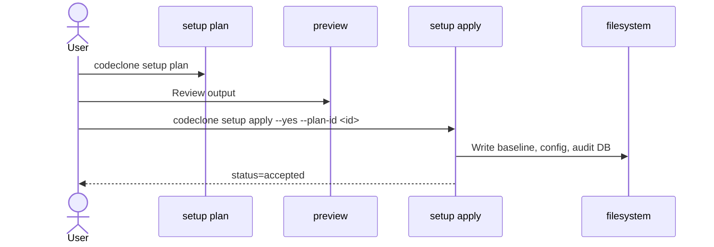

## What it is

`codeclone setup apply` mutates your project filesystem to initialize CodeClone governance. It:

- Installs a baseline snapshot of your code's structural metrics
- Creates governance configuration files
- Sets up intent tracking and audit logging
- Prepares the project for controlled change workflows

Setup is **read-only** until you explicitly confirm changes.

## When to use it

Run setup when:

- Initializing CodeClone in a new project
- Re-establishing governance after a reset
- Applying a reviewed plan to the filesystem

Do **not** run setup if another engineer is actively using CodeClone on the same project (governance intent conflicts will block execution).

## Basic workflow

## Key commands

| Command | Purpose | Flags |
|---------|---------|-------|
| `codeclone setup plan` | Preview all proposed changes | (none required) |
| `codeclone setup apply --dry-run` | Simulate execution without writing | `--dry-run` |
| `codeclone setup apply --yes` | Execute interactively or confirm with yes | `--yes` (required for CI) |
| `codeclone setup apply --plan-id <ID>` | Bind apply to a previewed plan; fail if plan is stale | `--plan-id <ID>` |

### Safety guarantees

- **Confirmation-required**: interactive apply halts until you type `yes` or `no`
- **Plan binding**: `--plan-id` verifies plan hasn't changed; mismatch exits `2` (`status=stale_plan`)
- **Dry-run isolation**: `--dry-run` shows what would happen without touching files

## Common mistakes

**Mistake:** Running `setup apply --yes` on a stale plan from earlier in the session
**Fix:** Re-run `codeclone setup plan` and use the new `--plan-id`

**Mistake:** Running setup while another developer holds an active governance intent
**Fix:** Wait for their intent to clear, or coordinate scope separately

**Mistake:** Assuming readiness status is final before apply
**Fix:** Readiness is derived fresh during apply; edge-case config issues may appear then

## Next steps

After `setup apply` succeeds:

1. Commit the generated baseline and configuration
2. Review the audit log at `.codeclone/db/audit.sqlite3` to verify what was written
3. Run `codeclone .` to confirm the baseline is correct
4. Begin using controlled-change workflows for code modifications
