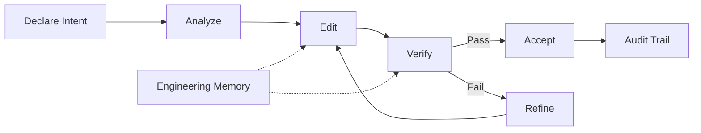

# CodeClone

## What CodeClone is

CodeClone is a deterministic structural controller for Python codebases. It provides change-control governance, code health analysis, and integration with AI-assisted development workflows. CodeClone enforces intent-driven edits through a workspace-aware protocol that tracks patches, verifies scope boundaries, and maintains audit trails.

## Core workflow

CodeClone operates through a declared-intent model:

1. **Declare intent** — articulate the scope and purpose of your change
2. **Analyze** — run structural analysis to establish baseline metrics and dependencies
3. **Edit** — make changes within the declared scope with real-time workspace awareness
4. **Verify** — re-analyze and validate that changes stay within scope and meet quality gates
5. **Accept** — finish the intent when verification passes, clearing the workspace for the next change

This workflow prevents silent scope creep, catches architectural violations early, and maintains a durable audit trail of who changed what and why.

## Where to start

CodeClone integrates into your development environment through MCP (Model Context Protocol). If you are using Claude Code or Claude Desktop with CodeClone enabled:

- Start with the change-control workflow when making edits to Python code or governance config
- Use analysis commands to understand code health, architecture coupling, and test coverage
- Reference the Engineering Memory store to review past decisions and avoid repeating mistakes
- Consult skill documentation for specialized workflows (e.g., release audits, security reviews)

*Documentation gap: specific CLI commands, configuration keys, and skill names are not available in this overview context. See the full documentation for command reference and configuration details.*

## Key concepts

| Concept | Definition |
|---------|-----------|
| **Intent** | A declared change operation with defined scope, purpose, and workspace state |
| **Scope** | The set of files and code regions the intent is permitted to modify |
| **Verification** | Structural analysis that checks scope boundaries, quality metrics, and test coverage |
| **Baseline** | A stored snapshot of metrics and artifacts from a previous analysis run |
| **Engineering Memory** | A durable local store of evidence-linked facts, decisions, and past findings |
| **Patch Contract** | The verification model that determines which structural checks apply to a change |
| **Health Score** | A composite metric combining complexity, coupling, cohesion, coverage, and clones |

## Integrations

CodeClone integrates with:

- **Claude Code** and **Claude Desktop** — via MCP for intent-driven edits and governance
- **VS Code** — Memory view for approving and managing engineering memory records
- **Git** — workspace and git state awareness for intent tracking and audit trails
- **Python testing** — coverage and test integration for health metric computation
- **SARIF, JSON, Markdown, HTML** — multiple report formats for analysis results

## Reference

- **Repository**: https://github.com/orenlab/codeclone
- **Issues**: https://github.com/orenlab/codeclone/issues
- **Documentation**: https://orenlab.github.io/codeclone/
- **Version**: 2.1.0a1

For full architecture, contract specifications, and the agent playbook, see `AGENTS.md` in the repository.

