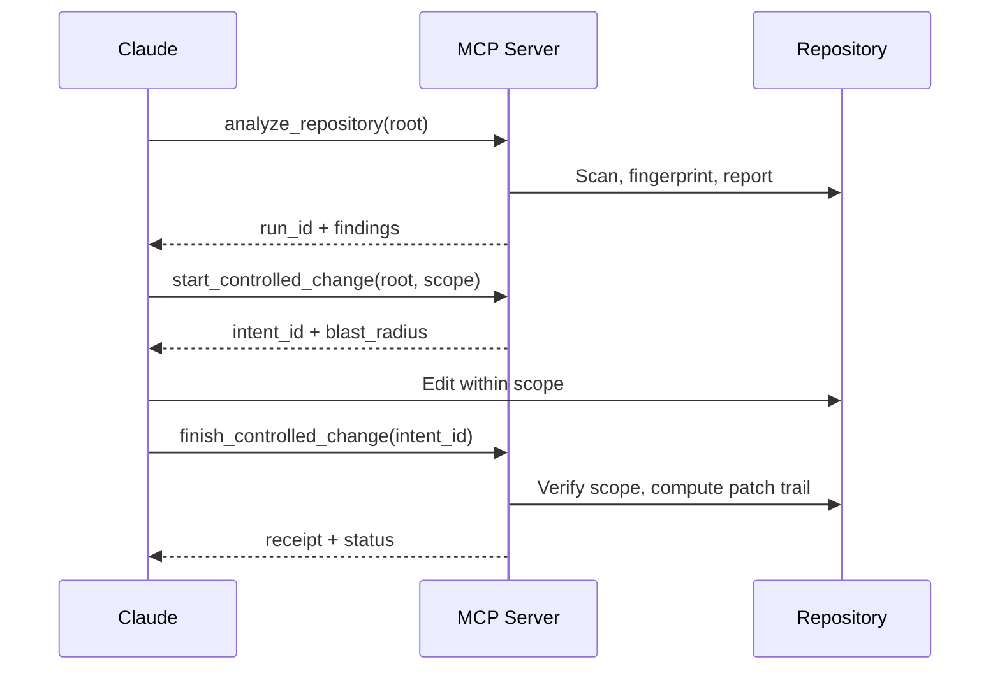

## What it is

CodeClone integrates with Claude (via MCP) to provide deterministic change control and structural governance during AI-assisted development. The MCP server exposes 38 tools spanning analysis, inspection, triage, change control, engineering memory, and audit/receipts. See the [MCP tools reference](../reference/mcp-tools.md) for the full catalog.

When Claude edits your code, CodeClone's MCP tools track changes against a declared scope, compute impact zones (blast radius), and verify that edits conform to your repository's structural contracts.

## Install

CodeClone ships a **Claude Code plugin** that wires up the MCP server and bundles change-control skills.

1. Install the CodeClone MCP runtime:

   ```bash
   uv tool install --prerelease allow "codeclone[mcp]"
   ```

2. Add the marketplace and install the plugin from Claude Code:

   ```text
   /plugin marketplace add orenlab/codeclone-claude-code
   /plugin install codeclone
   ```

The plugin launches the server with `python3 ${CLAUDE_PLUGIN_ROOT}/scripts/launch_mcp.py` (transport `stdio`). No manual `.mcp.json` editing is required.

## Bundled skills

The plugin registers ten skills that route to the right CodeClone workflow:

| Skill | Purpose |
|-------|---------|
| `codeclone-change-control` | Mandatory edit gate: `start`/`finish` controlled change |
| `codeclone-review` | Structural review of a repository or changed files |
| `codeclone-production-triage` | Fast production-first triage and next action |
| `codeclone-architecture-triage` | Rank demonstrated architectural problems |
| `codeclone-blast-radius` | Inspect dependents and risk before editing |
| `codeclone-implementation-context` | Bound the implementation frontier before broad search |
| `codeclone-hotspots` | Quick health / top-risk snapshot |
| `codeclone-engineering-memory` | Retrieve and preserve evidence-linked memory |
| `codeclone-setup` | Probe and configure repository readiness |
| `codeclone-platform-observability` | Maintainer-only runtime diagnostics |

## When to use it

- **Before editing code**: Call `start_controlled_change` to declare intent, get blast-radius visibility, and reserve workspace state.
- **After editing code**: Call `finish_controlled_change` to verify scope conformance, structural integrity, and generate an audit receipt.
- **During analysis**: Use `analyze_repository` to capture a baseline, then `analyze_changed_paths` for PR-focused review.
- **For triage**: Call `get_production_triage` first on noisy repositories; drill down with `get_implementation_context` for bounded structural facts.

## Basic workflow



## Key commands

| Task | MCP Tool | Notes |
|------|----------|-------|
| Run full analysis | `analyze_repository` | Pass absolute root; required before `start_controlled_change` |
| Declare edit intent | `start_controlled_change` | Returns `intent_id` and blast radius; gates edit permission |
| Get triage snapshot | `get_production_triage` | Health, cache freshness, hotspots—start here on complex repos |
| Fetch implementation context | `get_implementation_context` | Bounded structural facts: calls, dependencies, coverage, trajectories |
| Verify and finalize | `finish_controlled_change` | Hygiene check, scope reconciliation, receipt generation |
| Generate PR summary | `generate_pr_summary` | Compact Markdown summary for changed files |
| Retrieve audit trail | `get_patch_trail` | Full forensic evidence: declared/changed/untouched files, scope check |

## Common mistakes

1. **Starting without a prior analysis run**
   - Error: `start_controlled_change` fails if no valid run exists.
   - Fix: Call `analyze_repository` first.

2. **One intent per session**
   - An MCP session holds exactly one active change-control intent. Starting a new `start_controlled_change` before finishing the current one evicts the old one from tracking.
   - Fix: Always finish before starting a new intent, or use separate MCP sessions.

3. **Relative paths instead of absolute**
   - MCP tools reject relative paths like `"."` for analysis.
   - Fix: Use absolute paths (e.g., `/Users/you/project/`).

4. **Scope expansion without declaration**
   - Editing files outside your declared scope triggers scope violations at finish time.
   - Fix: If the fix requires new files, expand scope via a fresh `start_controlled_change` before editing.

5. **Ignoring stale memory warnings**
   - Engineering Memory may contain outdated constraints from prior runs.
   - Fix: Call `get_relevant_memory` after `start_controlled_change` and read `contradiction_note` alerts.

## Next steps

- Read the **MCP workflow** contract in `help(topic="overview")` for compact topic guidance.
- Use **change-control help** for detailed `start`/`finish` semantics, partial enforcement, and blast-artifact drill-down.
- Consult **Engineering Memory help** for evidence lanes, scope hygiene, and `get_memory_projection_page` continuation.
- Start with `get_production_triage` on your repository to understand its health and hotspots.
