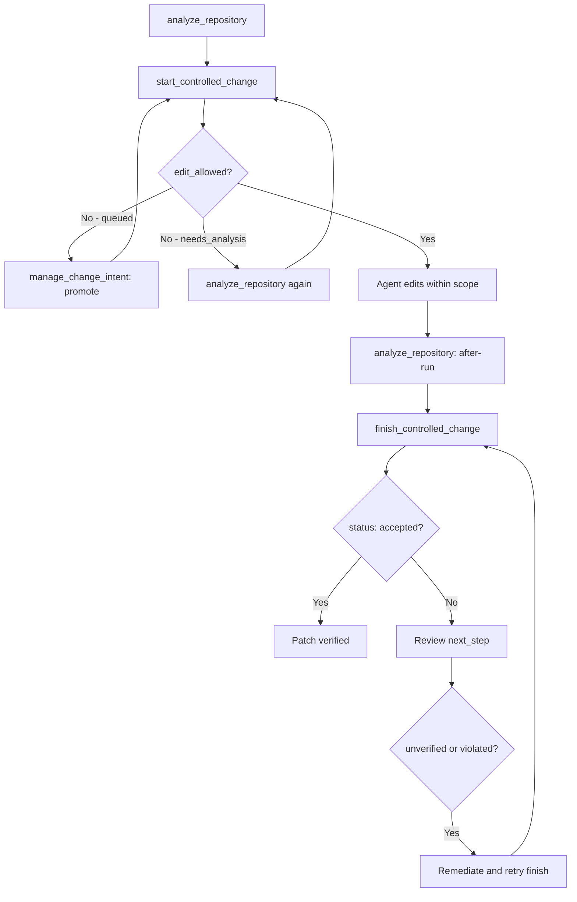

## What it is

CodeClone integrates with **OpenAI Codex** (the Codex CLI/agent) via MCP (Model Context Protocol). It provides deterministic workflow tools—`start_controlled_change`, `finish_controlled_change`, and supporting utilities—that enable AI-assisted code changes with structural verification and scope governance. The Codex plugin launches the server with `python3 ./scripts/launch_mcp`.

The integration works alongside CodeClone's baseline analysis (`analyze_repository`) to deliver:
- Pre-edit intent declaration with blast-radius budgets
- Post-edit scope verification and change validation
- Workspace coordination for concurrent agent work
- Auditable patch trails and receipts

## When to use it

Use Codex integration when:

| Scenario | Solution |
|----------|----------|
| A Codex agent is editing your repository | Call `start_controlled_change` before edits; `finish_controlled_change` after |
| Multiple agents work on overlapping scopes | Use `manage_change_intent` to queue and promote intents |
| You need proof of scope boundaries | `get_blast_radius` and `get_patch_trail` provide forensic trails |
| Verifying patch health before merge | `check_patch_contract` validates structural and governance rules |
| Auditing what changed and why | `create_review_receipt` generates deterministic receipts |

## Basic workflow



## Key commands

### Pre-edit: Declare intent and check workspace

```python
# Step 1: Ensure a baseline analysis exists
result = analyze_repository(root="/abs/path/to/repo")

# Step 2: Declare change intent with scope
response = start_controlled_change(
    root="/abs/path/to/repo",
    scope={"allowed_files": ["src/module.py", "tests/"]},
    intent="Fix concurrency bug in worker queue"
)

if response.status == "active" and response.edit_allowed:
    # Proceed to editing
    pass
elif response.status == "queued":
    # Another agent is editing; wait for promotion
    manage_change_intent(
        action="promote",
        intent_id=response.intent_id
    )
```

### During edit: Inspect blast radius and context

```python
# Query structural dependents before editing (uses the latest run)
blast = get_blast_radius(
    files=["src/module.py"]
)
# Review blast.do_not_touch and blast.direct_dependents

# Get implementation context for precise code facts
context = get_implementation_context(
    root="/abs/path/to/repo",
    paths=["src/module.py"]
)
```

### Post-edit: Verify and finalize

```python
# Step 1: Run structural analysis on the modified repo
after_run = analyze_repository(root="/abs/path/to/repo")

# Step 2: Verify patch contract and scope
finish_response = finish_controlled_change(
    intent_id="intent-<id>",
    changed_files=["src/module.py", "tests/test_module.py"],
    after_run_id=after_run.run_id
)

if finish_response.status == "accepted":
    # Patch is verified and safe to commit
    print("Patch accepted")
elif finish_response.status == "unverified":
    # Follow next_step guidance
    print(f"Next step: {finish_response.next_step}")
elif finish_response.status == "violated":
    # Scope mismatch; expand or remove out-of-scope changes
    print(f"Block reason: {finish_response.finish_block_reason}")
```

### Audit and receipts

```python
# Generate a deterministic review receipt
receipt = create_review_receipt(
    intent_id="intent-<id>",
    run_id="<before-run-id>"
)

# Fetch durably stored patch trail
trail = get_patch_trail(run_id="<run-id>")
# Shows declared files, changed files, untouched files, scope check, verification
```

## Common mistakes

### 1. Not running `analyze_repository` first

`start_controlled_change` requires an existing analysis baseline. If you skip it, the response returns `status: "needs_analysis"`.

**Fix:** Always run `analyze_repository(root="<abs>")` before calling `start_controlled_change`.

### 2. Editing before `edit_allowed: true`

If `start_controlled_change` returns `edit_allowed: false` (e.g., due to concurrent foreign intent), do not edit yet.

**Fix:** Check `response.status`. If `"queued"`, wait. If `"blocked"`, narrow scope or coordinate. Only edit when `edit_allowed == true` AND `status == "active"`.

### 3. Calling `start_controlled_change` twice in one session

An MCP session tracks only one active intent. Calling `start_controlled_change` again before `finish_controlled_change` evicts the first intent from tracking, causing "Unknown change intent id" on finish.

**Fix:** Call `finish_controlled_change` (or `manage_change_intent(action="clear")`) before starting a new intent.

### 4. Not passing `after_run_id` to `finish_controlled_change`

For Python structural changes, the finish step requires `after_run_id` from a post-edit analysis run. Without it, the response returns `status: "unverified"`.

**Fix:** Always run `analyze_repository` after editing Python files, then pass the result's `run_id` to `finish_controlled_change(after_run_id=...)`.

### 5. Ignoring scope violations

If `finish_controlled_change` returns `finish_block_reason: "missing_evidence"` or `"foreign_dirty_overlap"`, the patch is not accepted. Do not bypass with claims.

**Fix:** Reconcile the actual changes against your declared scope. Expand scope via a new `start_controlled_change` if the fix requires files outside the original boundary.

## Next steps

- **Detailed contract reference:** Read the change-control help topic with `help(topic="change_control")` in MCP.
- **Implementation context:** Use `get_implementation_context` to explore module dependencies, call graphs, and coverage gaps before editing.
- **Engineering Memory:** Store durable observations and lessons about your changes via `manage_engineering_memory` to inform future work.
- **Examples:** Review generated PR summaries with `generate_pr_summary(format="markdown")` to see how CodeClone documents patch impact.
