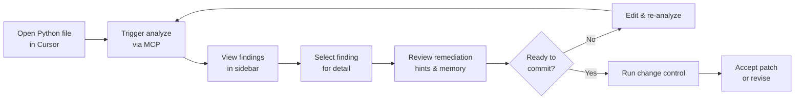

## What it is

The CodeClone MCP integration for Cursor enables AI-powered code analysis and change control directly in the editor. Through Cursor's MCP (Model Context Protocol) server support, you can run CodeClone analysis, review patch contracts, and track engineering memory without leaving your IDE.

## When to use it

Use the Cursor integration when you:

- Need live structural feedback on Python code before committing
- Want change control gates on risky patches (high complexity, coupling, or clones)
- Track and recover from previous analysis decisions via engineering memory
- Review PR quality across your team using standardized baselines
- Debug reproducible findings (clones, dead code, structural issues)

## Basic workflow



## Key commands

The integration exposes these MCP tools through Cursor's interface:

| Command | Purpose | When to use |
|---------|---------|-------------|
| `analyze_repository` | Full structural analysis from repo root | First pass, before major refactoring |
| `analyze_changed_paths` | Focused review of changed files only | During PR review, local branches |
| `start_controlled_change` | Declare intent, compute blast radius | Before editing large chunks |
| `finish_controlled_change` | Verify patch, record trail, accept/reject | After editing, before commit |
| `get_implementation_context` | Bounded structural & call-graph facts | Planning edits, understanding scope |
| `get_production_triage` | Health snapshot with hotspots | Quick health check |

## Configuration

Add `.cursor/settings.json` to enable the MCP server (auto-configured on first install):

```json
{
  "mcpServers": {
    "codeclone": {
      "command": "python",
      "args": ["-m", "codeclone.surfaces.mcp"],
      "env": {
        "CODECLONE_ROOT": "${workspaceFolder}"
      }
    }
  }
}
```

## Common mistakes

**Mistake 1: Absolute paths in MCP calls**
MCP tools require absolute repository roots. Relative paths like `.` are rejected. Always pass the full workspace path.

**Mistake 2: Forgetting `start_controlled_change` before editing**
Declaring intent first ensures the change control workflow captures blast radius and budget. Skipping it makes `finish_controlled_change` unable to verify scope.

**Mistake 3: Mixing before and after analysis runs**
For Python structural changes, you must run `analyze_repository` before editing and again after. A single run cannot verify both states.

**Mistake 4: Ignoring stale memory warnings**
Engineering memory may reference outdated decisions or contradictions. Always review memory alerts before relying on recorded facts.

## Next steps

- Read [Engineering Memory](../concepts/engineering-memory.md) to understand how CodeClone tracks decisions across sessions
- Explore MCP tool details with `codeclone-mcp help` in your terminal
- Set up baseline thresholds in `pyproject.toml` to match your team's standards
- Review [PR summary generation](../examples/report.md) for integrating CodeClone into CI
