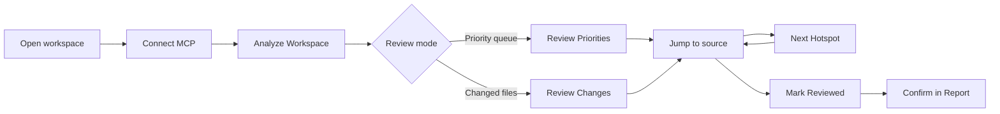

## What it is

CodeClone for VS Code is a native IDE surface for baseline-aware structural analysis. The extension connects to `codeclone-mcp` (the local MCP server), giving you triage-first access to repository health, new regressions, and changed-file findings directly in the editor. It is not a linter panel; structural review remains repository-read-only and driven by the same canonical report as the CLI.

## When to use it

Use the extension when you want to:

- **Review structural changes before committing** — scope analysis to your current diff and see new findings against the baseline.
- **Understand blast radius** — visualize how your changes impact dependent modules, complexity, and coverage.
- **Approve and govern changes** — mark findings as reviewed and track change intents in the Engineering Memory inbox (requires `codeclone >= 2.1.0a1`).
- **Debug hotspots interactively** — jump to source from the Hotspots view, step through findings, and see detailed remediations in-editor.

The extension is complementary to the CLI — use it for interactive development flow, the CLI for CI/CD and baseline updates.

## Basic workflow

**Step-by-step:**

1. Open a trusted Python workspace containing a `codeclone.baseline.json` (run `codeclone . --update-baseline` to create one).
2. Open the **CodeClone** view container (activity bar).
3. Click **Analyze Workspace** to run a fresh analysis.
4. Start with **Review Priorities** to see new regressions and production hotspots, or **Review Changes** to focus on files you modified.
5. Click any finding to jump to source; use **Next / Previous Hotspot** to step through findings in the current file.
6. Click **Show Blast Radius** to see the structural impact diagram for the active file.

## Key commands

| Command | Palette entry | Context | Purpose |
|---------|---------------|---------|---------|
| `Analyze Workspace` | `CodeClone: Analyze Workspace` | Overview | Run full structural analysis; fresh run or reuse cache. |
| `Review Changes` | `CodeClone: Review Changes` | Hotspots | Scope to HEAD diff (or configured git ref). |
| `Review Priorities` | `CodeClone: Review Priorities` | Hotspots | Show new regressions and high-risk findings. |
| `Show Blast Radius` | `CodeClone: Show Blast Radius` | Editor title menu | Render concentric SVG diagram of file impact. |
| `Copy Blast Radius Brief` | `CodeClone: Copy Blast Radius Brief` | Editor title menu | Copy structured Markdown summary to clipboard. |
| `Next / Previous Hotspot` | Command palette | Active file | Step through findings in editor. |
| `Mark Finding Reviewed` | Command palette | Active finding | Session-local marker (ephemeral, not persisted). |
| `Show Remediation` | Command palette | Finding detail | Full remediation text in Markdown webview. |
| `Open Setup Help` | Overview → help icon | Setup | Launcher diagnostic guide. |

## Common mistakes

**Launcher not found**
- Ensure `codeclone-mcp` is installed globally: `uv tool install --prerelease allow "codeclone[mcp]"`.
- Check `Settings → codeclone.mcp.command` is set to `auto` (default) or points to the correct binary.
- Run `codeclone-mcp --help` in your terminal to verify the launcher is available.

**No analysis runs**
- Workspace must be trusted (VS Code will prompt on first open).
- A `codeclone.baseline.json` file must exist at the workspace root.
- If running analysis for the first time, use the CLI: `codeclone . --update-baseline`.

**Hotspots view is empty**
- Analysis may still be running; check **Runs & Session** view for status.
- If cache is stale, click **Set Analysis Depth** → **Analyze Workspace** to force a fresh run.
- Hotspots filters (focus mode) may exclude your findings; change **Recommended** to **All** in the Hotspots view menu.

**Memory view shows "version required"**
- Engineering Memory requires `codeclone >= 2.1.0a1`. Update the launcher: `uv tool install --upgrade --prerelease allow "codeclone[mcp]"`.

## Next steps

- **Learn the settings** — `Settings → codeclone` to tune clone thresholds, coverage path, and Memory search behavior.
- **Set up Change Control** — if using agents, read the MCP guide for `start_controlled_change` / `finish_controlled_change` workflows.
- **Review the full report** — click **Open in HTML Report** (when available) to access the web UI with interactive tables and detail views.
- **Read the MCP guide** — https://orenlab.github.io/codeclone/ for agent-focused MCP tool usage and contract details.
