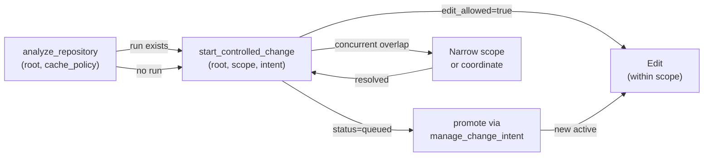
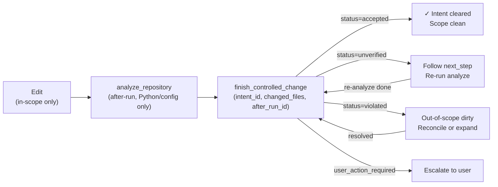

## Purpose

This guide documents the enforceable change-control rules that agents must follow when using CodeClone's MCP workflow. These rules ensure deterministic scope tracking, intent lifecycle management, and verification contracts across repository edits.

The workflow is mandatory for all Python structural, governance configuration, and documentation changes. Rules prevent untracked edits, orphaned intents, unverified patches, and concurrent-intent collisions that would invalidate scope audits and patch trails.

## Contracts

The change-control workflow depends on three durable contracts:

| Contract | Version | Enforced By | Risk |
|----------|---------|-------------|------|
| **Intent Lifecycle** | workspace_intent 1.7 | `manage_change_intent`, session tracking | Single active intent per MCP session; new `start_controlled_change` before `finish` evicts prior intent with no recovery |
| **Patch Trail** | 1 (PATCH_TRAIL_SCHEMA_VERSION) | `finish_controlled_change`, audit artifact | Scope check, changed files, verification result, workspace hygiene state persisted immutably |
| **Scope Binding** | parameter: `{"allowed_files": [...]}` | `start_controlled_change` | Relative file paths only; edits outside declared scope block `finish_controlled_change` with `finish_block_reason: own_unscoped_dirty` |

## Implementation map

### Start Phase

**Key invariants:**

1. Absolute root path required; relative roots rejected
2. Scope shape: `{"allowed_files": ["path/to/file.py", ...]}`  — relative paths under `allowed_files` key
3. Concurrent intents in workspace prevent edit unless foreign intent is queued or cleared
4. `dirty_scope_policy="continue_own_wip"` recovery only when resuming known WIP with no foreign overlap

### Finish Phase

**Profile-driven verification:**

- **python_structural** / **governance_config**: `after_run_id` required; all structural checks apply
- **documentation_only**: `after_run_id` optional; structural checks skipped
- **non_python_patch**: lightweight path; controller-stated limitations apply
- **state_artifact_change**: always rejected (baseline, cache mutations blocked)

## Failure modes

| Mode | Trigger | Block Reason | Recovery |
|------|---------|--------------|----------|
| Orphaned intent | `start_controlled_change` called before prior `finish_controlled_change` | Intent evicted from session tracking | Redeclare with `dirty_scope_policy=continue_own_wip` and reprovide evidence |
| Scope violation | Edits outside `allowed_files` detected by `finish` | `finish_block_reason: own_unscoped_dirty` | Remove out-of-scope edits or expand scope via new `start_controlled_change` |
| Missing verification | After-run not provided for Python/config patch | `status: unverified`, `next_step` returned | Run `analyze_repository` with new run_id, call `finish` again on same intent_id |
| Concurrent foreign intent | Foreign agent holds active intent in same session | `concurrent_intents` non-empty; no edit granted | Queue current intent, wait for foreign finish, promote via `manage_change_intent(action=promote)` |
| Workspace hygiene | Git tree, start snapshot, finish evidence disagree | `finish_block_reason: missing_evidence`, `foreign_dirty_overlap`, or `own_unscoped_dirty` (if `CODECLONE_STRICT_FINISH`) | Reconcile git state, widen scope, or provide missing evidence |

## Verification

Before claiming a patch is verified:

1. **Intent active and edit_allowed:** Confirm `start_controlled_change` returned `status == "active"` and `edit_allowed == true`
2. **Changed files declared:** List all files modified in scope via `finish_controlled_change(..., changed_files=[...])`
3. **After-run evidence:** Pass `after_run_id` for Python structural or governance config patches; documentation-only patches may omit it with controller-reported limitations
4. **Scope check clean:** Verify `finish` response contains `scope_check.status == "clean"` or `"expanded"`
5. **Intent cleared:** Confirm `intent_cleared == true` in finish response
6. **Claims validation:** If `claims.valid == false`, report warnings; do not suppress or override controller verdict

**Critical gates:**

- Do not edit without `edit_allowed == true`
- Do not call `finish` before after-run is ready (Python/config only)
- Do not leave active or recoverable intent behind; `intent_id` tracks ownership, so orphaning blocks the session
- Do not claim "verified" or "ready" unless all items 1–6 above are satisfied

## Evidence index

This page derives facts and contracts from the following sources. Internal documentation only; do not cite as published guidance.

| Source | Status | Evidence |
|--------|--------|----------|
| **Workspace Intent Lifecycle** | path_only | `codeclone/surfaces/mcp/_workspace_intent_lifecycle.py` — single active intent per session; eviction on re-start without recovery |
| **Intent Lifecycle: PID Security** | path_only | `codeclone/surfaces/mcp/_workspace_intent_lifecycle.py` — PID PermissionError tri-state (unknown vs. active/stale); hook write-gate denies unknown liveness |
| **Scope Parameter Shape** | path_only | `codeclone/surfaces/mcp/_workflow_*.py` — `allowed_files` key with relative paths list; verified in live testing session 2026-07-06 |
| **Patch Trail Immutability** | path_only | `codeclone/surfaces/mcp/audit_trail.py` — durable storage of scope check, changed files, verification result, workspace hygiene; retrieved via `get_patch_trail` read-only |
| **Implementation Context Projection** | path_only | `codeclone/surfaces/mcp/_implementation_context_pages.py` — exact only from saved MCP session projection artifact; `get_implementation_context_page` returns not_found rather than recomputing |
| **Workspace Drift Detection** | path_only | `codeclone/surfaces/mcp/_workspace_drift.py` — mtime+size signatures plus DirtySnapshot preserve pre-existing unchanged dirtiness; same-size rewrites detectable via git delta |
| **Budget Estimation** | path_only | `codeclone/budget/estimator.py` — long-lived MCP audit paths use chars_approx token estimation; exact tiktoken counting opt-in (heavy native state) |
| **Help Topics Synchronization** | path_only | `codeclone/surfaces/mcp/messages/help_topics.py` — context-governance response contracts synchronized; change-control help describes partial_enforce responses and blast artifact drill-down |
