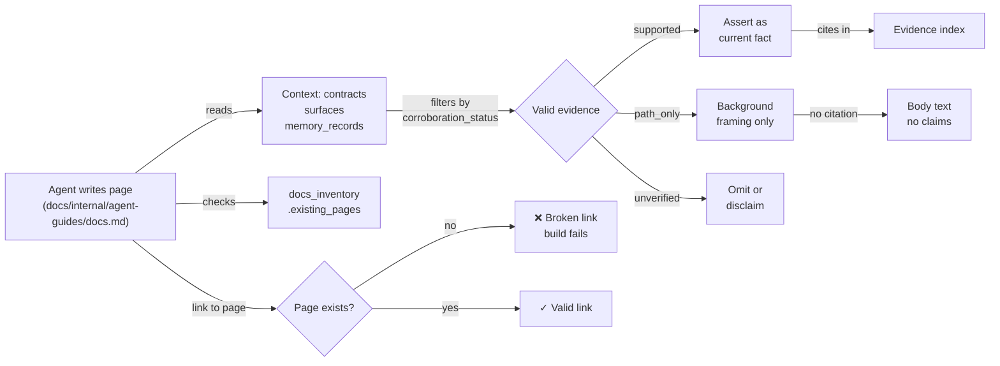

## Purpose

This guide documents the CodeClone documentation pipeline for agents authoring or verifying Markdown pages. It covers the constraints, workflows, failure modes, and verification requirements that prevent broken links, misattributed claims, and memory-docs skew.

## Contracts

The documentation system enforces:

| Contract | Enforcement | Failure |
|----------|-------------|---------|
| **No page-that-does-not-exist links** | Writers verify page path against `docs_inventory.existing_pages` before hyperlinking | Build fails; manual remediation required |
| **No fabricated constants or paths** | Claims cite only context-provided contracts, paths from provided surfaces, or corroborated memory | Verifier rejects as unsupported |
| **Corroboration status governs assertion** | `supported` → assert as current fact and cite; `path_only`/`no_checkable_claims` → background only; `unverified` → do not assert | Audit catches unsupported claims via citation index |
| **Evidence index required** | All claimed facts must cite their source (contract, surface, test, memory) with corroboration status | Draft rejected if incomplete |
| **Memory records are not docs** | Memory entries inform design but do not authorize documentation claims | Writer embeds evidence, not memory reference |

## Implementation map



The writer:

1. Reads all provided context (contracts, memory_records with status field)
2. Filters memory by corroboration_status: `supported` only becomes a cited claim
3. Verifies every hyperlink target against existing_pages
4. Builds an Evidence index mapping claims → sources
5. Does not reference memory IDs or chat text as evidence

## Failure modes

| Mode | Root cause | Detection | Recovery |
|------|-----------|-----------|----------|
| **Dead link** | Link target missing from docs_inventory | Zensical build catches 404 pattern | Rewrite as plain text or point to real page |
| **Unsupported claim** | Assertion cites only chat or invented constants | Verifier cross-checks evidence index | Cite provided contract or omit claim |
| **Memory as evidence** | Writer treats memory record as established fact | Audit queries source; memory ID ≠ evidence | Replace with corroboration_status check; cite context |
| **Scope creep** | Writer exceeds 300 lines with redundant sections | Word count | Compress Evidence index; remove filler |

## Verification

Before finishing a page:

1. **Evidence index completeness:** Every fact in the body has a corresponding entry mapping it to source + corroboration status
2. **Link validity:** All Markdown links point to paths in existing_pages
3. **Memory filter:** No memory record asserted as current behavior unless corroboration_status is `supported`
4. **Line budget:** Document ≤ 300 lines (excludes YAML front matter and index)
5. **Forbidden terms:** No R-003, P0, P1, .codeclone/reviews/ paths, "internal review artifact", or unsupported marketing phrases

Run the Zensical build locally to catch broken links:

```bash
# Building docs triggers link validation across inventory (strict mode fails on broken links)
uv run --with zensical==0.0.46 zensical build --clean --strict
```

## Evidence index

| Fact | Source | Corroboration status | Notes |
|------|--------|---------------------|-------|
| Page links must match docs_inventory.existing_pages | Task instruction + codeclone-docs-corporate skill | supported | Cross-link rule R5 |
| Memory entries (path_only or unverified) cannot anchor documentation claims | mem-5664eed913e24fc5bf402e0ea33ee54d | path_only | Haiku pilot caught; strict forbid now in place |
| Full pre-commit suite must run as final check, not per-intent deltas | mem-68c45fd523c3486f967e7e413b329d09 | path_only | Baseline gates all hooks, not artifact delta |
| .codeclone/** is an unconditional do_not_touch boundary | mem-451195911e41467a840244ac0577b88e | unverified | Structure enforced by controller workflow |
| Packet context mcp_tools filtering requires select_by_surface, not literal surface tag match | mem-02a4de27895f467b8ad94f62655ff7f5 | path_only | Topic pages return zero tool names without fix |
