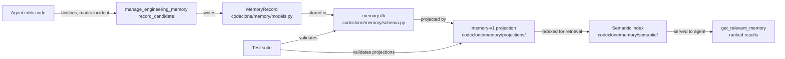

## Purpose

Engineering Memory is a persistent SQLite store for evidence-linked repository facts, decisions, and workflow trajectories. Agents modify Memory through `manage_engineering_memory` (for writes) and `query_engineering_memory` (for inspection). This guide covers the MCP contract, common patterns, failure modes, and verification steps for Memory changes.

## Contracts

The Memory surface exposes four MCP tools:

| Tool | Mode | Write | Read-only | Purpose |
|------|------|-------|-----------|---------|
| `get_relevant_memory` | — | no | yes | Return ranked evidence-linked facts for declared edit scope |
| `manage_engineering_memory` | agent actions | yes | no | record_candidate, refresh_from_run, validate_claims, propose_from_receipt, and projection rebuild actions |
| `query_engineering_memory` | search, get, for_path, for_symbol, stale, drafts, coverage, status, trajectory_* | no | yes | Mode-based inspection router across all memory lanes |
| `get_memory_projection_page` | — | no | yes | Retrieve omitted tail using digest-bound cursor from continuation |

Schema version (ENGINEERING_MEMORY_SCHEMA_VERSION): 1.7.
Projection version (MEMORY_PROJECTION_VERSION): memory-v1.

Agent actions available via `manage_engineering_memory`:
- `record_candidate` — Write durable note (record_type: change_rationale, risk_note, contradiction_note, etc.)
- `refresh_from_run` — Hydrate Memory from latest MCP run
- `validate_claims` — Validate claim text for scope/consistency warnings
- `propose_from_receipt` — Extract Memory candidates from finish_controlled_change receipt
- Projection job actions: `enqueue_projection_rebuild`, `rebuild_semantic_index`, `rebuild_trajectories`

Agents cannot call `approve`, `reject`, or `archive` — those require human approval via VS Code Memory view.

## Implementation map

Key modules:
- **models.py**: MemoryRecord dataclass, record_types, confidence_levels, origins, statuses
- **schema.py**: SQLite schema with synchronous=FULL for durability; intent/audit stores use NORMAL (loss-tolerable)
- **staleness.py**: Determines stale_reason (drift vs anchor commit, not inventory membership)
- **experience/distiller.py**: Converts workflow trajectories into distilled insights; watch for N+1 writes and trivial guard duplication
- **embedding/fastembed_provider.py**: Embedding vectors; guards on numbers.Real, excludes bool
- **schema_migrate.py**: Migration pattern uses `_add_column_if_missing` + `_record_schema_migration`

## Failure modes

| Trigger | Symptom | Prevention |
|---------|---------|-----------|
| Non-Python subject (docs/*.md, zensical.toml) marked linked_path_missing | Memory stale for valid non-.py files | Only apply linked_path_missing to .py subjects in staleness checks |
| Schema migration missing version bump | Tests fail; inconsistent schema state | Bump ENGINEERING_MEMORY_SCHEMA_VERSION in contracts; update version pin in tests and docs |
| Embedding vector coercion fails on numpy.float32 | Type error during semantic indexing | Guard on numbers.Real; never isinstance(str \| int \| float) |
| Experience distillation writes ~18 rows per output | Background projection worker performance degrades | Batch insert in distiller.py; avoid sequential trivial continue/return guards |
| Memory record without anchor commit populated | Staleness detection skips drifted records | Populate anchor_commit, source_run_id at write time; never disk/inventory-anchored only |

## Verification

After Memory changes (record writes, projection rebuilds, schema migrations):

1. **Unit tests**: `uv run pytest -q tests/test_memory_*.py tests/test_mcp_memory_*.py`
2. **Projection integrity**: `query_engineering_memory(mode=status)` returns schema_version, projection_version match
3. **Staleness correctness**: `query_engineering_memory(mode=stale)` returns only records with drift > anchor_commit
4. **Schema forward-compat**: Run `schema_migrate.py` test against both old and new versions
5. **Retrieval ranking**: `get_relevant_memory(root=..., scope=...)` returns evidence_score > 0; draft records marked draft

Full suite: `uv run pytest -q tests/test_memory_*.py tests/test_mcp_memory_*.py tests/test_cli_memory_*.py`

## Evidence index

The Memory surface depends on these facts, supported by provided context:

1. **synchronous=FULL durability** (codeclone/memory/schema.py): Main Memory SQLite commits via fsync; survives unclean process exit. Intent/audit stores use NORMAL (loss-tolerable). *(path_only)*

2. **Commit-anchored staleness** (codeclone/memory/staleness.py): MemoryRecord staleness is drift vs anchor_commit, not inventory membership; vacuum never deletes on subject-absence alone. *(path_only)*

3. **Non-.py subject stale reason bug** (codeclone/memory/staleness.py): `_subject_inventory_stale_reason` incorrectly marks docs/*.md, zensical.toml with linked_path_missing because `inventory_paths_from_report` lists only .py files. Fix: only apply linked_path_missing to .py subjects. *(path_only)*

4. **Experience distiller N+1 writes** (codeclone/memory/experience/distiller.py): Live telemetry confirms ~18 writes per produced experience in projection worker. Fix direction is batch insert. *(path_only)*

5. **numpy.float32 embedding guard** (codeclone/memory/embedding/fastembed_provider.py): Real fastembed embed() yields numpy.float32 scalars, not Python float/int subclasses. Guard on numbers.Real; exclude bool. *(path_only)*

6. **Schema migration pattern** (codeclone/memory/schema_migrate.py): Schema changes must reuse `_add_column_if_missing` + `_record_schema_migration`; version bump co-changes version pins in tests and docs. *(path_only)*

7. **Trivial guard duplication** (codeclone/memory/experience/distiller.py): `distill_experiences` self-tripped CodeClone duplicated_branches via two consecutive trivial continue guards. Avoid >=2 sequential trivial continue/return-None branches. *(path_only)*
