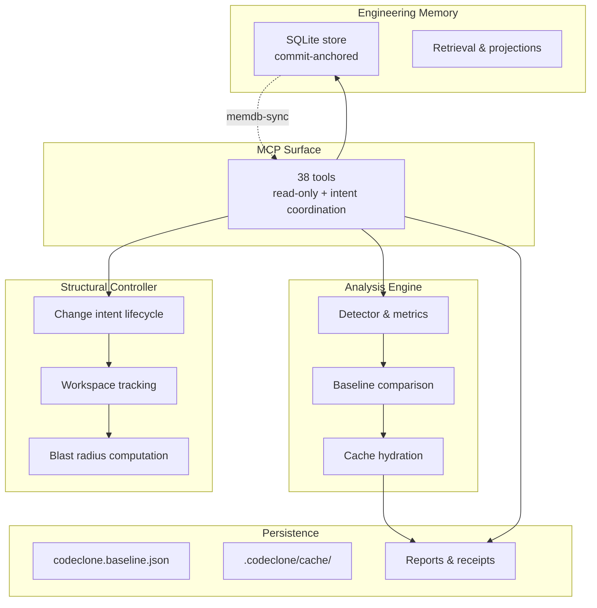

## Purpose

CodeClone is a deterministic structural controller for Python that governs code changes through a multi-layer architecture. This page describes the internal layer model, core surfaces, and data flows. The architecture enforces invariants: change intents are session-scoped singletons, memory is commit-anchored and forensic-durable, and baseline/cache/report are immutable downstream products. Extension points exist for observable metrics, custom analysis thresholds, and controlled memory lifecycle.

## Layer model

The four core tiers:

1. **Analysis engine**: Deterministic detector, fingerprint matching, metric aggregation. No mutation of source, baseline, or cache. Outputs keyed to schema versions (`BASELINE_FINGERPRINT_VERSION=3`, `CACHE_VERSION=3.2`, `REPORT_SCHEMA_VERSION=3.0`).

2. **Structural controller**: Pre-edit intent declaration, workspace liveness checking, scope verification. Single active intent per MCP session; eviction on new `start_controlled_change` without prior `finish`. No memory of prior intents across restart.

3. **Engineering Memory**: Durable SQLite store (`ENGINEERING_MEMORY_SCHEMA_VERSION=1.7`), never disk-anchored. Staleness pegged to commit sha, not inventory membership. Synchronous=FULL for table, NORMAL for ephemeral intent/audit tables.

4. **Persistence**: Immutable baseline (5 MB ceiling), cache (50 MB), and report outputs. Served by analysis engine; never mutated by controller or memory.

## Core surfaces

| Surface | Packages | Contract | Tests |
|---------|----------|----------|-------|
| **Change control** | `codeclone.budget`, `codeclone.controller_insights`, `codeclone.surfaces.mcp`, `codeclone.workspace_intent` | `start_controlled_change`, `finish_controlled_change`, `manage_change_intent` | `test_mcp_service.py`, `test_controller_insights.py` |
| **MCP workflow** | `codeclone.surfaces.mcp` | 38 tools: analyze, help, context, memory, artifact retrieval | `test_mcp_*.py` |
| **Engineering Memory** | `codeclone.memory` | `get_relevant_memory`, `manage_engineering_memory`, commit-anchored semantics | `test_cli_memory_*.py`, `test_memory_*.py` |
| **Baseline, cache, report** | `codeclone.baseline`, `codeclone.cache`, `codeclone.report` | Immutable fingerprints, deterministic ordering, version pinning | `test_baseline.py`, `test_cache.py`, `test_analytics_reporting.py` |

**MCP tools (38):**
analyze_changed_paths, analyze_repository, check_clones, check_cohesion, check_complexity, check_coupling, check_dead_code, check_patch_contract, clear_session_runs, compare_runs, create_review_receipt, evaluate_gates, finish_controlled_change, generate_pr_summary, get_blast_artifact, get_blast_radius, get_finding, get_implementation_context, get_implementation_context_page, get_memory_projection_page, get_patch_trail, get_production_triage, get_relevant_memory, get_remediation, get_report_section, get_review_receipt, get_run_summary, help, list_findings, list_hotspots, list_reviewed_findings, manage_change_intent, manage_engineering_memory, mark_finding_reviewed, query_engineering_memory, query_platform_observability, start_controlled_change, validate_review_claims. (Source of truth: `tests/fixtures/contract_snapshots/mcp_tool_schemas.json`.)

## Data flows

### Edit cycle workflow

1. **Pre-edit**: `analyze_repository` (fresh or cache-reused run) → `start_controlled_change` → `get_relevant_memory` (scope-ranked retrieval)
2. **Edit**: Mutate source files within declared scope only
3. **Post-edit**: `analyze_repository` (after-run; required for Python structural changes) → `manage_engineering_memory` (record incidents/decisions if needed) → `finish_controlled_change` (scope check, patch contract verification, intent clearance)

**Critical invariants:**
- One active intent per MCP session; starting a new `start_controlled_change` before finishing evicts the prior in-session intent.
- Change intents **are** persisted to the intent registry (default `file` backend, `.codeclone/db/intents.sqlite3` for the `sqlite` backend). `manage_change_intent(action="recover")` can recover an intent whose owning process died; in-memory analysis runs, by contrast, are session-local and lost on server restart.
- `finish_controlled_change` reconciles pre-edit dirty snapshot against post-edit git tree and after-run evidence. Missing evidence → `unverified`. Scope violation → `violated`. Foreign concurrent edits → `foreign_dirty_overlap`.

### Memory flow

- **Write**: `manage_engineering_memory(action=record_candidate|promote_experience)` → commit-anchored record (sha, statement, subject_path, confidence)
- **Read**: `get_relevant_memory(scope=paths|intent_id)` → ranked retrieval from sessions-local projection (stale markers, contradiction notes, evidence links)
- **Staleness**: memory staleness is pegged to commit sha in `provenance_anchor_sha`, never disk inventory
- **Durability**: SQLite `synchronous=FULL` ensures unclean process exit does not corrupt records; intent store uses NORMAL (loss-tolerable)

### Budget and blast-radius tracking

- **Token budget**: `codeclone.budget.estimator` computes chars_approx tokens for long-lived audit (exact tiktoken opt-in only; keeps native state resident)
- **Blast radius**: `start_controlled_change` computes scope-relative dependency graph depth, module counts, and code metrics. Stored as slim artifact at intent declaration time.
- **Verification profiles**: Derived from changed files: `python_structural` (any .py), `governance_config` (config only), `documentation_only` (.md/.rst), `non_python_patch`, `state_artifact_change` (baseline/cache)

## Extension points

### Custom thresholds and gate evaluation

- Default thresholds in `codeclone.contracts.__init__`: `DEFAULT_COMPLEXITY_THRESHOLD=20`, `DEFAULT_COUPLING_THRESHOLD=10`, `DEFAULT_COHESION_THRESHOLD=4`
- `check_patch_contract(mode='budget'|'verify')` returns gate evaluation, gating decisions, and claim validation
- Memory contradiction notes trigger claim override, not gate override

### Observable spans and metrics

- **Analysis spans**: pipeline.baseline, pipeline.cache_load, pipeline.report (MCP wrapped; CLI instrumentation TBD)
- **Metrics baseline** (`METRICS_BASELINE_SCHEMA_VERSION=1.3`): Cobertura join, health computation (7-factor weight per `HEALTH_WEIGHTS`)

### Cache wire paths

- **Security hardening**: Cache decode accepts repo-relative paths only; absolute or traversal paths rejected
- **Symlink resistance**: Advisory lock files use symlink-resistant open on Unix; pyproject loading rejects symlinked config

## Evidence index

| Evidence | Corroboration | Details |
|----------|---|---|
| Cache wire containment (mem-231f686b92ba) | path_only | codeclone/cache/projection.py; internal invariant |
| Security hardening: repo-relative only (mem-bc26f97ebb) | path_only | codeclone/cache/projection.py; symlink-resistant locks |
| Implementation-context facet exactness (mem-0ebd1dfb9f) | path_only | codeclone/surfaces/mcp/_implementation_context_pages.py; not recomputed fresh |
| Phase 30 freshness: DirtySnapshot invariant (mem-6e6628aa245) | path_only | codeclone/surfaces/mcp/_workspace_drift.py; pre-existing unchanged dirtiness not new drift |
| Budget token estimation: chars_approx default (mem-d788578731ab) | path_only | codeclone/budget/estimator.py; tiktoken opt-in only |
| One active intent per session, eviction on new start (mem-527db78f1c) | path_only | codeclone/surfaces/mcp/_workspace_intent_lifecycle.py; CRITICAL risk |
| clones_only summary mismatch (mem-881b92197a6) | path_only | codeclone/surfaces/mcp/_session_helpers.py; inventory.functions ~2x in projection |
| PID PermissionError tri-state (mem-6859f67ef123) | path_only | codeclone/surfaces/mcp/_workspace_intent_lifecycle.py; unknown liveness blocks hook write-gate |
| Memory SQLite synchronous=FULL (mem-08c5f5411e1) | path_only | codeclone/memory/schema.py; intent/audit tables use NORMAL |
| Memory commit-anchored, not disk-anchored (mem-5726b2105f6) | path_only | codeclone/memory/staleness.py; CRITICAL invariant |
| Staleness: non-Python subjects false-positive (mem-829156ad11) | path_only | codeclone/memory/staleness.py; linked_path_missing applied to non-.py (bug) |
| Memory N+1 write: experience distill (mem-8293d87dc474) | path_only | codeclone/memory/experience/distiller.py; telemetry-confirmed perf finding |
| Embedding coercion: numbers.Real guard (mem-f4a92cec90b1) | path_only | codeclone/memory/embedding/fastembed_provider.py; numpy.float32 not isinstance(float) |
| Memory schema migration: _add_column_if_missing pattern (mem-15e3f19498ef) | path_only | codeclone/memory/schema_migrate.py; version pin update required |
| Code duplication: trivial continue guards (mem-53f8a3942268) | path_only | codeclone/memory/experience/distiller.py; avoid >=2 sequential guards |
| Claim guard negation window (mem-1173f7d9866) | unverified | codeclone/surfaces/mcp/_claim_guard.py; STRUCTURAL_SCOPE_KEYWORDS not verified in codebase |
| MCP help topics synchronized (mem-74b325675fbf) | path_only | codeclone/surfaces/mcp/messages/help_topics.py; change-control & memory contract sync |
| Observability slice B: analyze_repository spans (mem-8973d8741052) | path_only | codeclone/surfaces/mcp/session.py; CLI instrumentation TBD (parity follow-up) |
