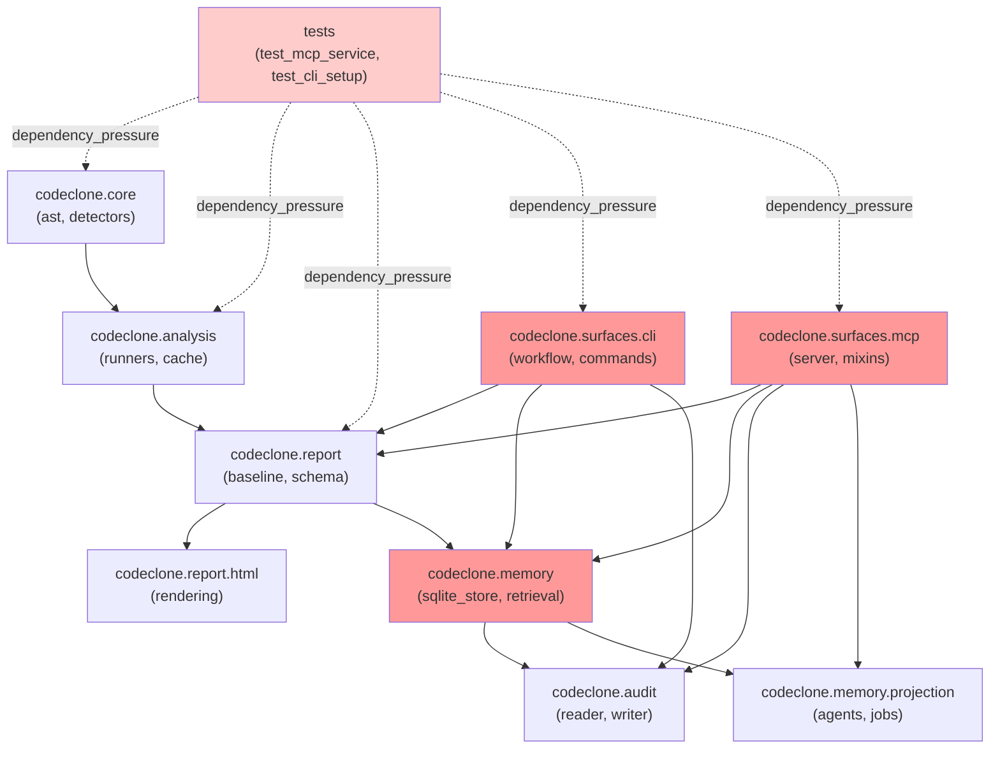

## Purpose

The package graph maps the 769 modules and 3,322 imports across CodeClone's layered architecture. This document specifies the dependency structure, identifies structural bottlenecks, and defines constraints that govern safe refactoring and extension.

The graph is retrieved via the module-map analysis surface (get_report_section / codeclone_mcp) and updated after each structural analysis run.

## Contracts

| Contract | Value | Notes |
|----------|-------|-------|
| **Module count** | 769 (active) | Includes tests + production + config modules |
| **Edge count** | 3,322 imports | Directed; may include redundant paths |
| **Depth-2 packages** | 303 | Primary structural units (e.g., `codeclone.memory`, `codeclone.surfaces.mcp`) |
| **Overloaded modules** | 43 candidates | Require unwinding (multi-responsibility) |
| **Unwind candidates** | 25 high-priority | Production=2; Tests=23 |
| **Schema version** | 3.2 (report) | REPORT_SCHEMA_VERSION from contracts/__init__.py |

**Central sinks** (high fan-in, low fan-out):
- `codeclone.report.meta` (fan_in=44, fan_out=5) — non-candidate; dependency_score=0.9912
- `codeclone.utils.json_io` (fan_in=33, fan_out=0) — non-candidate; used by all report writers
- `codeclone.audit.reader` (fan_in=27, fan_out=4) — candidate; tight integration with memory

**Central sources** (high fan-out):
- `tests.test_mcp_service` (fan_out=63, fan_in=0) — test harness; high instability
- `codeclone.surfaces.mcp._session_workflow_mixin` (fan_out=19, fan_in=2) — workflow orchestration
- `codeclone.surfaces.cli.workflow` (fan_out=30, fan_in=8) — CLI session coordination

**SQLite store** (`codeclone.memory.sqlite_store`):
- Central coordinator for memory subsystem
- fan_in=42 (memory retrieval, projection, record write)
- fan_out=12 (schema layers, audit integration)
- Candidate for unwinding due to chain-bottleneck signals

## Implementation map

**Layering rules:**
1. Core (AST, detectors) has no internal dependencies outside `codeclone.core`
2. Analysis (runners, cache) depends only on core
3. Report (baseline, schema, contracts) depends on analysis only
4. HTML rendering depends on report + utils only
5. Memory (SQLite) depends on report + audit only; must not import surfaces
6. Surfaces (CLI, MCP) are free to use all lower layers; must not cross-depend
7. Tests import freely for coverage; unwind candidates flag instability signals only

## Failure modes

| Failure | Trigger | Recovery |
|---------|---------|----------|
| **Circular dependency** | Import A → B → A | Review fan-in/out; extract abstraction; demote to tests |
| **SQLite store bottleneck** | Changes to sqlite_store ripple to 42 modules | Run full analysis before shipping; validate contract locks |
| **Instability cascade** | Test module imports 20+ production modules | Narrow test scope; extract test utilities into shared fixture layer |
| **Chain-bottleneck collapse** | Unwinding candidate (fan_out > 20) is modified | Activate split_phase refactoring; isolate responsibilities; run before-run + after-run analysis |
| **Cross-layer violation** | Memory imports from surfaces (or vice versa) | Blocked at CI / pre-commit; extract mediator in core; re-analyze |

## Verification

**Required analysis runs:**
- Full `analyze_repository` when any module under `codeclone.memory`, `codeclone.surfaces.*`, or `codeclone.report` changes
- Before shipping: confirm `overloaded_population_status == "ok"` and `unwind_candidate_count <= 25`
- Post-refactor: compare module_count and edge_count deltas; both should remain stable (±5% tolerance)

**Tests to run:**
- `pytest -q tests/test_report.py` — report schema invariants
- `pytest -q tests/test_mcp_service.py` — surface API contracts
- `pytest -q tests/test_analytics_foundation.py` — memory projection integrity

## Evidence index

| Evidence | Source | Status | Detail |
|----------|--------|--------|--------|
| Module count (769) | `codeclone_mcp_module_map` | supported | Retrieved via get_report_section; REPORT_SCHEMA_VERSION=3.2 |
| Central sinks (meta, json_io, audit.reader) | `module_map_unwind_candidates` | supported | Fan-in/out scores from current run; non-candidates are design-intended bottlenecks |
| Unwind candidates (25 active) | `module_map_unwind_candidates` | supported | 2 production (sqlite_store, _session_workflow_mixin); 23 test modules flagged for instability |
| Layering rules | `engineering_memory_records` (5 change_rationale + 1 risk_note) | path_only | Background context only; verify against code for active boundaries |
| Test coverage matrix | `tests[]` matched_packages | supported | 12 test files covering report, html, memory, analytics packages |

**Memory corroboration notes:**
- mem-1dbcda27742541ac874759a28edffe8a (structural panel migration): path_only; confirms HTML report component consolidation, not enforced dependency
- mem-a5cdede2b48440cbb2066eb87273e705 (finding_card design system): path_only; shared widget abstraction in codeclone.report.html.widgets, not enforced at graph level
