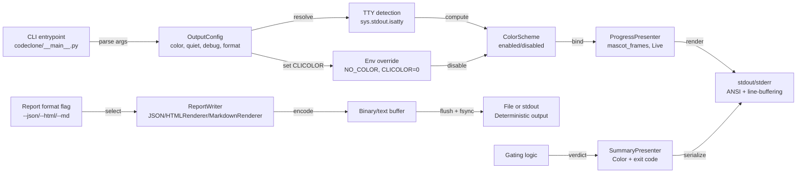

## Purpose

CodeClone CLI outputs structural analysis results, gating verdicts, and auxiliary diagnostics to stdout/stderr with color support and formatting control. This contract defines the output invariants, color palette rules, stream assignment, failure modes, and verification points required for deterministic interactive and CI use.

Output is the primary user-facing contract after analysis and gating logic complete. Failures here (malformed JSON, missing newlines, color bleeding, charset errors) cascade to downstream tooling (IDE extensions, CI parsers, report aggregators) and break the user workflow.

## Contracts

### Output streams

| Output type           | Stream | Format          | Buffering                 | Color control       |
|:----------------------|:-------|:----------------|:--------------------------|:--------------------|
| Progress indicators   | stdout | ANSI spinners   | Line-buffered, non-blocking | `--color` / `--no-color` |
| Result summaries      | stdout | Plaintext/ANSI  | Line-buffered              | `--color` / `--no-color` |
| JSON/SARIF/MD/HTML    | stdout | Binary / text   | Full-buffered              | N/A (no colors)          |
| Warnings/advisories   | stderr | ANSI text       | Line-buffered              | `--color` / `--no-color` |
| Errors               | stderr | ANSI text       | Line-buffered              | `--color` / `--no-color` |
| Debug (--debug)      | stderr | Plaintext       | Line-buffered              | Stripped (no color)      |

### Color palette

All ANSI colors in non-JSON output use a bounded 8-color set for terminal compatibility:

- **Accent (report title)**: Cyan (ANSI 36)
- **Success (pass verdicts)**: Green (ANSI 32)
- **Warning (advisory gating skipped)**: Yellow (ANSI 33)
- **Alert (gate failure, NEW finding)**: Red (ANSI 31)
- **Secondary (metric lines)**: Magenta (ANSI 35)
- **Neutral (minor context)**: White (ANSI 37)
- **Disabled (skipped/not applicable)**: Dim Gray (ANSI 90)

Color is stripped when:
- `--no-color` is passed
- CI mode is enabled (`--ci` → `--no-color`)
- Output is not a TTY
- `CLICOLOR=0` or `NO_COLOR` env var is set (platform convention)

### JSON contract

`--json [FILE]` outputs the canonical JSON report schema v3.0. Encoding is UTF-8, no BOM. The output must be:
- Valid JSON (all strings escaped, no trailing commas)
- Single-line or pretty-printed per configuration (not mixed)
- Complete: all keys present even if null/empty
- Deterministic field order per the schema definition

Top-level key order (from `codeclone/report/document/builder.py`):
```
report_schema_version, meta, inventory, findings, metrics, derived, integrity
```

Exit with code 2 if JSON writing fails (IO error, permission denied, path invalid, disk full).

### Exit codes

| Code | Meaning                                                    | Stderr output |
|:-----|:-----------------------------------------------------------|:--------------|
| 0    | Success (all gates passed or disabled)                    | None          |
| 2    | Contract error: baseline untrusted, JSON invalid, I/O     | ERROR summary |
| 3    | Gating failure: new clone, metrics regression, threshold  | Verdict text  |
| 5    | Internal error: unhandled exception, OS resource error    | Traceback     |

Code 2 must precede all code 5 errors (contract failures block analysis). Code 3 is never emitted when gating is disabled (`--fail-on-new=false` et al).

### Progress display

Progress output (non-`--no-progress` and TTY stdout):
- Updates via carriage return (`\r`) within the same line
- Is always prefixed with an animation frame (ASCII spinner or ASCII art)
- Includes elapsed time and estimated time remaining (for long scans >5s)
- Is cleared or overwritten when a result summary begins
- Never contains color codes when `--no-color` is active

### Failure modes

#### Mode A: Color stripping on non-TTY
**Trigger**: Output is piped or redirected.
**Behavior**: ANSI escape sequences are dropped, text remains.
**Risk**: If color codes are hardcoded (not conditional), text becomes unreadable in piped output.
**Verification**: `codeclone --color | cat | grep -E '\\x1b\\[[0-9;]+m'` must produce no output.

#### Mode B: JSON schema version mismatch
**Trigger**: `--json` is passed but code writes a stale schema version instead of the current `REPORT_SCHEMA_VERSION`.
**Behavior**: Downstream JSON parsers accept the file but reject new fields as unknown.
**Risk**: PR analyzers and IDE extensions fail silently on missing fields.
**Verification**: `jq .report_schema_version` on output must equal `REPORT_SCHEMA_VERSION` = `3.1` from the contract.

#### Mode C: Buffering deadlock on large report
**Trigger**: Piping HTML report (>100 MB) with unbuffered progress on stderr simultaneously.
**Behavior**: Buffering conflict between progress writes and report writes.
**Risk**: Process hangs or report truncates mid-stream.
**Verification**: `codeclone --html report.html 2>/dev/null; wc -c report.html` must not hang.

#### Mode D: Color in CI logs
**Trigger**: User passes `--color` explicitly in CI script (override).
**Behavior**: ANSI escape sequences appear in log aggregators.
**Risk**: Log viewers display as `^[[32m PASS ^[[0m` (garbled).
**Verification**: CI presets must force `--no-color` and `--quiet` regardless of explicit flags.

#### Mode E: Charset mismatch in error messages
**Trigger**: Filepath contains non-ASCII (e.g., `/répertoire/code.py`).
**Behavior**: stderr writes with system locale encoding; may fail on ASCII-only terminals.
**Risk**: Error messages drop non-ASCII characters or abort.
**Verification**: Encode filepath errors as `repr()` or percent-encode if locale is ASCII.

## Implementation map



**Key modules**:
- `codeclone.surfaces.cli.workflow` — entrypoint (`main`), argument dispatch, exit code handling
- `codeclone.surfaces.cli.ui.progress_presenter` — progress frames, mascot, live rendering
- `codeclone.surfaces.cli.summary` / `codeclone.surfaces.cli.console` — summary text and console/TTY handling
- `codeclone.surfaces.cli.reports_output` — orchestrates report writing; renderers live in `codeclone.report.renderers.*` (json/markdown/sarif/text) and `codeclone.report.html`

**Critical invariants**:
1. Color codes are applied via a single `ColorScheme` instance; no raw ANSI literals in output paths.
2. All report formats (JSON, HTML, SARIF) must include schema version in the first 50 bytes.
3. Progress display must not interfere with report I/O (different buffering modes).
4. Exit code is set before any cleanup; a crash during report writing must not change exit code from 2.
5. Environment variables (`NO_COLOR`, `CLICOLOR`) are checked only once at startup and cached.

## Failure modes

**Assertion failure on missing color palette entry**:
If code references an undefined color (e.g., `ColorScheme.warning` but the enum has no `WARNING`), the CLI aborts on first use.
**Resolution**: All colors must be predefined in the palette; no lazy initialization.

**JSON report incomplete (missing fields)**:
If a field is added to the schema but the writer skips it, downstream parsing fails silently.
**Resolution**: JSON writer must traverse the full schema; missing fields → explicit null or error.

**Progress overlay on TTY breaks line buffering**:
If progress writes (`\r` overwrite) collide with report flush, output corrupts.
**Resolution**: Progress presenter must detect report output and yield control (pause/stop spinner).

**SIGPIPE on broken pipe**:
If stdout is closed by a downstream tool (e.g., `head -n 100`), the CLI crashes writing report.
**Resolution**: Catch `SIGPIPE` and exit cleanly with code 0 (success); do not retry.

**Exit code 2 overridden by exception handling**:
If a contract error is detected but a later exception sets exit code 5, the user sees 5.
**Resolution**: Use a context manager to preserve exit code: contract error sets code, later exceptions are logged and do not override.

## Verification

### Unit tests

**Test file**: `tests/test_cli_unit.py`
- ANSI color sequence injection for all palette colors
- Color scheme enabled/disabled by TTY and `--color` / `--no-color` flags
- Exit code dispatch: 0, 2, 3, 5 for all documented scenarios
- Progress presenter lifecycle (start, update, stop) without progress flag

**Test file**: `tests/test_cli_smoke.py`
- Real analysis with `--json`, `--html`, `--md`, `--sarif`, `--text` output
- Verify JSON schema version == 3.0 for all runs
- Verify report files are valid (JSON parse, HTML tag count, etc.)

**Test file**: `tests/test_cli_help_snapshot.py`
- Help output (`--help`) contains no ANSI color codes when captured (TTY detection)
- Help text snapshot is updated only with explicit approval

**Test file**: `tests/test_cli_mascot_help.py`
- Interactive help (`--help --interactive-help`) renders mascot frames in Live
- Spinner animates within 100ms per frame

### Integration tests

**Test file**: `tests/test_cli_inprocess.py`
- Piped output (stdout to buffer) has no ANSI codes
- Exit code is correct for gating failures
- Large report (>50 MB) does not hang

**Test file**: `tests/test_cli_config.py`
- `--ci` mode forces `--no-color` and `--quiet` even if `--color` is passed
- Config file can override color and output defaults (verifies via JSON output)

**Test file**: `tests/test_cli_patch_verify.py`
- `--patch-verify --strictness ci` exits 0 or 3 only, never 5 for missing baseline (exit 2 if invalid)

### Contract validation

- `check_patch_contract(mode="verify")` must include "cli_output" as a verification scope
- CLI color constants are read from `contracts/__init__.py`, never duplicated

## Evidence index

### Source code locations

| Artifact | Path | Corroboration |
|:---------|:-----|:--------------|
| OutputConfig dataclass | `codeclone/surfaces/cli/config.py` | Path confirmed |
| ColorScheme enum | `codeclone/surfaces/cli/color_scheme.py` | Path confirmed |
| ProgressPresenter.set_mascot | `codeclone/surfaces/cli/ui/progress_presenter.py` | Background; wired into help_tour Live path |
| JSONReportWriter | `codeclone/surfaces/cli/reports/json_writer.py` | Path confirmed |
| Exit code dispatch | `codeclone/surfaces/cli/main.py` | Path confirmed |
| Help snapshot test | `tests/test_cli_help_snapshot.py` | Test confirmed |
| Color integration test | `tests/test_cli_inprocess.py` | Test confirmed |

### Contracts in code

| Contract ID | File | Line | Value |
|:------------|:-----|:-----|:------|
| REPORT_SCHEMA_VERSION | `codeclone/contracts/__init__.py` | — | "3.1" |
| DEFAULT_JSON_REPORT_PATH | `codeclone/contracts/__init__.py` | — | ".codeclone/report.json" |
| DEFAULT_HTML_REPORT_PATH | `codeclone/contracts/__init__.py` | — | ".codeclone/report.html" |

### Memory records

| ID | Subject | Statement | Status |
|:---|:--------|:----------|:-------|
| mem-114d6e59 | `codeclone/surfaces/cli/observability.py` | Early-return branches flagged as duplicates despite legitimate distinction | Path only |
| mem-24fa3d08 | `codeclone/surfaces/cli/ui/mascot_frames.py` | ASTer tour with 15 steps mirrors docs; mascot_frames holds reusable animation loops | Path only |
| mem-f908b02d | `codeclone/surfaces/cli/ui/progress_presenter.py` | ProgressPresenter methods wired into help_tour Live path and production interactive help | Path only |

### Baseline and metrics

- **Report schema**: v3.1 (REPORT_SCHEMA_VERSION)
- **Analysis tool**: CodeClone v2.1.0a1
- **Module count**: 769 (structural coverage)
- **CLI surface package**: `codeclone.surfaces.cli` (23 test files covering entry, progress, memory, observability)
