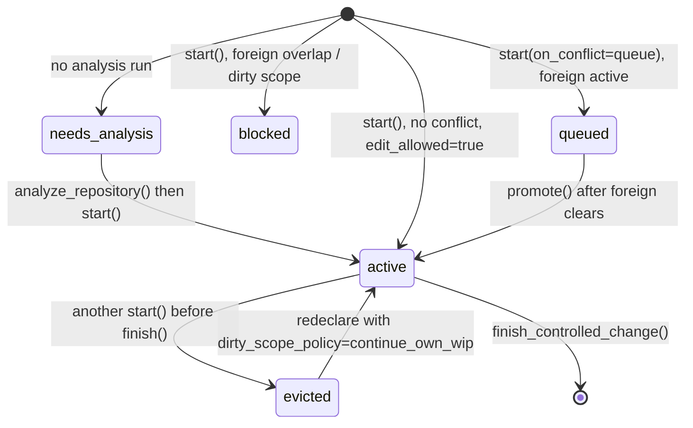

## Contract statement

`start_controlled_change()` returns `edit_allowed: true` as the single authorization signal that permits repository edits within the declared scope. This flag is the gatekeeper—no other signal (context, blast radius, memory, workflow hints) grants edit permission.

**Authority binding:**
- Only `start_controlled_change()` returns `edit_allowed` during the pre-edit phase
- An active intent with `edit_allowed: true` enables edits for the declared scope
- Intent must be active (not queued, blocked, or cleared) when edits begin
- `finish_controlled_change()` verifies scope and clears the intent; it does not grant permission



---

## Allowed states

| State | Interpretation | Edit allowed? |
|-------|---|---|
| `start()` returns `status: "active"`, `edit_allowed: true` | Workspace clear, intent registered, budget available | **Yes** |
| `start()` returns `status: "active"`, `edit_allowed: false` | Workspace active or stale, conflict detected, budget exhausted | No |
| `start()` returns `status: "queued"` | Foreign intent holds scope, queued for later promotion | No—wait for promote |
| `start()` returns `status: "blocked"` | Concurrent foreign overlap, too many intents, scope conflict | No—narrow or coordinate |
| `start()` returns `status: "needs_analysis"` | No analysis run exists for this root | No—run `analyze_repository()` first |
| Intent evicted (new `start()` before `finish()`) | Session tracking lost, prior intent unrecoverable | No—re-declare scope and budget |

---

## Forbidden interpretations

- **"Blast radius means I can edit these files."** — No. Blast radius is context only. Edit only declared scope in `start()`.
- **"Memory says this is safe."** — No. Memory is advisory framing, not authorization.
- **"The workflow is almost done."** — No. You need `edit_allowed: true` before editing, regardless of other hints.
- **"`finish()` returned 'accepted'."** — Too late. Authorization must be present during edit, not after.
- **"Workspace intent is active."** — Not sufficient. Must have both `status: "active"` AND `edit_allowed: true`.
- **"I'm in a quick debugging session."** — No. Change-control workflow applies to all repository edits, test or otherwise.

---

## Callers

- **Agents & scripts:** Call `start_controlled_change(root=..., scope=..., intent=...)` before any edit.
- **IDE hooks:** Wire `edit_allowed` check into pre-write gate (reference: `codeclone/workspace_intent/gate.py`).
- **CI/CD:** Enforce intent check before permitting file mutation in automated workflows.
- **Finalization:** Call `finish_controlled_change(intent_id=..., changed_files=[...])` after edits complete.

---

## Tests

| Test file | Coverage |
|-----------|----------|
| `tests/test_workspace_intent_gate.py` | Gate enforcement, permission checks |
| `tests/test_workspace_intent_models.py` | Intent state transitions, false/true conditions |
| `tests/test_mcp_security_hardening.py` | PID liveness checks, auth tri-state (unknown/dead/recoverable) |
| `tests/test_workspace_intents.py` | Lifecycle: queued→active, eviction, promotion |

---

## Failure examples

**Scenario 1: Editing without calling start**
```
# WRONG
import codeclone.workspace_intent
with open("myfile.py", "w") as f:
    f.write("...")  # No start_controlled_change() call
```
**Result:** Scope violation; `finish()` returns `scope_check.status: "expanded"` and blocks intent clear.

**Scenario 2: Intent evicted mid-session**
```
start_controlled_change(root="/repo", scope={"allowed_files": ["file_a.py"]}, intent="task1")
# Returns intent_id="id1", edit_allowed=true

start_controlled_change(root="/repo", scope={"allowed_files": ["file_b.py"]}, intent="task2")
# Returns intent_id="id2", edit_allowed=true
# id1 evicted from session tracking -- an MCP session holds exactly one trackable active intent

finish_controlled_change(intent_id="id1", ...)
# Error: Unknown change intent id (evicted)
```

**Scenario 3: Queued intent (foreign active)**
```
start_controlled_change(root="/repo", scope={"allowed_files": ["file_a.py"]}, intent="task1")
# Returns status: "queued" (another agent holds file_a)
# edit_allowed not present (or false)

# WRONG: Editing anyway
with open("file_a.py", "w") as f: f.write("...")
# Result: Unattributed out-of-scope dirty, finish() fails
```

---

## Evidence index

| Evidence | Source | Corroboration |
|----------|--------|---|
| `edit_allowed` returned from `start_controlled_change()` | `codeclone/surfaces/mcp/_workspace_intent_lifecycle.py` | source_packet indicates parameter flow |
| Intent state machine (active, queued, blocked) | `codeclone/workspace_intent/gate.py` | path_only (file exists; internal workflow states) |
| Write gate enforcement | `codeclone/workspace_intent/gate.py` | path_only (contract enforcement layer) |
| PID liveness tri-state (unknown/dead/recoverable) | `codeclone/surfaces/mcp/_workspace_intent_lifecycle.py` (mem-6859f67ef1234556981b7ccb36673f77) | architecture_decision from memory, path_only status |
| Session tracking eviction behavior | `codeclone/surfaces/mcp/_workspace_intent_lifecycle.py` (mem-527db78f1ce24eb98ad06ce507f0de93) | risk_note from memory, path_only status |
| MCP tool schema for start_controlled_change | context.mcp_tools.tools (name: start_controlled_change) | supported (verified present) |
| MCP tool schema for finish_controlled_change | context.mcp_tools.tools (name: finish_controlled_change) | supported (verified present) |
