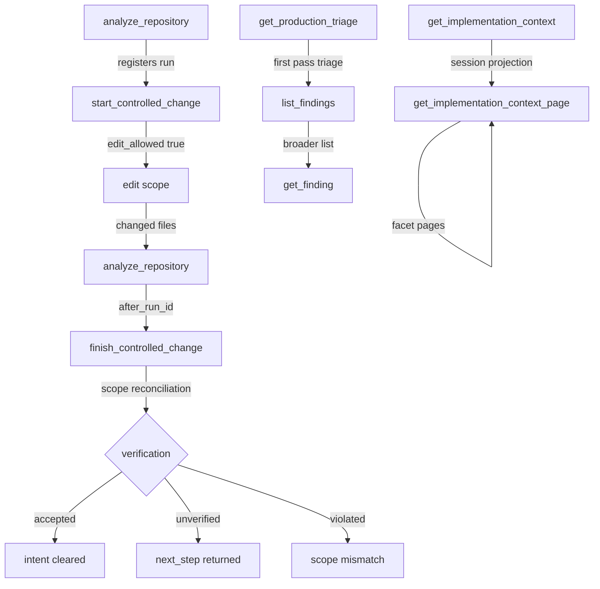

## Purpose

The MCP tool surface (`codeclone.surfaces.mcp`) exposes CodeClone's deterministic analysis and change-control workflow as a constrained, contractual API. This page documents:

- The semantics each tool enforces (not what it does, but what it guarantees and forbids)
- How tools interact in mandatory sequences (change control, memory, analysis)
- Failure modes and recovery paths
- Verification boundaries and what is not checked

MCP is contained analysis and coordination: it writes only CodeClone's own service data, and only inside CodeClone's service directories — the analysis cache its own run produced, its run and audit records, and ephemeral workspace state under `.codeclone/intents/`. Source files, baselines and canonical reports are never mutated.

## Contracts

### Change control lifecycle

| Tool | Trigger | Precondition | Guarantee | Failure mode |
|------|---------|--------------|-----------|--------------|
| `analyze_repository` | Initial analysis or after edit | None | Latest run registered, cache policy honored | Analysis error, returns schema violation |
| `start_controlled_change` | Before edit intent | Valid run exists for root | Intent created, blast radius computed, `edit_allowed` returned | `status: needs_analysis` (no run), `queued` (foreign intent), `blocked` (overlap) |
| `finish_controlled_change` | After edit cycle | Intent active, changed files named | Scope reconciled, verification run, receipt issued, intent cleared | `unverified` (missing after-run), `violated` (scope creep), `missing_evidence` (dirty tree) |

An MCP session holds exactly one active change-control intent. Calling `start_controlled_change` again before finishing evicts the prior intent without recovery.

### Implementation-context exactness

`get_implementation_context` returns a bounded projection artifact saved to the session. `get_implementation_context_page` must retrieve facet pages _only_ from that saved artifact. If the requested facet or digest is not found, the tool returns `not_found` or `mismatch` statuses, never recomputes fresh context to provide exact evidence.

### Help contract

`help(topic)` returns bounded guidance for one topic; `topic=overview` returns a compact topic index. `detail` defaults to `compact`, and `help(topic, detail)` with `detail="normal"` additionally returns `warnings`. Anti-patterns are returned for every topic that defines them, at either detail level. Topics must correspond to enforced context-governance response contracts (e.g., `change_control` describes partial_enforce start responses, `engineering_memory` describes get_memory_projection_page continuation).

### Memory synchronization

MCP help topics and claim-guard responses are synchronized with engineering memory governance rules. Negation handling (not/don't/never windows) mirrors memory record negation logic. Claim guard returns warnings for positive denial phrases in scope keywords that still flag health overstatement.

### Observability instrumentation

`analyze_repository` wraps previously-uninstrumented IO in observability spans: `pipeline.baseline`, `pipeline.cache_load`, `pipeline.report`. The CLI path is not yet instrumented with these same spans (parity follow-up pending).

## Implementation map



Memory-aware tools require `get_relevant_memory` after `start_controlled_change` returns `edit_allowed=true`:

- `root` parameter is required (intent_id alone fails validation)
- Read contract warnings, stale decisions, and `contradiction_note` alerts
- Do not treat `draft`, `inferred`, or excluded stale records as established facts
- If a `contradiction_note` exists for your scope, surface it before editing

## Failure modes

### Concurrent intent collision

- **Condition**: `start_controlled_change` detects active foreign intent overlapping declared scope.
- **Response**: `status: queued` with queue info (unless `on_conflict=queue` omits the queue).
- **Recovery**: `manage_change_intent(action="promote")` when foreign intent clears, then retry `start_controlled_change`.
- **Risk**: Session holds only one trackable intent. Do not call `start_controlled_change` again without promoting or clearing the prior intent.

### Unverified finish

- **Condition**: After-run missing, incomplete, or before-run identical to after-run (for Python structural patches).
- **Response**: `status: unverified`, `next_step` provided.
- **Recovery**: Run `analyze_repository` with a new `run_id`, then call `finish_controlled_change` again on the same `intent_id` with the new `after_run_id`.

### Violated scope

- **Condition**: Out-of-scope files modified and not accounted for in dirty snapshot.
- **Response**: `status: violated`, `finish_block_reason: own_unscoped_dirty` (only if `CODECLONE_STRICT_FINISH` truthy). Without it the outcome accepts and names the unchecked Python in `unverified_paths` instead.
- **Recovery**: Remove out-of-scope changes, or widen scope via `start_controlled_change(root=..., scope=..., intent=...)` and retry `finish` on a new intent.

### Missing evidence

- **Condition**: In-scope files edited during start snapshot but not reported in finish `changed_files` (under-reported in-scope dirty).
- **Response**: `status: unverified`, `reason: workspace_hygiene`, `finish_block_reason: missing_evidence`. (The intent stays active — this is a hygiene block, not a scope `violated`.)
- **Recovery**: Re-run `analyze_repository`, list all in-scope changed files, and call `finish_controlled_change(intent_id=..., changed_files=[...])` with complete evidence.

### Context page mismatch

- **Condition**: `get_implementation_context_page` requested with facet key or projection digest not in saved session artifact.
- **Response**: `not_found` or `mismatch` status, no fresh recomputation.
- **Recovery**: Call `get_implementation_context(root=..., paths=...)` to regenerate and save a new projection artifact, then retry the facet page request.

## Verification

### Required tests

- `tests/test_mcp_service.py`: MCP service lifecycle and tool schema registration.
- `tests/test_mcp_server.py`: Server startup, shutdown, and HTTP auth.
- `tests/test_mcp_tools.py`: Tool invocation, parameter validation, and response schema.
- `tests/test_mcp_context_governance.py`: Change-control start/finish sequences, intent lifecycle.
- `tests/test_mcp_memory_*.py`: Memory synchronization and engineering memory integration.
- `tests/test_mcp_security_hardening.py`: Input sanitization and permission enforcement.
- `tests/test_mcp_tool_schema_snapshot.py`: Tool schema drift detection (breaking changes).

Run:
```bash
uv run pytest -q tests/test_mcp_*.py tests/test_memory_mcp_sync.py tests/test_observability_mcp_registrar.py
```

### Contract boundaries

- **What is verified**: Schema compliance, lifecycle state transitions, blast radius computation, scope reconciliation, patch contract (via `check_patch_contract` internally).
- **What is not verified**: Edit correctness (finish does not re-run structural checks on user edits; after-run verification is delegated).
- **Assertion scope**: Tools enforce contracts only within their declared scope and preconditions; violations outside declared scope are reported but do not block (unless `CODECLONE_STRICT_FINISH` is truthy). A finish that accepts while out-of-scope Python was dirty names those paths in `unverified_paths`, `summary.unverified_paths` and the receipt's `claims_not_made`.

## Evidence index

| Evidence | Corroboration | Path |
|----------|----------------|------|
| One trackable intent per session; eviction on re-start | path_only | `codeclone/surfaces/mcp/_workspace_intent_lifecycle.py` |
| Implementation-context facet pages exact from saved artifact only | path_only | `codeclone/surfaces/mcp/_implementation_context_pages.py` |
| Help topics synchronized with context-governance contracts | path_only | `codeclone/surfaces/mcp/messages/help_topics.py` |
| MCP observability spans: baseline, cache_load, report | path_only | `codeclone/surfaces/mcp/session.py` |
| Claim guard negation handling mirrors memory governance | unverified | `codeclone/surfaces/mcp/_claim_guard.py` |

**Key**: `supported` = assert as current fact; `path_only` = background framing only, do not present as confirmed evidence; `unverified` = do not assert as current behavior.
