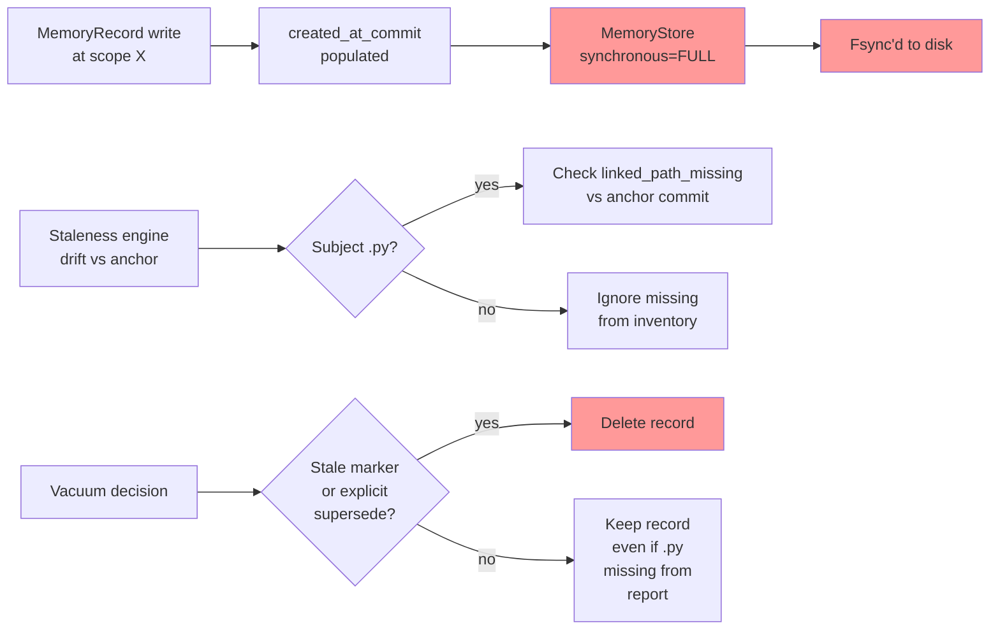

## Purpose

Engineering Memory SQLite storage enforces durability, provenance, and staleness contracts. This document defines schema invariants, failure modes, and quarantine rules that preserve memory integrity across concurrent writes, process exits, and repository drift.

## Contracts

| Contract | Enforcement | Risk |
|----------|-------------|------|
| **Synchronous=FULL** | Memory store fsync's every commit; intent/audit stores use NORMAL (loss-tolerable ephemeral state). Confusing the two databases voids durability guarantees. | Unclean process exit + power loss = silent record loss if write path uses wrong database handle. |
| **Commit-anchored provenance** | `MemoryRecord.created_at_commit` is populated at write time (and `verified_at_commit` on re-verification); staleness drifts vs. these commit anchors, never vs. disk inventory. Staleness rules: if linked subject file deleted and `subject_path` is Python (`.py`), mark stale with `linked_path_missing`; non-Python subjects ignored (docs, config files not in report inventory). | Subject inventory is incomplete (report only lists `.py` files). Applying `linked_path_missing` to `.md` or `.toml` subjects causes false stale markers and data loss under vacuum. |
| **No inventory-anchored vacuum** | Vacuum rules must never delete records based on subject absence from disk inventory alone. Deletion requires explicit evidence: stale markers, superseded trajectories, or archival intent. | Vacuum deletes valid memory for subjects outside canonical report scope (README, config files, vendor packages) → knowledge loss. |
| **Schema migration gates** | New column additions use `_add_column_if_missing()`; schema version bumps co-change version constant in tests and version docs. Missing the test bump masks migration failures in CI. | Inconsistent version state across tests, code, and docs; silent failures in migration. |
| **Embedding-vector coercion** | Guard on `numbers.Real` (excluding `bool`), never `isinstance(str \| int \| float)`. Real fastembed outputs numpy.float32 scalars, not Python float subclasses. | Coercion guards fail on numpy types; embeddings silently dropped or truncated. |

## Implementation map



## Failure modes

1. **Durability loss**: Using intent/audit store handle for memory writes → records written with NORMAL sync → power loss loses unfsynced writes. Fix: use separate `MemoryStore.connection()` handle; never cross-connect.

2. **False stale markers on non-Python subjects**: `staleness._subject_inventory_stale_reason()` checks if subject missing from `inventory_paths_from_report()` (which returns only `.py` files), marks `.md`, `.toml`, `.js` subjects as stale with `linked_path_missing`. Result: vacuum deletes documentation memory under false staleness. Fix: gate `linked_path_missing` reason to `.py` subjects only.

3. **Silent schema mismatch**: Code bumps `ENGINEERING_MEMORY_SCHEMA_VERSION = "1.8"`, adds column `X` via migration, but omits version bump in `tests/test_memory_schema.py`. Test database built at old version `1.7`, column `X` never created; inserts silently fail or return NULL for `X`. Fix: `_record_schema_migration()` must auto-sync version constant and test fixture.

4. **Embedding-vector loss**: Guard uses `isinstance(x, (int, float))`, receives `numpy.float32(0.5)` (which does not match), coercion skipped, embedding dropped. Fix: use `isinstance(x, numbers.Real) and not isinstance(x, bool)`.

5. **Vacuum cascades**: Intent projection job deletes parent trajectory record T1. Orphaned child experience records E1, E2 remain in `memory_experiences` (no foreign key constraint). Next query hits orphans; reconciliation deferred or skipped. Fix: add ON DELETE CASCADE to trajectory→experience foreign keys, or implement explicit orphan cleanup in vacuum.

## Verification

Required test coverage:

| Test file | Coverage |
|-----------|----------|
| `tests/test_memory_schema.py` | Schema version, column presence, migration idempotency. |
| `tests/test_memory_durability.py` | Fsync on MemoryStore, NORMAL on intent store, unclean exit recovery. |
| `tests/test_memory_governance.py` | Staleness rules, inventory anchoring, non-Python subject preservation. |
| `tests/test_memory_governance_vacuum_config_coverage.py` | Vacuum decision gates, stale marker precedence. |
| `tests/test_memory_experience_distillation.py` | Embedding coercion, numpy.float32 scalars, numbers.Real guard. |
| `tests/test_memory_extractors_repo.py` | Inventory accuracy: only `.py` files listed. |

Run before commit:
```bash
uv run pytest -q tests/test_memory_schema.py tests/test_memory_durability.py \
  tests/test_memory_governance.py tests/test_memory_experience_distillation.py
```

## Evidence index

- **mem-08c5f5411e1c425ca98dcce2ad00cc0f** (path_only): Memory SQLite uses synchronous=FULL; intent/audit stores use NORMAL. Reference: `codeclone/memory/schema.py`.

- **mem-5726b2105f674ef380aac4f4df932933** (path_only): Commit-anchored provenance required; staleness must drift vs. anchor commit, not inventory. Reference: `codeclone/memory/staleness.py`.

- **mem-829156ad116c4757aae082b6fc42e48b** (path_only): `staleness._subject_inventory_stale_reason()` falsely marks non-Python subjects (.md, .toml, .js) stale with `linked_path_missing` because report only lists `.py` files. Fix: gate reason to `.py` subjects only. Reference: `codeclone/memory/staleness.py`.

- **mem-8293d87dc4744816a53e41d5624ebdec** (path_only): Experience distillation N+1: `memory.experience.distill` runs ~18 writes per experience. Fix: batch insert. Reference: `codeclone/memory/experience/distiller.py`.

- **mem-f4a92cec90b14319a3c24135d0ab6cde** (path_only): Real fastembed embed() yields numpy.float32 scalars. Coercion must guard on `numbers.Real` (excluding `bool`), never isinstance(str|int|float). Reference: `codeclone/memory/embedding/fastembed_provider.py`.

- **mem-15e3f19498ef46a2bc3f8c24306e7e41** (path_only): Schema migrations reuse `_add_column_if_missing()` and `_record_schema_migration()`. Version bumps co-change test constant. Reference: `codeclone/memory/schema_migrate.py`.

- **mem-53f8a3942268431c9d42185e576e197d** (path_only): `distill_experiences` self-tripped duplicated_branches via consecutive trivial continue guards. Avoid ≥2 sequential trivial continue/return-None guards. Reference: `codeclone/memory/experience/distiller.py`.
