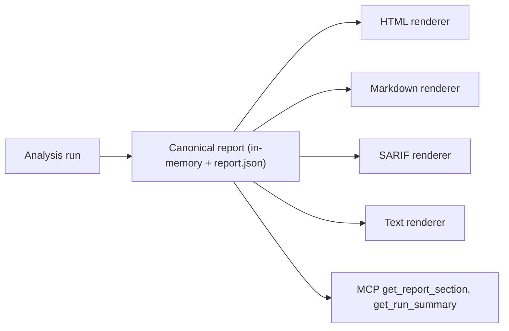

## Purpose

The report schema contract defines the structural format, versioning, and digest identity guarantees for CodeClone JSON, HTML, Markdown, SARIF, and text reports. Reports are the primary artifact surface for analysis results, serving CLI consumers, MCP tools, external CI/CD systems, and IDE integrations. This contract governs:

- **Schema versioning and stability**: `REPORT_SCHEMA_VERSION` and per-artifact version constants
- **Structural boundaries**: required and optional sections
- **Output path contracts**: default report locations and customization rules
- **Failure modes**: partial reports, schema drift, path traversal in custom paths

## Contracts

| Constant | Scope | Mutation policy |
|----------|-------|------------------|
| `REPORT_SCHEMA_VERSION` | Canonical JSON report; all derived formats are rendered from it | Bump only for a structural contract change; document the change in `codeclone/contracts/__init__.py` |
| `BASELINE_SCHEMA_VERSION` | `codeclone.baseline.json`; immutable artifact | Never auto-upgrade; a version bump requires an explicit baseline regeneration |
| `CACHE_VERSION` | `.cache/codeclone/` analysis cache | Bump invalidates all existing cache entries |
| `BASELINE_FINGERPRINT_VERSION` | Baseline integrity fingerprint | Never change without a reviewed migration (see the CLAUDE.md hard-boundaries rule) |

Exact current values live in `codeclone/contracts/__init__.py` — read from there directly rather than copying a number into a doc, since these constants are the single source of truth and drift silently otherwise.

### Report formats

| Format | Flag | Default path when FILE is omitted |
|--------|------|-------------------------------------|
| JSON (canonical) | `--json [FILE]` | `.codeclone/report.json` |
| HTML | `--html [FILE]` | `.codeclone/report.html` |
| Markdown | `--md [FILE]` | `.codeclone/report.md` |
| SARIF 2.1.0 | `--sarif [FILE]` | `.codeclone/report.sarif` |
| Plain text | `--text [FILE]` | `.codeclone/report.txt` |

The JSON report is the canonical artifact; HTML, Markdown, SARIF, and text are rendered from the same in-memory report structure produced by one analysis run, not separately regenerated from a prior JSON file on disk.

### Output path contract

A custom report path must resolve inside the repository root. Paths that would traverse outside the root are rejected rather than silently written elsewhere — see the same repo-relative containment invariant documented for the analysis cache in `docs/internal/surfaces/baseline-cache-report.md`.

## Implementation map



Report assembly and rendering live under `codeclone/report/` (per-format renderers under `codeclone/report/renderers/`, HTML-specific composition under `codeclone/report/html/`). Schema version constants live in `codeclone/contracts/__init__.py`. The MCP-facing read path for report sections is `codeclone/surfaces/mcp/_report_section.py`.

## Failure modes

| Mode | Symptom | Recovery |
|------|---------|----------|
| Reader built against an older `REPORT_SCHEMA_VERSION` | Reader errors on unrecognized sections instead of skipping them | Reader must treat unknown top-level report sections as forward-compatible and skip them |
| Custom `--json`/`--html`/... path escapes the repository root | Rejected rather than written | Use a path inside the repository, or the default `.codeclone/report.<ext>` |
| Stale baseline compared against a newer schema | `compared_without_valid_baseline` / untrusted baseline signal | Regenerate the baseline with `--update-baseline` on the same schema version |

## Verification

- `uv run pytest -q tests/test_report.py tests/test_html_report.py`
- `uv run pytest -q tests/test_baseline.py` for baseline schema and fingerprint invariants
- `uv run pytest -q tests/test_mcp_service.py -k report` for the MCP read path

### Manual verification

```bash
codeclone . --json
jq '.schema' .codeclone/report.json
```

## Evidence index

| Claim | Corroboration | Source |
|-------|----------------|--------|
| Report format flags and default paths | supported | `codeclone --help` (Reporting section), verified live this session |
| `REPORT_SCHEMA_VERSION` / `BASELINE_SCHEMA_VERSION` / `CACHE_VERSION` are read from `codeclone/contracts/__init__.py`, never copied elsewhere | supported | CLAUDE.md hard-boundaries rule; `codeclone/contracts/__init__.py` |
| Cache wire path containment (repo-relative only) | path_only | mem-231f686b92ba4103a6322e683ead9e6a, mem-bc26f97ebb0944a9986de756b857c9d3 (`codeclone/cache/projection.py`) |
| MCP report read path is `codeclone/surfaces/mcp/_report_section.py` | supported | verified directly against the repository tree this session |
