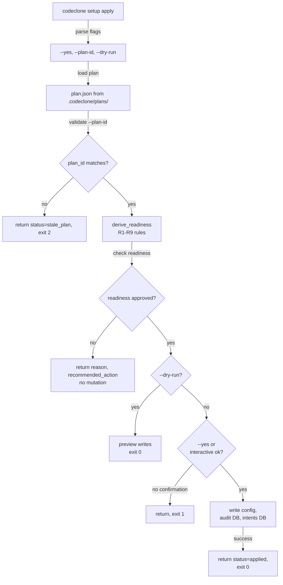

## Purpose

The `setup apply` command writes filesystem state (configuration, audit database initialization, intent registry setup) according to a plan. This contract guarantees:

1. **Mutation is intentional:** apply requires explicit user confirmation or non-interactive flags to write.
2. **Plan binding:** apply can bind to a specific plan via `--plan-id` to guard against stale or out-of-order execution.
3. **Readiness authority:** derive_readiness (R1–R9) is the sole readiness authority; `apply` honors readiness from the plan but does not override it.

## Contracts

### CLI Safety

| Flag | Behavior | Required context |
|------|----------|------------------|
| `--yes` | Non-interactive mode; apply writes without prompting | Use in CI/automation; paired with dry-run validation upstream |
| `--dry-run` | Preview writes without mutation; exit 0 if feasible | Use before `--yes` to verify plan safety |
| `--plan-id <uuid>` | Bind apply to a specific plan; return status=stale_plan (exit 2) if plan ID mismatch | Use when apply follows plan; ensures apply/plan coherence |
| None (interactive) | Prompt user for confirmation; no --yes required | Default shell/IDE mode |

### Non-interactive apply

`--yes` and `--dry-run` are **peer flags**, not conflicting:
- `--dry-run` alone → preview, exit 0 (no mutation)
- `--dry-run --yes` → allowed, exit 0 (no mutation)
- `--yes` alone → write (mutation)
- Neither → interactive prompt

If `--plan-id` mismatches or plan is stale, return **status=stale_plan**, exit code 2, before writing.

### Readiness binding

Apply reads the plan's derived readiness (R1–R9 rules). It **never** reinterprets or overrides readiness in the presentation layer. Readiness changes are governed by `derive_readiness()` logic in `codeclone/surfaces/cli/setup/engine/readiness.py`.

## Implementation map

Subject paths:
- `codeclone/surfaces/cli/setup/main.py` — entry point, CLI parsing
- `codeclone/surfaces/cli/setup/engine/apply.py` — core apply logic
- `codeclone/surfaces/cli/setup/engine/readiness.py` — R1–R9 derive rules
- `codeclone/surfaces/cli/setup/engine/rollup.py` — handler pattern (describe_*, no readiness override)

## Failure modes

| Condition | Response | Recovery |
|-----------|----------|----------|
| Plan file not found | status=plan_not_found, exit 1 | Run `setup plan` first |
| `--plan-id` mismatch (UUID does not match plan) | status=stale_plan, exit 2 | Use correct plan ID or omit `--plan-id` to reload |
| Readiness check fails (R1–R9 violation) | return reason, recommended_action; no write | Address readiness check (e.g., audit is disabled) |
| `--yes` missing in non-interactive environment | status=requires_confirmation, exit 1 | Add `--yes` or `--dry-run` |
| Write permission denied (config path, DB path) | status=permission_error, exit 1 | Verify ownership and umask; adjust `.codeclone/` permissions |
| Concurrent apply (intent registry locked) | status=locked, exit 1 (retryable) | Wait for prior apply to complete or clear stale intent |

## Verification

### Unit tests

File: `tests/test_cli_setup.py`

- Verify `--yes` allows non-interactive write
- Verify `--dry-run` previews without mutation
- Verify `--plan-id` mismatch returns exit 2, status=stale_plan
- Verify interactive mode prompts user; respects user choice
- Verify readiness (R1–R9) is respected; no override in presentation
- Verify golden fixture `tests/fixtures/golden_setup_snapshot_v1.json` captures correct readiness states (ci_policy attention-when-no-flags, audit attention-when-disabled, governed=true reachable)

### Integration contract

- After apply with `status=applied`, `.codeclone/db/audit.sqlite3` and `.codeclone/db/intents.sqlite3` must be writable and schema-initialized
- Config keys from `pyproject.toml` `[tool.codeclone.*]` must be loadable without merge errors
- `codeclone status` post-apply must reflect new state (audit_enabled, intent_registry_enabled, etc.)

## Evidence index

| Type | ID | Statement | Subject |
|------|----|-----------|---------
| change_rationale | mem-a262a1d | CLI mutation safety: `--yes` required for non-interactive; `--plan-id` binds to plan; status=stale_plan on mismatch (exit 2) | codeclone/surfaces/cli/setup/main.py |
| change_rationale | mem-c91d7 | Readiness authority: derive_readiness (R1–R9) is SOLE authority; handlers must not override | codeclone/surfaces/cli/setup/engine/rollup.py |
| change_rationale | mem-a8e1ce | Setup tests: golden fixture updated for corrected readiness model | tests/test_cli_setup.py |
