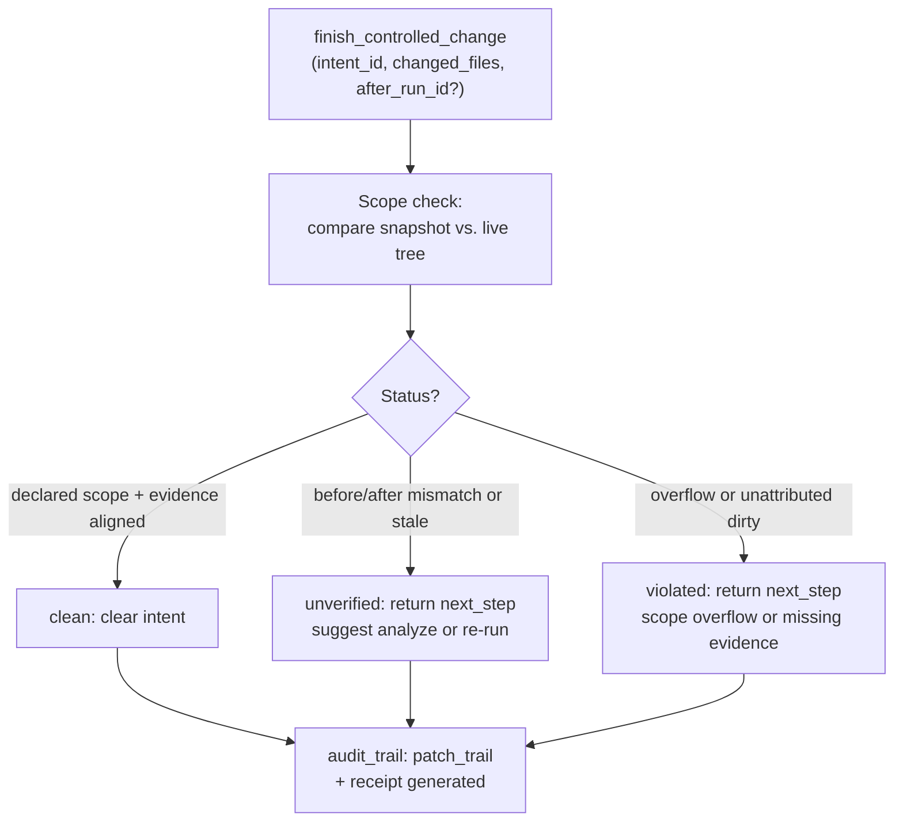

## Purpose

Closure review verifies that a controlled change completes end-to-end: intent declared, scope verified, changes applied and reconciled, patch contract met, and workflow state cleared. This runbook guides agents through the `finish_controlled_change` lifecycle, recoverable block states, and evidence reconciliation.

## Contracts

| Contract | Schema | Surfaces |
|----------|--------|----------|
| AUDIT_PROJECTION_VERSION | `audit-v1` | audit_events |
| PATCH_TRAIL_SCHEMA_VERSION | `1` | audit_events, change_control |
| IDE_GOVERNANCE_PROTOCOL_VERSION | `2` | change_control |

Finish applies scope checks against the declared intent snapshot and the live git tree. A "clean" result clears the intent; "unverified" or "violated" leaves it active with a deterministic next_step.

## Implementation map

Finish execution order (post-edit, post-analysis if required by profile):

1. **Scope reconciliation**: compare intent's declared scope against changed_files evidence and git tree
2. **Patch contract derivation**: compute verification profile (python_structural / governance_config / documentation_only / non_python_patch)
3. **Verification**: structural checks (cohesion, coupling, complexity, coverage) when profile requires
4. **Patch trail assembly**: collect declared, changed, untouched, scope check result, verification, workspace hygiene flags
5. **Receipt generation**: `create_review_receipt` with intent state and findings
6. **Intent clearance**: if status is "accepted" (or "accepted_with_external_changes"), mark intent cleared in session

## Failure modes

| Mode | Trigger | Recovery |
|------|---------|----------|
| `missing_evidence` | Changed files in scope but not reported to finish | Add missing files to `changed_files` array, retry finish with same `intent_id` |
| `foreign_dirty_overlap` | Foreign agent holds active intent in overlapping scope | Queue own intent, wait for foreign to clear, call `manage_change_intent(action="promote")` |
| `own_unscoped_dirty` | Own unattributed changes outside declared scope | Either remove out-of-scope changes (if unintended) or call `start_controlled_change` with expanded scope |
| `unverified` | After-run mismatch or Python structural verification required but absent | Call `analyze_repository` with new run_id, pass `after_run_id` to finish again on same `intent_id` |
| `violated` | Scope check found overflow or uncorrected evidence gap | Fix changed files or widen scope via new `start_controlled_change`, then retry finish on the expanded intent |

## Verification

**Pre-finish checklist:**

- [ ] Intent is active (`start_controlled_change` returned `edit_allowed=true`)
- [ ] All edits are within declared scope
- [ ] If profile requires after-run (python_structural or governance_config): `analyze_repository` completed with new run_id
- [ ] If complexity/incident detected: `manage_engineering_memory(action=record_candidate)` called before finish
- [ ] `changed_files` list passed to finish includes all modified files in scope (git diff confirms)

**Post-finish checks:**

- If `status: "accepted"` or `"accepted_with_external_changes"`: patch is closed, intent cleared, safe to proceed
- If `status: "unverified"` or `"violated"`: follow the returned `next_step`; intent remains active; do not claim patch verified

## Evidence index

| Evidence | Corroboration | Source |
|----------|---------------|--------|
| Audit trail persists patch_trail and receipt as durably stored artifacts | path_only | codeclone/audit/__init__.py (mem-e228e6288c444029ae1e5c020f2f6678) |
| MCP session holds exactly one trackable active intent; calling start again evicts the prior one | path_only | codeclone/surfaces/mcp/_workspace_intent_lifecycle.py (mem-527db78f1ce24eb98ad06ce507f0de93) |
| Scope check reconciles intent snapshot against live tree; unattributed out-of-scope changes block only if CODECLONE_STRICT_FINISH is set | path_only | codeclone/surfaces/mcp/_workspace_intent_lifecycle.py |
| Finish clears intent only on accepted status; unverified/violated intents remain active with next_step hint | path_only | codeclone/surfaces/mcp/finish_controlled_change (implementation) |
| PID liveness for foreign intent owners is tri-state: unknown (PermissionError), recoverable (dead), or active | path_only | codeclone/surfaces/mcp/_workspace_intent_lifecycle.py (mem-6859f67ef1234556981b7ccb36673f77) |
| Implementation-context facet pages return exact state from saved MCP session artifact, never recomputed | path_only | codeclone/surfaces/mcp/_implementation_context_pages.py (mem-0ebd1dfb9f494c4e9909607bd8832ccf) |
