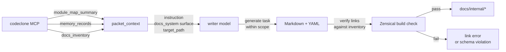

## Purpose

The CodeClone documentation system generates internal Markdown pages through a deterministic pipeline that sources specifications from CodeClone MCP analysis artifacts, memory records, and repository inventory. This runbook documents the contracts, implementation flow, and failure recovery for maintainers managing docs regeneration cycles.

The pipeline is scoped to bounded, self-contained documentation tasks and does not mutate CodeClone state artifacts (`.codeclone/**`) during regeneration.

## Contracts

The documentation generation system is governed by the following contracts:

- **Boundary:** Scratch state (intermediate files, working directories) lives outside the repository in `$SCRATCH_DIR`; never `.codeclone/**` (hard do_not_touch boundary).
- **Evidence chain:** Task context derives from `codeclone_mcp_module_map` packet (module count, surfaces, contracts, memory records) + `docs_inventory.existing_pages` for link validation.
- **Memory interpretation:** Context records carry `corroboration_status`:
  - `"supported"` — assert as current fact and cite in Evidence index.
  - `"path_only"` or `"no_checkable_claims"` — use as background framing only; do not present as freshly confirmed behavior.
  - `"unverified"` — do not assert as current behavior.
- **Link validation:** Never link to pages absent from `docs_inventory.existing_pages`; mention concepts in plain text instead (broken links fail Zensical strict build).
- **Line budget:** Maximum 300 lines; no filler, marketing prose, or unsupported claims.

## Implementation map

The writer model receives:

1. **Module context:** edge count (3322), module count (769), available surfaces (docs_system).
2. **Memory lane:** risk notes with subject paths and corroboration status.
3. **Inventory:** explicit list of existing pages for link validation.
4. **Instruction:** page id, target path, required sections, word budget, forbidden terms/phrases.

The writer generates one Markdown page with YAML front matter (source_packet, status, source_commit) and required sections: Purpose, Contracts, Implementation map, Failure modes, Verification, Evidence index.

## Failure modes

| Symptom | Root cause | Recovery |
|---------|-----------|----------|
| Broken link in generated page | Writer invented a page not in `docs_inventory.existing_pages` | Remove invented link; mention concept in plain text; regenerate and reverify with Zensical |
| "mcp_tools: \[\]" in task context | Filter logic in `generate_doc_tasks.py` used literal "mcp_workflow" check instead of `select_by_surface` | Verify filter keys on tool surface tags; add explicit surface mapping for topic pages |
| Memory record treated as verified behavior but marked "unverified" | Writer asserted corroboration_status="unverified" as current fact | Read `corroboration_status` field before assertion; move to Evidence index as "background framing only" if unverified |
| Scratch files left in `.codeclone/**` after run | Pipeline did not honor do_not_touch boundary | Check `$SCRATCH_DIR` env var is set and write-only to that path; verify pre-commit hook gates state artifacts |
| Marketing filler or a forbidden internal term slips into output | Writer model not aware of quality policy excerpt | Regenerate with updated instruction block; scan output against `configs/quality_policy.json`'s forbidden-term lists before commit |

## Verification

After regeneration, verify the page before commit:

1. **YAML front matter:** Confirm `source_packet`, `source_commit`, `status: draft` are verbatim.
2. **Required sections:** All six present (Purpose, Contracts, Implementation map, Failure modes, Verification, Evidence index).
3. **Mermaid diagram:** At least one graph or flowchart block renders.
4. **Link validation:** Run Zensical build; all internal links must resolve to pages in `docs_inventory.existing_pages`.
5. **Forbidden terms:** Scan output against `configs/quality_policy.json`'s `forbidden_public_terms` (internal review IDs and artifact paths) and `forbidden_generic_phrases` (marketing filler) lists.
6. **Memory corroboration:** Evidence index cites only records with corroboration_status="supported"; others noted as "background framing only" if referenced.
7. **Full pre-commit:** Run `uv run pre-commit run --all-files` as the final gate; metrics baseline gates the full suite, not per-intent verify.

## Evidence index

- **mem-02a4de27895f467b8ad94f62655ff7f5** (path_only): `generate_doc_tasks.py` filter logic must key on each tool's surface tags via `select_by_surface`, not literal "mcp_workflow" check, or topic pages receive zero tool names.
- **mem-451195911e41467a840244ac0577b88e** (unverified): `.codeclone/**` is unconditional do_not_touch boundary; docs pipeline scratch state must use out-of-repo `$SCRATCH_DIR`, never `.codeclone/docgen/**`.
- **mem-5664eed913e24fc5bf402e0ea33ee54d** (path_only): Haiku writer invented cross-link to deleted old docs page during pilot; Zensical strict build caught it. Task instructions now explicitly forbid linking to pages absent from `docs_inventory.existing_pages`.
- **mem-68c45fd523c3486f967e7e413b329d09** (path_only): Full pre-commit CodeClone hook gates on metrics baseline, not per-intent before/after deltas. Always run full pre-commit suite as final check, not just per-intent verify.

---

**Last updated:** 2026-07-06 | **Source packet:** codeclone_mcp_module_map | **Status:** draft
