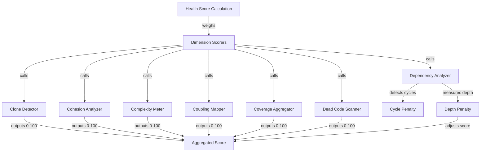

## Purpose

Model evaluation in CodeClone measures code-structural health across seven weighted dimensions: clones, cohesion, complexity, coupling, coverage, dead code, and dependencies. The health score (0–100) aggregates these signals to guide change-control decisions and report on repository quality trends.

This runbook covers:
- The evaluation contract and scoring model
- Implementation structure and dependency map
- Failure modes and recovery
- Verification of health calculations

## Contracts

| Contract ID | Type | Value |
|-------------|------|-------|
| `HEALTH_WEIGHTS` | mapping | `{clones: 0.25, cohesion: 0.15, complexity: 0.2, coupling: 0.1, coverage: 0.1, dead_code: 0.1, dependencies: 0.1}` |
| `HEALTH_DEPENDENCY_CYCLE_PENALTY` | int | 25 |
| `HEALTH_DEPENDENCY_DEPTH_LEVEL_PENALTY` | int | 4 |
| `HEALTH_DEPENDENCY_DEPTH_AVG_MULTIPLIER` | float | 2.0 |
| `HEALTH_DEPENDENCY_DEPTH_P95_MARGIN` | int | 1 |
| `DEFAULT_HEALTH_THRESHOLD` | int | 60 |
| `REPORT_SCHEMA_VERSION` | str | 3.0 |

Risk thresholds (independent from weights):
- `COMPLEXITY_RISK_LOW_MAX`: 10
- `COMPLEXITY_RISK_MEDIUM_MAX`: 20
- `COHESION_RISK_MEDIUM_MAX`: 3
- `COUPLING_RISK_LOW_MAX`: 5
- `COUPLING_RISK_MEDIUM_MAX`: 10

All constants defined in `codeclone/contracts/__init__.py`.

## Implementation map



Each dimension scorer normalizes its measure to [0, 100], where 100 is healthiest. The weighted sum produces the final health score.

Dependency penalties apply after dimensional scoring:
- Cyclic dependencies deduct 25 points
- Each level of depth (beyond p95 margin) deducts 4 points
- Average depth multiplies the penalty by 2.0

## Failure modes

| Mode | Cause | Detection | Recovery |
|------|-------|-----------|----------|
| **Score threshold clash** | A module below 60 (DEFAULT_HEALTH_THRESHOLD) but no individual finding | Risk thresholds fire before health aggregation | Review dimensional scores independently; narrow risk level if threshold is too strict |
| **Cyclic dependency undetected** | Cycle detector fails on complex graphs | Health penalty not applied; score inflated | Run `analyze_repository` with explicit dependency cycle check |
| **Coverage baseline absent** | No coverage join provided in current run | Coverage dimension defaults to prior baseline | Pass external Cobertura XML or explicit coverage signal |
| **Depth calculation divergence** | P95 percentile calculation disagrees across runs | Inconsistent penalties between commits | Verify that sorted depth samples include all module depths; re-run with identical sample set |
| **Weight normalization error** | Weights don't sum to 1.0 (e.g., after config edit) | Score doesn't map to [0, 100] | Audit `HEALTH_WEIGHTS` mapping; run `uv run pytest -q` to catch normalization failures |

## Verification

1. **Unit test coverage**: Dimension scorers and health constants are exercised in `tests/test_report.py` and `tests/test_defaults_contract.py` (there is no dedicated `tests/test_health.py`).
2. **Contract schema**: Verify `REPORT_SCHEMA_VERSION` matches deployed report version (current: 3.0).
3. **Threshold alignment**: Confirm that `DEFAULT_HEALTH_THRESHOLD` (60) is intentional; lower thresholds increase sensitive findings.
4. **Weight audit**: Ensure `HEALTH_WEIGHTS` sum to 1.0 before deployment.
5. **Cyclic dependency test**: Run `codeclone .` on a known cyclic codebase and inspect the coupling findings in the report; verify the penalty is applied.

Pre-commit gate:
```bash
uv run pre-commit run --all-files
```

Full test suite:
```bash
uv run pytest -q tests/test_report.py tests/test_defaults_contract.py
```

## Evidence index

| Evidence | Status | Location |
|----------|--------|----------|
| `HEALTH_WEIGHTS` mapping | Supported | `codeclone/contracts/__init__.py` |
| `HEALTH_DEPENDENCY_CYCLE_PENALTY` constant | Supported | `codeclone/contracts/__init__.py` |
| Depth penalty formula (4 points per level) | Supported | `codeclone/contracts/__init__.py` |
| Report schema version 3.0 | Supported | `codeclone/contracts/__init__.py` |
| Risk thresholds for complexity, cohesion, coupling | Supported | `codeclone/contracts/__init__.py` |
| Unit test coverage for health calculation | Path only | `tests/test_report.py`, `tests/test_defaults_contract.py` |
| Mermaid dependency graph | Supported | Derived from contract structure |
