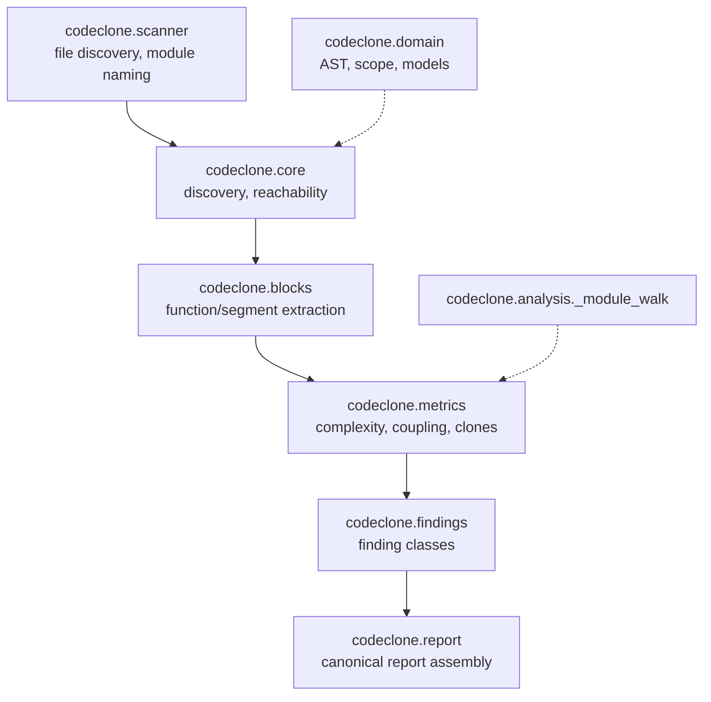

## Purpose

The structural analysis engine is the canonical detector and categorizer for Python code quality findings. It processes repository source, extracts structural metrics, identifies design risks, and reports findings through the MCP query API.

The engine is organized into functional surfaces — file discovery, analysis pipelines, domain models, block extraction, metrics computation, and finding classes — that feed a unified report contract. Clients access findings via deterministic queries and remediation guidance, never by re-deriving them.

## Contracts

| Contract | Value | Purpose |
|----------|-------|---------|
| `DEFAULT_BLOCK_MIN_LOC` | `20` | Minimum lines of code for a block to be eligible for block-level clone detection |
| `DEFAULT_BLOCK_MIN_STMT` | `8` | Minimum AST statement count for the same eligibility check |
| `CACHE_VERSION` | see `codeclone/contracts/__init__.py` | Analysis cache format; bumped on structural changes, invalidating all cached metrics |
| `HEALTH_WEIGHTS` | clones 0.25, complexity 0.2, cohesion 0.15, coupling 0.1, coverage 0.1, dead_code 0.1, dependencies 0.1 | Composite health score weighting across the seven structural dimensions |

Exact current values live in `codeclone/contracts/__init__.py` — read from there directly rather than copying a number into a doc.

## Implementation map

**Pipeline flow:**

1. **`codeclone.scanner`**: walks the filesystem (`iter_py_files`), applies `DEFAULT_EXCLUDES`, and derives module names from file paths. This is the file-discovery layer, not a caching or report-writing layer.
2. **`codeclone.core`**: parses Python AST and traces reachability, including bounded framework contracts (FastAPI lifecycle decorators, Pydantic `GenerateJsonSchema` hooks, Starlette/FastAPI route and app subclass hooks).
3. **`codeclone.blocks`**: extracts function and segment blocks, filtered by `DEFAULT_BLOCK_MIN_LOC` / `DEFAULT_BLOCK_MIN_STMT`.
4. **`codeclone.metrics`**: computes complexity, coupling, cohesion, and clone signals.
5. **`codeclone.findings`**: categorizes metrics into named finding groups (clones, cohesion, complexity, coupling, dead_code).
6. **`codeclone.report`**: assembles the canonical report consumed by CLI, MCP, and CI.

**Key modules called out by Engineering Memory:**

- `codeclone/analysis/_module_walk.py`: intra-module function-relationship resolution — detects method calls bound to `self`, `cls`, or same-module functions, keyed on the actual first parameter; staticmethods are excluded by design.
- `codeclone/analysis/phase_ledger.py`: micro-phase observability via a stdlib `PhaseLedger`, inert by default; timings are projected only as aggregate `pipeline.process` counters when the observer is enabled.
- `codeclone/metrics/dependencies.py`: dependency-graph sampling (`max_nodes`/`max_edges`/`node_id_fn`) shared by the Module Map and the Dependencies tab.
- `codeclone/findings/design/instance_methods.py`: has a duplicate bare-name Protocol/ABC interface check that diverges from the canonical alias-aware detection in `_module_walk` — a known determinism hazard (see Failure modes).

## Failure modes

| Mode | Symptom | Root cause | Mitigation |
|------|---------|------------|------------|
| Non-deterministic interface classification | Whether a class is treated as a Protocol/ABC implementer can vary by import alias style | `instance_methods.py` has a duplicate bare-name check that diverges from the canonical `_module_walk` Protocol/ABC-alias detection | Converge on one detection path in `_module_walk`; do not ship two Protocol/ABC implementations |
| Dead detector | `collect_instance_independent_methods` has zero callers | Phase 21 Cycle B (21.2–21.4) was never wired; deferred to avoid colliding with Phase 30 cache work | Complete the wiring before extending this detector further |
| Framework reachability blind spot | An entry point framework CodeClone doesn't recognize is treated as unreachable dead code | Reachability contracts are bounded to FastAPI, Pydantic, and Starlette hooks only, with no path-based exclusions | Flag unrecognized-framework repos explicitly rather than silently under-reporting reachability |
| Self-tripped structural findings when editing this engine | CodeClone's own clone/branch detectors flag new code added to `codeclone/analysis/`, `codeclone/findings/`, etc. | Repeated near-identical guard clauses (`if cond: continue`) or near-identical test assertions trip `duplicated_branches` / clone gates | Extract a shared predicate helper or parametrize tests instead of repeating near-identical statements |

## Verification

**MCP query tools** (read-only, from a stored run):

`list_findings`, `get_finding`, `check_clones`, `check_cohesion`, `check_complexity`, `check_coupling`, `check_dead_code`, `list_hotspots`, `get_production_triage`, `evaluate_gates`, `get_remediation`, `list_reviewed_findings`, `mark_finding_reviewed`.

**Test coverage:**

- `tests/test_blocks.py` — block extraction and thresholds
- `tests/test_metrics_*.py` — metrics computation and registry
- `tests/test_structural_findings.py` — finding categorization
- `tests/test_analysis_phase_ledger.py`, `tests/test_observability_analysis_phases.py` — phase ledger and observability

## Evidence index

| Claim | Corroboration | Source |
|-------|----------------|--------|
| `DEFAULT_BLOCK_MIN_LOC=20`, `DEFAULT_BLOCK_MIN_STMT=8` | supported | `codeclone/contracts/__init__.py`; cross-checked against a live `analyze_repository` run's `analysis_profile` (`block_min_loc: 20, block_min_stmt: 8`) |
| Health score weighting (clones 0.25, complexity 0.2, cohesion 0.15, coupling/coverage/dead_code/dependencies 0.1 each) | supported | `HEALTH_WEIGHTS` in `codeclone/contracts/__init__.py` |
| `codeclone.scanner` is the file-discovery layer (`iter_py_files`, module naming), not a report-caching layer | supported | verified directly against `codeclone/scanner/__init__.py` this session |
| `instance_methods.py` duplicate Protocol/ABC check vs. `_module_walk` | path_only | mem-1322da8d67214ad09278f39c6b53dae0 |
| Phase 21 Cycle B unwired | path_only | mem-0a9b4ea4ee8e41a58fdaf52c7defe376 |
| `_module_walk` intra-module relationship resolution | path_only | mem-6cc43f3d90394dfcb350437cae0780b4 |
| `phase_ledger` observability design | path_only | mem-df94987f37b84d6a969dd16af7a07d0a |
| `metrics/dependencies.py` sampling shared by Module Map | path_only | mem-dff5157a259341ffbc99a9ab9dcd54f6 |
