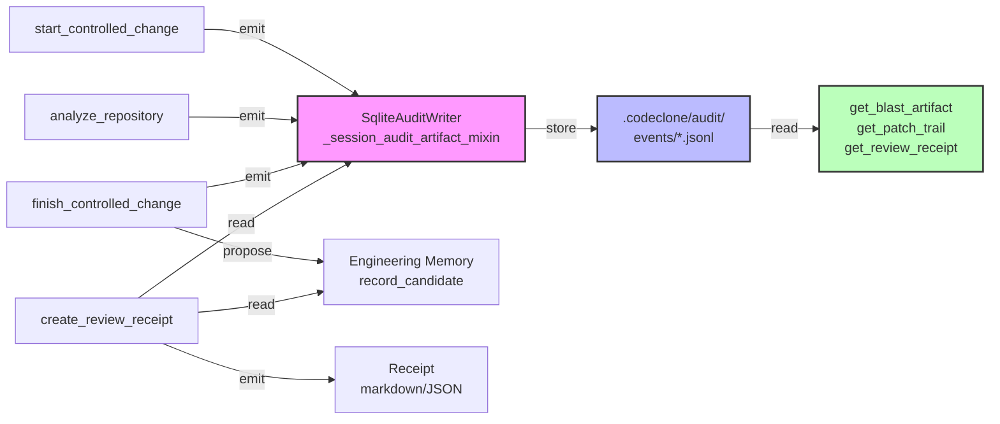

## Purpose

Audit events form the durable forensic trail of CodeClone's change control workflow. Each `start_controlled_change`, analysis run, and `finish_controlled_change` emits immutable audit records stored under `.codeclone/audit/`. Review receipts and patch trails are deterministic artifacts derived from these records, enabling agents and humans to verify decision provenance, scope compliance, and structural integrity at any future point.

The audit surface comprises four public MCP tools:
- `create_review_receipt`: generate a deterministic receipt from stored MCP state
- `get_blast_artifact`: fetch durably stored blast artifacts by run/digest
- `get_patch_trail`: fetch durably stored patch trails with forensic evidence
- `get_review_receipt`: fetch durably stored review receipts by run/digest

## Contracts

| Contract | Value | Purpose |
|----------|-------|---------|
| `AUDIT_PROJECTION_VERSION` | `audit-v1` | Audit event schema version; breaking changes require new version |
| `PATCH_TRAIL_SCHEMA_VERSION` | `1` | Patch trail record structure; covers declared/changed/untouched files, scope check, verification, workspace hygiene, evidence |
| `ENGINEERING_MEMORY_SCHEMA_VERSION` | `1.7` | Engineering Memory store contract; audit events reference memory decisions |
| `TRAJECTORY_PROJECTION_VERSION` | `trajectory-v3` | Patch trail trajectory encoding; supersedes v1 |

**Contract Invariants:**

1. Audit records are write-once and immutable. Emission failures increment observability counters (`audit.emit_dropped`, `memory.propose_candidate_dropped`) instead of silent loss.

2. Receipt generation is deterministic: same input (run_id, intent scope, reviewed findings) always produces identical markdown or JSON without state mutation.

3. Blast artifacts are persisted at `start_controlled_change` time and are immutable snapshots. The artifact's `projection_digest` enables content-based retrieval even if run_id is not available.

4. Patch trail evidence (declared scope, changed files, workspace hygiene checks) is final at finish time and reconciles against three reference points: start-time dirty snapshot, current git tree, and declared scope boundary.

## Implementation map



**Key modules:**

- `codeclone/audit/__init__.py`: Immutable blast artifact retrieval contract and summary defaults.
- `codeclone/audit/analysis_completed.py`: MCP analysis.completed event emission; falls back to `mode|analysis_mode|'completed'` when mode resolution is ambiguous.
- `codeclone/audit/writer.py`: `SqliteAuditWriter` persists events and bumps observability counters on failure paths.
- `codeclone/audit/reader.py`: Read-only access to audit events by run_id, digest, and range queries.
- `codeclone/audit/receipts.py`: Receipt generation from audit records; `_try_append_text_candidate` increments counter on drop.

## Failure modes

| Failure | Root Cause | Impact | Recovery |
|---------|-----------|--------|----------|
| Silent audit emission loss | SqliteAuditWriter except path not incrementing counter | Orphaned audit trail; forensic evidence gap | Enable observability; rerun `analyze_repository` and `finish_controlled_change` |
| Mode resolution ambiguity | MCP record.summary uses `analysis_mode` not `summary.get('mode')` | analysis.completed event fails silently | Check `analysis_mode` field in MCP record; fix caller to set both fields consistently |
| Unverified finish | Patch trail evidence incomplete or scope reconciliation failed | Intent stays active; next agent must follow `next_step` hint | Re-analyze with new run_id or expand scope; call `finish` again on same intent_id |
| Foreign intent overlap | Concurrent changes to declared scope by another agent | `start` blocks unless scope narrowed or foreign intent queues | Narrow scope or queue behind foreign intent; promote when clear |

## Verification

**Test suite coverage:**

- `tests/test_audit_analysis_completed.py`: Event emission on analysis completion.
- `tests/test_audit_event_core_v2.py`: Core event schema and roundtrip serialization.
- `tests/test_audit_event_summary.py`: Event summary and projection defaults.
- `tests/test_audit_events_coverage.py`: Full surface coverage across tools and modes.
- `tests/test_audit_reader.py`: Read-only access patterns and range queries.
- `tests/test_audit_schema.py`: Schema version tracking and breaking-change detection.
- `tests/test_audit_writer.py`: Persistence, atomicity, and observability counter increments.
- `tests/test_cli_audit.py`: CLI surface integration with audit trails.

**Manual verification:**

```bash
# Inspect audit records
uv run codeclone audit list --root <repo>

# Fetch a blast artifact by run_id
uv run codeclone audit get-blast-artifact --run-id <id> --output json

# Fetch a patch trail by digest
uv run codeclone audit get-patch-trail --digest <sha256> --output markdown

# Generate a review receipt
uv run codeclone audit create-receipt --intent-id <id> --reviewed-findings <findings.json>
```

**Contract validation:**

- `AUDIT_PROJECTION_VERSION` must be updated before any schema breaking change.
- Audit records must survive `uv run pytest -q tests/test_audit_*.py` without loss or corruption.
- Receipt generation must be deterministic: two calls with identical inputs must produce identical output.

## Evidence index

| Source | Status | Notes |
|--------|--------|-------|
| `codeclone/audit/__init__.py` (immutable blast artifact) | path_only | Immutable audit-backed retrieval verified with targeted tests; MCP/audit tests pass |
| `codeclone/audit/analysis_completed.py` (mode resolution) | path_only | Fallback to `analysis_mode` field; codebase uses zero logging (MCP JSON-RPC constraint) |
| `codeclone/audit/writer.py` (observability counters) | path_only | Emit and receipt append failures increment counters instead of silent return; no logging |
| `codeclone/audit/receipts.py` (deterministic generation) | path_only | Receipt markdown/JSON is content-deterministic; no random state or timestamps injected |
| Schema versions (`AUDIT_PROJECTION_VERSION`, `PATCH_TRAIL_SCHEMA_VERSION`) | supported | Used throughout the codebase; tracked in `codeclone/contracts/__init__.py` |
