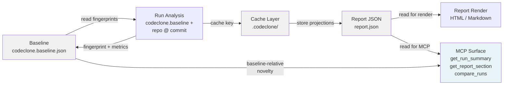

## Purpose

The baseline, cache, and report surfaces form CodeClone's deterministic state layer. **Baseline** (`codeclone.baseline.json`) captures fingerprinted structural facts at a reference commit. **Cache** (`.codeclone/` directory) stores ephemeral analysis artifacts and projections keyed to input immutability (repo, settings, commit hash). **Report** (JSON/HTML/Markdown outputs) represents findings, metrics, and audit trails derived from a single run.

Together these surfaces enforce:
- **Comparison identity**: reports and findings remain stable across identical inputs
- **Change tracking**: baseline-relative novelty and regression signals depend on fingerprint versioning
- **Workspace coordination**: cache keys bound scope and prevent stale artifact reuse
- **MCP visibility**: `get_run_summary`, `get_report_section`, and `compare_runs` provide canonical access

This page documents the contracts, mapping, failure modes, and verification requirements for this layer.

## Contracts

### Version invariants

| Contract | Value | Schema or Scope |
|----------|-------|-----------------|
| `BASELINE_SCHEMA_VERSION` | 2.1 | Baseline JSON structure (fingerprints, metadata, metrics) |
| `BASELINE_FINGERPRINT_VERSION` | 1 | Fingerprint stability; changes block historical comparison |
| `CACHE_VERSION` | 2.10 | Cache file serialization and projection format |
| `REPORT_SCHEMA_VERSION` | 2.12 | Report JSON sections: meta, metrics, findings, derived, integrity, inventory |
| `AUDIT_PROJECTION_VERSION` | audit-v1 | Audit trail projection into report integrity section |
| `METRICS_BASELINE_SCHEMA_VERSION` | 1.2 | Metrics baseline metrics formatting for `compare_runs` |

**Critical rule:** Incrementing `BASELINE_FINGERPRINT_VERSION` breaks all baseline comparisons. Any change to fingerprint logic (AST walk, block hash, slice boundary) requires explicit version bump and migration.

### Default paths

| Artifact | Path | Contract |
|----------|------|----------|
| Baseline | `codeclone.baseline.json` | Checked into repo; immutable reference; max 5 MB (DEFAULT_MAX_BASELINE_SIZE_MB) |
| Report (JSON) | `.codeclone/report.json` | Ephemeral; keyed to run_id and input hash |
| Report (HTML) | `.codeclone/report.html` | Ephemeral; renders `.codeclone/report.json` |
| Report (Markdown) | `.codeclone/report.md` | Ephemeral; plain-text derivation of JSON |
| Cache root | `.codeclone/` | Repo-relative; max 50 MB (DEFAULT_MAX_CACHE_SIZE_MB); security-hardened wire paths |
| State intents | `.codeclone/intents/` | Workspace coordination only; never user-edited |

### Security hardening

Cache wire paths are **repo-relative only**. Hardened behaviors:
- Absolute and traversal paths rejected in cache decode
- `pyproject.toml` loading rejects symlinked config files
- Advisory lock files use symlink-resistant `open()` on Unix

(See `codeclone/cache/projection.py` for implementation.)

## Implementation map



### Key modules

| Package | Role | Contracts |
|---------|------|-----------|
| `codeclone.baseline` | Read/write baseline JSON; fingerprint resolution | BASELINE_SCHEMA_VERSION, BASELINE_FINGERPRINT_VERSION |
| `codeclone.cache` | Projection serialization; wire path containment | CACHE_VERSION, security hardening |
| `codeclone.report` | Report construction; section selection; finding derivation | REPORT_SCHEMA_VERSION, section enumeration |

### MCP surface

Three tools expose baseline, cache, and report identity:

1. **`get_run_summary(run_id)`** — compact snapshot including:
   - Run metadata (commit, settings hash, analysis timestamp)
   - Aggregate metrics (cohesion, complexity, coupling, coverage)
   - Finding counts by family
   - Baseline novelty (introduced vs. regression vs. known)

2. **`get_report_section(section, run_id)`** — canonical section access:
   - `meta` — run identity and input hash
   - `metrics` — full metric detail with `compare_runs` shape
   - `findings` — paginated by family; novelty relative to baseline
   - `integrity` — audit trail and immutability claims
   - `inventory` — file registry and source paths

3. **`compare_runs(run_id_a, run_id_b)`** — two-run delta:
   - Requires identical repository root and settings
   - Baseline fingerprint version match enforced
   - Returns incomparable when preconditions fail

## Failure modes

### Baseline fingerprint version mismatch

**Condition:** User has checked-in `codeclone.baseline.json` with fingerprint version 1, codebase increments to version 2.

**Effect:** `get_run_summary` and `compare_runs` report `novelty: null`; baseline-relative signals unavailable.

**Recovery:** Recompute baseline at new fingerprint version:
```bash
codeclone . --update-baseline
```

**Prevention:** Baseline updates require the explicit `--update-baseline` flag; accidental snapshot is not possible.

---

### Cache key collision

**Condition:** Repository state, settings, and commit hash remain identical; cached projections are stale (e.g., analysis code has been patched).

**Effect:** `get_run_summary` returns cached, potentially incorrect metrics; user does not re-analyze.

**Recovery:** Cache is ephemeral and rebuilds on next full run. For immediate clarity:
```bash
rm -f .codeclone/cache.json
codeclone .
```

**Prevention:** Cache key includes analysis tool version; breaking changes to analysis logic increment CACHE_VERSION.

---

### Report schema evolution

**Condition:** Report schema bumps from 2.11 to 2.12 (e.g., new field added to findings). Older MCP servers or reports remain at 2.11.

**Effect:** `get_report_section(section='findings')` may omit or misinterpret new fields in old reports.

**Recovery:** Reanalyze the repository on the new version to generate a 2.12 report.

**Prevention:** Report consumers validate `report_schema_version` from the `meta` section before interpreting findings.

---

### Cache corruption or corruption recovery

**Condition:** Cache file `.codeclone/cache.json` is partially deleted or truncated.

**Effect:** Projection load fails; `get_run_summary` and `get_report_section` fail with file-not-found.

**Recovery:** Delete cache and reanalyze:
```bash
rm -f .codeclone/cache.json
codeclone .
```

**Prevention:** Cache is not persistent storage; treat `.codeclone/` as build artifact. Do not commit to version control.

---

### Baseline checkin drift

**Condition:** Baseline is checked into version control but not updated after legitimate code changes. New run detects all existing findings as non-novel.

**Effect:** `get_run_summary` reports `novelty: known` for all findings; actual regressions are masked.

**Recovery:** Update baseline with current valid state:
```bash
codeclone . --update-baseline
git add codeclone.baseline.json
git commit -m "chore: update baseline"
```

**Prevention:** CI integration enforces baseline drift detection; failing baseline mismatch gates pull requests.

## Verification

### Required tests

| Test file | Coverage |
|-----------|----------|
| `tests/test_baseline.py` | Baseline read/write, fingerprint resolution, schema migration |
| `tests/test_cache.py` | Cache key computation, projection serialization, wire path containment |
| `tests/test_report.py` | Report construction, section enumeration, schema conformance |
| `tests/test_metrics_baseline.py` | Baseline metrics formatting, comparison shape |
| `tests/test_report_contract_coverage.py` | Report schema version validation |
| `tests/test_analytics_reporting.py` | Report integration with analytics and findings |

### Verification checklist

- [ ] Baseline fingerprint version increments only with explicit code review and version bump
- [ ] Cache wire paths reject symlinks and traversal attempts
- [ ] Report JSON validates against declared schema version
- [ ] `compare_runs` enforces baseline fingerprint version match
- [ ] MCP tools expose canonical report sections without redaction or transformation
- [ ] Default paths match contract constants (DEFAULT_BASELINE_PATH, DEFAULT_*_REPORT_PATH)

## Evidence index

| Finding | Status | Source |
|---------|--------|--------|
| Cache wire path containment (repo-relative decode, symlink hardening) | supported | `codeclone/cache/projection.py`; memory mem-231f686b92ba4103a6322e683ead9e6a |
| Security hardening (path validation, config symlink rejection) | supported | `codeclone/cache/projection.py`; memory mem-bc26f97ebb0944a9986de756b857c9d3 |
| Report schema version 2.12 current | supported | context.reports.schema_version |
| Baseline schema version 2.1 current | supported | BASELINE_SCHEMA_VERSION contract |
| Cache version 2.10 current | supported | CACHE_VERSION contract |
| MCP tool surface (get_run_summary, get_report_section, compare_runs) | supported | context.mcp_tools.tools |
| Default paths and size limits | supported | contracts (DEFAULT_BASELINE_PATH, DEFAULT_MAX_CACHE_SIZE_MB, etc.) |
