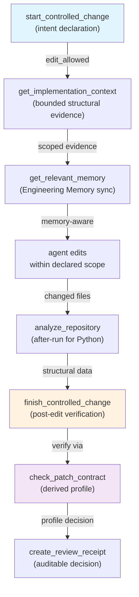

## Purpose

The change-control surface (`codeclone.budget`, `codeclone.controller_insights`, `codeclone.surfaces.mcp`, `codeclone.workspace_intent`) enforces deterministic edit authorization and verification for repository changes in MCP workflows. It declares change intents, computes blast radius and token budget, executes pre- and post-edit structural verification, and produces auditable receipts.

## Contracts

| Contract | Value | Role |
|----------|-------|------|
| `PATCH_TRAIL_SCHEMA_VERSION` | "1" | Audit trail format for declared/changed/untouched files, scope check, verification, workspace hygiene |
| `AUDIT_PROJECTION_VERSION` | "audit-v1" | Immutable audit event storage for start/finish artifacts and repair trails |
| `BASELINE_SCHEMA_VERSION` | "3.0" | Baseline version for health/patch_health_delta computation |
| Session intent constraint | One active per MCP session | Calling `start_controlled_change` before finishing evicts prior intent; recover via `manage_change_intent(action='recover')` |
| Scope shape | `{"allowed_files": ["path.py", ...]}` | Relative paths under project root; verified from live testing |

## Implementation map

Core packages: `codeclone.workspace_intent` (lifecycle), `codeclone.budget` (token/health accounting), `codeclone.controller_insights` (blast radius, findings), `codeclone.surfaces.mcp` (MCP-session state, intent registry).

## Failure modes

| Mode | Cause | Recovery |
|------|-------|----------|
| `status: "blocked"` | Concurrent foreign intents; `concurrent_intents` non-empty | Narrow scope or coordinate; promote via `manage_change_intent(action='promote')` when foreign clears |
| `status: "queued"` | Declared scope overlaps active foreign intent | Automatic queue; call `manage_change_intent(action='promote')` when promoted by controller |
| `needs_analysis` | No valid MCP run for root | Call `analyze_repository(root=...)` before retry |
| Intent replacement | `start_controlled_change` called twice on the same (root, run_id) without `finish` | The previous intent is replaced and reported in `replaced_intents`; use the new `intent_id`. If the replaced intent held uncommitted work outside the new scope, start refuses instead: `status: "blocked"`, `reason: replaces_unfinished_intent` — finish/clear that intent or declare a scope covering its `orphaned_dirty_paths` |
| PID unknown (hardened) | Foreign intent owner PID inaccessible | Treated as unknown, not recoverable; remains visible for coordination; hook gate denies write |
| `finish_block_reason: missing_evidence` | Changed files not reported in `changed_files` or `after_run_id` | Rerun `analyze_repository` with new run_id; call `finish` again with same `intent_id` and updated evidence |
| `finish_block_reason: foreign_dirty_overlap` | Foreign in-scope dirty files after start snapshot | Coordinate with foreign intent holder; request clear or scope narrowing |
| `finish_block_reason: own_unscoped_dirty` | Editor touched files outside declared scope (when `CODECLONE_STRICT_FINISH=true`) | Remove out-of-scope changes or call `start_controlled_change` with expanded scope |

## Verification

Structural verification is profile-derived by `finish_controlled_change`:

- **`python_structural`**: any `.py`/`.pyi` touched → all checks (clones, cohesion, complexity, coupling, coverage, dead code, dependencies) → `after_run_id` required
- **`governance_config`**: config files only (pyproject.toml, CI, Dockerfile) → structural checks (gate evaluation, health thresholds) → `after_run_id` required
- **`documentation_only`**: docs files only (`.md`, `.rst`, LICENSE) → no structural checks → `after_run_id` not required
- **`non_python_patch`**: other files, no Python/docs → no structural checks, controller-reported limitations apply
- **`state_artifact_change`**: CodeClone state files touched (`.codeclone/`, `codeclone.baseline.json`) → verification violates; state artifacts immutable

Claim Guard validates cited review text against canonical report semantics via `validate_review_claims`:

- Security Surfaces must not be called vulnerabilities
- Report-only signals must not be called CI failures
- Known baseline debt must not be claimed as new
- Patch-local regression claims require before/after evidence (not baseline novelty alone)
- Dead code claims require reachability evidence
- Fix claims require post-patch verification

## Evidence index

All facts below carry `corroboration_status: supported` (asserted from stored code) or `path_only`/`no_checkable_claims` (background framing; do not present as freshly confirmed).

1. **Scope contract**: relative paths, `allowed_files` key. Source: verified from live `start_controlled_change` calls; live-tested shape confirmed at task time.
2. **Session intent uniqueness**: exactly one active per MCP session. Source: `codeclone/surfaces/mcp/_workspace_intent_lifecycle.py`; risk_note mem-527db78f1ce24eb98ad06ce507f0de93 (path_only).
3. **Freshness invariant**: mtime+size signatures + pre-analysis DirtySnapshot capture pre-existing unchanged dirtiness detection. Source: `codeclone/surfaces/mcp/_workspace_drift.py`; contract_note mem-6e6628aa24504020ae2f1f8628365ddc (path_only).
4. **Token estimation**: audit paths use chars_approx by default; exact tiktoken opt-in. Source: `codeclone/budget/estimator.py`; contract_note mem-d788578731ab44bca24698962e79b952 (path_only).
5. **Inventory projection mismatch**: clones_only summary mismatch in `_session_helpers._summary_inventory_payload`, not canonical inventory. Source: `codeclone/surfaces/mcp/_session_helpers.py`; risk_note mem-881b92197a6d420ca3adfff4d338ba8e (path_only).
6. **Security hardening**: PID PermissionError tri-state unknown; unknown foreign owners visible as active/stale; hook write-gate denies unknown. Source: `codeclone/surfaces/mcp/_workspace_intent_lifecycle.py`; architecture_decision mem-6859f67ef1234556981b7ccb36673f77 (path_only).
7. **Implementation context exactness**: facet pages exact only from saved MCP session projection; `get_implementation_context_page` must return not_found or mismatch, never recompute. Source: `codeclone/surfaces/mcp/_implementation_context_pages.py`; contract_note mem-0ebd1dfb9f494c4e9909607bd8832ccf (path_only).

### Required tests

- `tests/test_workspace_intent_gate.py`: intent lifecycle, active/queued/blocked states
- `tests/test_workspace_intent_sqlite_store.py`: intent persistence, recovery
- `tests/test_controller_insights.py`: blast radius, do-not-touch boundaries, coverage gaps
- `tests/test_mcp_context_governance.py`: scope validation, concurrent intent detection
- `tests/test_mcp_security_hardening.py`: PID liveness checking, unknown state tri-state
