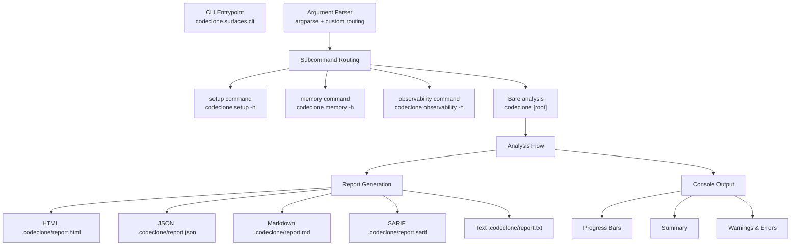

## Purpose

This document specifies the output contracts for CodeClone's command-line interface (CLI). It defines what the user sees on stdout, stderr, and in report files across all CLI entrypoints (bare analysis, `setup`, `analytics`, `memory`, `observability`), how output is routed based on flags, and failure modes when output conditions are violated.

## Contracts

### Exit codes

| Code | Meaning | Trigger |
|------|---------|---------|
| 0 | Success | Analysis completed, no gate failures |
| 2 | Contract error | Invalid baseline, configuration, version mismatch, unreadable sources in CI mode, or an untrusted baseline lane that an active gate reads |
| 3 | Gating failure | New clones found, threshold exceeded, metrics regression, quality gate violation |
| 5 | Internal error | Unexpected exception (unhandled error, environment issue) |

### Top-level subcommands

CodeClone has exactly four top-level subcommands (dispatched in `codeclone/surfaces/cli/workflow.py`):
- `codeclone setup [action]` — readiness, configuration planning, and initialization
- `codeclone analytics [subcommand]` — corpus analytics (snapshot, embed, cluster, build, profiles, …)
- `codeclone memory [subcommand]` — engineering memory lifecycle (init, status, search, approval, trajectories, etc.)
- `codeclone observability [action]` — MCP and workspace observability (diagnostics, tracing, span export)

Plus the bare invocation: `codeclone [root]` — runs analysis (there is no "analyze" or "check" subcommand).

### Report output routing

Reports are specified as **flags**, not subcommands. The analysis always runs; reports are optional outputs:

```
--html [FILE]          Write HTML report to FILE or .codeclone/report.html
--json [FILE]          Write JSON report to FILE or .codeclone/report.json
--md [FILE]            Write Markdown report to FILE or .codeclone/report.md
--sarif [FILE]         Write SARIF 2.1.0 report to FILE or .codeclone/report.sarif
--text [FILE]          Write plain-text report to FILE or .codeclone/report.txt
```

Multiple report flags may be combined in one invocation. If FILE is omitted, CodeClone writes to a standard default path under `.codeclone/`. When `--timestamped-report-paths` is set, default paths include a UTC timestamp.

### Console output control

| Flag | Effect |
|------|--------|
| `--progress` | Force progress bars and spinner frames to stdout (override auto-detection) |
| `--no-progress` | Suppress progress output; recommended for CI logs |
| `--color` | Force ANSI colors (override auto-detection) |
| `--no-color` | Disable ANSI colors |
| `--quiet` | Reduce output to warnings, errors, essential summaries only |
| `--verbose` | Include detailed identifiers for NEW clone findings in console output |
| `--debug` | Print tracebacks and environment details for internal errors |

The `--ci` preset is equivalent to `--fail-on-new --no-color --quiet`.

### Design code

Terminal presentation decisions have one owner:
`codeclone/ui_messages/styling.py`. Renderers import semantics from it and
never restate them locally.

- Grid: indentation moves in 2-space steps; summary labels pad to a
  13-column label field.
- Color is semantic: verdict styles (pass / fail / warn), count roles,
  accent, and meta. Chromatic color words appear only in the design module.
- Glyphs: `✔` pass, `✗` fail, `⚠` advisory, `·` in-row separator,
  `→` before/after transitions, `─` section rules.
- Counts render with thousands separators; nouns agree in number.
- Error messages state what failed, why, and an executable next step
  (a flag, a command, or a config key — never "see docs").
- Dynamic text is escaped before markup interpolation, so bracketed payload
  data such as `[Errno 2]` or severity markers survives rendering.
- `NO_COLOR` or a non-TTY stream yields plain, byte-stable output.

These rules are enforced mechanically by `tests/test_cli_design_system.py`:
a message added off the grid fails the suite, not review.

### Audit output

The `--audit` flag (read-only, no analysis required) displays the local Controller audit trail from the configured audit database. The `--audit-json` variant emits audit payload footprint as JSON, useful for cross-repository audits.

### Session and diagnostic flags

| Flag | Output | Requires analysis |
|------|--------|-------------------|
| `--session-stats` | Workspace session status (active agents, intents, lease health) | No |
| `--help` | Standard argument parser help | No |
| `--interactive-help` | Guided product tour (interactive terminal only) | No |
| `--version` | CodeClone version string | No |

## Implementation map



### Key modules

- **`codeclone.surfaces.cli`** — CLI entrypoint, argument parsing, subcommand routing
- **`codeclone.surfaces.cli.ui.progress_presenter`** — Progress bar and spinner management; integrates with help tour (methods: `bind_live`, `refresh`, `set_mascot`, `set_extra`)
- **`codeclone.surfaces.cli.ui.mascot_frames`** — Reusable animation loops for the help tour (graph pulse, scan, deps, cache, blocked)
- **`codeclone.surfaces.cli.observability`** — MCP and diagnostic output; subject to early-return branch deduplication risk

### Configuration and defaults

| Constant | Value |
|----------|-------|
| `DEFAULT_HTML_REPORT_PATH` | `.codeclone/report.html` |
| `DEFAULT_JSON_REPORT_PATH` | `.codeclone/report.json` |
| `DEFAULT_MARKDOWN_REPORT_PATH` | `.codeclone/report.md` |
| `DEFAULT_SARIF_REPORT_PATH` | `.codeclone/report.sarif` |
| `DEFAULT_TEXT_REPORT_PATH` | `.codeclone/report.txt` |

## Failure modes

### Invalid baseline (contract error, exit code 2)

- Baseline file does not exist when `--fail-on-new` is enabled
- Baseline is corrupted or unreadable
- Baseline root digest does not authenticate the container
- Baseline schema version does not match `BASELINE_SCHEMA_VERSION` ("3.0")
- Baseline fingerprint version does not match `BASELINE_FINGERPRINT_VERSION` ("3")
- Baseline exceeds `DEFAULT_MAX_BASELINE_SIZE_MB` (5 MB)

**Remediation:** Use `--update-baseline` to regenerate, or remove the baseline and re-run.

### Untrusted baseline lanes (per-lane degradation)

Baseline trust is per lane, not per file. A container whose root digest
authenticates may still carry individual lanes the current runtime cannot read
— most often after a lane payload schema bump, reported as
`payload_schema_outdated`. One such lane does not condemn the whole baseline.

The CLI resolves each untrusted lane against the versioned gate-to-lane matrix
(`active_gate_lane_requirements`), the single authority on which gate reads
which lane:

| Condition | Behaviour |
|-----------|-----------|
| No untrusted lanes | Unchanged; the baseline is fully trusted |
| Untrusted lane that **no** active gate reads | Run completes. The lane is named on stdout as opaque and its comparisons report `baseline_diff_available: false` |
| Untrusted lane that an active gate **does** read | Contract error, exit code 2, fail-closed |

Novelty for an opaque lane is reported as unavailable, never as zero: a
degraded lane must not be mistaken for a clean one. Lanes that remain trusted
keep their baseline comparisons in the same run.

**Remediation:** Use `--update-baseline` to regenerate the baseline so every
lane matches the current runtime contract.

### Invalid cache (contract error, exit code 2)

- Cache file is corrupted
- Cache schema version does not match `CACHE_VERSION` ("3.7")

**Remediation:** Delete `.codeclone/cache.json` and re-run.

A cache above `DEFAULT_MAX_CACHE_SIZE_MB` (256 MB) is not a contract error: the
file is ignored on load with a warning and the run falls back to cold analysis.

### Report file write failure (contract error, exit code 2)

- Target directory does not exist and cannot be created
- Permission denied on report path
- Disk full

**Remediation:** Check filesystem permissions and available disk space; specify an alternative report path.

### New clone findings with --fail-on-new (gating failure, exit code 3)

A finding is NEW if it appears in the current run but not in the baseline. Gating blocks the build.

**Message:** `Gating failure: new clones detected [finding_id ...]. Update the baseline or mitigate findings.`

### New metrics violations with --fail-on-new-metrics (gating failure, exit code 3)

A metric regression occurs when the current run reports a violation (e.g., cyclomatic complexity > 20) that was not present in the metrics baseline.

**Trigger:** `--fail-on-new-metrics` + metrics baseline + at least one metric crosses the gate threshold.

### Threshold violations (gating failure, exit code 3)

| Gate | Trigger | Default | Exit code |
|------|---------|---------|-----------|
| `--fail-threshold` | Total clones exceed limit | None (disabled unless set) | 3 |
| `--fail-complexity` | Any function CC > threshold | 20 | 3 |
| `--fail-coupling` | Any class CBO > threshold | 10 | 3 |
| `--fail-cohesion` | Any class LCOM4 > threshold | 4 | 3 |
| `--fail-cycles` | An **import-time** module cycle exists (`import_cycle`). A `deferred_cycle` is reported and does not gate | N/A | 3 |
| `--fail-dead-code` | High-confidence dead code found | N/A | 3 |
| `--fail-health` | Overall health score < threshold | 60 | 3 |
| `--fail-on-typing-regression` | Typing coverage regresses | N/A | 3 |
| `--fail-on-docstring-regression` | Docstring coverage regresses | N/A | 3 |
| `--fail-on-api-break` | Public API removed or signature breaks | N/A | 3 |
| `--fail-on-untested-hotspots` | Medium/high-risk functions below coverage threshold | 50% (coverage-min) | 3 |

### Internal error (exit code 5)

An unexpected exception occurred. The error is logged to stderr with a traceback (if `--debug` is set). This indicates a bug, not a user configuration issue.

**Always report with:** Python version, CodeClone version, repository root, and full traceback.

### Early-return deduplication risk

The observability module may flag two legitimately-distinct early-return branches that share identical shape as duplicated code. This is a false positive when branches handle separate exit paths.

**Known mitigation:** Extract one branch to a single-statement named helper so the bodies differ structurally. **Status:** path_only (background knowledge, not verified in current context).

## Verification

### Unit tests

Tests cover CLI flag combinations, report generation, exit codes, and output routing:

- `tests/test_cli_design_system.py` — Mechanical design-code validator (grid, style ownership, message anatomy, argparse help discipline)
- `tests/test_cli_smoke.py` — Basic invocation and output presence
- `tests/test_cli_help_snapshot.py` — Help text consistency
- `tests/test_cli_config.py` — Configuration and defaults
- `tests/test_cli_patch_verify.py` — Gating and exit codes
- `tests/test_cli_session_stats.py` — Session diagnostics output
- `tests/test_cli_audit.py` — Audit trail output
- `tests/test_cli_blast_radius.py` — Blast radius output format
- `tests/test_analytics_cli.py` — Analytics integration
- `tests/test_cli_setup.py` — Setup subcommand
- `tests/test_memory_cli.py`, `tests/test_memory_cli_*.py` — Memory subcommand family
- `tests/test_observability_cli_*.py` — Observability output

### Contract requirements

1. All report formats (HTML, JSON, MD, SARIF, TEXT) must be valid and match schema versions.
2. Exit codes must be deterministic: code 0 iff no gates fail.
3. Progress output must respect `--progress`, `--no-progress`, and CI presets.
4. Colors must respect `--color`, `--no-color`, and terminal detection.
5. Timestamp insertion in default report paths must use UTC format.
6. Baseline and cache versions must match expected schemas; violations are contract errors (exit code 2).
7. Console output under `--quiet` must include warnings, errors, and essential summaries only.
8. `--verbose` must include detailed clone identifiers for NEW findings.
9. Report write failures must exit with code 2 and report the filesystem error.

## Evidence index

| Subject | Type | Status | Evidence |
|---------|------|--------|----------|
| `codeclone.surfaces.cli` (package) | implementation | path_only | CLI entrypoint and routing; package exists and is public |
| Subcommands: `setup`, `memory`, `observability` | contract | supported | CLI help text, argparse routing |
| Bare analysis: `codeclone [root]` | contract | supported | CLI help, no "analyze" subcommand |
| Report flags (--html, --json, etc.) | contract | supported | CLI help text and argument parser |
| Default report paths | contract | supported | Constants in `codeclone/contracts/__init__.py` |
| Exit codes (0, 2, 3, 5) | contract | supported | CLI help text ("Exit codes:" section) |
| Progress presenter methods | change_rationale | path_only | `codeclone.surfaces.cli.ui.progress_presenter` (bind_live, refresh, set_mascot, set_extra) wired to help_tour; subject path exists |
| Mascot frames animation | change_rationale | path_only | `codeclone.surfaces.cli.ui.mascot_frames` holds 15-step ASTer tour loops (graph pulse, scan, deps, cache, blocked); subject path exists |
| Observability module early-return deduplication | risk_note | path_only | Two distinct early-return branches with identical shape may be flagged as duplicated; mitigation: extract one to named helper; subject path `codeclone/surfaces/cli/observability.py` exists |
| Tests (cli, memory, observability, setup, analytics, audit) | verification | path_only | 22 test files covering CLI surfaces; all paths exist in `tests/` directory |
