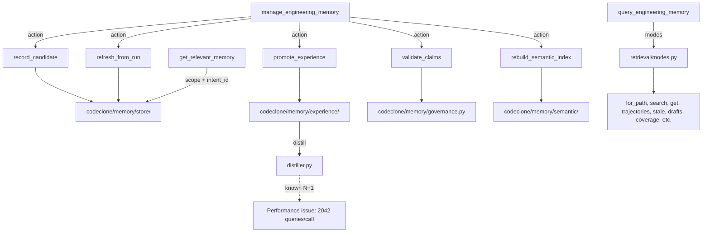

# Engineering Memory surface

## Purpose

Engineering Memory is a SQLite-backed evidence store for recording durable repository facts, workflow decisions, and incident trajectories across CodeClone sessions. It bridges the gap between ephemeral chat context and persistent agent knowledge, enabling next-session resumption and multi-agent coordination.

The surface provides four MCP tools:
- **get_relevant_memory**: ranked, evidence-linked retrieval for declared edit scopes
- **manage_engineering_memory**: governance actions (record, promote, validate, refresh)
- **query_engineering_memory**: mode-based inspection (search, get, for_path, trajectories, drafts, stale, etc.)
- **get_memory_projection_page**: pagination for omitted tail results

Schema version: `ENGINEERING_MEMORY_SCHEMA_VERSION="1.7"` (contract constant in `codeclone/contracts/__init__.py`).

## Contracts

| Invariant | Requirement | Source |
|-----------|-------------|--------|
| **Sync mode** | Memory SQLite uses `synchronous=FULL` (fsync'd every commit). Intent/audit stores use `NORMAL` (TTL-designed, recovery-tolerable loss). | `codeclone/memory/schema.py` |
| **Schema migration** | ALTER-style migrations must reuse `_add_column_if_missing + _record_schema_migration` in `schema_migrate.py`. Do not inline PRAGMA/ALTER inline. | `codeclone/memory/schema_migrate.py` |
| **Embedding vectors** | Real fastembed `embed()` yields `numpy.float32` scalars (not Python `float`/`int` subclasses). Guard coercion on `numbers.Real` (excluding `bool`), never `isinstance(str\|int\|float)`. | `codeclone/memory/embedding/fastembed_provider.py` |
| **Record types** | Supported: `architecture_decision`, `change_rationale`, `contract_note`, `contradiction_note`, `document_link`, `human_note`, `module_role`, `protocol_rule`, `public_surface`, `risk_note`, `stale_marker`, `test_anchor` | Memory configuration |
| **Statuses** | `active`, `archived`, `draft`, `historical`, `rejected`, `stale`, `superseded` | Memory configuration |
| **Projection versions** | `MEMORY_PROJECTION_VERSION="memory-v1"`, `SEMANTIC_INDEX_FORMAT_VERSION="3"`, `TRAJECTORY_PROJECTION_VERSION="trajectory-v3"` | Contract constants |

## Implementation map



## Failure modes

| Symptom | Root cause | Mitigation |
|---------|-----------|-----------|
| Schema migration inlined PRAGMA/ALTER | Repeated ALTER clauses in migration inline instead of reusing `_add_column_if_missing`. | Read `schema_migrate.py` before touching schema. Use `_record_schema_migration` wrapper. |
| Non-Python subjects marked stale as `linked_path_missing` | `staleness._subject_inventory_stale_reason` applies `linked_path_missing` to `.md`, `.toml`, `.js` subjects. `inventory_paths_from_report` lists only `.py` files. | Only apply `linked_path_missing` to `.py` subjects. Fix in `codeclone/memory/staleness.py`. |
| Semantic memory unavailable at runtime | Embedding coercion guards on `isinstance(str\|int\|float)` discard `numpy.float32` scalars. | Guard on `numbers.Real` (excluding `bool`) instead. See `embedding/fastembed_provider.py`. |
| Duplicated branches in experience distiller | Two consecutive `if cond: continue` guards with identical bodies trigger CodeClone's `duplicated_branches` detector. | Use one guard with positive condition + append. Avoid >=2 sequential trivial guards. |
| High memory, slow distill_experiences | Known N+1 in background projection worker: 2042 queries / 2031 writes per call; 523MB RSS / 2.9s observed. | Fix tracked in task_2a83620f (P2); requires batch insert optimization. Do not attempt workaround; escalate. |

## Verification

Before editing `codeclone/memory/`, run:

```bash
# Memory-specific tests
uv run pytest -q tests/test_memory_*.py tests/test_mcp_memory_*.py tests/test_cli_memory_*.py

# Schema and migration
uv run pytest -q tests/test_memory_schema.py tests/test_memory_config*.py

# Experience and semantic
uv run pytest -q tests/test_memory_experience*.py tests/test_memory_semantic.py tests/test_mcp_memory_semantic.py

# Retrieval and search
uv run pytest -q tests/test_memory_retrieval*.py tests/test_memory_search*.py

# All pre-commit
uv run pre-commit run --all-files
```

Do not manually update Engineering Memory baselines or semantic indexes. Use `manage_engineering_memory` actions only (agent actions only; `approve`/`reject`/`archive` not available via MCP).

## Evidence index

**Contracts and invariants:**
- `codeclone/contracts/__init__.py` (ENGINEERING_MEMORY_SCHEMA_VERSION, projection versions)

**Source paths:**
- `codeclone/memory/schema.py` (synchronous=FULL guarantee)
- `codeclone/memory/schema_migrate.py` (migration reuse patterns)
- `codeclone/memory/experience/distiller.py` (duplicated branches, N+1 performance)
- `codeclone/memory/embedding/fastembed_provider.py` (vector coercion guard)
- `codeclone/memory/staleness.py` (linked_path_missing overapplication)
- `codeclone/memory/retrieval/` (query_engineering_memory modes)
- `codeclone/memory/governance.py` (manage_engineering_memory actions)

**Test anchors:**
- `tests/test_memory_schema.py`, `tests/test_memory_config*.py` (schema and migration)
- `tests/test_memory_experience*.py` (distiller, duplicated branches)
- `tests/test_memory_embedding*.py` (embedding vectors, if present)
- `tests/test_memory_retrieval*.py` (retrieval modes and pagination)
- `tests/test_mcp_memory_management.py` (manage_engineering_memory actions)
- `tests/test_memory_durability.py` (synchronous=FULL guarantees)

**Memory records (supporting evidence):**
- mem-08c5f5411e1c425ca98dcce2ad00cc0f (SQLite sync mode, path_only)
- mem-15e3f19498ef46a2bc3f8c24306e7e41 (schema migration reuse, path_only)
- mem-53f8a3942268431c9d42185e576e197d (distiller duplicated branches, path_only)
- mem-8293d87dc4744816a53e41d5624ebdec (N+1 performance, path_only)
- mem-f4a92cec90b14319a3c24135d0ab6cde (embedding vector coercion, path_only)
- mem-829156ad116c4757aae082b6fc42e48b (staleness linked_path_missing, path_only)
