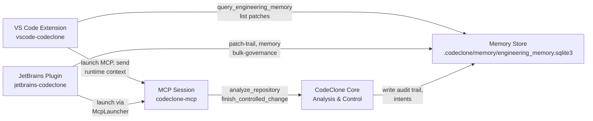

## Purpose

IDE integrations route CodeClone analysis into VS Code, JetBrains IDEs (PyCharm, IntelliJ, Rider), and Cursor through extension surfaces. These extensions expose MCP tools, governance memory workflows, and patch-trail visualization without requiring CLI invocation. Extensions bridge development workflows with the CodeClone controller through managed MCP processes, environment handling, and cache coordination.

## Contracts

| Contract | Value | Role |
|----------|-------|------|
| `IDE_GOVERNANCE_PROTOCOL_VERSION` | `2` | MCP handshake and governance-state serialization format for all IDE surfaces |
| `ENGINEERING_MEMORY_SCHEMA_VERSION` | `1.7` | Memory record and trajectory schema used by VS Code and JetBrains bulk-governance workflows |
| `TRAJECTORY_PROJECTION_VERSION` | `trajectory-v3` | Episode and patch-trail format for IDE patch-visualization UI |
| Extension entry point | `McpLauncher` (JetBrains), `runtime.js` (VS Code) | MCP process spawning and lifecycle management per IDE |

**Non-negotiables:**
- MCP process spawns must resolve `codeclone-mcp` tool via absolute PATH or explicit `uv` resolution, not shell lookup.
- Memory bulk-governance operations must dispatch `records_by_status` (active/draft/stale keys), not assume draft-only.
- Coverage paths passed to `analyze_repository` must be repo-relative unless caller sets `allow_repo_absolute=true`.
- `IDE_GOVERNANCE_PROTOCOL_VERSION` bumps require synchronized extension and MCP server updates.

## Implementation map

**Extension contact points:**
- `vscode-codeclone/src/runtime.js`: MCP launcher, coverage path normalization, Memory fetch and display.
- `jetbrains-codeclone/src/main/kotlin/.../McpLauncher.kt`: MCP spawning with environment augmentation, auto-connect on project open.
- `extensions/**/*.md`: Surface documentation and user guides (not included in this page).

## Failure modes

| Symptom | Root Cause | Mitigation |
|---------|-----------|-----------|
| JetBrains plugin fails to connect MCP on Dock launch | GUI PATH lacks `~/.local/bin` and `uv`; spawnEnvironment omits augmentation | McpLauncher must augment spawnEnvironment with user shell PATH or resolve tool absolute path before spawn |
| VS Code `analyze_repository` fails with "path not found" | Coverage XML path is absolute workspace path; core expects repo-relative | runtime.js must normalize coverage.xml to repo-relative; use `allow_repo_absolute=true` only when caller explicitly permits |
| Memory bulk-governance shows no stale records in UI | MCP status payload includes `records_by_status.stale`, but memoryController only dispatches `memoryDraft` | memoryController.js must handle all keys in `records_by_status`: `active`, `draft`, `stale` |
| Extension crashes when memory DB is missing | `.codeclone/memory/engineering_memory.sqlite3` not initialized | Bootstrap memory with `manage_engineering_memory(action="refresh_from_run")` on first connect or on missing-DB error |
| Race condition on concurrent IDE analysis | Two IDE instances spawn overlapping `analyze_repository` calls | Defer second IDE to same CodeClone server process via IPC coordination or implement intent-conflict queuing |

## Verification

1. **MCP connectivity**: Confirm `codeclone-mcp` is reachable from IDE via PATH or absolute resolve; capture spawn stderr on failure.
2. **Path handling**: For VS Code, verify coverage.xml is repo-relative in `analyze_repository` payload; for JetBrains, confirm McpLauncher augments PATH before spawn.
3. **Memory state dispatch**: Check that memoryController.js and MCP payload both support `active`, `draft`, and `stale` record keys.
4. **Protocol version**: Verify extension and MCP server agree on `IDE_GOVERNANCE_PROTOCOL_VERSION` before tool invocation.
5. **Patch-trail rendering**: For each trajectory projected with `trajectory-v3`, confirm episode and step structure matches schema in Memory database queries.

Run integration tests:
- `pytest -q tests/test_mcp_service.py tests/test_mcp_server.py` for MCP contract.
- JetBrains plugin tests: `./gradlew test` in `extensions/jetbrains-codeclone/`.
- VS Code tests: `npm test` in `extensions/vscode-codeclone/`.

## Evidence index

| Item | Source | Status |
|------|--------|--------|
| JetBrains MCP launch PATH issue and fix | `extensions/jetbrains-codeclone/src/main/kotlin/.../McpLauncher.kt` | path_only: directory exists; environment augmentation not verified via constant or test evidence |
| VS Code coverage path normalization requirement | `extensions/vscode-codeclone/src/runtime.js` | path_only: file exists; exact behavior and repo-relative enforcement not independently verified |
| Memory bulk-governance stale-record dispatch | `extensions/vscode-codeclone/src/memoryController.js` | path_only: file exists; `records_by_status` key enumeration not verified in test or declaration |
| IDE_GOVERNANCE_PROTOCOL_VERSION contract | `codeclone/contracts/__init__.py` | supported: constant defined as `2` in authoritative location |
| ENGINEERING_MEMORY_SCHEMA_VERSION | `codeclone/contracts/__init__.py` | supported: constant defined as `1.7` |
