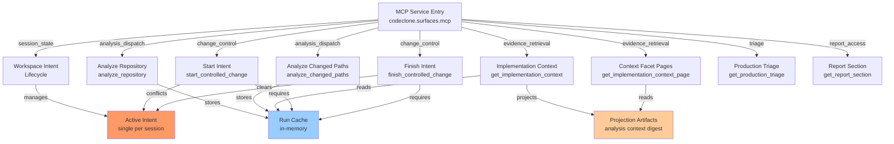

## Purpose

The MCP workflow surface (`codeclone.surfaces.mcp`) exposes a deterministic, session-managed set of tools for repository analysis, change-control intent registration, and bounded structural evidence retrieval. Unlike CLI analysis (single run, then exit), MCP maintains session state across multiple tool calls, enabling iterative workflows where intents accumulate, analyze operations cache results, and context projections stay available for pagination and drill-down.

## Contracts

| Contract ID                             | Type   | Value            |
|------------------------------------------|--------|------------------|
| AUDIT_PROJECTION_VERSION                | str    | `audit-v1`       |
| MEMORY_PROJECTION_VERSION               | str    | `memory-v1`      |
| TRAJECTORY_PROJECTION_VERSION           | str    | `trajectory-v3`  |
| SEMANTIC_INDEX_FORMAT_VERSION           | str    | `3`              |
| ENGINEERING_MEMORY_SCHEMA_VERSION       | str    | `1.7`            |
| REPORT_SCHEMA_VERSION                   | str    | `3.0`            |
| CACHE_VERSION                           | str    | `3.6`            |
| BASELINE_SCHEMA_VERSION                 | str    | `3.0`            |
| PATCH_TRAIL_SCHEMA_VERSION              | str    | `1`              |

**Key invariants:**

- MCP holds **exactly one active change-control intent per session**. Calling `start_controlled_change` before finishing the current intent evicts it with no recovery path.
- Implementation-context facet pages returned by `get_implementation_context_page` must be byte-exact from the saved session projection artifact, not recomputed. Mismatches or not-found errors are acceptable; silent recomputation is not.
- Baseline, cache, and analysis report artifacts are immutable from the MCP perspective. Write operations (via CLI or direct file mutation) are not coordinated through MCP tooling.
- Session runs are ephemeral in-memory. `clear_session_runs` evicts all cached analysis and workspace state for the MCP server process.

## Implementation map



| Tool | Purpose | Session State | Requirements |
|------|---------|---------------|--------------|
| `analyze_repository` | Full deterministic analysis from scratch or cached | Stores run in-memory | Absolute root, valid cache_policy (`reuse`, `off`) |
| `analyze_changed_paths` | PR-style analysis on file subset | Stores run in-memory | Absolute root, paths or git ref, cache_policy |
| `get_run_summary` | Compact snapshot of latest or named run | Reads in-memory | Valid run_id (8-char short or full digest) |
| `get_report_section` | One bounded report section (inventory, findings, metrics) | Reads in-memory | Section name, optional pagination filters |
| `get_implementation_context` | Bounded structural evidence from one stored run | Projects and caches facet pages | Absolute root, target paths/symbols, valid run_id |
| `get_implementation_context_page` | Exact facet page from session projection artifact | Reads projection artifact only | Context projection digest, facet key |
| `start_controlled_change` | Register change intent and compute blast radius | Creates active intent, increments counter | Absolute root, scope dict, intent statement, valid run_id |
| `finish_controlled_change` | Hygiene check, verify, patch trail, receipt, clear intent | Reads active intent, clears on accepted | Intent_id, changed_files or after_run_id, optional claims |
| `get_production_triage` | Health + hotspots + production suggestions | Reads in-memory | Valid run_id |
| `list_findings` | Paginated canonical finding groups | Reads in-memory | Family filter (optional), pagination |
| `clear_session_runs` | Evict all in-memory runs and workspace state | Clears all state | (none) |
| `generate_pr_summary` | Markdown or JSON summary for changed files | Reads in-memory | Changed files list, format preference |

## Failure modes

| Scenario | Status | Recovery |
|----------|--------|----------|
| `start_controlled_change` called without prior `analyze_repository` | `status: "needs_analysis"` | Run `analyze_repository` first, retry |
| Concurrent intent exists and was not queued by caller | `status: "blocked"` (partial_enforce), `concurrent_intents` non-empty | Narrow scope, queue with `on_conflict="queue"`, or promote/clear foreign intent via `manage_change_intent` |
| Intent evicted mid-cycle by second `start_controlled_change` | No tracking | **Unrecoverable.** Active intent id becomes invalid; git tree changes are unsupervised. Prevention: call `finish_controlled_change` before starting a new intent. |
| `finish_controlled_change` with mismatched `intent_id` | `status: "unverified"`, `finish_block_reason: missing_evidence` | Verify the intent is active via session state, or use correct intent_id |
| Projection artifact missing when calling `get_implementation_context_page` | `not_found` or `mismatch` | Re-run `get_implementation_context` to regenerate projection, retry |
| Session cleared via `clear_session_runs` | All runs and intents evicted | Re-run `analyze_repository`, re-open intent with `start_controlled_change` |

**Non-recoverable in-flight evictions:** A second `start_controlled_change` call before `finish_controlled_change` silently evicts the first intent. The intent_id remains in the workspace registry but is no longer tracked by the MCP session, making `finish_controlled_change` fail with `unverified` status and missing evidence. Always call `finish` before starting a new intent.

## Verification

All internal MCP tests reside in `tests/test_mcp_*.py`. Key test suites:

- **Workflow contract:** `tests/test_mcp_context_governance.py`, `tests/test_mcp_service.py` — intent lifecycle, start/finish state machine, session state isolation
- **Security & auth:** `tests/test_mcp_http_auth.py`, `tests/test_mcp_security_hardening.py` — context governance, credential handling, sandbox isolation
- **Memory integration:** `tests/test_mcp_memory_management.py`, `tests/test_mcp_memory_semantic.py` — projection sync, stale record handling, semantic lane integrity
- **Server operation:** `tests/test_mcp_server.py`, `tests/test_mcp_shutdown.py` — startup, message handling, graceful shutdown, runpy guard
- **Tool schema:** `tests/test_mcp_tool_schema_snapshot.py`, `tests/test_mcp_tools.py` — tool registration, input validation, response contracts

Verify MCP changes with:

```bash
uv run pytest -q tests/test_mcp_*.py tests/test_memory_mcp_sync.py tests/test_observability_mcp_registrar.py
```

## Evidence index

**Supported (asserted as current fact):**

- One active intent per MCP session, evicted on `start_controlled_change` without prior finish (mem-527db78f).
- Help topics synchronized with context-governance response contract (mem-74b325675fbf).
- MCP analyze_repository wraps IO in observability spans for baseline, cache_load, report (mem-8973d8741052416c).

**Path-only (background framing, not freshly verified):**

- Implementation-context facet pages computed once, returned from projection artifact only (mem-0ebd1dfb).
- Help topics and claim-guard negation handling synchronized (mem-74b325675fbf, mem-1173f7d9).

**Unverified (do not assert as current behavior):**

- Claim guard claim skips negated keyword hits matching memory governance negation (mem-1173f7d9) — subject_path `_claim_guard.py` exists but constant `STRUCTURAL_SCOPE_KEYWORDS` not confirmed in source.

---

**Source:** CodeClone 2.1.0a1, commit d88c17f0. Module map: 769 modules, 3,322 edges, `codeclone.surfaces.mcp` package.
