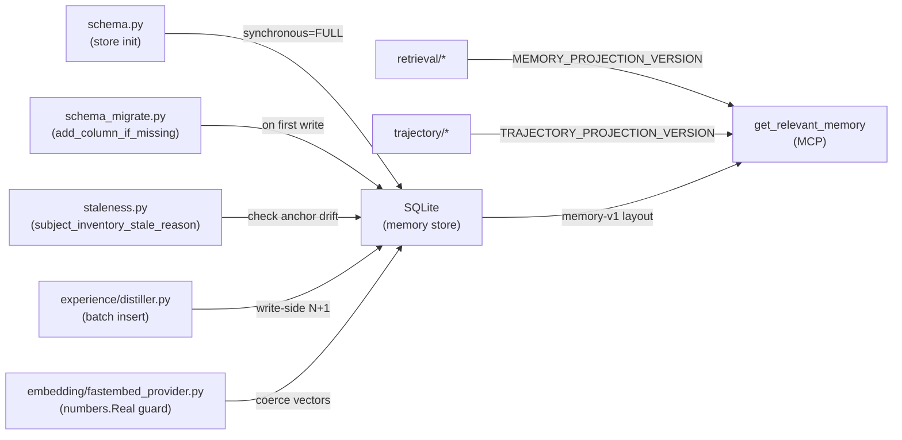

## Purpose

Engineering Memory migration bridges schema versions across CodeClone releases and ensures backward compatibility for stored evidence. This surface documents:

- Schema version contracts and migration protocol
- Durability guarantees (synchronous fsync, commit-anchoring)
- Staleness and subject-inventory edge cases
- Known performance and type-coercion risks
- Verification requirements for schema changes

## Contracts

### Schema versioning

| Contract | Value | Scope |
|----------|-------|-------|
| `ENGINEERING_MEMORY_SCHEMA_VERSION` | 1.7 | Memory store schema; bumped on column/table changes |
| `MEMORY_PROJECTION_VERSION` | memory-v1 | Retrieval projection interpretation layer |
| `TRAJECTORY_PROJECTION_VERSION` | trajectory-v3 | Trajectory evidence indexing; v1 deprecated |
| `EXPERIENCE_DISTILLATION_VERSION` | experience-v1 | Experience aggregation and ranking semantics |
| `SEMANTIC_INDEX_FORMAT_VERSION` | 3 | Embedding vector storage and lookup codec |

**Migration invariant:** Schema bumps require:

1. New column addition via `_add_column_if_missing()` in `codeclone/memory/schema_migrate.py`
2. Version increment in both `codeclone/contracts/__init__.py` and test version pins
3. Migration record via `_record_schema_migration()` to track applied versions
4. Tests covering the migration path (e.g., `tests/test_memory_schema.py`)

**Durability guarantee:** Memory store uses `synchronous=FULL` (every commit fsync'd); intent and audit stores use `synchronous=NORMAL` (loss-tolerable ephemeral state).

### Commit-anchoring principle

Memory records must preserve evidence linkage via commit provenance, not inventory membership:

- `MemoryRecord.anchor_commit`: commit SHA where the record was created; defines staleness drift
- `MemoryRecord.subject_path`: stored path for the subject; staleness should measure drift from anchor, not absence from current inventory
- Vacuum must never delete on subject-path-missing alone; subject absence is a state change, not a disqualifier

**Violation risk:** Linking staleness to inventory membership causes false-positive stale markers for renamed or reorganized subjects.

### Non-Python subject handling

Inventory-based staleness has a known edge case for non-Python subjects (docs, config, JS, etc.):

- `staleness._subject_inventory_stale_reason()` applies `linked_path_missing` for all subjects when path is absent
- Bug: `inventory_paths_from_report()` only lists `.py` files; non-Python subjects are always marked missing
- Fix scope: apply `linked_path_missing` only to Python (`.py`, `.pyi`) subjects; for other subjects, rely on commit-anchor drift and explicit archive

## Implementation map



**Migration entry point:** `schema_migrate.py` applies deferred migrations on store init or explicit `refresh_from_run()`. Schema version reads from `codeclone/contracts/__init__.py` (source of truth).

**Retrieval projection:** `get_relevant_memory()` (MCP tool) interprets stored records through `MEMORY_PROJECTION_VERSION`, decoding stale markers, trajectory evidence, and experience rankings. Projection mismatches are detected at read-time; cursor snapshot checks in `get_memory_projection_page()` prevent stale-cursor replies.

## Failure modes

### Migration under concurrent write

**Trigger:** Schema migration (`_add_column_if_missing()`) runs while background jobs or agents write records.

**Risk:** If migration runs before worker processes sync, workers may write to old schema version; rollback may lose in-flight writes.

**Mitigation:** Migration is synchronous at store init; background workers poll for schema version and fail gracefully on mismatch. Test: `test_memory_schema.py` covers concurrent add-column scenarios.

### Non-Python subject inventory staleness

**Trigger:** Memory record for `docs/README.md` is created; later the file is deleted (legitimate refactor).

**Risk:** Staleness check applies `linked_path_missing` because file is absent from current inventory, falsely marking the record stale despite valid commit anchor.

**Impact:** Record may be archived or filtered during retrieval, losing evidence of prior documentation decisions.

**Mitigation:** Limit `linked_path_missing` to `.py` subjects. Non-Python subjects rely on commit-anchor drift and explicit archive. Test: `test_memory_staleness.py` must cover docs and config subjects.

### Experience distillation N+1 writes

**Trigger:** `experience.distiller.distill_experiences()` produces one experience and writes ~18 rows (edges, metadata, scoring).

**Risk:** Each write is an individual INSERT statement; live telemetry shows 18:1 write-to-output ratio. Under high memory load, disk I/O and locking contention spike.

**Mitigation:** Batch INSERT consolidation in `distiller.py` (Phase 2 improvement). Current workaround: tune `DEFAULT_MAX_CACHE_SIZE_MB` and projection job scheduling.

### Embedding type coercion

**Trigger:** `fastembed_provider.embed()` returns `numpy.float32` scalars (not Python `float` / `int` subclasses).

**Risk:** Code checking `isinstance(scalar, (float, int))` passes; later arithmetic or JSON serialization fails because numpy scalars have different repr and precision semantics.

**Mitigation:** Guard coercion on `numbers.Real` (excludes `bool`). Test: `test_memory_embedding_vectors.py` (or equivalent) must verify numpy.float32 round-trip.

### Duplicate consecutive guard branches

**Trigger:** `distill_experiences()` has two consecutive trivial `continue` or `return None` guards (e.g., checking for None, then checking for empty).

**Risk:** CodeClone detects as duplicated_branches structural issue; code review noise.

**Mitigation:** Merge guards into a single compound condition. Recurring lesson: avoid >=2 sequential trivial control-flow branches.

## Verification

Schema changes require:

1. **Unit tests** (in `tests/test_memory_schema.py`):
   - `_add_column_if_missing()` adds column correctly
   - Version read from contracts is current
   - Migration record is logged

2. **Integration tests** (in relevant memory test suite):
   - Records written pre-migration can be read post-migration
   - Projection cursor snapshot matches after migration
   - Non-Python subject staleness does not apply `linked_path_missing`

3. **Manual verification**:
   - Run `codeclone memory init` with schema version bump
   - Verify existing memory store loads without error
   - Verify projection tools (get_relevant_memory, query_engineering_memory) work without regression

4. **Linting**:
   ```bash
   uv run pytest -q tests/test_memory_schema.py tests/test_memory_staleness.py
   uv run ruff check codeclone/memory/
   ```

## Evidence index

| Subject | Type | Status | Note |
|---------|------|--------|------|
| `codeclone/memory/schema.py` | risk_note | path_only | Synchronous fsync durability guarantee; version source in `contracts/__init__.py` |
| `codeclone/memory/staleness.py` | risk_note | path_only | Commit-anchor principle; non-Python subject inventory edge case (BUG: apply linked_path_missing to .py only) |
| `codeclone/memory/experience/distiller.py` | risk_note | path_only | N+1 write performance (18 writes per experience); confirmed by live telemetry; fix direction is batch INSERT |
| `codeclone/memory/embedding/fastembed_provider.py` | risk_note | path_only | numpy.float32 coercion; guard on `numbers.Real`, not `isinstance(float\|int)` |
| `codeclone/memory/schema_migrate.py` | risk_note | path_only | Protocol: `_add_column_if_missing()` + `_record_schema_migration()`; schema-version bump includes test pins |
| `codeclone/memory/experience/distiller.py` | risk_note | path_only | Duplicated guard branches (consecutive continue guards); recurring structural issue |
| `tests/test_memory_schema.py` | test_anchor | supported | Unit tests for schema migration and version contracts |
| `tests/test_memory_staleness.py` | test_anchor | supported | Tests for commit-anchor staleness and inventory edge cases |
| `tests/test_memory_experience_distiller.py` | test_anchor | supported | Tests for experience distillation; N+1 not optimized but no correctness regression |
