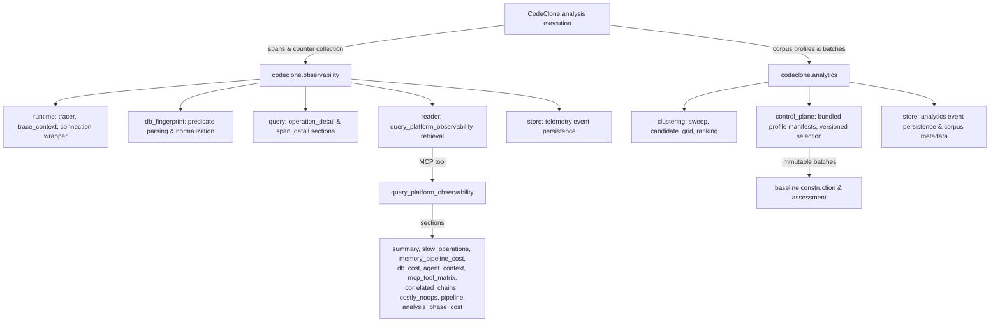

## Purpose

Observability and analytics provide runtime diagnostics and structural assessment
of CodeClone's own execution. Observability captures telemetry during analysis
(database operations, memory consumption, pipeline stages, slow operations).
Analytics profiles repository structures and selects representative corpus
samples for baseline construction and quality assessment. These surfaces are
for maintainers diagnosing CodeClone behavior, not for user-facing quality
claims about analyzed repositories.

## Contracts

| Contract | Value | Kind | Note |
|----------|-------|------|------|
| `ENGINEERING_MEMORY_SCHEMA_VERSION` | `1.7` | str | Schema for durable change/incident records |
| `MEMORY_PROJECTION_VERSION` | `memory-v1` | str | Memory audit trail and trajectory versioning |
| `AUDIT_PROJECTION_VERSION` | `audit-v1` | str | Change control audit artifact versioning |
| `CORPUS_ANALYTICS_STORE_SCHEMA_VERSION` | `1.2` | str | Analytics store and profile manifest schema |
| `CORPUS_EMBEDDING_CONTRACT_VERSION` | `2` | str | Embedding representation versioning |
| `SEMANTIC_INDEX_FORMAT_VERSION` | `3` | str | Semantic index fingerprinting |
| `TRAJECTORY_PROJECTION_VERSION` | `trajectory-v3` | str | Trajectory audit projection for patch trails |
| `IDE_GOVERNANCE_PROTOCOL_VERSION` | `2` | int | IDE workspace coordination (workspace intents) |

Must not be changed casually. Schema violations block finish_controlled_change.

## Implementation map



### Observability packages

**`codeclone.observability`** — runtime telemetry collection:

- `runtime.py`: Tracer and trace context. Counts logical database statements (not callback fires) via connection wrapper. Spans pipeline stages with RSS snapshots.
- `db_fingerprint.py`: Parses normalized fingerprints (kind/table/where_columns) from raw SQL. Cockpit DB QUERY SHAPES table displays predicate summary as primary cell.
- `query.py`: Sections for operation_detail, span_detail with per-span memory and counters. CLI path lacks three B spans (Phase 29 deferral).
- `reader.py`: Exposes `query_platform_observability` MCP tool for maintainer diagnostics.
- `store.py`: Persists telemetry events; keyed by trace_id and session_id.

### Analytics packages

**`codeclone.analytics`** — corpus profiling and control:

- `clustering/sweep.py`: Deterministic candidate grid and ranking over repository structure.
- `control_plane.py`: Manages versioned bundled profile manifests (Phase 31), immutable profile batches, and append-only maintainer selections.
- `store.py`: Persists analytics events and corpus metadata.

## Failure modes

| Scenario | Symptom | Root cause | Mitigation |
|----------|---------|-----------|-----------|
| N+1 false positive | DB counter inflated | `sqlite3.set_trace_callback` fires per executemany row, indistinguishable from loop | Connection wrapper counts logical statements, not trace fires |
| Missing B spans (CLI) | Cockpit incomplete | Phase 29 deferred three B spans for CLI path | Requires observer boilerplate in pipeline CLI interface |
| Outdated profile selection | Stale corpus | Maintainer selection not persisted immutably | Use control_plane append-only record; never mutate selection history |
| Schema drift | Finish blocked | Contract version mismatch | Do not update SCHEMA_VERSION constants without audit trail and baseline reset |

## Verification

Run these tests to validate observability and analytics behavior:

```bash
# Observability core
uv run pytest -q tests/test_observability_runtime.py
uv run pytest -q tests/test_observability_db_fingerprint.py
uv run pytest -q tests/test_observability_query.py

# Analytics core
uv run pytest -q tests/test_analytics_foundation.py
uv run pytest -q tests/test_analytics_profiles.py
uv run pytest -q tests/test_analytics_store.py

# Integration
uv run pytest -q tests/test_observability_analysis_phases.py
uv run pytest -q tests/test_analytics_integration.py
uv run pytest -q tests/test_cli_memory_observability.py

# MCP surface
uv run pytest -q tests/test_observability_mcp_registrar.py
```

Invariant: Observability must not mutate baselines, cache, or generated reports.
Analytics profiles are append-only; never backfill or replace maintainer selections.

## Evidence index

| Record | Status | Note |
|--------|--------|------|
| mem-b05428e6 | path_only | Observer A/B/C done for MCP; CLI still lacks three B spans |
| mem-cd43af53 | path_only | db_fingerprint parses normalized predicates for cockpit DB QUERY SHAPES table |
| mem-f473582b | path_only | v2 logical statement counting fixed earlier N+1 false positive |
| mem-e5676ddc | path_only | Phase 31 control plane versioned bundled manifests and immutable selections |

Records marked `path_only` provide background context; assertions require code verification.
