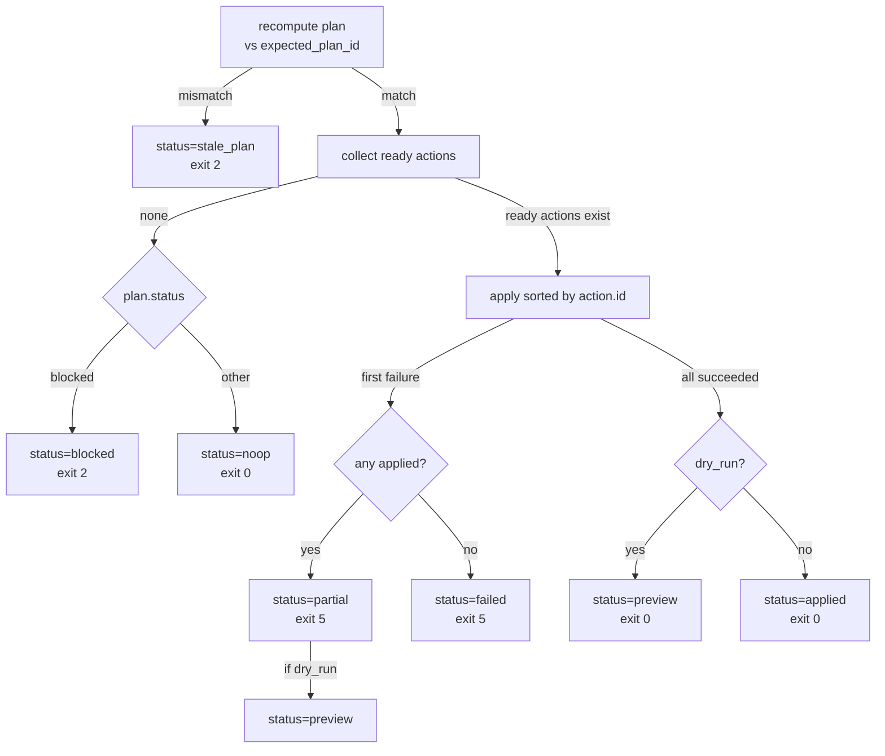

## Purpose

`setup apply` is the bounded mutation surface that writes filesystem changes to satisfy readiness requirements. It recomputes the active plan before every apply, confirms mutations with the caller (interactive) or gate flags (non-interactive), applies only ready actions in sorted order, and reports atomicity and success per action.

Setup changes are limited to two action kinds: `pyproject_merge` (tool.codeclone config updates) and `gitignore_append` (cache directory exclusion). No other filesystem mutations are available through this surface.

## Contracts

### CLI Interface

```
codeclone setup apply [--dry-run] [--yes | --plan-id PLAN_ID] [--root ROOT]
```

**Flags:**

| Flag | Effect | Requirement |
|------|--------|-------------|
| `--dry-run` | Preview writes without modifying files; returns status=preview for all actions | Skips confirmation gate; implies --yes |
| `-y, --yes` | Skip confirmation prompt; required for non-interactive execution | Mutually exclusive with interactive confirmation |
| `--plan-id PLAN_ID` | Only proceed if the recomputed plan matches this ID (stale-plan guard) | Optional; when supplied, blocks apply with status=stale_plan on mismatch (exit 2) |
| `--root ROOT` | Repository root path | Default: `.` |

**Exit codes:**

- `0` (SUCCESS): Apply completed without errors (status in `{noop, applied}`)
- `2` (CONTRACT_ERROR): Confirmation required but no TTY, stale plan detected, or invalid arguments (status in `{blocked, stale_plan}`)
- `5` (INTERNAL_ERROR): Action execution failed (status in `{failed, partial}`)

### Confirmation Gate (Interactive Apply)

When both `--dry-run` and `--yes` are absent, `_confirmation_gate` runs:

1. Require TTY on stdin and stdout; if missing, refuse with CONTRACT_ERROR
2. Call `_confirm_apply`: recompute plan, render it, prompt user with `[y/N]`
3. User reply `y` or `yes` → proceed with the confirmed `plan_id`
4. User reply anything else or no TTY → refuse with SUCCESS (no action taken)

This gate returns `(plan_id, None)` on acceptance or `(None, exit_code)` on refusal. It is skipped if `--dry-run` or `--yes` is supplied.

### Apply Status Machine



**Status values:**

- `noop`: No ready actions in plan (nothing to apply)
- `preview`: Dry-run succeeded (all actions would be applied)
- `applied`: Writes completed successfully
- `partial`: Some actions applied, then one failed
- `failed`: First action failed (no prior writes)
- `blocked`: Plan status is blocked (e.g., missing required capability)
- `stale_plan`: Recomputed plan ID does not match `expected_plan_id`

### Action Apply Results

Each action in the result carries:

```json
{
  "id": "unique action identifier",
  "kind": "pyproject_merge | gitignore_append",
  "path": "target file path",
  "status": "applied | preview | skipped | failed",
  "message": "error detail if status=failed; reason if status=skipped",
  ...metadata...
}
```

**Action status rules:**

- `applied`: Filesystem mutation completed (non-dry-run only)
- `preview`: Filesystem mutation would occur (dry-run only)
- `skipped`: Target already satisfied; no mutation needed
- `failed`: Execution error (I/O, permissions, validation)

### Stale-Plan Guard

If `expected_plan_id` is supplied, `apply_setup_plan` recomputes the plan and compares `plan.plan_id` to the expected value:

- **Match**: proceed with apply
- **Mismatch**: refuse with `status="stale_plan"` (exit 2), no actions applied

This guard prevents applying an outdated plan when repository state changes between preview (`setup plan`) and apply.

### Readiness Authority

`derive_readiness` (rules R1-R9 in `rollup.py`) is the sole readiness authority. Rollup presentation handlers (`describe_capability`) supply only human-readable `reason` and `recommended_action` strings and **must never override readiness**. Setup apply queries `plan.status` and each action's `status == "ready"` to decide what to apply; these values flow from the immutable readiness derivation, not from presentation.

## Implementation map

**Primary entry and control flow:**

- `codeclone/surfaces/cli/setup/main.py`: CLI parser, `_run_apply`, `_confirmation_gate`, exit code derivation
- `codeclone/surfaces/cli/setup/engine/apply.py`: `apply_setup_plan`, `_ready_actions`, action handlers
- `codeclone/surfaces/cli/setup/engine/rollup.py`: `derive_readiness` (R1-R9), presentation only in `describe_capability`

**Action handlers:**

| Kind | Handler | Mutation |
|------|---------|----------|
| `pyproject_merge` | `_apply_pyproject_merge` | Merge tool.codeclone config into pyproject.toml via `merge_tool_codeclone` |
| `gitignore_append` | `_apply_gitignore_append` | Append cache line to .gitignore; verify coverage post-write |

**Plan recomputation and validation:**

- `codeclone/surfaces/cli/setup/engine/plan.py`: `build_setup_plan` (called once per apply to guard against stale plans)
- `codeclone/config/pyproject_writer.py`: `merge_tool_codeclone` (atomic merge, rollback on error)
- `codeclone/paths/gitignore.py`: gitignore helpers (`append_gitignore_line`, `write_gitignore_text_atomically`, post-write verify)

## Failure modes

### Stale Plan Between Preview and Apply

**Symptom:** `setup plan` shows plan_id X, but `setup apply --plan-id X` returns `status=stale_plan`.

**Root cause:** Repository config or readiness changed between plan preview and apply (e.g., user edited pyproject.toml, fixture was deleted).

**Recovery:** Rerun `setup plan` to see the new plan_id, then `setup apply --plan-id <new_id>`.

### Partial Apply (Some Actions Succeed, One Fails)

**Symptom:** `status=partial` with mixed applied/skipped/failed results.

**Root cause:** Filesystem error (permissions, disk full, permission race) or I/O validation failure (post-write verification of .gitignore coverage).

**Recovery:** Fix the underlying I/O condition and rerun `setup apply`; already-satisfied actions will skip (idempotent).

### No Confirmation TTY in Interactive Mode

**Symptom:** `setup apply` without `--yes` or `--dry-run` exits with CONTRACT_ERROR and stderr message "requires confirmation".

**Root cause:** stdin or stdout is not a TTY (redirected pipe, running in background, CI environment).

**Recovery:** Supply `--yes` to proceed without confirmation, or use `--dry-run` to preview.

### Unsupported Action Kind

**Symptom:** Action in plan has `kind` not in `{pyproject_merge, gitignore_append}`; result shows `status=failed` with "Unsupported plan action kind".

**Root cause:** Plan engine produced an action kind without a corresponding handler in `_ACTION_HANDLERS`.

**Impact:** This is a contract violation and indicates a bug in the plan builder or a version mismatch. User cannot recover without a code fix.

### Post-Write Gitignore Verification Failure

**Symptom:** `gitignore_append` action returns `status=failed` with message "post-write verification failed".

**Root cause:** After appending the cache pattern to .gitignore, the verification function `repo_gitignore_covers_codeclone_cache` found that the .codeclone directory is not covered (e.g., subsequent line deleted the entry, or another process modified .gitignore concurrently).

**Recovery:** Inspect .gitignore manually; ensure `.codeclone/` is not excluded elsewhere; rerun apply.

## Verification

**Test file:** `tests/test_cli_setup.py`

**Key test suites:**

- `test_apply_*`: Single-action apply scenarios (pyproject_merge, gitignore_append, stale_plan, partial failure)
- `test_confirmation_gate_*`: TTY detection, user acceptance/decline, no-TTY refusal
- `test_exit_code_*`: Exit code mapping for each status
- `test_apply_dry_run_*`: Preview mode (no filesystem writes, status=preview)

**Manual verification:**

```bash
# Dry-run preview
uv run codeclone setup apply --dry-run --root <repo>

# Non-interactive apply with confirmation guard
uv run codeclone setup plan --root <repo> --json | jq -r .plan_id | \
  xargs -I {} uv run codeclone setup apply --plan-id {} --yes --root <repo>

# Interactive apply (requires TTY)
uv run codeclone setup apply --root <repo>
```

**Pre-commit hook:** None. Setup apply is not run automatically; it is user-initiated.

## Evidence index

| Evidence | Corroboration | Citation |
|----------|---------------|----------|
| `--yes`, `--dry-run`, `--plan-id` flags prevent interactive confirmation and require non-TTY paths | supported | mem-a262a1d22861492688a8db12759c258d; main.py _run_apply lines 101–106 |
| Plan ID mismatch returns status=stale_plan (exit 2) and refuses apply | supported | mem-a262a1d22861492688a8db12759c258d; apply.py lines 43–49 |
| `derive_readiness` (R1-R9) is sole authority; rollup.describe_* must not override | path_only | mem-c91d791f131e47468f549a8dfba441fa; rollup.py docstring lines 9–12 |
| Golden fixture setup_snapshot_v1.json reflects corrected readiness model | path_only | mem-a8e1ce4f4440455e881ff858cc74267f; tests/test_cli_setup.py _GOLDEN_SNAPSHOT fixture |
| Action handlers: pyproject_merge (via merge_tool_codeclone), gitignore_append (atomic write + verify) | supported | apply.py lines 145–244; config/pyproject_writer.py, paths/gitignore.py |
| Sorted action apply by id; fail-fast on first failure with partial/failed status | supported | apply.py lines 50–80, _ready_actions line 90 |
| Status machine: noop/blocked from plan, preview on dry-run, applied on success, partial/failed on error | supported | apply.py lines 54, 66–74, 98–101 |
