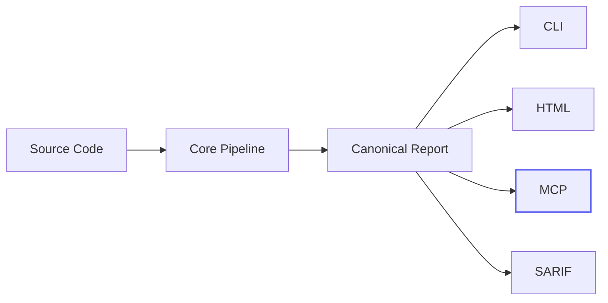
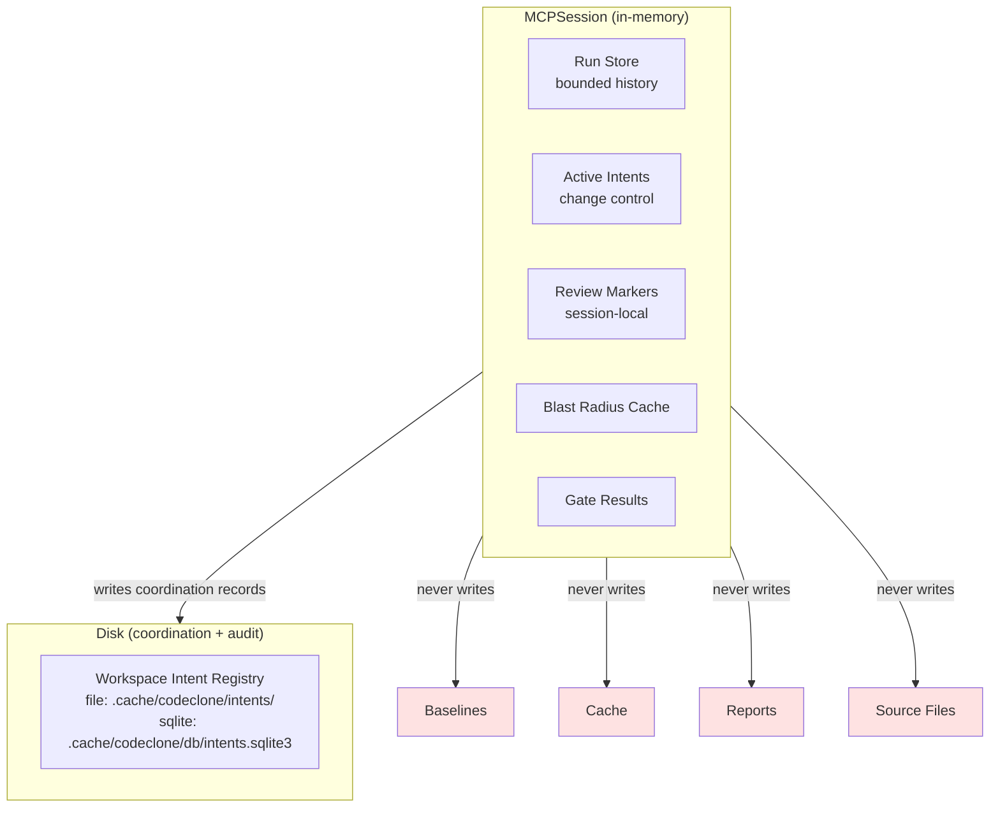
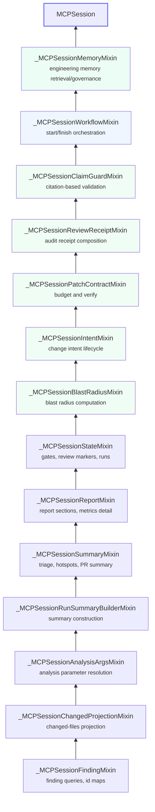
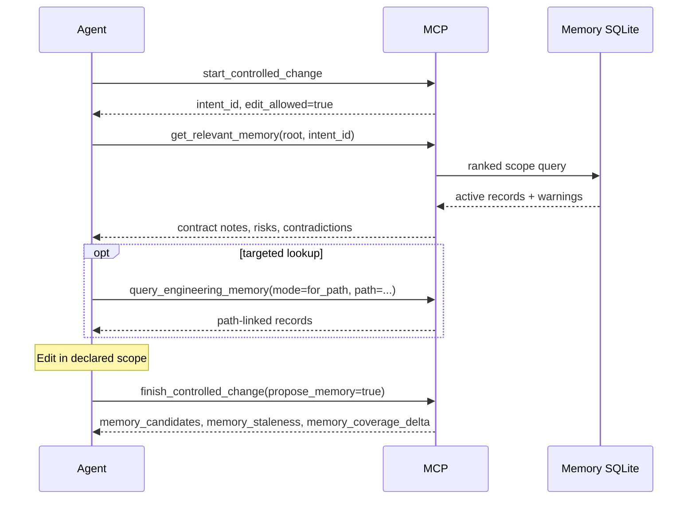
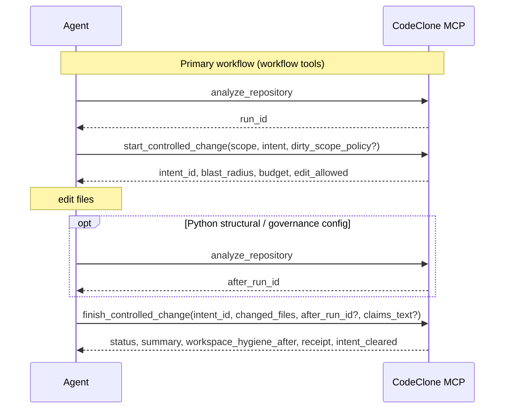

# MCP for AI Agents

CodeClone MCP is a **read-only, baseline-aware** analysis server for AI agents
and MCP-capable clients. It exposes the same deterministic pipeline as the CLI
without mutating source files, baselines, cache, or report artifacts.

Works with any MCP-capable client regardless of backend model.

---

## Architecture

### Where MCP fits

MCP is an **integration surface**, not a second analyzer. It composes over the
same canonical pipeline and report contracts as the CLI and HTML report.



### Session architecture

Every `codeclone-mcp` process owns an isolated session. Session state lives
entirely in process memory and does not survive restart.



### Mixin chain

The session is composed from focused mixins, each owning one capability
layer. The chain is append-only: new phases extend the top without modifying
existing mixins.



---

## Install

=== "Standalone tool"

    ```bash
    uv tool install "codeclone[mcp]"
    ```

=== "Project environment"

    ```bash
    uv pip install "codeclone[mcp]"
    ```

---

## Client setup

All clients use the same server. Only the registration format differs.

=== "Claude Code"

    ```bash
    claude mcp add codeclone -- codeclone-mcp --transport stdio
    ```

    Use `--scope project` to store config in `.mcp.json` for the repository.

=== "Codex"

    ```bash
    marketplace add orenlab/codeclone-codex
    ```

    The native plugin includes the MCP definition and CodeClone skills.
    Manual MCP registration without the plugin is also valid:

    ```bash
    codex mcp add codeclone -- codeclone-mcp --transport stdio
    ```

    See [Codex plugin guide](codex-plugin.md).

=== "Cursor"

    Add to `.cursor/mcp.json`:

    ```json
    {
      "mcpServers": {
        "codeclone": {
          "command": "codeclone-mcp",
          "args": ["--transport", "stdio"]
        }
      }
    }
    ```

=== "Claude Desktop"

    A local `.mcpb` bundle ships in `extensions/claude-desktop-codeclone/`.
    See [Claude Desktop bundle guide](claude-desktop-bundle.md).

=== "JSON config (generic)"

    ```json
    {
      "mcpServers": {
        "codeclone": {
          "command": "codeclone-mcp",
          "args": ["--transport", "stdio"]
        }
      }
    }
    ```

    Works with Copilot Chat, Gemini CLI, and other MCP-capable clients.

If `codeclone-mcp` is not on `PATH`, use the full launcher path.

---

## Server

### Transports

| Transport         | Default | Use case                        |
|-------------------|---------|---------------------------------|
| `stdio`           | Yes     | Local agents, IDEs, CLI clients |
| `streamable-http` | No      | Remote clients, Responses API   |

```bash title="Local (default)"
codeclone-mcp --transport stdio
```

```bash title="HTTP (loopback only)"
codeclone-mcp --transport streamable-http --host 127.0.0.1 --port 8000
```

!!! warning "Remote exposure is opt-in"
Non-loopback hosts require `--allow-remote`. The built-in HTTP server
has no authentication. Use it only on trusted networks or behind an
authenticated reverse proxy.

### Run retention

Run history is bounded: default `4`, max `10` (`--history-limit`).
Runs are in-memory only and do not survive process restart.

### Absolute roots

All analysis tools require an **absolute** repository root. Relative roots
like `.` are rejected because the server working directory may differ from
the client workspace.

---

## Tool surface

Current surface: **31 tools**, **7 fixed resources**, **3 URI templates**.

The surface is organized by workflow phase. Start at the top, drill down
as needed.

### Phase 1: Analyze

| Tool                    | Purpose                                           |
|-------------------------|---------------------------------------------------|
| `analyze_repository`    | Full deterministic analysis of one repo root      |
| `analyze_changed_paths` | Diff-aware analysis with changed-files projection |

Both register the result as an in-memory run. All other tools read from
stored runs.

### Phase 2: Triage

| Tool                    | Purpose                                                    |
|-------------------------|------------------------------------------------------------|
| `get_run_summary`       | Cheapest snapshot: health, findings, baseline status       |
| `get_production_triage` | Production-first view: hotspots, suggestions, thresholds   |
| `list_hotspots`         | Priority-ranked hotspot views by kind                      |
| `compare_runs`          | Run-to-run delta: regressions, improvements, health change |

!!! tip "Start here"
After analysis, call `get_run_summary` or `get_production_triage` first.
Prefer `list_hotspots` or `check_*` before broad `list_findings` calls.

### Workspace hygiene tips

Selected MCP responses may include a non-blocking `tips[]` array with
structured workspace guidance. The first tip checks whether the repository
root `.gitignore` covers `.cache/codeclone/` (or the broader `.cache/` tree).

| Field             | Example                     |
|-------------------|-----------------------------|
| `id`              | `gitignore-codeclone-cache` |
| `severity`        | `info`                      |
| `category`        | `workspace_hygiene`         |
| `suggested_entry` | `.cache/codeclone/`         |

Tips are advisory only — not findings, gates, or failures. MCP never edits
`.gitignore` automatically; agents must declare scope before changing it.

Surfaces: `analyze_repository`, `get_run_summary`, `get_production_triage`,
`start_controlled_change`, and the CLI after a normal interactive analysis run
(suppressed in `--quiet`, CI, and non-TTY contexts).

### Phase 3: Drill down

| Tool                  | Purpose                                                     |
|-----------------------|-------------------------------------------------------------|
| `list_findings`       | Filtered, paginated findings with novelty and scope filters |
| `get_finding`         | Single finding detail by short or canonical ID              |
| `get_remediation`     | Remediation and explainability for one finding              |
| `get_report_section`  | Read report sections; `metrics_detail` is paginated         |
| `evaluate_gates`      | Preview CI gating decisions without mutating state          |
| `generate_pr_summary` | PR-friendly markdown or JSON summary                        |

### Phase 4: Focused checks

Narrow queries over a single quality dimension. Cheaper than `list_findings`
when you know which dimension to inspect.

| Tool               | Dimension                      |
|--------------------|--------------------------------|
| `check_clones`     | Clone groups                   |
| `check_complexity` | Cyclomatic complexity hotspots |
| `check_coupling`   | Afferent/efferent coupling     |
| `check_cohesion`   | Module cohesion                |
| `check_dead_code`  | Dead code candidates           |

### Phase 5: Change control

The structural change controller workflow. These tools compose over stored
runs and session state without running analysis or mutating the repository.

```mermaid
sequenceDiagram
    participant A as Agent
    participant M as MCP Server
    participant D as Intent Registry
    A ->> M: manage_change_intent(action="list_workspace", root)
    M ->> D: read active intents (file or sqlite backend)
    D -->> M: active intents
    M -->> A: workspace state
    A ->> M: analyze_repository(root)
    M -->> A: run registered
    A ->> M: manage_change_intent(action="declare", scope, intent)
    M ->> D: write intent record
    M -->> A: intent_id, blast_radius, concurrent_intents
    alt Scope conflict with on_conflict="queue"
        A ->> M: manage_change_intent(action="declare", scope, intent, on_conflict="queue")
        M ->> D: write queued intent record
        M -->> A: status=queued, blocked_by, queue_position
        Note over A: Wait for foreign intent to clear
        A ->> M: manage_change_intent(action="promote", intent_id)
        M ->> D: re-check conflicts, update to active
        M -->> A: status=active
    end
    A ->> M: get_blast_radius(files)
    M -->> A: do_not_touch, review_context
    A ->> M: check_patch_contract(mode=budget)
    M -->> A: regression budget, headroom
    Note over A: Edit files within scope
    opt Long edit or test run
        A ->> M: manage_change_intent(action="renew", intent_id, lease_seconds)
        M ->> D: update lease timestamp
        M -->> A: lease_renewed
    end

    A ->> M: analyze_repository(root)
    M -->> A: after_run_id registered
    A ->> M: manage_change_intent(action="check", intent_id, changed_files or diff_ref)
    Note right of M: intent stays on before-run, changed scope is explicit
    M -->> A: clean / expanded / violated
    A ->> M: check_patch_contract(mode=verify, before_run_id, after_run_id, intent_id)
    M -->> A: accepted / violated
    A ->> M: validate_review_claims(text, patch_health_delta?)
    M -->> A: valid / violations
    A ->> M: create_review_receipt
    M -->> A: audit artifact
    A ->> M: manage_change_intent(action="clear", intent_id)
    M ->> D: close intent (file: delete row; sqlite: status=clean)
```

| Tool                       | Purpose                                                                                                              |
|----------------------------|----------------------------------------------------------------------------------------------------------------------|
| `start_controlled_change`  | Pre-edit workflow: workspace check + declare + blast radius + budget (`dirty_scope_policy` for own WIP)              |
| `finish_controlled_change` | Post-edit workflow: scope check + verify + claims + receipt + clear (`propose_memory` for draft candidates on accept) |
| `manage_change_intent`     | Intent lifecycle: declare, get, check, clear, renew, promote, list_workspace, gc_workspace, recover, reset_workspace |
| `get_blast_radius`         | Pre-change risk boundary: dependents, clone cohorts, do-not-touch, review context                                    |
| `get_relevant_memory`      | Ranked engineering memory for declared edit scope (explicit scope or active intent_id)                               |
| `query_engineering_memory`   | Mode router: search, get, for_path, for_symbol, stale, coverage, status. Search supports `filters.match_mode` (`any`\|`all`) |
| `manage_engineering_memory`  | Agent memory governance: `record_candidate`, `validate_claims`, `propose_from_receipt` (approve/reject/archive are CLI-only)    |
| `check_patch_contract`     | Budget query (`mode=budget`) or post-edit verification (`mode=verify`)                                               |
| `create_review_receipt`    | Deterministic audit artifact: provenance, scope, reviewed findings, patch status, verification profile               |
| `validate_review_claims`   | Citation-based overclaim detection; optional `patch_health_delta` from verify for regression-free claim checks       |

??? info "Blast radius: do_not_touch vs review_context"
Graph traversal core lives in `codeclone/analysis/blast_radius.py`; MCP and CLI
are presentation adapters over canonical report facts. `do_not_touch` contains
actionable edit prohibitions: baselines, generated state, forbidden paths.
`review_context` contains report-only signals: security boundary inventory,
overloaded-module candidates, known baseline debt. Review context is information,
not an edit ban.

??? info "Patch contract modes"
**Budget** reads one stored run and optional intent. Shows regression
headroom per quality dimension before editing. Queued intents return
`edit_allowed=false`. **Verify** compares explicit before/after stored
runs, previews gates, validates scope, and reports baseline-abuse signals.
When `intent_id` is provided but `before_run_id` is omitted, verify
auto-resolves the before-run from the intent record. Verify derives a
**verification profile** from changed files — docs-only and non-Python
patches skip structural checks; Python source changes require a full
after-run. Identical before/after runs for `python_structural` and
`governance_config` return `reason: after_run_not_new`. Non-accepted responses include a `next_step` hint and
`claim_validation_recommended` flag. Missing runs return
`status=unverified`. Accepted verify with negative `health_delta` may
include `health_regression_advisory`.

### Engineering Memory

Engineering Memory is a **local SQLite store** of evidence-linked facts about the
repository. It complements change control by giving agents ranked context for
the declared edit scope — contract notes, document links, risk hotspots, module
roles, and governed drafts.

Full contract: [Engineering Memory (book)](book/26-engineering-memory.md).

#### Bootstrap (human / CI — not MCP)

```bash
codeclone memory init --root /abs/repo
codeclone memory init --root /abs/repo --refresh   # re-ingest + staleness pass
```

MCP memory tools return a contract error until init has run at least once.

#### Agent read path



| When | Tool | Why |
|------|------|-----|
| After `start`, before edit | `get_relevant_memory(scope \| intent_id)` | Ranked scope context |
| One path / symbol | `query_engineering_memory(mode=for_path\|for_symbol)` | Targeted lookup |
| Keyword discovery | `query_engineering_memory(mode=search, query=…, filters={match_mode:…})` | FTS search |
| Unclear semantics | `help(topic="engineering_memory")` | Compact playbook |

Defaults exclude **stale** and **draft** records. Surface stale warnings when
present — they signal changed context.

#### Agent write path (draft only)

| Action | Tool | Result |
|--------|------|--------|
| Observation during edit | `manage_engineering_memory(action=record_candidate, …)` | `draft` record |
| Validate finish claims | `manage_engineering_memory(action=validate_claims, text=…)` | warnings/errors |
| Post-edit proposals | `finish_controlled_change(propose_memory=true)` | draft candidates + staleness |
| Atomic fallback | `manage_engineering_memory(action=propose_from_receipt, …)` | draft proposals |

**Human promote:** `codeclone memory approve RECORD_ID` — agents cannot activate
drafts via MCP.

#### Trust boundaries

Memory **cannot**:

- expand declared edit scope or authorize `do_not_touch` edits
- override CodeClone structural findings
- mutate baselines, analysis cache, canonical reports, or source files
- run `memory init` / `refresh` (ask the user or CI)

Treat `draft`, `inferred`, and excluded stale records as **non-authoritative**.

### Phase 6: Session management

| Tool                     | Purpose                                                                                               |
|--------------------------|-------------------------------------------------------------------------------------------------------|
| `mark_finding_reviewed`  | Session-local review marker (in-memory)                                                               |
| `list_reviewed_findings` | List reviewed findings for a run                                                                      |
| `clear_session_runs`     | Reset in-memory runs, session review markers, and workspace intent registry state for the MCP process |
| `help`                   | Bounded workflow and contract guidance                                                                |

---

## Resource surface

Resources are read-only views over stored runs. They do not trigger analysis.

### Fixed resources

| URI                              | Content                           |
|----------------------------------|-----------------------------------|
| `codeclone://latest/summary`     | Latest run summary                |
| `codeclone://latest/triage`      | Latest production-first triage    |
| `codeclone://latest/report.json` | Full canonical report             |
| `codeclone://latest/health`      | Health score and dimensions       |
| `codeclone://latest/gates`       | Last gate evaluation result       |
| `codeclone://latest/changed`     | Changed-files projection          |
| `codeclone://schema`             | Canonical report shape descriptor |

### Run-scoped templates

| URI template                                      | Content                         |
|---------------------------------------------------|---------------------------------|
| `codeclone://runs/{run_id}/summary`               | Summary for a specific run      |
| `codeclone://runs/{run_id}/report.json`           | Report for a specific run       |
| `codeclone://runs/{run_id}/findings/{finding_id}` | One finding from a specific run |

`codeclone://latest/*` always resolves to the most recent run. A later
`analyze_repository` or `analyze_changed_paths` call moves the pointer.

---

## Workflows

### Health check

```
analyze_repository
  -> get_run_summary or get_production_triage
  -> list_hotspots or check_*
  -> get_finding -> get_remediation
```

### PR review

```
analyze_changed_paths(changed_paths=[...] or git_diff_ref="HEAD~1")
  -> list_findings(sort_by="priority")
  -> get_finding -> get_remediation
  -> generate_pr_summary
```

### Change control



!!! info "Tool tiers"

    | Tier | Tools | When to use |
    |------|-------|-------------|
    | Normal workflow | `analyze_repository`, `start_controlled_change`, `finish_controlled_change` | Every edit cycle |
    | Queue/recovery | `manage_change_intent` (promote, recover, reset, renew) | Multi-agent coordination, crash recovery |
    | Advanced/diagnostic | `get_blast_radius`, `check_patch_contract`, `validate_review_claims`, `create_review_receipt` | Deep inspection, step-by-step debugging |

### Detailed atomic workflow

For older MCP servers or step-by-step debugging:

```
manage_change_intent(action="list_workspace")
  -> analyze_repository
  -> manage_change_intent(action="declare", scope={...})
  -> get_blast_radius(files=[...])
  -> check_patch_contract(mode="budget")
  -> [edit within scope]
  -> analyze_repository                                                          # after-run
  -> manage_change_intent(action="check", intent_id=..., changed_files=[...])
  -> check_patch_contract(mode="verify", after_run_id=..., intent_id=...)
  -> validate_review_claims(text="...", patch_health_delta=...)                    # explicit claims text; delta from verify
  -> create_review_receipt
  -> manage_change_intent(action="clear")
```

### Multi-agent queue

```
start_controlled_change(scope={...}, on_conflict="queue")                        # queued behind foreign
  -> [wait for foreign intent to clear]
  -> manage_change_intent(action="promote", intent_id=...)                       # queued → active
  -> [edit within scope]
  -> finish_controlled_change(intent_id=..., changed_files=[...], claims_text=...) # verify + optional claims + clear
```

### Workspace hygiene and lazy intent closure

Three independent contours (do not collapse):

```text
status     = persisted registry lifecycle
ownership  = runtime view (PID / TTL / lease)
hygiene    = git working tree ∩ declared scope
permission = edit_allowed (with status gate)
```

- **Lazy close:** agent-facing reads close TTL-expired and corrupted records on
  list/declare/start refresh. **Orphaned** (dead PID) intents stay recoverable
  until TTL expiry or explicit `gc_workspace` — not removed on read.
- **`gc_workspace`:** explicit GC removes orphaned, expired, and other eligible
  records in one transaction. Lazy close and GC share lifecycle concepts but use
  **different** close predicates (`for_lazy_close` vs full GC removal).
- **`dirty_scope_policy`:** default `block` when scoped hygiene detects dirty
  paths in `allowed_files`. `continue_own_wip` allows start when dirty scope is
  yours alone (no live `foreign_dirty_overlaps`); finish still requires evidence.
- **`start_controlled_change`:** may return workflow `status: "blocked"` with
  `edit_allowed: false` when foreign scope overlap or scoped hygiene blocks.
  When `budget.gate_preview.would_fail` is true, edit may still be allowed —
  the preview is advisory; final verify may not accept the patch.
  Response includes `workspace.concurrent_intents`, `workspace_relations`, and
  optional scoped `workspace_hygiene`.
- **`finish_controlled_change`:** re-checks scoped hygiene before verify. Finish
  reconciles agent `changed_files` / `diff_ref` with **git** — under-reported
  in-scope dirty paths and own unscoped dirty edits block even when the agent
  omits them from evidence. Foreign dirty paths outside your declared scope are
  ignored when attributed to a foreign active/stale intent
  (`foreign_attributed_outside_scope`). Failures return `reason:
  "workspace_hygiene"`, optional `finish_block_reason` (`missing_evidence`,
  `own_unscoped_dirty`, `foreign_dirty_overlap`), and keep the intent active.
  Declare **new files** in `allowed_files` at start. Accepted and non-accepted
  verify responses include a compact `summary` and `workspace_hygiene_after`;
  `review_text` is a human note, and only `claims_text` is passed to Claim Guard.
- **`manage_change_intent(list_workspace)`:** returns repo-level
  `workspace_dirty_summary` only (no scoped `blocks_edit`). When recoverable
  intents exist, includes `recovery_available` (`run_available`, per-candidate
  `hint`) and `recovery_next_step`.

See [Change-control payload semantics](#change-control-payload-semantics) for
`health_delta`, multi-agent hygiene, and start/finish transition tables.

### Change-control payload semantics

This section supplements the workflow diagrams above. It does not repeat tool
lists or atomic step sequences — see
[Structural Change Controller](book/24-structural-change-controller.md) for those.

#### `structural_delta.health_delta` vs receipt `health.delta`

Verify compares the intent's **before-run** to the explicit **after-run** via
`compare_runs`. `structural_delta` mirrors that comparison:

```json
"before": {"run_id": "14d82d39", "health": 90},
"after": {"run_id": "74cb3c0e", "health": 88},
"structural_delta": {
"verdict": "regressed",
"health_delta": -2,
"regressions": ["...new finding ids..."]
}
```

| Field                            | Source                                             | Meaning                                              |
|----------------------------------|----------------------------------------------------|------------------------------------------------------|
| `verification.before` / `.after` | Intent before-run vs `after_run_id`                | Run refs used for patch contract                     |
| `structural_delta.health_delta`  | `health_after - health_before` from `compare_runs` | **Patch delta** between those two stored runs        |
| `receipt.health.delta`           | After-run summary vs trusted baseline              | **Repository drift** signal in the receipt narrative |

If `before.run_id == after.run_id` for `python_structural` or
`governance_config` profiles, verify returns `status: "unverified"` with
`reason: "after_run_not_new"` — run a fresh post-edit analysis and pass the new
`after_run_id`. For documentation-only patches the identical-run case is not
structurally gated the same way.

Negative `health_delta` sets `structural_delta.verdict` to `"regressed"` (or
`"mixed"` when improvements coexist). It does **not** by itself set
`verification.status` to `"violated"` — blocking comes from intent-scoped
finding regressions, gate worsening attributable to the patch, scope
violations, or baseline-abuse signals. Agents should still surface
`health_delta < 0` in review text. Accepted verify may include
`health_regression_advisory`. Claim Guard warns and violates regression-free
claims when `patch_health_delta < 0` (passed automatically by
`finish_controlled_change`; explicit on atomic `validate_review_claims`).

#### Multi-agent hygiene (who blocks whom)

Hygiene reads the **shared git working tree**, not per-agent sandboxes.

| Actor                                                                                                    | Trigger                         | Start                                                                                                    | Finish                                   |
|----------------------------------------------------------------------------------------------------------|---------------------------------|----------------------------------------------------------------------------------------------------------|------------------------------------------|
| **Foreign active/stale** intent on overlapping scope                                                     | `concurrent_intents`            | `status: "blocked"` (coordination)                                                                       | —                                        |
| **Any** uncommitted dirty file in your `allowed_files`                                                   | `workspace_hygiene.blocks_edit` | `edit_allowed: false` (unless `dirty_scope_policy="continue_own_wip"` and no live foreign dirty overlap) | —                                        |
| Dirty in scope **not** listed in `changed_files` / `diff_ref` (git reconciliation) | `unacknowledged_dirty_in_scope` | — | `finish_block_reason: missing_evidence` |
| Dirty **outside** declared scope, not foreign-attributed | `own_unscoped_dirty` | — | `finish_block_reason: own_unscoped_dirty` — redeclare scope |
| Foreign dirty **outside** your scope (other agent's paths) | `foreign_attributed_outside_scope` | — | **ignored** — does not block finish |
| **Live** foreign intent previously declared overlapping dirty paths in your scope | `foreign_dirty_overlaps` | Contributes to `blocks_edit` context | `finish_block_reason: foreign_dirty_overlap` if overlaps remain |

Recoverable, expired, terminal, or **queued** foreign records **do not**
populate `foreign_dirty_overlaps`. A queued peer does not block finish for an
active agent.

**Foreign attribution at finish:** only **`foreign_active`** and
**`foreign_stale`** intents (live owning PID, foreign to this session) may
populate `foreign_attributed_outside_scope`. **`Recoverable`** intents (dead
owning PID) do **not** grant foreign attribution — treat their dirty paths like
ordinary workspace dirt unless scope is widened or changes reverted.

**Finish hygiene payload fields** (on `workspace_hygiene` / `workspace_hygiene_after`
when finish is hygiene-gated):

| Field | Meaning |
|-------|---------|
| `unacknowledged_dirty_in_scope` | In-scope git dirty missing from finish evidence |
| `own_unscoped_dirty` | Out-of-scope git dirty not foreign-attributed |
| `foreign_attributed_outside_scope` | Out-of-scope git dirty owned by foreign active/stale intent — informational, non-blocking |
| `files_for_scope_check` | Paths passed to scope check after hygiene pass (evidence ∪ own unscoped) |
| `finish_block_reason` | `missing_evidence`, `own_unscoped_dirty`, or `foreign_dirty_overlap` when `blocks_finish` |

**Typical two-agent overlap on `pkg/a.py`:**

1. Agent A (active intent) edits → working tree dirty on `pkg/a.py`.
2. Agent B calls `start` on the same path → blocked by **coordination**
   (`foreign_active`) **and** **hygiene** (`blocks_edit` because the tree is
   dirty in scope). B should not edit.
3. Agent A calls `finish` with `changed_files` including `pkg/a.py` → passes
   own dirty acknowledgment. Finish fails on **live** foreign dirty overlap only
   (`foreign_active` / `foreign_stale`). **Queued** foreign peers do not
   appear in `foreign_dirty_overlaps`.
4. Resolution: coordinate (queue/promote/clear **active** foreign intent),
   stash/commit foreign WIP, or narrow scope — not kill foreign PIDs.

#### Start / finish workflow transitions

Workflow `status` values are **not** persisted registry lifecycle states.

| Tool response                                 | `edit_allowed` | Agent action                                                                                                      |
|-----------------------------------------------|----------------|-------------------------------------------------------------------------------------------------------------------|
| `start` → `needs_analysis`                    | `false`        | `analyze_repository` → `start` again                                                                              |
| `start` → `queued`                            | `false`        | Wait → `promote`; re-analyze if `before_run_evicted`                                                              |
| `start` → `blocked`                           | `false`        | Follow `next_step` (`message` matches); do not edit unless `continue_own_wip` was requested and returned `active` |
| `start` → `active`                            | `true`         | Edit inside declared scope only; read `budget.gate_preview` as advisory                                           |
| `finish` → `accepted`                         | —              | Intent cleared; optional Claim Guard on review text                                                               |
| `finish` → `unverified` / `workspace_hygiene` | —              | Read `finish_block_reason`; widen scope, fix evidence, or coordinate foreign in-scope overlap |
| `finish` → `violated`                         | —              | Fix regressions or widen scope via new `start`                                                                    |

Interactive version: open the **Change-control transitions** canvas in the IDE
(alongside this doc).

### Coverage review

```
analyze_repository(coverage_xml="coverage.xml")
  -> get_report_section(section="metrics_detail", family="coverage_join")
  -> evaluate_gates(fail_on_untested_hotspots=true, coverage_min=50)
```

### Session review loop

```
list_findings -> get_finding -> mark_finding_reviewed
  -> list_findings(exclude_reviewed=true) -> ...
  -> clear_session_runs
```

---

## Prompt patterns

Good prompts include **scope**, **goal**, and **constraint**:

```text title="Health check"
Use codeclone MCP to analyze this repository.
Give me a concise structural health summary and the top findings to look at first.
```

```text title="Changed-files review"
Use codeclone MCP in changed-files mode for my latest edits.
Focus only on findings that touch changed files and rank them by priority.
```

```text title="Gate preview"
Run codeclone through MCP and preview gating with fail_on_new.
Explain the exact reasons. Do not change any files.
```

```text title="AI-generated code check"
I added code with an AI agent. Use codeclone MCP to check for new structural drift.
Separate accepted baseline debt from new regressions.
```

!!! tip "Best practices"

- Use `analyze_changed_paths` for PRs, not full analysis.
- Prefer `get_run_summary` or `get_production_triage` as the first pass.
- Prefer `list_hotspots` or narrow `check_*` tools before broad `list_findings`.
- Use `get_finding` / `get_remediation` for one finding instead of raising
  `detail_level` on larger lists.
- Pass an absolute `root` — MCP rejects relative roots like `.`.
- Use `coverage_xml` only with `analysis_mode="full"`.
- Use `source_kind="production"` (or `tests`, `fixtures`, `mixed`, `other`) to
  cut test/fixture noise.
- Use `mark_finding_reviewed` + `exclude_reviewed=true` in long sessions.

---

## Payload conventions

Short reference for response structure patterns across the tool surface.

**IDs** — Run IDs are 8-char hex handles. Finding IDs are short prefixed
forms. Both accept the full canonical form as input.

**Detail levels** — `summary` (default for lists), `normal` (default for
single finding), `full` (compatibility payload with URIs).

**Pagination** — `list_findings`, `list_hotspots`, and
`get_report_section(section="metrics_detail")` support `offset` and `limit`.

**Changed-scope filters** — `list_findings`, `list_hotspots`, and
`generate_pr_summary` accept `changed_paths` or `git_diff_ref` for PR
projection.

**Threshold context** — Empty `check_*` responses include
`threshold_context` showing whether the run is genuinely quiet or simply
below the active threshold.

**Budget nulls** — `check_patch_contract` uses `null` for disabled numeric
thresholds. Boolean policy gates use `forbid_*` names.

**Long context** — `do_not_touch`, `review_context`, and similar sections
include `total`, `shown`, and `truncated` summaries.

---

## Security

| Property          | Guarantee                                                                                                                                                                                                                                                   |
|-------------------|-------------------------------------------------------------------------------------------------------------------------------------------------------------------------------------------------------------------------------------------------------------|
| Read-only         | Never mutates source, baseline, cache, or report artifacts                                                                                                                                                                                                  |
| Default transport | Local `stdio`                                                                                                                                                                                                                                               |
| Remote exposure   | Explicit `--allow-remote` required for non-loopback                                                                                                                                                                                                         |
| Lazy loading      | Base `codeclone` install does not require MCP packages                                                                                                                                                                                                      |
| Repository access | Limited to what the server process can read locally                                                                                                                                                                                                         |
| Session state     | In-memory runs and review markers; do not survive restart                                                                                                                                                                                                   |
| Workspace intents | File backend: ephemeral JSON under `.cache/codeclone/intents/`; SQLite backend: auditable rows under `.cache/codeclone/db/intents.sqlite3` with retention purge (default 7 days, max 14 in open source — see [Plans and Retention](plans-and-retention.md)) |
| Audit trail       | Optional SQLite under `.cache/codeclone/db/audit.sqlite3` when `audit_enabled=true`                                                                                                                                                                         |

---

## Troubleshooting

| Problem                                                   | Fix                                                     |
|-----------------------------------------------------------|---------------------------------------------------------|
| `CodeClone MCP support requires the optional 'mcp' extra` | `uv tool install "codeclone[mcp]"`                      |
| Client cannot find `codeclone-mcp`                        | `uv tool install "codeclone[mcp]"` or use absolute path |
| Client only accepts remote MCP                            | Use `streamable-http` transport                         |
| Agent reads stale results                                 | Call `analyze_repository` again                         |
| `changed_paths` rejected                                  | Pass a `list[str]` of repo-relative paths               |
| Relative root rejected                                    | Use absolute path, not `.`                              |

---

## See also

- [MCP Interface Contract](book/20-mcp-interface.md) — formal tool and resource contract
- [Structural Change Controller](book/24-structural-change-controller.md) — change control workflow
- [Claim Guard](book/28-claim-guard.md) — citation-based review validation
- [CLI Reference](book/09-cli.md) — command-line interface
- [Report Contract](book/08-report.md) — canonical report schema
