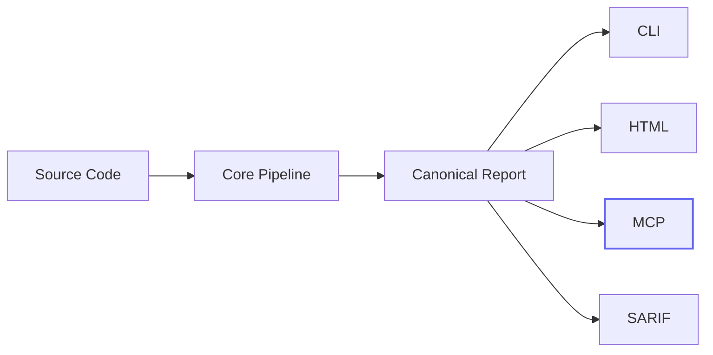
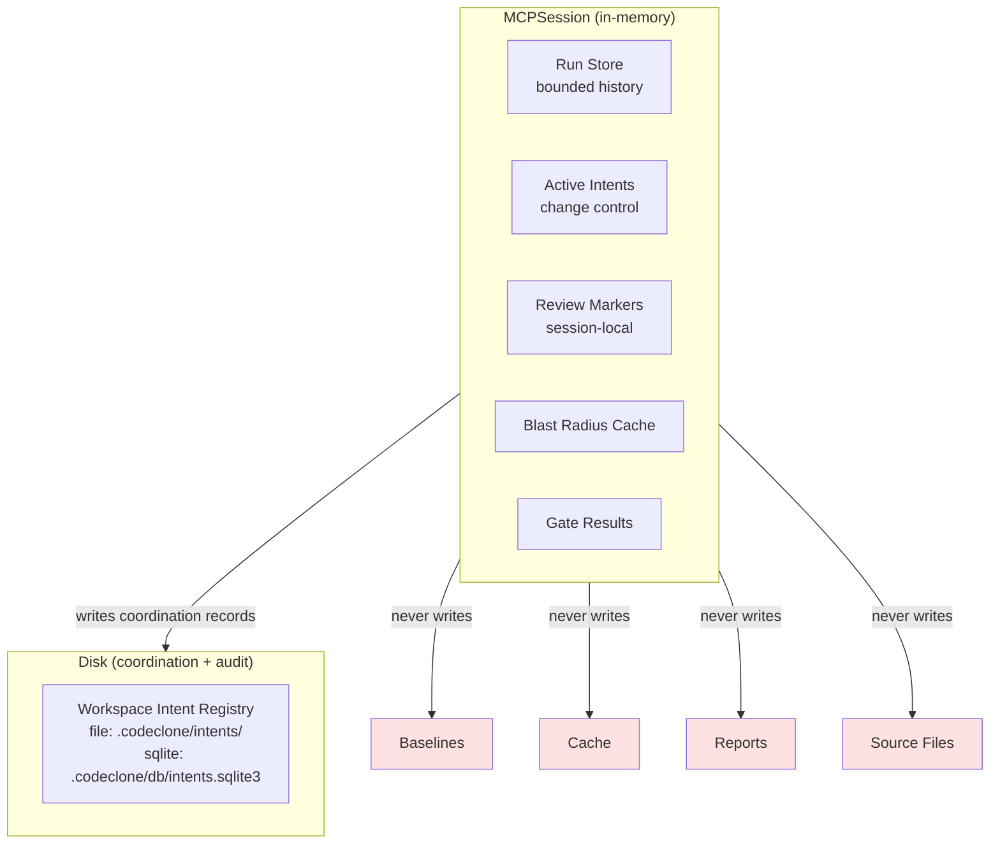
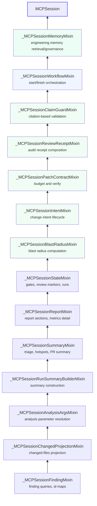
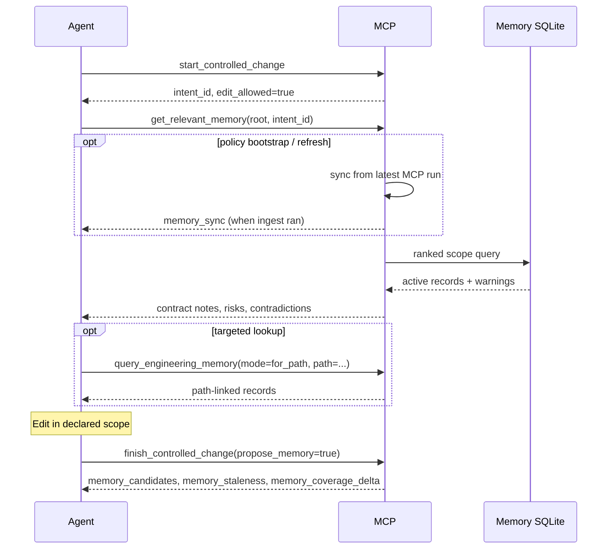
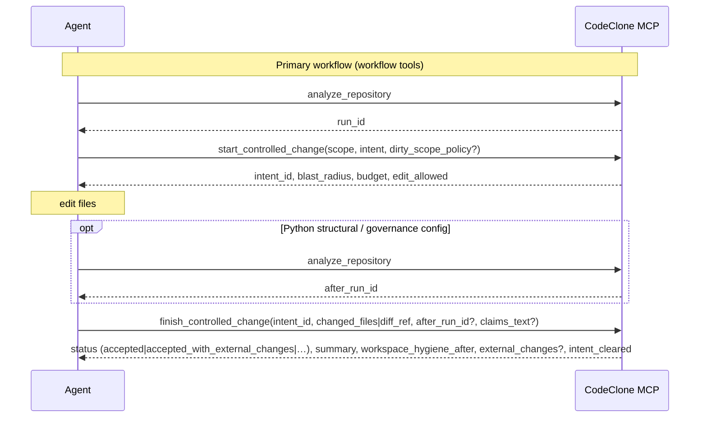

<!-- doc-scope: MCP USAGE GUIDE for AI agents and MCP-capable clients.
     owns: install/client matrices, workflow diagrams, prompt recipes,
       troubleshooting, tool usage patterns.
     does-not-own: MCP tool/resource contract (→ book/25), payload semantics
       (→ book/12), engineering memory contract (→ book/13).
     rule: this is the GUIDE. book/25 is the CONTRACT. Do not merge them.
       Normative tables live in book/12 — do not copy back. -->
# MCP for AI Agents

CodeClone MCP is a **read-only, baseline-aware** analysis server for AI agents
and MCP-capable clients. It exposes the same deterministic pipeline as the CLI
without mutating source files, baselines, cache, or report artifacts.

Works with any MCP-capable client regardless of backend model.

---

## Architecture

### Where MCP fits

MCP is an **integration surface**, not a second analyzer. It composes over the
same canonical pipeline and report contracts as the CLI and HTML report.



### Session architecture

Every `codeclone-mcp` process owns an isolated session. Session state lives
entirely in process memory and does not survive restart.



### Mixin chain

The session is composed from focused mixins, each owning one capability
layer. The chain is append-only: new phases extend the top without modifying
existing mixins.



---

## Install

=== "Standalone tool"

    ```bash
    uv tool install "codeclone[mcp]"
    ```

=== "Project environment"

    ```bash
    uv pip install "codeclone[mcp]"
    ```

---

## Client setup

All clients use the same server. Only the registration format differs.

=== "Claude Code"

    ```bash
    claude mcp add codeclone -- codeclone-mcp --transport stdio
    ```

    Use `--scope project` to store config in `.mcp.json` for the repository.

=== "Codex"

    ```bash
    marketplace add orenlab/codeclone-codex
    ```

    The native plugin includes the MCP definition and CodeClone skills.
    Manual MCP registration without the plugin is also valid:

    ```bash
    codex mcp add codeclone -- codeclone-mcp --transport stdio
    ```

    See [Codex plugin guide](codex-plugin.md).

=== "Cursor"

    Add to `.cursor/mcp.json`:

    ```json
    {
      "mcpServers": {
        "codeclone": {
          "command": "codeclone-mcp",
          "args": ["--transport", "stdio"]
        }
      }
    }
    ```

    For intent-first edits with IDE enforcement, use the bundled
    [Cursor plugin](cursor-plugin.md): install project hooks so `preToolUse`
    reads the same workspace intent registry (file or SQLite) as MCP.

=== "Claude Desktop"

    A local `.mcpb` bundle ships in `extensions/claude-desktop-codeclone/`.
    See [Claude Desktop bundle guide](claude-desktop-bundle.md).

=== "JSON config (generic)"

    ```json
    {
      "mcpServers": {
        "codeclone": {
          "command": "codeclone-mcp",
          "args": ["--transport", "stdio"]
        }
      }
    }
    ```

    Works with Copilot Chat, Gemini CLI, and other MCP-capable clients.

If `codeclone-mcp` is not on `PATH`, use the full launcher path.

---

## Server

### Transports

| Transport         | Default | Use case                        |
|-------------------|---------|---------------------------------|
| `stdio`           | Yes     | Local agents, IDEs, CLI clients |
| `streamable-http` | No      | Remote clients, Responses API   |

```bash title="Local (default)"
codeclone-mcp --transport stdio
```

```bash title="HTTP (loopback only)"
codeclone-mcp --transport streamable-http --host 127.0.0.1 --port 8000
```

!!! warning "Remote exposure is opt-in"
    Non-loopback hosts require `--allow-remote`. The built-in HTTP server
    has no authentication. Use it only on trusted networks or behind an
    authenticated reverse proxy.

### Run retention

Run history is bounded: default `4`, max `10` (`--history-limit`).
Runs are in-memory only and do not survive process restart.

### Absolute roots

All analysis tools require an **absolute** repository root. Relative roots
like `.` are rejected because the server working directory may differ from
the client workspace.

---

## Tool surface

Current surface: **31 tools** for agent clients, **7 fixed resources**, **3 URI
templates**. With `--ide-governance-channel` (VS Code), **33 tools** — adds
`get_workspace_session_stats` and `get_controller_audit_trail` (not exposed to
generic agent catalogs).

The surface is organized by workflow phase. Start at the top, drill down
as needed.

### Phase 1: Analyze

| Tool                    | Purpose                                           |
|-------------------------|---------------------------------------------------|
| `analyze_repository`    | Full deterministic analysis of one repo root      |
| `analyze_changed_paths` | Diff-aware analysis with changed-files projection |

Both register the result as an in-memory run. All other tools read from
stored runs.

### Phase 2: Triage

| Tool                    | Purpose                                                    |
|-------------------------|------------------------------------------------------------|
| `get_run_summary`       | Cheapest snapshot: health, findings, baseline status       |
| `get_production_triage` | Production-first view: hotspots, suggestions, thresholds   |
| `list_hotspots`         | Priority-ranked hotspot views by kind                      |
| `compare_runs`          | Run-to-run delta: regressions, improvements, health change |

!!! tip "Start here"
    After analysis, call `get_run_summary` or `get_production_triage` first.
    Prefer `list_hotspots` or `check_*` before broad `list_findings` calls.

### Workspace hygiene tips

Selected MCP responses may include a non-blocking `tips[]` array with
structured workspace guidance. The first tip checks whether the repository
root `.gitignore` covers `.codeclone/` (or the broader `.cache/` tree).

| Field             | Example                     |
|-------------------|-----------------------------|
| `id`              | `gitignore-codeclone-cache` |
| `severity`        | `info`                      |
| `category`        | `workspace_hygiene`         |
| `suggested_entry` | `.codeclone/`         |

Tips are advisory only — not findings, gates, or failures. MCP never edits
`.gitignore` automatically; agents must declare scope before changing it.

Surfaces: `analyze_repository`, `get_run_summary`, `get_production_triage`,
`start_controlled_change`, and the CLI after a normal interactive analysis run
(suppressed in `--quiet`, CI, and non-TTY contexts).

### Phase 3: Drill down

| Tool                  | Purpose                                                     |
|-----------------------|-------------------------------------------------------------|
| `list_findings`       | Filtered, paginated findings with novelty and scope filters |
| `get_finding`         | Single finding detail by short or canonical ID              |
| `get_remediation`     | Remediation and explainability for one finding              |
| `get_report_section`  | Read report sections; `metrics_detail` is paginated         |
| `evaluate_gates`      | Preview CI gating decisions without mutating state          |
| `generate_pr_summary` | PR-friendly markdown or JSON summary                        |

### Phase 4: Focused checks

Narrow queries over a single quality dimension. Cheaper than `list_findings`
when you know which dimension to inspect.

| Tool               | Dimension                      |
|--------------------|--------------------------------|
| `check_clones`     | Clone groups                   |
| `check_complexity` | Cyclomatic complexity hotspots |
| `check_coupling`   | Afferent/efferent coupling     |
| `check_cohesion`   | Module cohesion                |
| `check_dead_code`  | Dead code candidates           |

### Phase 5: Change control

The structural change controller workflow. These tools compose over stored
runs and session state without running analysis or mutating the repository.

```mermaid
sequenceDiagram
    participant A as Agent
    participant M as MCP Server
    participant D as Intent Registry
    A ->> M: manage_change_intent(action="list_workspace", root)
    M ->> D: read active intents (file or sqlite backend)
    D -->> M: active intents
    M -->> A: workspace state
    A ->> M: analyze_repository(root)
    M -->> A: run registered
    A ->> M: manage_change_intent(action="declare", scope, intent)
    M ->> D: write intent record
    M -->> A: intent_id, blast_radius, concurrent_intents
    alt Scope conflict with on_conflict="queue"
        A ->> M: manage_change_intent(action="declare", scope, intent, on_conflict="queue")
        M ->> D: write queued intent record
        M -->> A: status=queued, blocked_by, queue_position
        Note over A: Wait for foreign intent to clear
        A ->> M: manage_change_intent(action="promote", intent_id)
        M ->> D: re-check conflicts, update to active
        M -->> A: status=active
    end
    A ->> M: get_blast_radius(files)
    M -->> A: do_not_touch, review_context
    A ->> M: check_patch_contract(mode=budget)
    M -->> A: regression budget, headroom
    Note over A: Edit files within scope
    opt Long edit or test run
        A ->> M: manage_change_intent(action="renew", intent_id, lease_seconds)
        M ->> D: update lease timestamp
        M -->> A: lease_renewed
    end

    A ->> M: analyze_repository(root)
    M -->> A: after_run_id registered
    A ->> M: manage_change_intent(action="check", intent_id, changed_files or diff_ref)
    Note right of M: intent stays on before-run, changed scope is explicit
    M -->> A: clean / expanded / violated
    A ->> M: check_patch_contract(mode=verify, before_run_id, after_run_id, intent_id)
    M -->> A: accepted / violated
    A ->> M: validate_review_claims(text, patch_health_delta?)
    M -->> A: valid / violations
    A ->> M: create_review_receipt
    M -->> A: audit artifact
    A ->> M: manage_change_intent(action="clear", intent_id)
    M ->> D: close intent (file: delete row; sqlite: status=clean)
```

| Tool                        | Purpose                                                                                                                                                                                                                         |
|-----------------------------|---------------------------------------------------------------------------------------------------------------------------------------------------------------------------------------------------------------------------------|
| `start_controlled_change`   | Pre-edit workflow: workspace check + declare + blast radius + budget (`dirty_scope_policy` for known WIP)                                                                                                                       |
| `finish_controlled_change`  | Post-edit workflow: scope check + verify + claims + receipt + clear (`propose_memory` for draft candidates on accept)                                                                                                           |
| `manage_change_intent`      | Intent lifecycle: declare, get, check, clear, renew, promote, list_workspace, gc_workspace, recover, reset_workspace                                                                                                            |
| `get_blast_radius`          | Pre-change risk boundary: dependents, clone cohorts, do-not-touch, review context                                                                                                                                               |
| `get_relevant_memory`       | Ranked engineering memory for declared edit scope. **Requires `root`**; pass `scope` and/or active `intent_id`                                                                                                                  |
| `query_engineering_memory`  | Mode router: search, get, for_path, for_symbol, stale, coverage, status. Search supports `filters.match_mode` (`any`\|`all`)                                                                                                    |
| `manage_engineering_memory` | Agent memory governance: `record_candidate`, `validate_claims`, `propose_from_receipt`, `refresh_from_run`, `rebuild_semantic_index`. Human approve/reject/archive use the CodeClone VS Code **Memory** view (IDE channel only; not available to agents). |
| `check_patch_contract`      | Budget query (`mode=budget`) or post-edit verification (`mode=verify`)                                                                                                                                                          |
| `create_review_receipt`     | Deterministic audit artifact: provenance, scope, reviewed findings, patch status, verification profile                                                                                                                          |
| `validate_review_claims`    | Citation-based overclaim detection; optional `patch_health_delta` from verify for regression-free claim checks                                                                                                                  |

??? info "Blast radius: do_not_touch vs review_context"
    Graph traversal core lives in `codeclone/analysis/blast_radius.py`; MCP and CLI
    are presentation adapters over canonical report facts. `do_not_touch` contains
    actionable edit prohibitions: baselines, generated state, forbidden paths.
    `review_context` contains report-only signals: security boundary inventory,
    overloaded-module candidates, known baseline debt. Review context is information,
    not an edit ban.

??? info "Patch contract modes"
    **Budget** reads one stored run and optional intent. Shows regression
    headroom per quality dimension before editing. Queued intents return
    `edit_allowed=false`. **Verify** compares explicit before/after stored
    runs, previews gates, validates scope, and reports baseline-abuse signals.
    When `intent_id` is provided but `before_run_id` is omitted, verify
    auto-resolves the before-run from the intent record. Verify derives a
    **verification profile** from changed files — docs-only and non-Python
    patches skip structural checks; Python source changes require a full
    after-run. Identical before/after runs for `python_structural` and
    `governance_config` return `reason: after_run_not_new`. Non-accepted responses include a `next_step` hint and
    `claim_validation_recommended` flag. Missing runs return
    `status=unverified`. Accepted verify with negative `health_delta` may
    include `health_regression_advisory`.

### Engineering Memory

Engineering Memory is a **local SQLite store** of evidence-linked facts about the
repository. It complements change control by giving agents ranked context for
the declared edit scope — contract notes, document links, risk hotspots, module
roles, and governed drafts.

Full contract: [Engineering Memory (book)](book/13-engineering-memory.md).

#### Bootstrap and MCP sync

Default policy `mcp_sync_policy = "bootstrap_if_missing"` auto-creates the store
from the latest MCP analysis run on first `get_relevant_memory` — no separate CLI
init required for agents.

| Policy                           | Auto on `get_relevant_memory`        | Explicit refresh                                       |
|----------------------------------|--------------------------------------|--------------------------------------------------------|
| `bootstrap_if_missing` (default) | Create DB when missing               | `manage_engineering_memory(action="refresh_from_run")` |
| `refresh_when_stale`             | Re-ingest when report digest changed | same                                                   |
| `off`                            | Disabled                             | `refresh_from_run` still works                         |

CLI init remains available for CI and offline bootstrap:

```bash
codeclone memory init --root /abs/repo
codeclone memory init --root /abs/repo --refresh   # re-ingest + staleness pass
```

When auto-sync is disabled or no MCP run exists, memory tools return a contract
error until init or `refresh_from_run` succeeds.

#### Agent read path



| When                       | Tool                                                                     | Why                       |
|----------------------------|--------------------------------------------------------------------------|---------------------------|
| After `start`, before edit | `get_relevant_memory(root, scope \| intent_id)`                          | Ranked scope context      |
| One path / symbol          | `query_engineering_memory(mode=for_path\|for_symbol)`                    | Targeted lookup           |
| Keyword discovery          | `query_engineering_memory(mode=search, query=…, filters={match_mode:…})` | FTS search                |
| Semantic discovery (opt-in) | `query_engineering_memory(mode=search, semantic=true, …)`              | FTS + LanceDB blend when `[tool.codeclone.memory.semantic] enabled` and index built; default config is **off** |
| Refresh system facts       | `manage_engineering_memory(action=refresh_from_run, run_id?)`            | Force ingest from MCP run |
| Rebuild semantic sidecar   | `manage_engineering_memory(action=rebuild_semantic_index)`               | LanceDB index when semantic enabled |
| Unclear semantics          | `help(topic="engineering_memory")`                                       | Compact playbook          |

Defaults exclude **stale** records. Keyword search excludes drafts unless
`include_drafts=true`; scoped `get_relevant_memory` and `for_path` /
`for_symbol` include draft agent notes automatically so handoffs are visible.
Draft records remain non-authoritative. Surface stale warnings when present —
they signal changed context.

**Optional semantic search (Phase 20):** off by default (`enabled=false`).
When enabled, install `codeclone[semantic-lancedb]` for the sidecar, run
`manage_engineering_memory(action=rebuild_semantic_index)` (agents) or
`codeclone memory semantic rebuild` (CLI/CI), then pass `semantic=true` on
`mode=search`. For semantic-quality local recall, install
`codeclone[semantic-local]` and set `embedding_provider = "fastembed"` under
`[tool.codeclone.memory.semantic]`. Responses include a `semantic` object
(`used`, `provider`, `model`, `reason`, …). The default `diagnostic` provider
uses deterministic hash vectors — **not** semantic-quality embeddings; treat
hits as deterministic proximity over projected text, not LLM recall. See
[Engineering Memory — semantic retrieval](book/13-engineering-memory.md#optional-semantic-retrieval-phase-20).

**Scope and token hygiene:** project root is not a valid memory scope; unscoped
`get_relevant_memory` is rejected (use `status`/`search` for orientation). List
responses default to compact statement previews; use `mode=get` or
`detail_level=full` for complete text. Agent `record_candidate` requires
`subject_path` and rejects statements above `max_statement_chars` (default 1000).

#### Agent write path (draft only)

| Action                    | Tool                                                          | Result                        |
|---------------------------|---------------------------------------------------------------|-------------------------------|
| Refresh from analysis run | `manage_engineering_memory(action=refresh_from_run, run_id?)` | System ingest from MCP report |
| Rebuild semantic index    | `manage_engineering_memory(action=rebuild_semantic_index)`   | LanceDB sidecar from memory + audit |
| Observation during edit   | `manage_engineering_memory(action=record_candidate, …)`       | `draft` record                |
| Validate finish claims    | `manage_engineering_memory(action=validate_claims, text=…)`   | warnings/errors               |
| Post-edit proposals       | `finish_controlled_change(propose_memory=true)`               | draft candidates + staleness  |
| Atomic fallback           | `manage_engineering_memory(action=propose_from_receipt, …)`   | draft proposals               |

**Human promote:** CodeClone VS Code **Memory** view (approve with confirmation) — agents cannot activate records
through MCP
drafts via MCP.

#### Trust boundaries

Memory **cannot**:

- expand declared edit scope or authorize `do_not_touch` edits
- override CodeClone structural findings
- mutate baselines, analysis cache, canonical reports, or source files
- approve/reject/archive drafts (human CLI only)

MCP **can** bootstrap or refresh the memory store via `mcp_sync_policy` and
`refresh_from_run` — system ingest only, not human governance.

Treat `draft`, `inferred`, and excluded stale records as **non-authoritative**.

### Phase 6: Session management

| Tool                     | Purpose                                                                                               |
|--------------------------|-------------------------------------------------------------------------------------------------------|
| `mark_finding_reviewed`  | Session-local review marker (in-memory)                                                               |
| `list_reviewed_findings` | List reviewed findings for a run                                                                      |
| `clear_session_runs`     | Reset in-memory runs, session review markers, and workspace intent registry state for the MCP process |
| `help`                   | Bounded workflow and contract guidance                                                                |

---

## Resource surface

Resources are read-only views over stored runs. They do not trigger analysis.

### Fixed resources

| URI                              | Content                           |
|----------------------------------|-----------------------------------|
| `codeclone://latest/summary`     | Latest run summary                |
| `codeclone://latest/triage`      | Latest production-first triage    |
| `codeclone://latest/report.json` | Full canonical report             |
| `codeclone://latest/health`      | Health score and dimensions       |
| `codeclone://latest/gates`       | Last gate evaluation result       |
| `codeclone://latest/changed`     | Changed-files projection          |
| `codeclone://schema`             | Canonical report shape descriptor |

### Run-scoped templates

| URI template                                      | Content                         |
|---------------------------------------------------|---------------------------------|
| `codeclone://runs/{run_id}/summary`               | Summary for a specific run      |
| `codeclone://runs/{run_id}/report.json`           | Report for a specific run       |
| `codeclone://runs/{run_id}/findings/{finding_id}` | One finding from a specific run |

`codeclone://latest/*` always resolves to the most recent run. A later
`analyze_repository` or `analyze_changed_paths` call moves the pointer.

---

## Workflows

### Health check

```
analyze_repository
  -> get_run_summary or get_production_triage
  -> list_hotspots or check_*
  -> get_finding -> get_remediation
```

### PR review

```
analyze_changed_paths(changed_paths=[...] or git_diff_ref="HEAD~1")
  -> list_findings(sort_by="priority")
  -> get_finding -> get_remediation
  -> generate_pr_summary
```

### Change control



!!! info "Tool tiers"

    | Tier | Tools | When to use |
    |------|-------|-------------|
    | Normal workflow | `analyze_repository`, `start_controlled_change`, `finish_controlled_change` | Every edit cycle |
    | Queue/recovery | `manage_change_intent` (promote, recover, reset, renew) | Multi-agent coordination, crash recovery |
    | Advanced/diagnostic | `get_blast_radius`, `check_patch_contract`, `validate_review_claims`, `create_review_receipt` | Deep inspection, step-by-step debugging |

### Detailed atomic workflow

For older MCP servers or step-by-step debugging:

```
manage_change_intent(action="list_workspace")
  -> analyze_repository
  -> manage_change_intent(action="declare", scope={...})
  -> get_blast_radius(files=[...])
  -> check_patch_contract(mode="budget")
  -> [edit within scope]
  -> analyze_repository                                                          # after-run
  -> manage_change_intent(action="check", intent_id=..., changed_files=[...])
  -> check_patch_contract(mode="verify", after_run_id=..., intent_id=...)
  -> validate_review_claims(text="...", patch_health_delta=...)                    # explicit claims text; delta from verify
  -> create_review_receipt
  -> manage_change_intent(action="clear")
```

### Multi-agent queue

```
start_controlled_change(scope={...}, on_conflict="queue")                        # queued behind foreign
  -> [wait for foreign intent to clear]
  -> manage_change_intent(action="promote", intent_id=...)                       # queued → active
  -> [edit within scope]
  -> finish_controlled_change(intent_id=..., changed_files=[...], claims_text=...) # verify + optional claims + clear
```

### Workspace hygiene and lazy intent closure

Three independent contours (do not collapse):

```text
status     = persisted registry lifecycle
ownership  = runtime view (PID / TTL / lease)
hygiene    = git working tree ∩ declared scope
permission = edit_allowed (with status gate)
```

- **Lazy close:** agent-facing reads close TTL-expired and corrupted records on
  list/declare/start refresh. **Orphaned** (dead PID) intents stay recoverable
  until TTL expiry or explicit `gc_workspace` — not removed on read.
- **`gc_workspace`:** explicit GC removes orphaned, expired, and other eligible
  records in one transaction. Lazy close and GC share lifecycle concepts but use
  **different** close predicates (`for_lazy_close` vs full GC removal).
- **`dirty_scope_policy`:** default `block` when scoped hygiene detects dirty
  paths in `allowed_files`. `continue_own_wip` allows start for known WIP in the
  declared scope when no live `foreign_dirty_overlaps` exist; finish still
  requires evidence.
- **`start_controlled_change`:** may return workflow `status: "blocked"` with
  `edit_allowed: false` when foreign scope overlap or scoped hygiene blocks.
  When `budget.gate_preview.would_fail` is true, edit may still be allowed —
  the preview is advisory; final verify may not accept the patch.
  Response includes `workspace.concurrent_intents`, `workspace_relations`, and
  optional scoped `workspace_hygiene`.
- **`finish_controlled_change`:** fixed pipeline (hygiene → check → verify →
  optional claims → receipt → clear). See
  [Structural Change Controller — finish_controlled_change](book/12-structural-change-controller.md#finish_controlled_change).
  Finish reconciles `changed_files` / `diff_ref` with **git** and the start-time
  dirty snapshot. **Only** `missing_evidence` (in-scope dirty not listed) and
  `foreign_dirty_overlap` (live foreign intent on overlapping in-scope paths)
  block finish (`reason: workspace_hygiene`). Out-of-scope unattributed dirt
  (`new_` / `modified_` / `unknown_unattributed_unscoped_dirty`) is **advisory**
  — report it, but it does not fail hygiene. Plain `accepted` verify with
  out-of-scope dirty elevates top-level status to `accepted_with_external_changes`
  and adds `external_changes`. `review_text` is a human note; only `claims_text`
  goes to Claim Guard. Responses include `summary` and `workspace_hygiene_after`.
- **`manage_change_intent(list_workspace)`:** returns repo-level
  `workspace_dirty_summary` only (no scoped `blocks_edit`). When recoverable
  intents exist, includes `recovery_available` (`run_available`, per-candidate
  `hint`) and `recovery_next_step`.

For `health_delta` semantics, multi-agent hygiene tables (who blocks whom), and
start/finish workflow transition tables, see
[Change-control payload semantics](book/12-structural-change-controller.md#change-control-payload-semantics)
in the Structural Change Controller reference.

### Coverage review

```
analyze_repository(coverage_xml="coverage.xml")
  -> get_report_section(section="metrics_detail", family="coverage_join")
  -> evaluate_gates(fail_on_untested_hotspots=true, coverage_min=50)
```

### Session review loop

```
list_findings -> get_finding -> mark_finding_reviewed
  -> list_findings(exclude_reviewed=true) -> ...
  -> clear_session_runs
```

---

## Prompt patterns

Good prompts include **scope**, **goal**, and **constraint**:

```text title="Health check"
Use codeclone MCP to analyze this repository.
Give me a concise structural health summary and the top findings to look at first.
```

```text title="Changed-files review"
Use codeclone MCP in changed-files mode for my latest edits.
Focus only on findings that touch changed files and rank them by priority.
```

```text title="Gate preview"
Run codeclone through MCP and preview gating with fail_on_new.
Explain the exact reasons. Do not change any files.
```

```text title="AI-generated code check"
I added code with an AI agent. Use codeclone MCP to check for new structural drift.
Separate accepted baseline debt from patch-local before/after regressions.
```

!!! tip "Best practices"

    - Use `analyze_changed_paths` for PRs, not full analysis.
    - Prefer `get_run_summary` or `get_production_triage` as the first pass.
    - Prefer `list_hotspots` or narrow `check_*` tools before broad `list_findings`.
    - Use `get_finding` / `get_remediation` for one finding instead of raising
      `detail_level` on larger lists.
    - Pass an absolute `root` — MCP rejects relative roots like `.`.
    - Use `coverage_xml` only with `analysis_mode="full"`.
    - Use `source_kind="production"` (or `tests`, `fixtures`, `mixed`, `other`) to
      cut test/fixture noise.
    - Use `mark_finding_reviewed` + `exclude_reviewed=true` in long sessions.

---

## Payload conventions

Short reference for response structure patterns across the tool surface.

**IDs** — Run IDs are 8-char hex handles. Finding IDs are short prefixed
forms. Both accept the full canonical form as input.

**Detail levels** — `summary` (default for lists), `normal` (default for
single finding), `full` (compatibility payload with URIs).

**Pagination** — `list_findings`, `list_hotspots`, and
`get_report_section(section="metrics_detail")` support `offset` and `limit`.

**Changed-scope filters** — `list_findings`, `list_hotspots`, and
`generate_pr_summary` accept `changed_paths` or `git_diff_ref` for PR
projection.

**Threshold context** — Empty `check_*` responses include
`threshold_context` showing whether the run is genuinely quiet or simply
below the active threshold.

**Budget nulls** — `check_patch_contract` uses `null` for disabled numeric
thresholds. Boolean policy gates use `forbid_*` names.

**Long context** — `do_not_touch`, `review_context`, and similar sections
include `total`, `shown`, and `truncated` summaries.

---

## Security

| Property          | Guarantee                                                                                                                                                                                                                                                   |
|-------------------|-------------------------------------------------------------------------------------------------------------------------------------------------------------------------------------------------------------------------------------------------------------|
| Read-only         | Never mutates source, baseline, cache, or report artifacts                                                                                                                                                                                                  |
| Default transport | Local `stdio`                                                                                                                                                                                                                                               |
| Remote exposure   | Explicit `--allow-remote` required for non-loopback                                                                                                                                                                                                         |
| Lazy loading      | Base `codeclone` install does not require MCP packages                                                                                                                                                                                                      |
| Repository access | Limited to what the server process can read locally                                                                                                                                                                                                         |
| Session state     | In-memory runs and review markers; do not survive restart                                                                                                                                                                                                   |
| Workspace intents | File backend: ephemeral JSON under `.codeclone/intents/`; SQLite backend: auditable rows under `.codeclone/db/intents.sqlite3` with retention purge (default 7 days, max 14 in open source — see [Plans and Retention](plans-and-retention.md)) |
| Audit trail       | Optional SQLite under `.codeclone/db/audit.sqlite3` when `audit_enabled=true`                                                                                                                                                                         |

---

## Troubleshooting

| Problem                                                   | Fix                                                     |
|-----------------------------------------------------------|---------------------------------------------------------|
| `CodeClone MCP support requires the optional 'mcp' extra` | `uv tool install "codeclone[mcp]"`                      |
| Client cannot find `codeclone-mcp`                        | `uv tool install "codeclone[mcp]"` or use absolute path |
| Client only accepts remote MCP                            | Use `streamable-http` transport                         |
| Agent reads stale results                                 | Call `analyze_repository` again                         |
| `changed_paths` rejected                                  | Pass a `list[str]` of repo-relative paths               |
| Relative root rejected                                    | Use absolute path, not `.`                              |

---

## See also

- [MCP Interface Contract](book/25-mcp-interface.md) — formal tool and resource contract
- [Structural Change Controller](book/12-structural-change-controller.md) — change control workflow
- [Claim Guard](book/14-claim-guard.md) — citation-based review validation
- [CLI Reference](book/11-cli.md) — command-line interface
- [Report Contract](book/05-report.md) — canonical report schema
