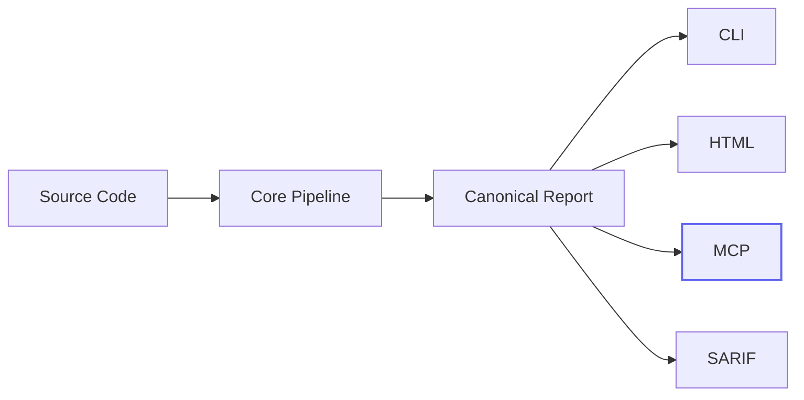
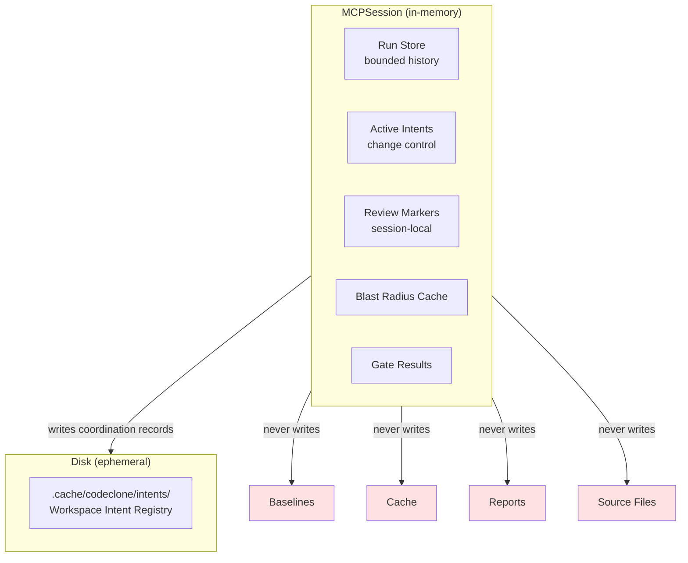
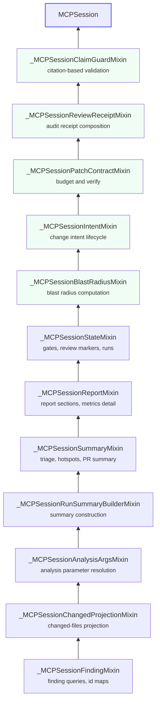

# MCP for AI Agents

CodeClone MCP is a **read-only, baseline-aware** analysis server for AI agents
and MCP-capable clients. It exposes the same deterministic pipeline as the CLI
without mutating source files, baselines, cache, or report artifacts.

Works with any MCP-capable client regardless of backend model.

---

## Architecture

### Where MCP fits

MCP is an **integration surface**, not a second analyzer. It composes over the
same canonical pipeline and report contracts as the CLI and HTML report.



### Session architecture

Every `codeclone-mcp` process owns an isolated session. Session state lives
entirely in process memory and does not survive restart.



### Mixin chain

The session is composed from focused mixins, each owning one capability
layer. The chain is append-only: new phases extend the top without modifying
existing mixins.



---

## Install

=== "Standalone tool"

    ```bash
    uv tool install "codeclone[mcp]"
    ```

=== "Project environment"

    ```bash
    uv pip install "codeclone[mcp]"
    ```

---

## Client setup

All clients use the same server. Only the registration format differs.

=== "Claude Code"

    ```bash
    claude mcp add codeclone -- codeclone-mcp --transport stdio
    ```

    Use `--scope project` to store config in `.mcp.json` for the repository.

=== "Codex"

    ```bash
    codex mcp add codeclone -- codeclone-mcp --transport stdio
    ```

    A native plugin also ships in `plugins/codeclone/`.
    See [Codex plugin guide](codex-plugin.md).

=== "Cursor"

    Add to `.cursor/mcp.json`:

    ```json
    {
      "mcpServers": {
        "codeclone": {
          "command": "codeclone-mcp",
          "args": ["--transport", "stdio"]
        }
      }
    }
    ```

=== "Claude Desktop"

    A local `.mcpb` bundle ships in `extensions/claude-desktop-codeclone/`.
    See [Claude Desktop bundle guide](claude-desktop-bundle.md).

=== "JSON config (generic)"

    ```json
    {
      "mcpServers": {
        "codeclone": {
          "command": "codeclone-mcp",
          "args": ["--transport", "stdio"]
        }
      }
    }
    ```

    Works with Copilot Chat, Gemini CLI, and other MCP-capable clients.

If `codeclone-mcp` is not on `PATH`, use the full launcher path.

---

## Server

### Transports

| Transport         | Default | Use case                        |
|-------------------|---------|---------------------------------|
| `stdio`           | Yes     | Local agents, IDEs, CLI clients |
| `streamable-http` | No      | Remote clients, Responses API   |

```bash title="Local (default)"
codeclone-mcp --transport stdio
```

```bash title="HTTP (loopback only)"
codeclone-mcp --transport streamable-http --host 127.0.0.1 --port 8000
```

!!! warning "Remote exposure is opt-in"
Non-loopback hosts require `--allow-remote`. The built-in HTTP server
has no authentication. Use it only on trusted networks or behind an
authenticated reverse proxy.

### Run retention

Run history is bounded: default `4`, max `10` (`--history-limit`).
Runs are in-memory only and do not survive process restart.

### Absolute roots

All analysis tools require an **absolute** repository root. Relative roots
like `.` are rejected because the server working directory may differ from
the client workspace.

---

## Tool surface

Current surface: **26 tools**, **7 fixed resources**, **3 URI templates**.

The surface is organized by workflow phase. Start at the top, drill down
as needed.

### Phase 1: Analyze

| Tool                    | Purpose                                           |
|-------------------------|---------------------------------------------------|
| `analyze_repository`    | Full deterministic analysis of one repo root      |
| `analyze_changed_paths` | Diff-aware analysis with changed-files projection |

Both register the result as an in-memory run. All other tools read from
stored runs.

### Phase 2: Triage

| Tool                    | Purpose                                                    |
|-------------------------|------------------------------------------------------------|
| `get_run_summary`       | Cheapest snapshot: health, findings, baseline status       |
| `get_production_triage` | Production-first view: hotspots, suggestions, thresholds   |
| `list_hotspots`         | Priority-ranked hotspot views by kind                      |
| `compare_runs`          | Run-to-run delta: regressions, improvements, health change |

!!! tip "Start here"
After analysis, call `get_run_summary` or `get_production_triage` first.
Prefer `list_hotspots` or `check_*` before broad `list_findings` calls.

### Phase 3: Drill down

| Tool                  | Purpose                                                     |
|-----------------------|-------------------------------------------------------------|
| `list_findings`       | Filtered, paginated findings with novelty and scope filters |
| `get_finding`         | Single finding detail by short or canonical ID              |
| `get_remediation`     | Remediation and explainability for one finding              |
| `get_report_section`  | Read report sections; `metrics_detail` is paginated         |
| `evaluate_gates`      | Preview CI gating decisions without mutating state          |
| `generate_pr_summary` | PR-friendly markdown or JSON summary                        |

### Phase 4: Focused checks

Narrow queries over a single quality dimension. Cheaper than `list_findings`
when you know which dimension to inspect.

| Tool               | Dimension                      |
|--------------------|--------------------------------|
| `check_clones`     | Clone groups                   |
| `check_complexity` | Cyclomatic complexity hotspots |
| `check_coupling`   | Afferent/efferent coupling     |
| `check_cohesion`   | Module cohesion                |
| `check_dead_code`  | Dead code candidates           |

### Phase 5: Change control

The structural change controller workflow. These tools compose over stored
runs and session state without running analysis or mutating the repository.

```mermaid
sequenceDiagram
    participant A as Agent
    participant M as MCP Server
    participant D as Disk Registry

    A->>M: list_workspace(root)
    M->>D: read .cache/codeclone/intents/
    D-->>M: active intents
    M-->>A: workspace state

    A->>M: analyze_repository(root)
    M-->>A: run registered

    A->>M: declare(scope, intent)
    M->>D: write intent record
    M-->>A: intent_id, blast_radius, concurrent_intents

    A->>M: get_blast_radius(files)
    M-->>A: do_not_touch, review_context

    A->>M: check_patch_contract(mode=budget)
    M-->>A: regression budget, headroom

    Note over A: Edit files within scope

    A->>M: analyze_repository(root)
    M-->>A: after_run_id registered

    A->>M: check(intent_id, changed_files or diff_ref)
    Note right of M: intent stays on before-run; changed scope is explicit
    M-->>A: clean / expanded / violated

    A->>M: check_patch_contract(mode=verify, before_run_id, after_run_id, intent_id)
    M-->>A: accepted / violated

    A->>M: validate_review_claims(text)
    M-->>A: valid / violations

    A->>M: create_review_receipt
    M-->>A: audit artifact

    A->>M: clear
    M->>D: remove intent record
```

| Tool                     | Purpose                                                                                     |
|--------------------------|---------------------------------------------------------------------------------------------|
| `manage_change_intent`   | Intent lifecycle: declare, get, check, clear, list_workspace, gc_workspace, reset_workspace |
| `get_blast_radius`       | Pre-change risk boundary: dependents, clone cohorts, do-not-touch, review context           |
| `check_patch_contract`   | Budget query (`mode=budget`) or post-edit verification (`mode=verify`)                      |
| `create_review_receipt`  | Deterministic audit artifact: provenance, scope, reviewed findings, patch status            |
| `validate_review_claims` | Citation-based overclaim detection against stored run semantics                             |

??? info "Blast radius: do_not_touch vs review_context"
`do_not_touch` contains actionable edit prohibitions: baselines, generated
state, forbidden paths. `review_context` contains report-only signals:
security boundary inventory, overloaded-module candidates, known baseline
debt. Review context is information, not an edit ban.

??? info "Patch contract modes"
**Budget** reads one stored run and optional intent. Shows regression
headroom per quality dimension before editing. **Verify** compares explicit
before/after stored runs, previews gates, validates scope, and reports
baseline-abuse signals. Missing runs return `status=unverified`.

### Phase 6: Session management

| Tool                     | Purpose                                 |
|--------------------------|-----------------------------------------|
| `mark_finding_reviewed`  | Session-local review marker (in-memory) |
| `list_reviewed_findings` | List reviewed findings for a run        |
| `clear_session_runs`     | Reset in-memory runs and session state  |
| `help`                   | Bounded workflow and contract guidance  |

---

## Resource surface

Resources are read-only views over stored runs. They do not trigger analysis.

### Fixed resources

| URI                              | Content                           |
|----------------------------------|-----------------------------------|
| `codeclone://latest/summary`     | Latest run summary                |
| `codeclone://latest/triage`      | Latest production-first triage    |
| `codeclone://latest/report.json` | Full canonical report             |
| `codeclone://latest/health`      | Health score and dimensions       |
| `codeclone://latest/gates`       | Last gate evaluation result       |
| `codeclone://latest/changed`     | Changed-files projection          |
| `codeclone://schema`             | Canonical report shape descriptor |

### Run-scoped templates

| URI template                                      | Content                         |
|---------------------------------------------------|---------------------------------|
| `codeclone://runs/{run_id}/summary`               | Summary for a specific run      |
| `codeclone://runs/{run_id}/report.json`           | Report for a specific run       |
| `codeclone://runs/{run_id}/findings/{finding_id}` | One finding from a specific run |

`codeclone://latest/*` always resolves to the most recent run. A later
`analyze_repository` or `analyze_changed_paths` call moves the pointer.

---

## Workflows

### Health check

```
analyze_repository
  -> get_run_summary or get_production_triage
  -> list_hotspots or check_*
  -> get_finding -> get_remediation
```

### PR review

```
analyze_changed_paths(changed_paths=[...] or git_diff_ref="HEAD~1")
  -> list_findings(sort_by="priority")
  -> get_finding -> get_remediation
  -> generate_pr_summary
```

### Change control

```
manage_change_intent(action="list_workspace")
  -> analyze_repository
  -> manage_change_intent(action="declare", scope={...})
  -> get_blast_radius(files=[...])
  -> check_patch_contract(mode="budget")
  -> [edit within scope]
  -> analyze_repository                                                          # after-run
  -> manage_change_intent(action="check", intent_id=..., changed_files=[...])
  -> check_patch_contract(mode="verify", before_run_id=..., after_run_id=..., intent_id=...)
  -> validate_review_claims(text="...")
  -> create_review_receipt
  -> manage_change_intent(action="clear")
```

### Coverage review

```
analyze_repository(coverage_xml="coverage.xml")
  -> get_report_section(section="metrics_detail", family="coverage_join")
  -> evaluate_gates(fail_on_untested_hotspots=true, coverage_min=50)
```

### Session review loop

```
list_findings -> get_finding -> mark_finding_reviewed
  -> list_findings(exclude_reviewed=true) -> ...
  -> clear_session_runs
```

---

## Prompt patterns

Good prompts include **scope**, **goal**, and **constraint**:

```text title="Health check"
Use codeclone MCP to analyze this repository.
Give me a concise structural health summary and the top findings to look at first.
```

```text title="Changed-files review"
Use codeclone MCP in changed-files mode for my latest edits.
Focus only on findings that touch changed files and rank them by priority.
```

```text title="Gate preview"
Run codeclone through MCP and preview gating with fail_on_new.
Explain the exact reasons. Do not change any files.
```

```text title="AI-generated code check"
I added code with an AI agent. Use codeclone MCP to check for new structural drift.
Separate accepted baseline debt from new regressions.
```

!!! tip "Best practices"
- Use `analyze_changed_paths` for PRs, not full analysis.
- Prefer `get_run_summary` or `get_production_triage` as the first pass.
- Prefer `list_hotspots` or narrow `check_*` tools before broad `list_findings`.
- Use `get_finding` / `get_remediation` for one finding instead of raising
`detail_level` on larger lists.
- Pass an absolute `root` — MCP rejects relative roots like `.`.
- Use `coverage_xml` only with `analysis_mode="full"`.
- Use `source_kind="production-only"` to cut test/fixture noise.
- Use `mark_finding_reviewed` + `exclude_reviewed=true` in long sessions.

---

## Payload conventions

Short reference for response structure patterns across the tool surface.

**IDs** — Run IDs are 8-char hex handles. Finding IDs are short prefixed
forms. Both accept the full canonical form as input.

**Detail levels** — `summary` (default for lists), `normal` (default for
single finding), `full` (compatibility payload with URIs).

**Pagination** — `list_findings`, `list_hotspots`, and
`get_report_section(section="metrics_detail")` support `offset` and `limit`.

**Changed-scope filters** — `list_findings`, `list_hotspots`, and
`generate_pr_summary` accept `changed_paths` or `git_diff_ref` for PR
projection.

**Threshold context** — Empty `check_*` responses include
`threshold_context` showing whether the run is genuinely quiet or simply
below the active threshold.

**Budget nulls** — `check_patch_contract` uses `null` for disabled numeric
thresholds. Boolean policy gates use `forbid_*` names.

**Long context** — `do_not_touch`, `review_context`, and similar sections
include `total`, `shown`, and `truncated` summaries.

---

## Security

| Property          | Guarantee                                                  |
|-------------------|------------------------------------------------------------|
| Read-only         | Never mutates source, baseline, cache, or report artifacts |
| Default transport | Local `stdio`                                              |
| Remote exposure   | Explicit `--allow-remote` required for non-loopback        |
| Lazy loading      | Base `codeclone` install does not require MCP packages     |
| Repository access | Limited to what the server process can read locally        |
| Session state     | In-memory only; does not survive restart                   |
| Workspace intents | Ephemeral coordination under `.cache/codeclone/intents/`   |

---

## Troubleshooting

| Problem                                                   | Fix                                                     |
|-----------------------------------------------------------|---------------------------------------------------------|
| `CodeClone MCP support requires the optional 'mcp' extra` | `uv tool install "codeclone[mcp]"`                      |
| Client cannot find `codeclone-mcp`                        | `uv tool install "codeclone[mcp]"` or use absolute path |
| Client only accepts remote MCP                            | Use `streamable-http` transport                         |
| Agent reads stale results                                 | Call `analyze_repository` again                         |
| `changed_paths` rejected                                  | Pass a `list[str]` of repo-relative paths               |
| Relative root rejected                                    | Use absolute path, not `.`                              |

---

## See also

- [MCP Interface Contract](book/20-mcp-interface.md) — formal tool and resource contract
- [Structural Change Controller](book/24-structural-change-controller.md) — change control workflow
- [Claim Guard](book/28-claim-guard.md) — citation-based review validation
- [CLI Reference](book/09-cli.md) — command-line interface
- [Report Contract](book/08-report.md) — canonical report schema
