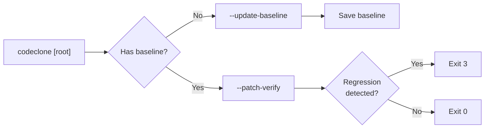

## Overview

CodeClone is a deterministic structural change controller for AI-assisted Python development. The default invocation runs full analysis on a repository:

```bash
codeclone [options] [root]
```

The root directory defaults to the current directory. Analysis produces findings on structural clones, code metrics, dependencies, and code health. Reporting formats include JSON, HTML, Markdown, SARIF, and plain text.

Specialized subcommands manage setup, engineering memory, and analytics. Exit code 0 indicates success; 2 signals contract violations; 3 indicates gating failures; 5 is an internal error.

## Global options

### Target and analysis scope

| Option | Description |
|--------|-------------|
| `root` | Project root directory. Defaults to `.` |
| `--min-loc MIN_LOC` | Minimum Lines of Code for clone analysis. Default: 10 |
| `--min-stmt MIN_STMT` | Minimum top-level statements in the function body for clone analysis; statements nested inside them are not counted. Default: 6 |
| `--processes PROCESSES` | Parallel worker processes. Default: 4 |
| `--changed-only` | Limit findings to files in a git diff |
| `--diff-against REF` | Use `git diff --name-only <REF>` to determine changed files |
| `--paths-from-git-diff REF` | Shorthand for `--changed-only --diff-against REF` |
| `--near-miss` | Report near-miss clone pairs. Advisory; never gates or enters the baseline |
| `--renamed-structure` | Report renamed-structure clone groups (consistent renaming of locals and receiver attributes). Advisory; never gates or enters the baseline |

### Baseline and cache

| Option | Description |
|--------|-------------|
| `--baseline [FILE]` | Baseline path. Default: `codeclone.baseline.json` |
| `--max-baseline-size-mb MB` | Maximum baseline size. Default: 5 |
| `--update-baseline` | Overwrite the baseline with current results |
| `--cache-path [FILE]` | Cache file path. Default: `.codeclone/db/cache.sqlite3` |
| `--cache-dir [FILE]` | Legacy alias for `--cache-path` |
| `--max-cache-size-mb MB` | Maximum cache size. Default: 256 |

Clone findings and metrics live in one baseline container, so one
`--baseline` / `--update-baseline` pair governs both. There is no separate
metrics-baseline flag. See [Baseline container and lane trust](../concepts/baseline-container.md).

Baseline update and baseline-relative gating both require a stable
`baseline_scope_id` in `pyproject.toml`; without it CodeClone exits 2.

### Verification and gates

| Option | Description |
|--------|-------------|
| `--blast-radius FILE [FILE ...]` | Show structural impact for given files |
| `--patch-verify` | Verify current patch against baseline budget |
| `--strictness LEVEL` | Strictness profile: `ci`, `strict`, or `relaxed`. Default: `ci` |
| `--ci` | Enable CI preset (`--fail-on-new --no-color --quiet`) |
| `--api-surface` | Collect API surface facts (contract-visible exports) for compatibility review |
| `--semantic-authority` | Collect report-only semantic authority candidates and provenance facts |
| `--coverage FILE` | Join external Cobertura XML line coverage |

CodeClone treats names listed in `__all__` as contract-visible exports for
API-break accounting. An explicit `__all__` remains authoritative even in an
underscore-prefixed module — existing policy, not a claim that Python prevents
external imports.

### Quality gates (fail on violation)

| Option | Description |
|--------|-------------|
| `--fail-on-new` | Exit 3 if new clones found vs. baseline |
| `--fail-on-new-metrics` | Exit 3 if metrics violations appear vs. baseline |
| `--fail-threshold MAX_CLONES` | Exit 3 if total clone groups exceed value |
| `--fail-complexity [CC_MAX]` | Exit 3 if cyclomatic complexity exceeds threshold. Default if enabled: 20 |
| `--fail-coupling [CBO_MAX]` | Exit 3 if class coupling exceeds threshold. Default if enabled: 10 |
| `--fail-cohesion [LCOM4_MAX]` | Exit 3 if class cohesion exceeds threshold. Default if enabled: 4 |
| `--fail-cycles` | Exit 3 if an **import-time** dependency cycle is detected. Deferred cycles are reported but never fail the build — see [Dependency cycle kinds](#dependency-cycle-kinds) |
| `--fail-dead-code` | Exit 3 if dead code detected |
| `--fail-on-unresolved-dead-code` | Exit 3 on unresolved external overrides. These are abstentions, never counted as dead code |
| `--fail-health [SCORE_MIN]` | Exit 3 if health score below threshold. Default if enabled: 60 |
| `--fail-on-typing-regression` | Exit 3 if typing coverage regresses |
| `--fail-on-docstring-regression` | Exit 3 if docstring coverage regresses |
| `--fail-on-api-break` | Exit 3 if contract-visible API removals detected |
| `--fail-on-authority-violation` | Exit 3 on an authority violation in a governed semantic contract. Requires a reviewed `[[tool.codeclone.authority]]` entry |
| `--fail-on-untested-hotspots` | Exit 3 if risk-level functions have insufficient coverage. Requires `--coverage` |
| `--min-typing-coverage PERCENT` | Exit 3 if parameter typing coverage below threshold |
| `--min-docstring-coverage PERCENT` | Exit 3 if public docstring coverage below threshold |
| `--coverage-min PERCENT` | Coverage threshold for untested hotspots. Default: 50 |

#### Dependency cycle kinds

CodeClone classifies every dependency cycle by the binding time of the edges
that close it:

| Kind | Meaning | Fails `--fail-cycles` |
|------|---------|-----------------------|
| `import_cycle` | The cycle survives when the graph is restricted to import-time edges, so it can raise `ImportError` at interpreter start | Yes |
| `deferred_cycle` | The cycle is closed only by deferred, lazy, or `TYPE_CHECKING` edges, so it cannot fail an import | No |

Both kinds are always **reported** — a deferred cycle is a real design fact and
still appears in the summary, the report, and the findings. Only the import
kind fails the build, because only it can break at runtime. `TYPE_CHECKING`
edges never form a runtime cycle at all and are excluded before classification.

The same rule governs regression gating: under `--fail-on-new-metrics`, a new
`import_cycle` fails and a new `deferred_cycle` does not. A cycle whose kind
*changes* between runs is reported as a kind change rather than as unchanged —
a `deferred_cycle` that hardens into an `import_cycle` fails the gate, and the
reverse repair never does.

There is deliberately no flag to gate on every cycle. If you want a deferred
cycle to block a build, treat it through the report or a review policy rather
than through the import-time gate.

### Analysis stages

| Option | Description |
|--------|-------------|
| `--skip-metrics` | Run clone-only mode, skip full metrics |
| `--skip-dead-code` | Skip dead code detection |
| `--dead-code-world {open,closed}` | World contract for dead-code verdicts. Under `open`, a symbol that consumers outside the repository could reach is never asserted dead on internal evidence alone and is reported in the `unresolved` lane instead; `closed` treats every consumer as inside the repository. An `__all__` entry is exposure evidence for this decision, never internal use: a symbol held only by its module's `__all__` and its tests is `unresolved` under `open` and dead under `closed`, with its test-only consumers named. Default: `open` |
| `--skip-dependencies` | Skip dependency graph analysis |

### Workspace and audit

| Option | Description |
|--------|-------------|
| `--session-stats` | Show workspace session status (read-only) |
| `--audit` | Show local Controller audit trail (read-only) |
| `--audit-json` | Output audit payload footprint as JSON. Implies `--audit` |

## Commands

### `setup [action]`

Initialize or inspect repository readiness.

**Actions:**
- `status` (default): Show readiness status
- `doctor`: Diagnostic check
- `plan`: Preview setup steps
- `apply`: Execute setup plan
- `wizard`: Interactive setup guide

**Options:**
- `--json`: Emit JSON output
- `--dry-run`: Preview changes without modifying files (apply only)
- `-y, --yes`: Skip confirmation prompt (apply only)
- `--plan-id PLAN_ID`: For apply, verify plan matches this ID
- `--root ROOT`: Repository root path

### `memory [subcommand]`

Manage engineering memory (durable knowledge base).

**Subcommands:**
- `init`: Initialize engineering memory
- `status`: Show memory status
- `for-path`: List records for a source path
- `search`: Search records by keyword
- `stale`: List stale records
- `vacuum`: Purge expired records
- `coverage`: Show memory coverage
- `review-candidates`: List draft candidates
- `approve`: Approve a draft record
- `reject`: Reject a draft record
- `archive`: Archive an active record
- `semantic`: Semantic index management (status / rebuild / search)
- `trajectory`: Trajectory projections (status / rebuild / list / search / show / agents / anomalies / dashboard / export)
- `jobs`: Projection rebuild jobs (status / enqueue / run-once / list)

### `analytics [subcommand]`

Manage and query code analytics.

**Subcommands:**
- `snapshot`: Capture current metrics snapshot
- `embed`: Embed code representations
- `cluster`: Clustering operations
- `build`: Build analytics indices
- `clusters`: List available clusters
- `cluster-show`: Show cluster details
- `outliers`: Identify outlier code
- `profiles`: Show analytics profiles

### `observability [subcommand]`

Observe CodeClone runtime behavior (maintainer only).

## `codeclone-mcp` (MCP server launcher)

Installing `codeclone[mcp]` adds a second console script, `codeclone-mcp`,
which runs the [MCP server](mcp-tools.md). The default transport is stdio,
which is what IDE and agent integrations spawn; no options are required:

```bash
codeclone-mcp
```

| Option | Description |
|--------|-------------|
| `--transport {stdio,streamable-http}` | MCP transport. Default: `stdio` |
| `--host HOST` | Bind host for `streamable-http`. Default: `127.0.0.1` |
| `--port PORT` | Bind port for `streamable-http`. Default: `8000` |
| `--allow-remote` | Allow binding `streamable-http` to a non-loopback host. HTTP always requires `CODECLONE_MCP_AUTH_TOKEN` |
| `--history-limit N` | In-memory analysis runs retained by the server (1–10). Default: `4` |
| `--json-response` | JSON responses for `streamable-http`. Default: enabled |
| `--stateless-http` | Stateless Streamable HTTP mode. Default: enabled |
| `--debug` | FastMCP debug mode. Default: disabled |
| `--log-level {DEBUG,INFO,WARNING,ERROR,CRITICAL}` | Server log level. Default: `INFO` |
| `--ide-governance-channel` | Enable the IDE governance channel for human approve/reject/archive via `manage_engineering_memory`. Agent launchers must not pass this flag |

The `streamable-http` transport requires the `CODECLONE_MCP_AUTH_TOKEN`
environment variable to hold a bearer token of at least 32 characters; the
server refuses HTTP without it.

## Machine-readable output

Reports are written to `.codeclone/report.<ext>` by default unless FILE is specified.

| Flag | Format | Default path |
|------|--------|--------------|
| `--json [FILE]` | Canonical JSON report | `.codeclone/report.json` |
| `--html [FILE]` | Interactive HTML | `.codeclone/report.html` |
| `--md [FILE]` | Markdown | `.codeclone/report.md` |
| `--sarif [FILE]` | SARIF 2.1.0 | `.codeclone/report.sarif` |
| `--text [FILE]` | Plain text | `.codeclone/report.txt` |

**Report options:**
- `--timestamped-report-paths`: Append UTC timestamp to default report filenames
- `--open-html-report`: Open HTML report in default browser (requires `--html`)

**Output formatting:**
- `--no-progress` / `--progress`: Disable or force-enable progress output (disable for CI)
- `--no-color` / `--color`: Disable or force-enable ANSI colors
- `--quiet`: Reduce output to warnings and errors
- `--verbose`: Include detailed identifiers for new findings
- `--debug`: Print debug details and traceback on error

**General:**
- `-h, --help`: Show help and exit
- `--interactive-help`: Open the guided product tour; use with `--help`
- `--version`: Print the CodeClone version and exit

## Exit codes

| Code | Meaning |
|------|---------|
| 0 | Success |
| 2 | Contract error: invalid baseline, incompatible versions, or unreadable sources in CI/gating mode |
| 3 | Gating failure: new clones, threshold violations, or metrics regression |
| 5 | Internal error: unexpected exception |

## Examples

```bash
# Basic analysis on current directory
codeclone

# Analysis with baseline update
codeclone --update-baseline

# CI mode with fail-on-new check
codeclone --ci --fail-on-new

# Changed files only, with HTML report
codeclone --paths-from-git-diff origin/main --html

# Patch verification against baseline
codeclone --patch-verify --strictness strict

# Show structural impact of specific files
codeclone --blast-radius src/core/engine.py src/core/parser.py

# Quality gates: fail on complexity or new clones
codeclone --fail-complexity 20 --fail-on-new

# With external coverage analysis
codeclone --coverage coverage.xml --fail-on-untested-hotspots

# Memory workflow
codeclone memory status
codeclone memory for-path src/core/
codeclone memory search "clustering algorithm"

# Setup readiness check
codeclone setup status
codeclone setup plan
codeclone setup apply --yes
```

## Workflow

The typical workflow combines analysis, baseline updates, and quality gates:



For CI/CD pipelines, use the `--ci` preset with appropriate gates:

```bash
codeclone --ci --fail-on-new --fail-complexity 20
```

For pull request analysis, focus on changed files and verify against the merge-base baseline:

```bash
codeclone --paths-from-git-diff origin/main --patch-verify
```

Engineering memory enables persistent, evidence-linked annotations across changesets:

```bash
codeclone memory search "refactor_domain_boundary"
codeclone memory for-path src/domain/
```
