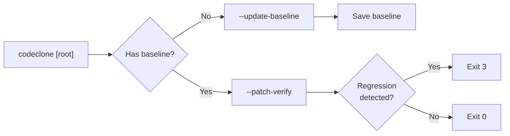

## Overview

CodeClone is a deterministic structural change controller for AI-assisted Python development. The default invocation runs full analysis on a repository:

```bash
codeclone [options] [root]
```

The root directory defaults to the current directory. Analysis produces findings on structural clones, code metrics, dependencies, and code health. Reporting formats include JSON, HTML, Markdown, SARIF, and plain text.

Specialized subcommands manage setup, engineering memory, analytics, baseline publication state, and recorded runtime traces. Exit code 0 indicates success; 2 signals contract violations; 3 indicates gating failures; 5 is an internal error.

## Global options

### Target and analysis scope

| Option | Description |
|--------|-------------|
| `root` | Project root directory. Defaults to `.` |
| `--min-loc MIN_LOC` | Minimum Lines of Code for clone analysis. Default: 10 |
| `--min-stmt MIN_STMT` | Minimum top-level statements in the function body for clone analysis; statements nested inside them are not counted. Default: 6 |
| `--processes PROCESSES` | Parallel worker processes. Default: 4 |
| `--changed-only` | Limit findings to files in a git diff |
| `--diff-against REF` | Use `git diff --name-only <REF>` to determine changed files |
| `--paths-from-git-diff REF` | Shorthand for `--changed-only --diff-against REF` |
| `--near-miss` | Report near-miss clone pairs. Advisory; never gates or enters the baseline |
| `--renamed-structure` | Report renamed-structure clone groups (consistent renaming of locals and receiver attributes). Advisory; never gates or enters the baseline |

### Baseline and cache

| Option | Description |
|--------|-------------|
| `--baseline [FILE]` | Baseline path. Default: `codeclone.baseline.json` |
| `--max-baseline-size-mb MB` | Maximum baseline size. Default: 5 |
| `--update-baseline` | Overwrite the baseline with current results |
| `--cache-path [FILE]` | Cache file path. Default: `.codeclone/db/cache.sqlite3` |
| `--cache-dir [FILE]` | Legacy alias for `--cache-path` |
| `--max-cache-size-mb MB` | Maximum cache size. Default: 256 |

Clone findings and metrics live in one baseline container, so one
`--baseline` / `--update-baseline` pair governs both. There is no separate
metrics-baseline flag. See [Baseline container and lane trust](../concepts/baseline-container.md).

Baseline update and baseline-relative gating both require a stable
`baseline_scope_id` in `pyproject.toml`; without it CodeClone exits 2.

### Verification and gates

| Option | Description |
|--------|-------------|
| `--blast-radius FILE [FILE ...]` | Show structural impact for given files |
| `--patch-verify` | Verify current patch against baseline budget |
| `--strictness LEVEL` | Strictness profile: `ci`, `strict`, or `relaxed`. Default: `ci` |
| `--ci` | Enable CI preset (`--fail-on-new --no-color --quiet`) |
| `--api-surface` | Collect API surface facts (contract-visible exports) for compatibility review |
| `--semantic-authority` | Collect report-only semantic authority candidates and provenance facts |
| `--coverage FILE` | Join external Cobertura XML line coverage |

CodeClone treats names listed in `__all__` as contract-visible exports for
API-break accounting. An explicit `__all__` remains authoritative even in an
underscore-prefixed module — existing policy, not a claim that Python prevents
external imports.

### Quality gates (fail on violation)

| Option | Description |
|--------|-------------|
| `--fail-on-new` | Exit 3 if new clones found vs. baseline |
| `--fail-on-new-metrics` | Exit 3 if metrics violations appear vs. baseline |
| `--fail-threshold MAX_CLONES` | Exit 3 if total clone groups exceed value |
| `--fail-complexity [CC_MAX]` | Exit 3 if cyclomatic complexity exceeds threshold. Default if enabled: 20 |
| `--fail-coupling [CBO_MAX]` | Exit 3 if class coupling exceeds threshold. Default if enabled: 10 |
| `--fail-cohesion [LCOM4_MAX]` | Exit 3 if class cohesion exceeds threshold. Default if enabled: 4 |
| `--fail-cycles` | Exit 3 if an **import-time** dependency cycle is detected. Deferred cycles are reported but never fail the build — see [Dependency cycle kinds](#dependency-cycle-kinds) |
| `--fail-dead-code` | Exit 3 if dead code detected |
| `--fail-on-unresolved-dead-code` | Exit 3 on unresolved external overrides. These are abstentions, never counted as dead code |
| `--fail-health [SCORE_MIN]` | Exit 3 if health score below threshold. Default if enabled: 60 |
| `--fail-on-typing-regression` | Exit 3 if typing coverage regresses |
| `--fail-on-docstring-regression` | Exit 3 if docstring coverage regresses |
| `--fail-on-api-break` | Exit 3 if contract-visible API removals detected |
| `--fail-on-authority-violation` | Exit 3 on an authority violation in a governed semantic contract. Requires a reviewed `[[tool.codeclone.authority]]` entry |
| `--fail-on-untested-hotspots` | Exit 3 if risk-level functions have insufficient coverage. Requires `--coverage` |
| `--min-typing-coverage PERCENT` | Exit 3 if parameter typing coverage below threshold |
| `--min-docstring-coverage PERCENT` | Exit 3 if public docstring coverage below threshold |
| `--coverage-min PERCENT` | Coverage threshold for untested hotspots. Default: 50 |

#### Dependency cycle kinds

CodeClone classifies every dependency cycle by the binding time of the edges
that close it:

| Kind | Meaning | Fails `--fail-cycles` |
|------|---------|-----------------------|
| `import_cycle` | The cycle survives when the graph is restricted to import-time edges, so it can raise `ImportError` at interpreter start | Yes |
| `deferred_cycle` | The cycle is closed only by deferred, lazy, or `TYPE_CHECKING` edges, so it cannot fail an import | No |

Both kinds are always **reported** — a deferred cycle is a real design fact and
still appears in the summary, the report, and the findings. Only the import
kind fails the build, because only it can break at runtime. `TYPE_CHECKING`
edges never form a runtime cycle at all and are excluded before classification.

The same rule governs regression gating: under `--fail-on-new-metrics`, a new
`import_cycle` fails and a new `deferred_cycle` does not. A cycle whose kind
*changes* between runs is reported as a kind change rather than as unchanged —
a `deferred_cycle` that hardens into an `import_cycle` fails the gate, and the
reverse repair never does.

There is deliberately no flag to gate on every cycle. If you want a deferred
cycle to block a build, treat it through the report or a review policy rather
than through the import-time gate.

### Analysis stages

| Option | Description |
|--------|-------------|
| `--skip-metrics` | Run clone-only mode, skip full metrics |
| `--skip-dead-code` | Skip dead code detection |
| `--dead-code-world {open,closed}` | World contract for dead-code verdicts. Under `open`, a symbol that consumers outside the repository could reach is never asserted dead on internal evidence alone and is reported in the `unresolved` lane instead; `closed` treats every consumer as inside the repository. An `__all__` entry is exposure evidence for this decision, never internal use: a symbol held only by its module's `__all__` and its tests is `unresolved` under `open` and dead under `closed`, with its test-only consumers named. Default: `open` |
| `--skip-dependencies` | Skip dependency graph analysis |

### Workspace and audit

| Option | Description |
|--------|-------------|
| `--session-stats` | Show workspace session status (read-only) |
| `--audit` | Show local Controller audit trail (read-only) |
| `--audit-json` | Output audit payload footprint as JSON. Implies `--audit` |

## Commands

Five subcommand trees sit in front of the analysis parser: `setup`,
`analytics`, `baseline`, `memory`, and `observability`. They are dispatched
before the analysis options are parsed, so each tree owns its own parser and
prints its own help. `codeclone --help` lists the five trees but not their
verbs; to see the verbs of one tree, ask that tree:

```bash
codeclone <command> --help
codeclone <command> <verb> --help
```

Every verb that acts on a repository takes `--root`, defaulting to the current
directory.

### `setup [action]`

Initialize or inspect repository readiness.

**Actions:**
- `status` (default): Show readiness status
- `doctor`: Diagnostic check
- `plan`: Preview setup steps
- `apply`: Execute setup plan
- `wizard`: Interactive setup guide

**Options:**
- `--json`: Emit JSON output
- `--dry-run`: Preview changes without modifying files (apply only)
- `-y, --yes`: Skip confirmation prompt (apply only)
- `--plan-id PLAN_ID`: For apply, verify plan matches this ID
- `--root ROOT`: Repository root path

### `memory [subcommand]`

Manage engineering memory (durable knowledge base).

**Subcommands:**
- `init`: Initialize engineering memory
- `status`: Show engineering memory status
- `for-path PATH`: List memory records linked to a source path
- `search QUERY`: Search engineering memory records by keyword
- `stale`: List stale engineering memory records
- `vacuum`: Purge expired stale, draft, rejected, and archived records
- `coverage PATHS...`: Show memory coverage for repo-relative paths
- `review-candidates`: List draft memory candidates awaiting review
- `approve`: Approve a draft memory record
- `reject`: Reject a draft memory record
- `archive`: Archive an active memory record
- `semantic`: Semantic retrieval index — see below
- `trajectory`: Trajectory projections and analytics — see below
- `jobs`: Projection rebuild jobs — see below

The last three are command groups rather than verbs: each takes a verb of its
own; invoked bare, a group exits 2 and prints its verb list in the usage line.

#### `memory semantic`

The semantic retrieval index over memory records. `status` reports whether the
index has been built and which embedding provider is configured; retrieval
falls back to keyword search when it has not.

**Verbs:**
- `status`: Show semantic index status
- `rebuild`: Rebuild the semantic index. **Writes the index**
- `search QUERY`: Semantic free-text search over memory. `--limit` (default 10), `--json`
- `probe`: Measure semantic projection length distribution per lane. `--json`, `--exact-tokens`

`probe` is a read-only measurement and does not embed anything. It reports, per
lane, the document count and the character and token percentiles of the text
that would be embedded, together with how many documents exceed the model's
token limit — the number to look at before a `rebuild`. By default lengths are
estimated with the `chars_approx` estimator; `--exact-tokens` counts them with
the embedding model's own tokenizer, which loads FastEmbed when configured.

```bash
codeclone memory semantic status
codeclone memory semantic probe
codeclone memory semantic probe --json
codeclone memory semantic search "cache invalidation" --limit 5
```

`search` needs a built index: until `rebuild` has run it reports the reason it
is unavailable and exits 2.

#### `memory trajectory`

Trajectory projections derived from the audit event core: one trajectory per
change-control workflow, with its steps, outcome, and any detected anomalies.

**Verbs:**
- `status`: Show trajectory projection status
- `rebuild`: Rebuild trajectory projections from the audit event core. **Writes the projections**
- `list`: List stored trajectories. `--limit` (default 20)
- `search QUERY`: Search stored trajectories by keyword. `--limit` (default 10), `--match {any,all}`
- `show TRAJECTORY_ID`: Show one stored trajectory; short id prefixes are accepted
- `agents`: Aggregate trajectories by agent label. `--include-routine`, `--json`
- `anomalies`: List trajectories with detected anomalies. `--limit` (default 25), `--include-routine`, `--json`
- `dashboard`: Combined status, agents, and anomalies summary. `--limit` (default 25), `--include-routine`, `--json`
- `export`: Export trajectories to local JSONL. `--profile` and `--out` are required; `--allow-external-out`, `--force`, `--json`

Export is disabled by default: without `trajectory_export_enabled` in the
memory configuration the command refuses unless `--force` is passed. `--out`
must stay inside the repository root unless `--allow-external-out` is given.

```bash
codeclone memory trajectory status
codeclone memory trajectory list --limit 5
codeclone memory trajectory agents --json
codeclone memory trajectory show 4f2a91c8
```

#### `memory jobs`

Background jobs that rebuild the memory projections. Enqueueing normally spawns
a worker process; `run-once` is the foreground path used in CI and when the
spawned worker is unwanted.

**Verbs:**
- `status`: Show projection rebuild job status
- `enqueue`: Enqueue a projection rebuild bundle job. **Writes a job**. `--force`, `--no-spawn`
- `run-once`: Claim and run one pending job. **Writes projections**. `--not-before`
- `list`: List recent projection jobs. `--limit` (default 20), `--json`

`--force` enqueues even when the policy is off or the stimulus is unchanged,
and `--no-spawn` records the job without starting a background worker.
`--not-before` takes an ISO-8601 UTC deadline and defers the run until then
before loading the embedding model, which coalesces a burst of rebuilds into
one trailing-edge flush.

```bash
codeclone memory jobs status
codeclone memory jobs list --limit 10 --json
```

### `analytics [subcommand]`

Build and query the intent analytics corpus.

**Subcommands:**
- `snapshot`: Build an immutable intent corpus snapshot
- `embed`: Generate analytics embeddings for a snapshot
- `cluster`: Cluster an embedded snapshot
- `build`: Snapshot, embed, and cluster end-to-end
- `clusters`: List clustering runs for a snapshot
- `cluster-show`: Export one clustering run as JSON
- `outliers`: Show noise cluster assignments
- `profiles`: Inspect the analytics profile registry — see below

#### `analytics profiles`

A profile is a named clustering search space: which representations to use,
which parameter grid to sweep, and which suitability bounds a run must satisfy.
Profiles ship with the package; this group inspects the resolved registry and
never modifies it.

**Verbs:**
- `list`: List registered profiles
- `show`: Show one profile manifest. `--profile-id` is required
- `validate`: Validate one manifest, or the resolved registry when no path is given. `--path`

All three are read-only, take `--root`, and print JSON on stdout — there is no
`--json` flag because there is no other format. `list` reports each profile's
id, version, label, source, and manifest digest; `show` prints the full
manifest, including its search space and suitability bounds; `validate` returns
a `valid` verdict alongside the digest of every manifest it checked. An
unknown `--profile-id` exits 2.

```bash
codeclone analytics profiles list
codeclone analytics profiles show --profile-id intent-small-balanced-v1
codeclone analytics profiles validate
```

### `baseline [subcommand]`

Manage the native baseline publication state.

Publishing a baseline takes a lock beside the baseline file so two writers
cannot interleave. If the publishing process dies, that lock can outlive it and
every later publish refuses. This tree clears such a lock without writing a
baseline; nothing here recomputes or republishes analysis results.

**Subcommands:**
- `recover-lock`: Explicitly recover a stale baseline publication lock without writing the baseline

#### `baseline recover-lock`

**Options:**
- `--path PATH` (required): Baseline target whose adjacent lock is recovered
- `--expected-token TOKEN` (required): Exact lock token observed by the operator
- `--force`: Allow recovery of foreign-host or malformed lock evidence

**This command deletes lock state.** The lock lives beside its baseline as
`<baseline>.publish.lock`, and the token it holds is not printed by any other
command — the operator reads it out of that file. Passing it back with
`--expected-token` is what makes recovery deliberate rather than blind.

Recovery is refused, and the refusal cannot be forced, when:

- the token does not match the one in the lock, or
- the lock's owning process is still alive on this host.

`--force` covers only the two cases where the evidence itself is unusable: a
lock written by another host, and a lock that cannot be parsed at all. It does
not override a live owner, so it is not a way to take a lock away from a
running publisher.

On success the command prints a confirmation and exits 0; a refusal prints the
reason and exits 2. Either way no baseline is written.

```bash
# Read the token the lock is holding, then hand it back
cat codeclone.baseline.json.publish.lock

codeclone baseline recover-lock \
  --path codeclone.baseline.json \
  --expected-token <token-from-the-lock-file>
```

### `observability [subcommand]`

Inspect recorded runtime traces (maintainer only).

Platform observability is a development-only diagnostic and is **off by
default**. Runs are recorded only when `CODECLONE_OBSERVABILITY_ENABLED=1` is
set, and the store lives under the analysed repository. This command opens that
store read-only and never writes it; with no store present it prints a notice
explaining how to start collecting and exits 0.

**Subcommands:**
- `trace`: Render the recorded operation trace

#### `observability trace`

**Options:**
- `--root ROOT`: Repository root path
- `--last N`: Show the last N root operations
- `--operation ID`: Focus one operation id and its chain
- `--correlation ID`: Filter by correlation id
- `--json PATH`: Write JSON to this path
- `--html PATH`: Write HTML to this path

With neither `--json` nor `--html`, the trace is printed as JSON on stdout.
Both may be given in one invocation; each writes its file and prints the path
written. The payload carries the operation tree, the per-plane operation lists,
a waterfall, phase aggregates, and the span-retention accounting that says
which operations were truncated.

```bash
# Record a run
CODECLONE_OBSERVABILITY_ENABLED=1 codeclone .

# Read the trace back
codeclone observability trace
codeclone observability trace --last 20
codeclone observability trace --html trace.html
```

For the trace contract and what the store retains, see
[Platform observability](observability.md).

## `codeclone-mcp` (MCP server launcher)

Installing `codeclone[mcp]` adds a second console script, `codeclone-mcp`,
which runs the [MCP server](mcp-tools.md). The default transport is stdio,
which is what IDE and agent integrations spawn; no options are required:

```bash
codeclone-mcp
```

| Option | Description |
|--------|-------------|
| `--transport {stdio,streamable-http}` | MCP transport. Default: `stdio` |
| `--host HOST` | Bind host for `streamable-http`. Default: `127.0.0.1` |
| `--port PORT` | Bind port for `streamable-http`. Default: `8000` |
| `--allow-remote` | Allow binding `streamable-http` to a non-loopback host. HTTP always requires `CODECLONE_MCP_AUTH_TOKEN` |
| `--history-limit N` | In-memory analysis runs retained by the server (1–10). Default: `4` |
| `--json-response` | JSON responses for `streamable-http`. Default: enabled |
| `--stateless-http` | Stateless Streamable HTTP mode. Default: enabled |
| `--debug` | FastMCP debug mode. Default: disabled |
| `--log-level {DEBUG,INFO,WARNING,ERROR,CRITICAL}` | Server log level. Default: `INFO` |
| `--ide-governance-channel` | Enable the IDE governance channel for human approve/reject/archive via `manage_engineering_memory`. Agent launchers must not pass this flag |

The `streamable-http` transport requires the `CODECLONE_MCP_AUTH_TOKEN`
environment variable to hold a bearer token of at least 32 characters; the
server refuses HTTP without it.

## Machine-readable output

Reports are written to `.codeclone/report.<ext>` by default unless FILE is specified.

| Flag | Format | Default path |
|------|--------|--------------|
| `--json [FILE]` | Canonical JSON report | `.codeclone/report.json` |
| `--html [FILE]` | Interactive HTML | `.codeclone/report.html` |
| `--md [FILE]` | Markdown | `.codeclone/report.md` |
| `--sarif [FILE]` | SARIF 2.1.0 | `.codeclone/report.sarif` |
| `--text [FILE]` | Plain text | `.codeclone/report.txt` |

**Report options:**
- `--timestamped-report-paths`: Append UTC timestamp to default report filenames
- `--open-html-report`: Open HTML report in default browser (requires `--html`)

**Output formatting:**
- `--no-progress` / `--progress`: Disable or force-enable progress output (disable for CI)
- `--no-color` / `--color`: Disable or force-enable ANSI colors
- `--quiet`: Reduce output to warnings and errors
- `--verbose`: Include detailed identifiers for new findings
- `--debug`: Print debug details and traceback on error

**General:**
- `-h, --help`: Show help and exit
- `--interactive-help`: Open the guided product tour; use with `--help`
- `--version`: Print the CodeClone version and exit

## Exit codes

| Code | Meaning |
|------|---------|
| 0 | Success |
| 2 | Contract error: invalid baseline, incompatible versions, or unreadable sources in CI/gating mode |
| 3 | Gating failure: new clones, threshold violations, or metrics regression |
| 5 | Internal error: unexpected exception |

## Examples

```bash
# Basic analysis on current directory
codeclone

# Analysis with baseline update
codeclone --update-baseline

# CI mode with fail-on-new check
codeclone --ci --fail-on-new

# Changed files only, with HTML report
codeclone --paths-from-git-diff origin/main --html

# Patch verification against baseline
codeclone --patch-verify --strictness strict

# Show structural impact of specific files
codeclone --blast-radius src/core/engine.py src/core/parser.py

# Quality gates: fail on complexity or new clones
codeclone --fail-complexity 20 --fail-on-new

# With external coverage analysis
codeclone --coverage coverage.xml --fail-on-untested-hotspots

# Memory workflow
codeclone memory status
codeclone memory for-path src/core/
codeclone memory search "clustering algorithm"

# Setup readiness check
codeclone setup status
codeclone setup plan
codeclone setup apply --yes

# Analytics profile registry (read-only)
codeclone analytics profiles list
codeclone analytics profiles validate

# Recorded runtime trace (maintainer only)
CODECLONE_OBSERVABILITY_ENABLED=1 codeclone .
codeclone observability trace --last 20
```

## Workflow

The typical workflow combines analysis, baseline updates, and quality gates:


```mermaid
graph LR
  A["codeclone [root]"] --> B{Has baseline?}
  B -->|No| C["--update-baseline"]
  B -->|Yes| D["--patch-verify"]
  C --> E["Save baseline"]
  D --> F{Regression<br/>detected?}
  F -->|Yes| G["Exit 3"]
  F -->|No| H["Exit 0"]
```

For CI/CD pipelines, use the `--ci` preset with appropriate gates:

```bash
codeclone --ci --fail-on-new --fail-complexity 20
```

For pull request analysis, focus on changed files and verify against the merge-base baseline:

```bash
codeclone --paths-from-git-diff origin/main --patch-verify
```

Engineering memory enables persistent, evidence-linked annotations across changesets:

```bash
codeclone memory search "refactor_domain_boundary"
codeclone memory for-path src/domain/
```
