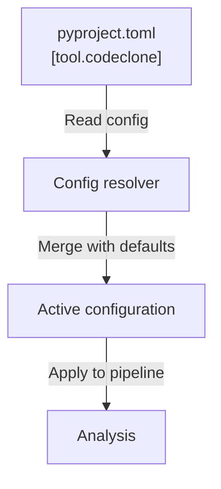

# Configuration reference

CodeClone configuration is declarative and lives in your project's `pyproject.toml` under the `[tool.codeclone]` table. Configuration controls analysis thresholds, output paths, audit retention, and governance features.

## Configuration files

Configuration is stored in `pyproject.toml`:

```toml
[tool.codeclone]
baseline = "codeclone.baseline.json"
audit_enabled = true   # opt in; disabled by default
fail_health = 60       # gate on health; disabled by default
```

All configuration keys are optional. Unset keys use their defaults. Most gates
and the audit trail are **disabled by default** — CodeClone reports without
failing your build until you opt in.

## Keys

| Key | Type | Default | Purpose |
|-----|------|---------|---------|
| `baseline` | str | `codeclone.baseline.json` | Path to baseline snapshot file |
| `audit_enabled` | bool | `false` | Enable audit trail collection |
| `audit_path` | str | `.codeclone/db/audit.sqlite3` | SQLite database for audit events |
| `audit_payloads` | str | `compact` | Payload detail level: `off`, `compact`, or `full` |
| `audit_retention_days` | int | `30` | Retain audit records (days) |
| `fail_cycles` | bool | `false` | Exit nonzero on dependency cycles |
| `fail_dead_code` | bool | `false` | Exit nonzero on dead code |
| `fail_health` | int | `-1` (disabled) | Exit nonzero if health < threshold (0–100); bare `--fail-health` applies `60` |
| `fail_on_new` | bool | `false` | Exit nonzero on new findings |
| `fail_on_new_metrics` | bool | `false` | Exit nonzero on regression in metrics |
| `min_loc` | int | `10` | Minimum lines of code per block |
| `min_stmt` | int | `6` | Minimum statements per block |
| `min_typing_coverage` | int | `-1` (disabled) | Minimum type annotation coverage (%) |
| `intent_registry_backend` | str | `file` | Intent storage backend (`file` or `sqlite`) |
| `intent_registry_path` | str | `.codeclone/db/intents.sqlite3` | Intent registry database path |
| `intent_registry_retention_days` | int | `14` | Retain intent records (days) |
| `api_surface` | bool | `false` | Compute API surface metrics |
| `golden_fixture_paths` | list | `[]` | Paths to golden test fixtures |

### Memory and semantic configuration

| Key | Type | Default | Purpose |
|-----|------|---------|---------|
| `memory.ingest.contract_constants_paths` | list | `[]` | Contract constant sources |
| `memory.ingest.document_link_paths` | list | `[]` | Documentation sources |
| `memory.semantic.enabled` | bool | `false` | Enable semantic search |
| `memory.semantic.backend` | str | `lancedb` | Vector database backend |
| `memory.semantic.embedding_model` | str | `BAAI/bge-small-en-v1.5` | fastembed embedding model identifier |
| `memory.semantic.embedding_provider` | str | `diagnostic` | Embedding provider (`diagnostic`, `fastembed`, `local_model`, `api`) |
| `memory.semantic.embedding_cache_dir` | str | `.codeclone/memory/fastembed` | Cached embeddings directory |
| `memory.semantic.index_path` | str | `.codeclone/memory/semantic_index.lance` | Semantic index path |
| `memory.semantic.dimension` | int | `256` | Embedding vector dimension (fastembed provider uses `384`) |
| `memory.semantic.max_results` | int | `20` | Maximum search results |
| `memory.semantic.index_audit` | bool | `true` | Audit index operations |
| `memory.projection_rebuild_policy` | str | `off` | Rebuild strategy when stale (`off`, `enqueue_when_stale`) |
| `memory.projection_rebuild_timeout_seconds` | int | `1800` | Worker timeout (seconds) |

## Defaults

CodeClone applies defaults at resolution time. Unset keys use their compiled defaults. Quality gates are opt-in: an unset `fail_health` leaves the health gate **disabled** (`-1`), and passing a bare `--fail-health` (no value) applies the built-in threshold of `60`.



## Validation

Configuration is validated when CodeClone initializes:

- **Type mismatch**: key value does not match declared type → error
- **Path validation**: `baseline`, `audit_path`, `intent_registry_path` must be writable or creatable
- **Range validation**: `fail_health` must be 0–100; retention days must be positive
- **Retention policy**: audit and intent records respect `*_retention_days` settings; records older than the configured age are automatically purged on cleanup
- **Setup safety**: `codeclone setup apply` refuses filesystem writes without explicit `--yes` confirmation or `--dry-run` preview; `--plan-id` binding prevents stale plans from applying

## Examples

### Minimal configuration

```toml
[tool.codeclone]
# Use all defaults
```

### Strict health gates

```toml
[tool.codeclone]
fail_health = 85
fail_on_new = true
fail_cycles = true
fail_dead_code = true
```

### Extended audit trail

```toml
[tool.codeclone]
audit_enabled = true
audit_payloads = "full"
audit_retention_days = 90
intent_registry_retention_days = 60
```

### Custom analysis thresholds

```toml
[tool.codeclone]
min_loc = 8
min_stmt = 5
min_typing_coverage = 95
```

### Semantic memory with custom index

```toml
[tool.codeclone.memory.semantic]
enabled = true
backend = "lancedb"
embedding_model = "BAAI/bge-small-en-v1.5"
index_path = ".codeclone/memory/index.lance"
max_results = 15
```
