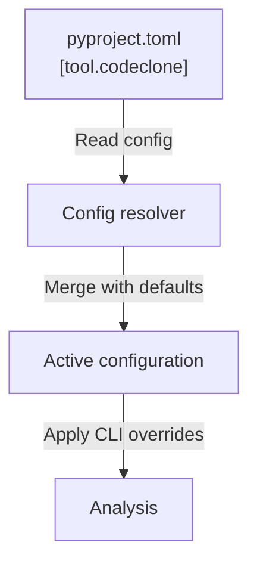

# Configuration reference

CodeClone configuration is declarative and lives in your project's `pyproject.toml` under the `[tool.codeclone]` table. Configuration controls analysis thresholds, output paths, audit retention, and governance features.

## Configuration files

Configuration is stored in `pyproject.toml`:

```toml
[tool.codeclone]
baseline = "codeclone.baseline.json"
baseline_scope_id = "0189f1a2-3b4c-7d8e-9f01-234567890abc"  # required to update or gate on a baseline
audit_enabled = true   # opt in; disabled by default
fail_health = 60       # gate on health; disabled by default
```

All configuration keys are optional. Unset keys use their defaults. Most gates
and the audit trail are **disabled by default** — CodeClone reports without
failing your build until you opt in.

Exactly sixty keys are accepted in the root `[tool.codeclone]` table; the
tables below list all of them. An unknown key is a contract error, not a
warning. The nested `[tool.codeclone.memory]`, `[tool.codeclone.analytics]`,
and `[[tool.codeclone.authority]]` tables are separate namespaces documented
further down.

## Precedence

Every run resolves each option in this order (highest wins):

1. **Explicit CLI flag** — a flag actually present on the command line,
   including the `--no-*` form of a boolean flag.
2. **`[tool.codeclone]` value** from `pyproject.toml`.
3. **Built-in default.**

A pyproject value therefore overrides the flag's built-in default but never an
explicitly typed flag. Arguments after a literal `--` separator are not
scanned for flags.

**CLI flag mapping.** Where a key has a CLI flag, the flag name is the key
with underscores replaced by hyphens, with these exceptions:
`coverage_xml` is the `[tool.codeclone]` key for the `--coverage FILE` flag,
`cache_path` maps to `--cache-path` (legacy alias `--cache-dir`), and the report keys
`html_out`, `json_out`, `md_out`, `sarif_out`, `text_out` map to `--html`,
`--json`, `--md`, `--sarif`, `--text`. Keys marked `—` have no CLI flag and
can only be set in `pyproject.toml`.

**Path values.** The keys `baseline`, `cache_path`, `coverage_xml`,
`html_out`, `json_out`, `md_out`, `sarif_out`, and `text_out` are path-valued:
`~` is expanded, and a relative path is resolved against the repository root,
not the current working directory.

## Keys

### Analysis scope and clone thresholds

| Key | Type | Default | CLI flag | Purpose |
|-----|------|---------|----------|---------|
| `min_loc` | int | `10` | `--min-loc` | Minimum lines of code for a clone-eligible unit |
| `min_stmt` | int | `6` | `--min-stmt` | Minimum AST statements for a clone-eligible unit |
| `block_min_loc` | int | `20` | — | Minimum LOC floor for block-level clone artifacts inside a clone-eligible unit |
| `block_min_stmt` | int | `8` | — | Minimum statement floor for block-level clone artifacts |
| `segment_min_loc` | int | `20` | — | Minimum LOC floor for statement-segment clone artifacts |
| `segment_min_stmt` | int | `10` | — | Minimum statement floor for statement-segment clone artifacts |
| `processes` | int | `4` | `--processes` | Parallel worker processes |
| `near_miss` | bool | `false` | `--near-miss` | Produce the advisory near-miss clone channel |
| `renamed_structure` | bool | `false` | `--renamed-structure` | Produce the advisory renamed-structure clone channel |
| `golden_fixture_paths` | list[str] | `[]` | — | Repo-relative `tests/` or `tests/fixtures/` paths whose clone groups are suppressed with a visible count |
| `source_roots` | list[str] | auto-detected | — | Explicit repo-relative import roots for module identity; unset auto-detects an unambiguous `src` layout, otherwise the repository root |
| `baseline_scope_id` | str | unset | — | Stable canonical UUID naming the baseline scope. Required for baseline update and baseline-relative gating |
| `project_label` | str | unset | — | Operator-facing project name recorded in the published baseline metadata — see below |

### Audit trail and intent registry

| Key | Type | Default | CLI flag | Purpose |
|-----|------|---------|----------|---------|
| `audit_enabled` | bool | `false` | — | Enable audit trail collection (`--audit` only *views* the trail) |
| `audit_path` | str | `.codeclone/db/audit.sqlite3` | — | SQLite database for audit events |
| `audit_payloads` | str | `compact` | — | Payload detail level: `off`, `compact`, or `full` |
| `audit_retention_days` | int | `30` | — | Retain audit records (days) |
| `audit_token_estimator` | str | `chars_approx` | — | Token estimator for audit payload footprints: `chars_approx` or `tiktoken` |
| `intent_registry_backend` | str | `file` | — | Workspace intent storage backend (`file` or `sqlite`) |
| `intent_registry_path` | str | `.codeclone/db/intents.sqlite3` | — | Intent registry database path (`sqlite` backend only) |
| `intent_registry_retention_days` | int | `14` | — | Retain intent records (days) |

### Cache

| Key | Type | Default | CLI flag | Purpose |
|-----|------|---------|----------|---------|
| `cache_path` | str | unset (`<root>/.codeclone/cache.json`) | `--cache-path` | Analysis cache file path |
| `max_cache_size_mb` | int | `256` | `--max-cache-size-mb` | Maximum cache size (MB) |

The cap is a memory and decompression-bomb guard on cache load. A repository whose
saved cache exceeds `max_cache_size_mb` is ignored on load with a warning, and every
run falls back to cold analysis until the cap is raised or the cache shrinks.

### Baselines and CI

| Key | Type | Default | CLI flag | Purpose |
|-----|------|---------|----------|---------|
| `baseline` | str | `codeclone.baseline.json` | `--baseline` | Path to the baseline snapshot file |
| `max_baseline_size_mb` | int | `5` | `--max-baseline-size-mb` | Maximum baseline size (MB) |
| `update_baseline` | bool | `false` | `--update-baseline` | Overwrite the baseline with current results |
| `semantic_authority` | bool | `false` | `--semantic-authority` | Collect report-only semantic authority candidates and provenance facts |
| `ci` | bool | `false` | `--ci` | CI preset: implies `fail_on_new`, `no_color`, and `quiet` |
| `api_surface` | bool | `false` | `--api-surface` | Compute public API surface facts |
| `coverage_xml` | str | unset | `--coverage` | External Cobertura XML coverage file to join |

### Quality gates

Gates use `-1` as the disabled sentinel. Passing the bare CLI flag without a
value applies the built-in threshold shown in parentheses.

| Key | Type | Default | CLI flag | Purpose |
|-----|------|---------|----------|---------|
| `fail_on_new` | bool | `false` | `--fail-on-new` | Exit nonzero on new clone findings vs. baseline |
| `fail_on_new_metrics` | bool | `false` | `--fail-on-new-metrics` | Exit nonzero on metrics regressions vs. baseline |
| `fail_threshold` | int | `-1` (disabled) | `--fail-threshold` | Exit nonzero if total clone groups exceed the value |
| `fail_complexity` | int | `-1` (disabled) | `--fail-complexity` | Exit nonzero if cyclomatic complexity exceeds the threshold (bare flag: `20`) |
| `fail_coupling` | int | `-1` (disabled) | `--fail-coupling` | Exit nonzero if class coupling exceeds the threshold (bare flag: `10`) |
| `fail_cohesion` | int | `-1` (disabled) | `--fail-cohesion` | Exit nonzero if class cohesion (LCOM4) exceeds the threshold (bare flag: `4`) |
| `fail_cycles` | bool | `false` | `--fail-cycles` | Exit nonzero on **import-time** dependency cycles. Deferred cycles are reported but never gate |
| `fail_dead_code` | bool | `false` | `--fail-dead-code` | Exit nonzero on dead code |
| `fail_on_unresolved_dead_code` | bool | `false` | `--fail-on-unresolved-dead-code` | Exit nonzero on unresolved external overrides |
| `fail_health` | int | `-1` (disabled) | `--fail-health` | Exit nonzero if health score is below the threshold, 0–100 (bare flag: `60`) |
| `fail_on_typing_regression` | bool | `false` | `--fail-on-typing-regression` | Exit nonzero if typing coverage regresses |
| `fail_on_docstring_regression` | bool | `false` | `--fail-on-docstring-regression` | Exit nonzero if docstring coverage regresses |
| `fail_on_api_break` | bool | `false` | `--fail-on-api-break` | Exit nonzero on public API removals |
| `fail_on_authority_violation` | bool | `false` | `--fail-on-authority-violation` | Exit nonzero on an authority violation in a governed contract |
| `fail_on_untested_hotspots` | bool | `false` | `--fail-on-untested-hotspots` | Exit nonzero if risk-level functions have insufficient coverage (needs `coverage_xml`) |
| `min_typing_coverage` | int | `-1` (disabled) | `--min-typing-coverage` | Minimum parameter typing coverage (%) |
| `min_docstring_coverage` | int | `-1` (disabled) | `--min-docstring-coverage` | Minimum public docstring coverage (%) |
| `coverage_min` | int | `50` | `--coverage-min` | Coverage threshold (%) for untested-hotspot gating |

### Analysis stages

| Key | Type | Default | CLI flag | Purpose |
|-----|------|---------|----------|---------|
| `skip_metrics` | bool | `false` | `--skip-metrics` | Clone-only mode, skip full metrics |
| `skip_dead_code` | bool | `false` | `--skip-dead-code` | Skip dead code detection |
| `skip_dependencies` | bool | `false` | `--skip-dependencies` | Skip dependency graph analysis |

### Reporting

Unset report keys write nothing; the bare CLI flag writes to the default path
shown in parentheses.

| Key | Type | Default | CLI flag | Purpose |
|-----|------|---------|----------|---------|
| `html_out` | str | unset | `--html` | HTML report path (bare flag: `.codeclone/report.html`) |
| `json_out` | str | unset | `--json` | JSON report path (bare flag: `.codeclone/report.json`) |
| `md_out` | str | unset | `--md` | Markdown report path (bare flag: `.codeclone/report.md`) |
| `sarif_out` | str | unset | `--sarif` | SARIF report path (bare flag: `.codeclone/report.sarif`) |
| `text_out` | str | unset | `--text` | Plain-text report path (bare flag: `.codeclone/report.txt`) |

### Output and UI

| Key | Type | Default | CLI flag | Purpose |
|-----|------|---------|----------|---------|
| `no_progress` | bool | `false` | `--no-progress` | Disable progress output (`--progress` forces it back on) |
| `no_color` | bool | `false` | `--no-color` | Disable ANSI colors (`--color` forces them back on) |
| `quiet` | bool | `false` | `--quiet` | Reduce output to warnings and errors |
| `verbose` | bool | `false` | `--verbose` | Include detailed identifiers for new findings |
| `debug` | bool | `false` | `--debug` | Print debug details and traceback on error |

### CLI-only options

The remaining CLI surface has no pyproject key and is set per invocation only:
the positional `root`, `--changed-only`, `--diff-against`,
`--paths-from-git-diff`, `--blast-radius`, `--patch-verify`, `--strictness`,
`--session-stats`, `--audit`, `--audit-json`, `--timestamped-report-paths`,
`--open-html-report`, and `--interactive-help`. See the
[CLI reference](cli.md) for their semantics.

!!! note "`project_label` is descriptive metadata"

    The publisher records the configured value in the container's
    `meta.project_label`:

    ```json
    "meta": {
      "container_version": "3.0",
      "created_at": "2026-08-03T12:06:42Z",
      "generator": {
        "name": "codeclone",
        "version": "2.1.0a2"
      },
      "project_label": "Acme Payments",
      "python_tag": "cp314",
      "root_digest": {
        "algorithm": "sha256",
        "domain": "codeclone.baseline.root.v1",
        "value": "bb382f33933c820059338ac2ec1c627f95bc7893f0fe6a5c4f0a9577f44580d2"
      }
    }
    ```

    The label stays out of the root digest, exactly like `created_at`, so
    setting or changing it never invalidates an existing baseline and never
    affects gating. `baseline_scope_id`, not the label, is what binds a
    baseline to its project. Renaming still republishes the container, because
    the label is compared separately from the digest.

### Semantic authority registry

`[[tool.codeclone.authority]]` is an array of tables, each declaring one
governed contract. See [Semantic authority governance](../concepts/semantic-authority.md).

### Engineering Memory (nested tables)

`[tool.codeclone.memory]` configures Engineering Memory. All keys are
optional; unknown keys are a contract error. Explicitly configured path
values resolve against the analyzed repository root and must stay under it.

Default store paths (`memory.db_path`, `memory.semantic.index_path`,
`memory.semantic.embedding_cache_dir`) anchor at the repository's **main
checkout**: in a linked `git worktree`, the git common directory is resolved
lexically (gitfile → `commondir`) and every worktree of one repository shares
the main checkout's `.codeclone/memory/` store, so drafts recorded from a
worktree survive its removal. Non-git roots, submodule checkouts, and
unresolvable git states keep per-root resolution; an explicitly configured
`memory.db_path` (or `CODECLONE_MEMORY_DB_PATH`) always resolves against the
analyzed root itself. MCP memory responses report the branch taken in
`store_provenance.store_resolution`.

| Key | Type | Default | Purpose |
|-----|------|---------|---------|
| `memory.backend` | str | `sqlite` | Memory store backend (`sqlite` or `postgres`) |
| `memory.db_path` | str | `.codeclone/memory/engineering_memory.sqlite3` | Memory database path; the default is shared across git worktrees (anchored at the main checkout), an explicit value stays per-checkout |
| `memory.mcp_sync_policy` | str | `bootstrap_if_missing` | MCP store sync: `off`, `bootstrap_if_missing`, or `refresh_when_stale` |
| `memory.active_retention_days` | int | `-1` (keep forever) | Retain active records (days) |
| `memory.stale_retention_days` | int | `180` | Retain stale records (days) |
| `memory.draft_retention_days` | int | `14` | Retain draft candidates (days) |
| `memory.rejected_retention_days` | int | `30` | Retain rejected records (days) |
| `memory.archived_retention_days` | int | `365` | Retain archived records (days) |
| `memory.receipt_retention_days` | int | `90` | Retain review receipts (days) |
| `memory.max_records` | int | `10000` | Maximum stored records |
| `memory.max_candidates` | int | `1000` | Maximum draft candidates |
| `memory.max_evidence_per_record` | int | `20` | Maximum evidence links per record |
| `memory.max_statement_chars` | int | `1000` | Hard limit on statement length |
| `memory.max_blast_radius_cache_entries` | int | `500` | Blast-radius cache entries |
| `memory.git_hotspot_period_days` | int | `90` | Git hotspot lookback window (days) |
| `memory.git_hotspot_min_changes` | int | `5` | Minimum changes for hotspot status |
| `memory.trajectories_enabled` | bool | `true` | Record workflow trajectories |
| `memory.trajectory_retention_days` | int | `365` | Retain trajectories (days) |
| `memory.trajectory_export_enabled` | bool | `false` | Enable trajectory export |
| `memory.trajectory_export_include_payloads` | bool | `false` | Include payloads in exports |
| `memory.trajectory_export_max_record_bytes` | int | `65536` | Export record size cap (bytes) |
| `memory.trajectory_export_max_file_bytes` | int | `10485760` | Export file size cap (bytes) |
| `memory.projection_rebuild_policy` | str | `off` | Rebuild strategy when projections are stale (`off`, `enqueue_when_stale`) |
| `memory.projection_rebuild_running_timeout_seconds` | int | `1800` | Rebuild worker timeout (seconds) |
| `memory.projection_rebuild_spawn_worker` | bool | `true` | Spawn a background rebuild worker |
| `memory.projection_rebuild_coalesce_window_seconds` | int | `60` | Coalesce sub-threshold rebuilds into one window (`0` disables) |
| `memory.projection_rebuild_coalesce_min_delta` | int | `25` | Active-record delta that bypasses the coalesce window |

`[tool.codeclone.memory.semantic]` configures the optional semantic retrieval
index:

| Key | Type | Default | Purpose |
|-----|------|---------|---------|
| `memory.semantic.enabled` | bool | `false` | Enable semantic search |
| `memory.semantic.backend` | str | `lancedb` | Vector index backend |
| `memory.semantic.index_path` | str | `.codeclone/memory/semantic_index.lance` | Semantic index path |
| `memory.semantic.embedding_provider` | str | `diagnostic` | Embedding provider: `diagnostic`, `fastembed`, `local_model`, or `api` |
| `memory.semantic.embedding_model` | str | unset | Embedding model id; with the `fastembed` provider defaults to `BAAI/bge-small-en-v1.5` |
| `memory.semantic.embedding_cache_dir` | str | `.codeclone/memory/fastembed` | Embedding model cache directory |
| `memory.semantic.allow_model_download` | bool | `false` | Allow downloading embedding model weights |
| `memory.semantic.dimension` | int | `256` | Embedding vector dimension; with the `fastembed` provider defaults to `384` |
| `memory.semantic.max_results` | int | `20` | Maximum search results |
| `memory.semantic.index_audit` | bool | `true` | Audit index operations |
| `memory.semantic.embed_max_documents_per_batch` | int | `64` | Embedding batch size (documents) |
| `memory.semantic.embed_max_padded_tokens_per_batch` | int | `8192` | Embedding batch size (padded tokens) |
| `memory.semantic.projection_token_estimator` | str | `chars_approx` | Token estimator: `chars_approx` or `tiktoken` |

`[tool.codeclone.memory.ingest]` declares extra document sources for memory
ingestion:

| Key | Type | Default | Purpose |
|-----|------|---------|---------|
| `memory.ingest.contract_constants_paths` | list[str] | `[]` | Contract constant source files |
| `memory.ingest.document_link_paths` | list[str] | `[]` | Documentation sources to link |
| `memory.ingest.mcp_tool_schema_snapshot_path` | str | unset | MCP tool schema snapshot file |
| `memory.ingest.mcp_tool_count_doc_paths` | list[str] | `[]` | Docs whose MCP tool counts are checked |

### Analytics (nested table)

`[tool.codeclone.analytics]` configures the `codeclone analytics` subcommands
(corpus clustering). All keys are optional; unknown keys are rejected. The
embedding model cache and download policy default to the resolved
`memory.semantic` configuration so model weights are shared, not duplicated.

| Key | Type | Default | Purpose |
|-----|------|---------|---------|
| `analytics.db_path` | str | `.codeclone/analytics/corpus_clustering.sqlite3` | Analytics store path |
| `analytics.vectors_path` | str | `.codeclone/analytics/corpus_vectors` | Vector sidecar path |
| `analytics.embedding_model` | str | `BAAI/bge-small-en-v1.5` | Embedding model id |
| `analytics.embedding_dimension` | int | `384` | Embedding vector dimension |
| `analytics.embedding_provider` | str | `fastembed` | Embedding provider (only `fastembed`) |
| `analytics.embedding_cache_dir` | str | from `memory.semantic` | Embedding model cache directory |
| `analytics.allow_model_download` | bool | from `memory.semantic` | Allow downloading model weights |
| `analytics.min_correlation_sample_size` | int | `5` | Minimum sample size for correlations |
| `analytics.cluster_random_seed` | int | `42` | Deterministic clustering seed |
| `analytics.default_pca_dimensions` | int | `64` | PCA dimensions |
| `analytics.default_min_cluster_size` | int | `8` | HDBSCAN minimum cluster size |
| `analytics.default_min_samples` | int | `3` | HDBSCAN minimum samples |
| `analytics.default_cluster_selection_method` | str | `eom` | Cluster selection: `eom` or `leaf` |
| `analytics.default_profile_id` | str | unset | Default analytics profile id |
| `analytics.profile_paths` | list[str] | `[]` | Analytics profile definition files (must exist) |
| `analytics.sweep_pca_dimensions` | list[int] | `[32, 64, 128]` | Parameter sweep: PCA axes |
| `analytics.sweep_min_cluster_sizes` | list[int] | `[5, 8, 12, 15]` | Parameter sweep: cluster sizes |
| `analytics.sweep_min_samples` | list[int] | `[1, 3, 5]` | Parameter sweep: min samples |
| `analytics.sweep_selection_methods` | list[str] | `["eom", "leaf"]` | Parameter sweep: selection methods |

## Environment variables

Environment variables are read at run time. Where a variable mirrors a
pyproject key, the environment value overrides the pyproject value.

| Variable | Purpose |
|----------|---------|
| `CODECLONE_DEBUG` | `1` enables debug diagnostics, same as `--debug` |
| `NO_COLOR` | Any non-empty value disables ANSI colors |
| `CODECLONE_STRICT_FINISH` | Truthy (`1`, `true`, `yes`, `on`) makes MCP finish hygiene block on unattributed out-of-scope changes instead of reporting them as advisory |
| `CODECLONE_MEMORY_DB_PATH` | Overrides `memory.db_path`; resolves against the analyzed root (per-checkout, never worktree-shared) |
| `CODECLONE_PROJECTION_REBUILD_POLICY` | Overrides `memory.projection_rebuild_policy` |
| `CODECLONE_MEMORY_SEMANTIC_ENABLED` | Overrides `memory.semantic.enabled` |
| `CODECLONE_MEMORY_SEMANTIC_EMBEDDING_PROVIDER` | Overrides `memory.semantic.embedding_provider` |
| `CODECLONE_MEMORY_SEMANTIC_EMBEDDING_MODEL` | Overrides `memory.semantic.embedding_model` |
| `CODECLONE_MEMORY_SEMANTIC_EMBEDDING_CACHE_DIR` | Overrides `memory.semantic.embedding_cache_dir` |
| `CODECLONE_MEMORY_SEMANTIC_ALLOW_MODEL_DOWNLOAD` | Overrides `memory.semantic.allow_model_download` |
| `CODECLONE_MEMORY_SEMANTIC_INDEX_PATH` | Overrides `memory.semantic.index_path` |
| `CODECLONE_INTENT_REGISTRY_BACKEND` | Overrides `intent_registry_backend` |
| `CODECLONE_INTENT_REGISTRY_PATH` | Overrides `intent_registry_path` |
| `CODECLONE_INTENT_REGISTRY_RETENTION_DAYS` | Overrides `intent_registry_retention_days` |
| `CODECLONE_INTENT_LEASE_SECONDS` | Workspace intent lease length; clamped to 60–600, default `300` |
| `CODECLONE_INTENT_TTL_SECONDS` | Workspace intent TTL; clamped to 60–86400, default `3600` |
| `CODECLONE_MCP_AUTH_TOKEN` | Bearer token (at least 32 characters) required for the MCP `streamable-http` transport — see [CLI reference](cli.md) |
| `CODECLONE_EXTERNAL_ARTIFACT_ROOTS` | Extra allowed roots (`os.pathsep`-separated) for external artifacts such as coverage XML passed to MCP |
| `CODECLONE_HOOK_AUTHORIZE_FOREIGN` | Hook-gate policy for live foreign intents: unset authorizes them; `0` enforces own-intent-only authorization |
| `CODECLONE_OBSERVABILITY_*` | Maintainer diagnostics — see [Platform observability](observability.md) |

## Defaults

CodeClone applies defaults at resolution time. Unset keys use their compiled defaults. Quality gates are opt-in: an unset `fail_health` leaves the health gate **disabled** (`-1`), and passing a bare `--fail-health` (no value) applies the built-in threshold of `60`.



## Validation

Configuration is validated when CodeClone initializes:

- **Unknown keys**: any key outside the documented set is a contract error
- **Type mismatch**: key value does not match declared type → error
- **Path validation**: `baseline`, `audit_path`, `intent_registry_path` must be writable or creatable; memory and analytics state paths must stay under the repository root (for default memory store paths in a linked worktree, that root is the main checkout)
- **Range validation**: `fail_health` must be 0–100; retention days must be positive
- **Retention policy**: audit and intent records respect `*_retention_days` settings; records older than the configured age are automatically purged on cleanup
- **Setup safety**: `codeclone setup apply` refuses filesystem writes without explicit `--yes` confirmation or `--dry-run` preview; `--plan-id` binding prevents stale plans from applying

## Examples

### Minimal configuration

```toml
[tool.codeclone]
# Use all defaults
```

### Strict health gates

```toml
[tool.codeclone]
fail_health = 85
fail_on_new = true
fail_cycles = true
fail_dead_code = true
```

`fail_cycles` fails the build on import-time cycles only. A cycle closed purely
by deferred, lazy, or `TYPE_CHECKING` imports cannot raise at interpreter
start, so it is reported without gating. See
[Dependency cycle kinds](cli.md#dependency-cycle-kinds).

### Extended audit trail

```toml
[tool.codeclone]
audit_enabled = true
audit_payloads = "full"
audit_retention_days = 90
intent_registry_retention_days = 60
```

### Custom analysis thresholds

```toml
[tool.codeclone]
min_loc = 8
min_stmt = 5
min_typing_coverage = 95
```

### Semantic memory with custom index

```toml
[tool.codeclone.memory.semantic]
enabled = true
backend = "lancedb"
embedding_model = "BAAI/bge-small-en-v1.5"
index_path = ".codeclone/memory/index.lance"
max_results = 15
```
