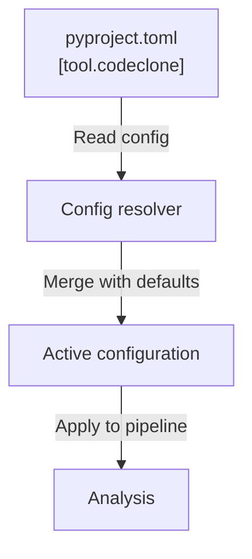

# Configuration reference

CodeClone configuration is declarative and lives in your project's `pyproject.toml` under the `[tool.codeclone]` table. Configuration controls analysis thresholds, output paths, audit retention, and governance features.

## Configuration files

Configuration is stored in `pyproject.toml`:

```toml
[tool.codeclone]
baseline = "codeclone.baseline.json"
audit_enabled = true
fail_health = 80
```

All configuration keys are optional. Unset keys use their defaults.

## Keys

| Key | Type | Default | Purpose |
|-----|------|---------|---------|
| `baseline` | str | `codeclone.baseline.json` | Path to baseline snapshot file |
| `audit_enabled` | bool | `true` | Enable audit trail collection |
| `audit_path` | str | `.codeclone/db/audit.sqlite3` | SQLite database for audit events |
| `audit_payloads` | str | `full` | Payload detail level: `full` or `summary` |
| `audit_retention_days` | int | `30` | Retain audit records (days) |
| `fail_cycles` | bool | `true` | Exit nonzero on dependency cycles |
| `fail_dead_code` | bool | `true` | Exit nonzero on dead code |
| `fail_health` | int | `80` | Exit nonzero if health < threshold (0–100) |
| `fail_on_new` | bool | `true` | Exit nonzero on new findings |
| `fail_on_new_metrics` | int | `true` | Exit nonzero on regression in metrics |
| `min_loc` | int | `6` | Minimum lines of code per block |
| `min_stmt` | int | `4` | Minimum statements per block |
| `min_typing_coverage` | int | `99` | Minimum type annotation coverage (%) |
| `intent_registry_backend` | str | `sqlite` | Intent storage backend |
| `intent_registry_path` | str | `.codeclone/db/intents.sqlite3` | Intent registry database path |
| `intent_registry_retention_days` | int | `30` | Retain intent records (days) |
| `api_surface` | bool | `true` | Expose API surface (MCP, CLI) |
| `golden_fixture_paths` | list | `["tests/fixtures/golden_*"]` | Paths to golden test fixtures |

### Memory and semantic configuration

| Key | Type | Default | Purpose |
|-----|------|---------|---------|
| `memory.ingest.contract_constants_paths` | list | `["codeclone/contracts/__init__.py"]` | Contract constant sources |
| `memory.ingest.document_link_paths` | list | `["docs/guide/mcp/README.md", "AGENTS.md", "CLAUDE.md"]` | Documentation sources |
| `memory.semantic.enabled` | bool | `true` | Enable semantic search |
| `memory.semantic.backend` | str | `lancedb` | Vector database backend |
| `memory.semantic.embedding_model` | str | `BAAI/bge-small-en-v1.5` | Embedding model identifier |
| `memory.semantic.embedding_provider` | str | `fastembed` | Embedding provider |
| `memory.semantic.embedding_cache_dir` | str | `.codeclone/memory/fastembed` | Cached embeddings directory |
| `memory.semantic.index_path` | str | `.codeclone/memory/semantic_index.lance` | Semantic index path |
| `memory.semantic.dimension` | int | `384` | Embedding vector dimension |
| `memory.semantic.max_results` | int | `20` | Maximum search results |
| `memory.semantic.index_audit` | bool | `true` | Audit index operations |
| `memory.projection_rebuild_policy` | str | `enqueue_when_stale` | Rebuild strategy when stale |
| `memory.projection_rebuild_timeout_seconds` | int | `1800` | Worker timeout (seconds) |

## Defaults

CodeClone applies defaults at resolution time. Unset keys use their compiled defaults. For example, a missing `fail_health` threshold defaults to `80`.



## Validation

Configuration is validated when CodeClone initializes:

- **Type mismatch**: key value does not match declared type → error
- **Path validation**: `baseline`, `audit_path`, `intent_registry_path` must be writable or creatable
- **Range validation**: `fail_health` must be 0–100; retention days must be positive
- **Retention policy**: audit and intent records respect `*_retention_days` settings; records older than the configured age are automatically purged on cleanup
- **Setup safety**: `codeclone setup apply` refuses filesystem writes without explicit `--yes` confirmation or `--dry-run` preview; `--plan-id` binding prevents stale plans from applying

## Examples

### Minimal configuration

```toml
[tool.codeclone]
# Use all defaults
```

### Strict health gates

```toml
[tool.codeclone]
fail_health = 85
fail_on_new = true
fail_cycles = true
fail_dead_code = true
```

### Extended audit trail

```toml
[tool.codeclone]
audit_enabled = true
audit_payloads = "full"
audit_retention_days = 90
intent_registry_retention_days = 60
```

### Custom analysis thresholds

```toml
[tool.codeclone]
min_loc = 8
min_stmt = 5
min_typing_coverage = 95
```

### Semantic memory with custom index

```toml
[tool.codeclone.memory.semantic]
enabled = true
backend = "lancedb"
embedding_model = "BAAI/bge-small-en-v1.5"
index_path = ".codeclone/memory/index.lance"
max_results = 15
```
