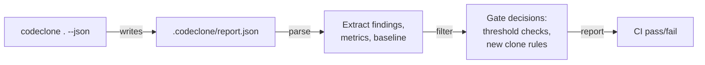

## What it is

CodeClone produces deterministic, schema-versioned JSON reports via the `--json` flag. The report captures the complete structural analysis state: clone findings, metrics, dependencies, health scores, and baseline-relative deltas. The schema version (`REPORT_SCHEMA_VERSION: 3.1`) is stable within a CodeClone release; breaking changes require a new major version.

JSON output is designed for programmatic consumption—CI gates, metric dashboards, IDE integrations, and cross-repository analysis. Each field is deterministic: the same codebase analyzed twice produces byte-identical JSON (modulo timestamps).

## When to use it

Use `--json` for:
- **CI pipelines**: Parse findings, gate on thresholds, feed downstream tools
- **Dashboards**: Aggregate metrics across multiple repositories
- **IDE plugins**: Stream findings to editors without invoking full HTML rendering
- **Baseline comparisons**: Normalize reports across time for trend analysis
- **Machine learning**: Feed structured finding data into learning systems

Do not use JSON when you need:
- Human-readable summaries (use `--text` or `--md`)
- Interactive exploration (use `--html`)
- SARIF compliance for static-analysis workflows (use `--sarif`)

## Basic workflow



Run analysis and generate JSON in one step:

```bash
codeclone . --json [FILE]
```

If FILE is omitted, CodeClone writes to `.codeclone/report.json`. The report is valid JSON and contains these top-level keys:
- `report_schema_version` — schema version string (matches `REPORT_SCHEMA_VERSION`, currently `3.1`)
- `meta` — run metadata: `codeclone_version`, `project_name`, `scan_root`, `python_version`, `analysis_mode`, `analysis_thresholds`, `analysis_profile`, `baseline`, `cache`, `runtime`
- `inventory` — scanned inventory: `files`, `code` counts, and `file_registry`
- `findings` — object with `summary` and `groups[]`; each group carries type, locations, risk, and `novelty` (`new` / `known`)
- `metrics` — object with `summary` and per-family `families` (complexity, coupling, cohesion, …)
- `derived` — `suggestions`, `overview`, `hotlists`, `module_map`, `review_queue`
- `integrity` — deterministic `canonicalization` and the `digests` hierarchy: `observation`, `analysis_facts`, `comparison`, `evaluation`, `envelope`. Each tier is an object with `kind`, `algorithm`, `digest_version` and `value`, and hashes the tier before it. Read `analysis_facts` to identify the analysed code, `comparison` to identify the run, and `envelope` to identify the exact document

## Key commands

| Command | Effect | Output |
|---------|--------|--------|
| `codeclone . --json` | Analyze and write to default path | `.codeclone/report.json` |
| `codeclone . --json FILE` | Analyze and write to custom path | `FILE` |
| `codeclone . --json --baseline FILE` | Compare against baseline | JSON with `novelty` (`new` / `known`) per finding group |
| `codeclone . --json --ci` | Preset for CI (quiet, color off) | `.codeclone/report.json` |
| `codeclone . --json --fail-on-new --ci` | Gate: fail if any new findings | Exit code 3 if violated |

## Common mistakes

1. **Assuming JSON is human-readable**: JSON is not designed for grep or manual review. Pipe to `jq` for filtering, or use `--md`/`--text` for human audiences.

2. **Ignoring schema version**: Always validate `report_schema_version` matches your parser's supported schema. Breaking changes in a future major release may shift field names.

3. **Not comparing against baseline**: The `novelty` field requires `--baseline FILE`. Without it, all findings appear novel. Always ground CI gates in baseline-aware decisions.

4. **Parsing incomplete JSON during analysis**: JSON is written atomically after analysis completes. Do not attempt to parse `.codeclone/report.json` while `codeclone` is still running.

5. **Mixing report formats in CI**: Do not parse `--json` output from HTML or Markdown reports. Each format is independent; use the format you requested.

## Next steps

- **Integrate with CI**: Read [Development guide](../guides/development.md) for baseline and gate setup in GitHub Actions, GitLab CI, or other platforms.
- **Script analysis**: Use `jq` to extract and filter finding groups: `jq '.findings.groups[] | select(.novelty == "new")' report.json`
- **Audit trail**: Combine JSON output with `--audit-json` to inspect the controller workspace history and decision logs.
