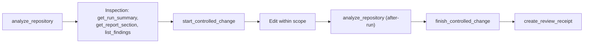

## Overview

CodeClone exposes structural analysis and change control through MCP (Model Context Protocol) tools. These tools enable AI assistants and agents to analyze Python repositories deterministically, manage edit scopes, and verify changes against architectural contracts.

All MCP tools require an absolute repository root path. Relative paths like `'.'` are rejected. MCP respects cache policy settings (`reuse` or `off`); analysis runs are registered as the latest session-local run when complete.

The server is started with the `codeclone-mcp` launcher — see the
[CLI reference](cli.md) for its transports and options.



## Tool groups

| Group | Purpose | Entry point |
|-------|---------|-------------|
| **Analysis** | Run deterministic CodeClone analysis on repositories or changed paths | `analyze_repository`, `analyze_changed_paths` |
| **Inspection** | Retrieve analysis results, implementation context, and summaries | `get_run_summary`, `get_report_section`, `get_implementation_context` |
| **Change Control** | Declare intent, compute blast radius, verify patches, and close edits | `start_controlled_change`, `finish_controlled_change`, `manage_change_intent`, `check_patch_contract`, `get_blast_radius` |
| **Triage** | Production-first review and finding discovery | `get_production_triage`, `list_findings`, `list_hotspots` |
| **Focused checks** | Narrower alternatives to `list_findings` for one finding family | `check_clones`, `check_cohesion`, `check_complexity`, `check_coupling`, `check_dead_code`, `check_authority`, `get_finding`, `get_remediation` |
| **Engineering Memory** | Retrieve, govern, and inspect evidence-linked repository knowledge | `get_relevant_memory`, `manage_engineering_memory`, `query_engineering_memory`, `get_memory_projection_page` |
| **Audit and receipts** | Durable, replayable evidence from the audit trail | `create_review_receipt`, `get_review_receipt`, `get_patch_trail`, `get_blast_artifact`, `validate_review_claims` |
| **Navigation** | Drill into facets, compare runs, and manage session state | `get_implementation_context_page`, `compare_runs`, `clear_session_runs` |
| **Other** | Gates, PR summaries, and reviewed-finding bookkeeping | `evaluate_gates`, `generate_pr_summary`, `list_reviewed_findings`, `mark_finding_reviewed`, `query_platform_observability` |

## Tools

### Analysis Tools

**`analyze_repository(root)`**
Run a deterministic CodeClone analysis on the repository at `root` and register the result as the latest MCP session run. Returns metrics, findings, and artifact locations. Use as the first step in any workflow. The analysis cache is not a per-call option: its location and size limit come from `[tool.codeclone]` in `pyproject.toml`, and the MCP reads that cache without ever writing it.

**`analyze_changed_paths(root, changed_paths | git_diff_ref)`**
Analyze only changed files from an explicit `changed_paths` list or a `git_diff_ref` revision (mutually exclusive). Faster than full analysis for PR-style review. Response includes a `next_tool` hint suggesting which inspection tool to use.

### Inspection Tools

**`get_run_summary(run_id)`**
Return a compact snapshot of a stored run (latest or specified by 8-char short id or full digest). Includes health score, top findings, and artifact locations.

**`get_report_section(section, family, limit, ...)`**
Retrieve one bounded canonical report section by name; `section` defaults to `meta`. Sections: `meta`, `inventory` (file registry), `findings` (grouped by family when specified), `metrics`, `metrics_detail` (with pagination), `changed`, `derived`, `module_map`, `integrity`. The whole report document is not served over MCP — the withdrawn `all` section answers with a typed refusal (`status: "unsupported_section"`) that names the bounded sections and the on-disk route. The `codeclone://latest/report.json` and `codeclone://runs/{run_id}/report.json` resources served that same whole document and are withdrawn with it: neither is registered any more, and reading either URI answers with a typed refusal (`status: "removed_resource"`) naming the same routes. For the full document, generate it with `codeclone <root> --json .codeclone/report.json` and read the file.

**`get_implementation_context(root, paths, symbols, include, ...)`**
Return deterministic, bounded implementation context for explicit repo-relative `paths` or `module:symbol` qualnames (via `symbols`) from an existing run. Projects module dependencies, API surfaces, callers, blast radius, cache origin, and workspace freshness. Does not authorize edits or re-analyze.

**`get_implementation_context_page(root, run_id, context_projection_digest, facet, ...)`**
Fetch an exact implementation-context facet page (e.g., `public_surface`, `callers`, `trajectories`) from the session-local projection artifact. Requires the `context_projection_digest` returned by `get_implementation_context`.

### Change Control Tools

**`start_controlled_change(root, scope, intent, ...)`**
Pre-edit workflow: declare intent, check for concurrent edits, and compute blast radius. Requires a valid analysis run. Returns `intent_id` (pass to `finish_controlled_change`), blast radius, patch budget, and workspace state. Status may be `active` (proceed to edit), `queued` (wait for other edits), `blocked` (scope overlap), or `needs_analysis` (no run found).

**`finish_controlled_change(intent_id, changed_files, after_run_id, ...)`**
Post-edit pipeline: perform hygiene checks, scope verification, contract validation, and claims review. Returns receipt, scope status, and `intent_id` cleared if accepted. Required after every edit declared with `start_controlled_change`. For Python structural changes, pass `after_run_id` from a fresh analysis run.

**`manage_change_intent(action, ...)`**
Manage the agent change-intent lifecycle for the current MCP session and the optional workspace registry. Actions: `list_workspace`, `declare`, `get`, `check`, `clear`, `renew`, `promote`, `recover`, `gc_workspace`, `reset_workspace`. Used for queue/promote/recover flows that `start_controlled_change`/`finish_controlled_change` do not expose directly.

**`check_patch_contract(mode, ...)`**
Pre-edit budget query (`mode="budget"`) or post-edit structural verification (`mode="verify"`). Composes stored runs, gate evaluation, run comparison, and the session-local change intent without running analysis or mutating repository state.

**`get_blast_radius(paths)`**
Return the deterministic structural risk boundary for changing the given files: direct dependents, clone cohort members, coverage gaps, do-not-touch paths, and review-only context. Derived from the canonical report; no new analysis is performed.

### Triage Tools

**`get_production_triage(run_id)`**
Production-first triage view: health, cache freshness, production hotspots, and suggestions. Prioritizes issues likely to affect production over global metrics. Use as default first-pass review on noisy repositories.

**`list_findings(run_id, family, scope, limit, ...)`**
List canonical finding groups with deterministic ordering and optional filters. Returns compact summary cards by default. Prefer `list_hotspots` or focused `check_*` tools for first-pass triage.

**`list_hotspots(run_id, ...)`**
Return one of the derived CodeClone hotlists for the latest or specified run, using compact summary cards by default. Prefer this for first-pass triage before broader `list_findings` calls.

### Focused Check Tools

Narrower alternatives to `list_findings` when only one finding family is needed, all reading from a compatible stored run:

**`check_clones`**, **`check_cohesion`**, **`check_complexity`**, **`check_coupling`**, **`check_dead_code`**
Return clone / cohesion / complexity / coupling / dead-code findings respectively.

**`check_authority`**
Return active canonical semantic-authority violation findings for one run, with deterministic ordering and bounded detail. See [Semantic authority governance](../concepts/semantic-authority.md).

**`get_finding(finding_id, detail)`**
Return a single canonical finding group by short or full id. Unknown ids return a structured `status="not_found"` response instead of an error.

**`get_remediation(finding_id)`**
Return actionable remediation guidance for a single finding. Returns `status="no_guidance"` instead of an error when no remediation packet exists.

### Engineering Memory Tools

**`get_relevant_memory(root, scope, intent_id, ...)`**
Return ranked, evidence-linked engineering memory for the declared edit scope. Read-only; does not mutate the memory database.

**`manage_engineering_memory(root, action, ...)`**
Engineering memory governance for agents. Actions: `refresh_from_run`, `record_candidate`, `promote_experience`, `validate_claims`, `propose_from_receipt`, `rebuild_semantic_index`, `rebuild_trajectories`, `enqueue_projection_rebuild`, `projection_rebuild_status`, `run_projection_jobs_once`. Approve, reject, and archive are not available to agents.

**`query_engineering_memory(mode, ...)`**
Mode-based engineering memory inspection router. Modes include `search`, `get`, `for_path`, `for_symbol`, `stale`, `drafts`, `coverage`, `status`, `trajectory_status`, `trajectory_search`, `trajectory_get`, `experience_get`, `trajectory_anomalies`, `trajectory_agents`, and `trajectory_dashboard`. Read-only.

**`get_memory_projection_page(cursor, ...)`**
Return an exact page for a `get_relevant_memory` omitted tail using the digest-bound cursor returned in that response. Fails closed if the underlying memory projection no longer matches the cursor identity.

### Audit and Receipt Tools

**`create_review_receipt(...)`**
Generate a deterministic, auditable review receipt from stored MCP state: report provenance, intent scope, blast radius, reviewed findings, patch-contract status, and human decision points. Markdown or JSON output; does not mutate repository state.

**`get_review_receipt(run_id, receipt_digest)`**
Fetch a durably stored review receipt from the audit trail exactly as it was created. Read-only.

**`get_patch_trail(run_id, patch_trail_digest)`**
Fetch the full forensic patch trail from the audit trail: declared/changed/untouched files, scope check, verification, workspace hygiene, and evidence. Read-only.

**`get_blast_artifact(run_id, blast_artifact_id, ...)`**
Fetch a durably stored start-time blast artifact from the audit trail, exactly as it was persisted when `start_controlled_change` produced its slim summary. Read-only.

**`validate_review_claims(review_text, ...)`**
Validate cited review text against canonical report semantics: catches Security Surfaces called vulnerabilities, report-only signals called CI failures, known baseline debt called new, and other deterministic mischaracterizations.

### Navigation Tools

**`generate_pr_summary(run_id, changed_files, format)`**
Generate a PR-friendly CodeClone summary. Format `markdown` (default) produces LLM-facing compact output; `json` is for machine post-processing.

**`compare_runs(run_id_a, run_id_b)`**
Compare two runs by finding groups and health deltas. Returns incomparable when repository roots or settings differ.

**`help(topic)`**
Bounded workflow and contract guidance with doc links. `topic=overview` returns a compact topic index. Complexity level `compact` adds anti-patterns; `normal` (default) includes warnings.

**`clear_session_runs()`**
Clear all in-memory analysis runs and ephemeral session state for the MCP server process.

### Other Tools

**`evaluate_gates(run_id, ...)`**
Evaluate CodeClone gate conditions against an existing run without modifying baselines or exiting the process.

**`list_reviewed_findings(run_id)`**
List in-memory reviewed findings for the current or specified run.

**`mark_finding_reviewed(finding_id, run_id)`**
Mark a finding reviewed in this MCP session only; cleared on process restart or `clear_session_runs`.

**`query_platform_observability(section, ...)`**
Read-only sectioned diagnostics over CodeClone's own runtime telemetry (not part of user-facing repository analysis). Intended for CodeClone maintainers, not for user-facing quality claims about a repository.

## Inputs and outputs

### Inputs

All tools accept an absolute repository root (required for most tools). Analysis tools accept a cache policy: `reuse` (use cached results if fresh) or `off` (ignore cache). Change-control tools require an existing analysis run and declare a `scope` dict specifying affected file patterns. Inspection tools take a `run_id` (8-char short id or full digest, or `latest` for the session-local run).

### Outputs

Analysis tools return a `run_id`, artifact locations (JSON, HTML, SARIF), and canonical result structures. Change-control tools return an `intent_id` for pairing `start` and `finish` calls. Inspection tools return structured data: summaries (JSON), sections (paginated results), or implementation-context projections. All responses include a `next_tool` hint when appropriate.

## Error behavior

| Condition | Response |
|-----------|----------|
| Absolute root not provided | Rejected at validation; no tool execution |
| No analysis run exists | `start_controlled_change` returns `status: "needs_analysis"` |
| Concurrent intent exists | `start_controlled_change` returns `status: "queued"` |
| Scope already dirty | `start_controlled_change` may return `status: "blocked"` unless recovery flag is set |
| Missing after-run evidence | `finish_controlled_change` returns `status: "unverified"` with `next_step` hint |
| Scope mismatch on finish | `finish_controlled_change` returns `status: "violated"` with details |

If a step cannot proceed, the response includes `next_step` and/or `user_action_required` to guide recovery.

## Examples

### Analyze a repository

```python
result = analyze_repository(root="/absolute/path/to/repo")
print(f"Run ID: {result['run_id']}")
print(f"Health: {result['health_score']}")
print(f"Report: {result['artifacts']['report_path']}")
```

### Declare a change intent and get blast radius

```python
intent = start_controlled_change(
    root="/absolute/path/to/repo",
    scope={"allowed_files": ["src/services/auth.py"]},
    intent="refactor service authentication",
)
print(f"Intent ID: {intent['intent_id']}")
print(f"Edit allowed: {intent['edit_allowed']}")
print(f"Blast radius: {intent['blast_radius']}")
```

### Get production hotspots

```python
triage = get_production_triage(run_id="latest")
for hotspot in triage["hotspots"]:
    print(f"{hotspot['path']}: {hotspot['issue']}")
```

### Finish a controlled change

```python
receipt = finish_controlled_change(
    intent_id="abcd1234",
    changed_files=["src/services/auth.py"],
    after_run_id="run_xyz789",
)
print(f"Status: {receipt['status']}")
print(f"Scope check: {receipt['scope_check']['status']}")
```
