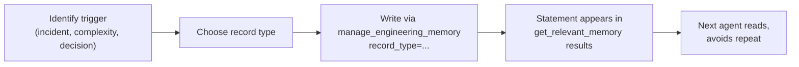

## What it is

Engineering Memory stores durable facts about your codebase as **records** — evidence-linked observations about architecture, risks, decisions, and changes. Each record has a type that signals its purpose and how agents should use it.

Record types distinguish what kind of knowledge a note encodes: is it a historical fact, a risk, a decision we made, or a design rule? The type shapes how Memory surfaces and retrieves that fact for future agents.

## When to use it

Use record types when writing to Engineering Memory via MCP:

- **During edits**: Record findings about tradeoffs, non-obvious root causes, or patterns to avoid next time.
- **After verification**: Document what you learned in a controlled change so the next agent doesn't repeat the diagnosis.
- **For team decisions**: Capture architectural choices, protocol rules, or integration constraints that affect future work.

Don't write memory for trivial edits (typo fix, one-line fix, nothing to relearn).

## Basic workflow



After `start_controlled_change` grants edit permission:

1. Perform your work and encounter a trigger (complexity, decision, incident).
2. Select the record type that best fits.
3. Call `manage_engineering_memory(action='record_candidate', record_type='...', statement='...', subject_path='...')`.
4. Statement will be ranked and surfaced to future agents working in that scope.

## Key commands

Write a record immediately during edit:

```python
manage_engineering_memory(
    root="/path/to/repo",
    action="record_candidate",
    record_type="risk_note",
    statement="Database migration requires fsync per commit; loss-intolerant stores use FULL, ephemeral intents use NORMAL.",
    subject_path="codeclone/memory/schema.py",
)
```

Or batch memory candidates after `finish_controlled_change`:

```python
finish_controlled_change(
    intent_id="...", changed_files=[...], after_run_id="...", propose_memory=True
)
```

Retrieve memory before editing:

```python
get_relevant_memory(root="/path/to/repo", scope=[...])
```

Query memory for specific lanes or paths:

```python
query_engineering_memory(
    root="/path/to/repo", mode="for_path", path="codeclone/memory/..."
)
```

## Record types

| Type | When to use | Example |
|------|-------------|---------|
| `architecture_decision` | Major structural choice affecting modules, layers, or interfaces. | "Memory store is SQLite, not PostgreSQL, because offline CLI agents must not require a server." |
| `change_rationale` | Why a specific change was made; what problem it solves; alternatives ruled out. | "Batch insert reduces N+1 writes in experience distiller from 18 per record to 1." |
| `contract_note` | Clarification or warning about a contract, schema, or API expectation not obvious from code. | "MemoryRecord.provenance fields must be populated at write time, never mutated later." |
| `contradiction_note` | Two records or observations that conflict; signals stale memory or outdated assumptions. | "Schema v1.6 docs say column X is required, but v1.7 migration makes it optional." |
| `document_link` | Reference to a related internal guide, spec, or decision doc outside chat. | "See specs/phase-21-FINISH-RESUME.md for detector wiring plan." |
| `human_note` | Explicit human-authored context (not inferred by agents). | "Product team decided: do not store PII in memory records." |
| `module_role` | The purpose or responsibility of a module within the architecture. | "codeclone/memory/embedding/ handles vector conversion and index writes only; does not query." |
| `protocol_rule` | A governance rule, convention, or hard requirement that applies across code. | "All schema migrations must reuse _add_column_if_missing + _record_schema_migration." |
| `public_surface` | An MCP tool, CLI command, or API surface and its contract. | "get_relevant_memory(root=..., scope=...) returns ranked, evidence-linked memory for an edit scope." |
| `risk_note` | A known fragility, performance issue, or correctness invariant to preserve. | "fastembed.embed() yields numpy.float32, not Python float; vector coercion must guard on numbers.Real." |
| `stale_marker` | A marker that a prior record is outdated or superseded by a newer one. | "Old: memory stores on disk-inventory anchors. Current: must be commit-anchored." |
| `test_anchor` | A test file or scenario that validates a critical invariant or contract. | "tests/test_memory_durability.py validates fsync and unclean exit recovery." |

## Common mistakes

**Overwriting memory instead of recording a note**: Memory is append-only. If you need to correct a fact, write a `contradiction_note` or `stale_marker`, not a replacement. Agents need to see the history.

**Vague statements**: "Fixed a bug" or "Improved performance" are not specific enough. Include the root cause, the metric, and why it matters.

**Treating chat as memory**: Chat context shrinks, sessions end, and the next agent won't see it. Use MCP `record_candidate` for anything the team needs to remember.

**Forgetting `subject_path`**: Always specify the repo-relative file path you touched. Memory uses this to rank relevance for future scope declarations.

**Ignoring corroboration_status**: When `get_relevant_memory` returns a record with `corroboration_status: "unverified"` or `"draft"`, do not assert it as established fact. Read the contradiction notes first.

## Next steps

- **Write your first record**: Use `manage_engineering_memory` with `record_type="change_rationale"` the next time you make a non-trivial edit.
- **Query memory before editing**: Call `get_relevant_memory(scope=[...])` to see what prior agents learned in that scope.
- **Read contradiction notes**: If `get_relevant_memory` flags a contradiction, investigate and record clarification or resolution.
- **See also**: [Engineering Memory concepts](../concepts/engineering-memory.md); MCP help: `help(topic="engineering_memory")`.
