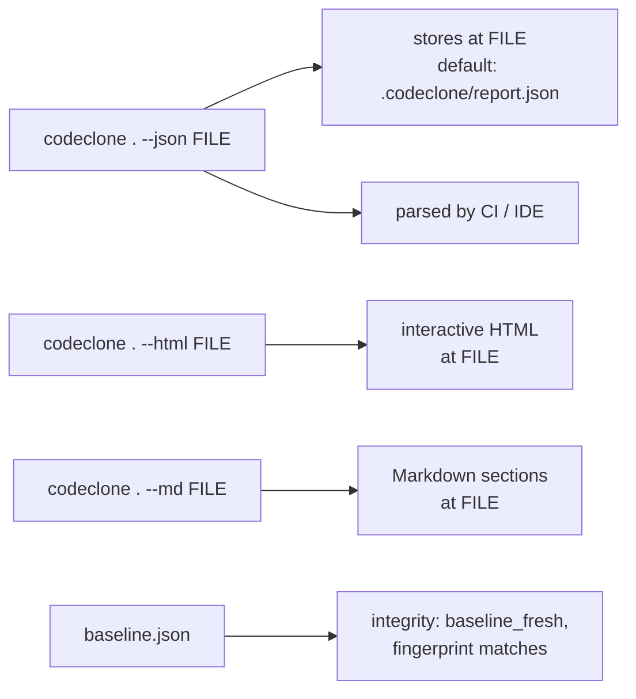

# Report reference

## What it is

CodeClone generates structural analysis reports across five formats: JSON, HTML, Markdown, SARIF, and plain text. A report captures module dependencies, findings (clones, complexity, coupling, cohesion, coverage gaps, dead code), metrics, and file inventory at a specific moment in your codebase.

Each report includes:

- **Metrics**: lines of code, module counts, health score (aggregates complexity, coupling, cohesion, clones, coverage, dead code, and dependency depth)
- **Findings**: ranked structural issues by severity
- **Inventory**: detailed module and file registry with health contributions
- **Integrity** (JSON only): baseline alignment and cache freshness markers

## When to use it

Use reports to:

- **Baseline integration**: Commit `codeclone.baseline.json` before major refactors to track regressions
- **CI gates**: Pipe JSON output to CI for automated threshold checks
- **Team review**: Share HTML reports for visual code-health assessment
- **Markdown integration**: Embed findings in pull-request descriptions
- **Machine parsing**: Consume JSON schema (v2.12) or SARIF for IDE plugins

## Basic workflow



## Key commands

| Flag | Output | Default path | Use when |
|------|--------|--------------|----------|
| `--json FILE` | Structured report (schema v2.12) | `.codeclone/report.json` | Parsing or CI gates |
| `--html FILE` | Interactive dashboard | `.codeclone/report.html` | Team review or drill-down |
| `--md FILE` | Markdown findings and metrics | `.codeclone/report.md` | PR descriptions or docs |
| `--sarif FILE` | SARIF v2.1.0 format | `.codeclone/report.sarif` | IDE / SIEM integration |
| `--text FILE` | Plain-text summary | `.codeclone/report.txt` | Quick terminal review |

All flags are bare command options: `codeclone . --json my-report.json` (not a "codeclone report" subcommand).

## Examples

**Generate JSON for CI:**
```bash
codeclone . --json report.json && jq '.metrics.summary.health.score' report.json
```

**Compare against baseline:**
```bash
codeclone . --json current.json
# Baseline is `codeclone.baseline.json` (auto-loaded)
# meta.baseline records loaded/status/fingerprint_version; meta.cache records freshness
```

**Export for IDE:**
```bash
codeclone . --sarif findings.sarif
# IDE plugin parses SARIF and highlights issues inline
```

## Common mistakes

- **Assuming `--json` prints to stdout**: `codeclone . --json` (no path) writes to the default file `.codeclone/report.json`; it does not stream to stdout. Pass an explicit path to override the location.
- **Stale baseline**: Moving `codeclone.baseline.json` or regenerating without review breaks integrity. Baseline is a contract—commit it.
- **Ignoring health weights**: Health score balances 7 dimensions (clones 25%, complexity 20%, cohesion 15%, coupling 10%, coverage 10%, dead code 10%, dependencies 10%). A single high spike does not drive score alone.
- **Cache staleness**: If cache is stale (reported in integrity), re-run analysis. Cache is not refreshed automatically.

## Next steps

- Automate baseline updates in your CI: store `codeclone.baseline.json` per major branch
- Integrate JSON reports into dashboards (schema v2.12 is stable)
- Use MCP tools (`get_run_summary`, `get_report_section`, `compare_runs`) for programmatic access
