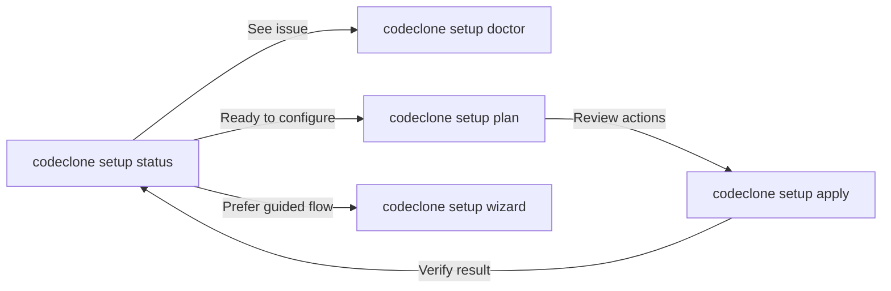

## What it is

`codeclone setup` is a readiness controller that probes your repository for CodeClone installation, configuration, and runtime dependencies. It generates a deterministic plan of recommended actions and applies them when confirmed.

The setup commands do not modify your code. `setup apply` writes only two files: it merges the `[tool.codeclone]` section into your `pyproject.toml` and appends CodeClone cache paths to `.gitignore`. It does not create a baseline, cache, or audit/intent database — those artifacts are produced later by analysis and controlled-change runs.

## When to use it

Run `codeclone setup` to:
- **Check readiness** before first use: `codeclone setup status`
- **Diagnose issues** in detail: `codeclone setup doctor`
- **Preview changes** safely: `codeclone setup plan` then `codeclone setup apply --dry-run`
- **Apply configuration** interactively or non-interactively
- **Explore options** with guided workflow: `codeclone setup wizard`

## Basic workflow



**Typical flow:**

1. Check readiness: `codeclone setup status`
2. Preview recommended actions: `codeclone setup plan`
3. Apply interactively (requires TTY): `codeclone setup apply`
4. Verify: `codeclone setup status`

**Non-interactive flow (CI/automation):**

```bash
codeclone setup plan --root /path/to/repo
codeclone setup apply --yes --root /path/to/repo
```

## Key commands

| Command | Purpose | Output | Notes |
|---------|---------|--------|-------|
| `status` | Probe readiness across 14 capabilities (4 groups), each scored on installation/configuration/runtime axes | Table of capabilities, readiness states | Default if no command given; read-only |
| `doctor` | Detailed diagnostics for each capability | Status table + per-capability evidence panels | Verbose; for troubleshooting |
| `plan` | Compute configuration actions without writing | Actions list with deterministic plan ID | Preview mode; no files changed |
| `apply` | Execute ready actions from current plan | Applied actions and result status | Requires confirmation (TTY) or `--yes` |
| `wizard` | Guided interactive workflow | Menu-driven steps: plan → confirm → apply | Combines plan, confirmation, and apply |

**Common flags:**

- `--root PATH` — Repository root (default: `.`)
- `--json` — Output as JSON (status, doctor, plan, apply)
- `--dry-run` (apply only) — Preview writes without modifying files
- `--yes` (apply only) — Skip confirmation prompt (required non-interactively)
- `--plan-id ID` (apply only) — Bind apply to a specific plan; refuses if stale

## Common mistakes

**"Apply requires confirmation"**

Interactive apply needs a TTY or `--yes` flag. Provide confirmation:
```bash
codeclone setup apply --yes
```

**"Plan is stale"**

Repository changed between `setup plan` and `setup apply`. Recompute:
```bash
codeclone setup plan  # Get fresh plan_id
codeclone setup apply --plan-id <new_id>
```

**Using apply-only flags on other commands**

`--dry-run`, `--yes`, `--plan-id` only work with `apply`. Remove them or use `apply`:
```bash
# Wrong:
codeclone setup status --yes

# Right:
codeclone setup apply --yes
```

**Missing pyproject.toml**

Some actions (e.g., adding audit configuration) require `pyproject.toml`. Create one:
```bash
touch pyproject.toml
codeclone setup plan
```

## Next steps

- Read the [engineering memory documentation](../concepts/engineering-memory.md) to understand memory initialization
- Use `codeclone setup --help` for all available flags
- Run `codeclone setup doctor` to diagnose any configuration issues
- After setup completes, run `codeclone . --update-baseline` to generate your baseline
