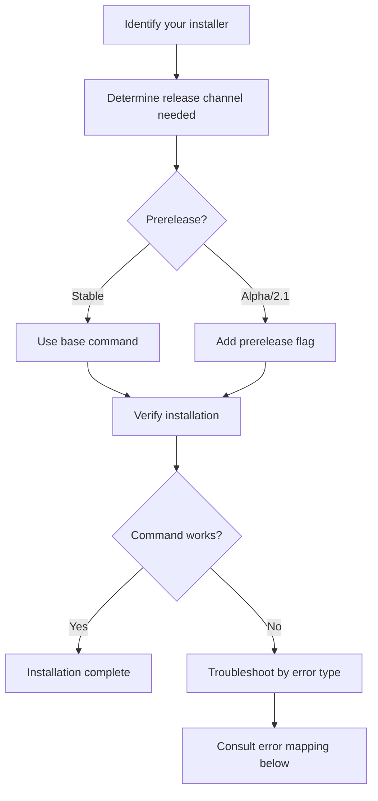

# Installation troubleshooting

## What it is

CodeClone is distributed via PyPI and installed through Python package managers. This guide covers common installation issues, version selection, and resolution steps for both stable releases and prerelease versions.

CodeClone 2.1 is available as an alpha prerelease (`2.1.0a1`). The stable release series uses standard semantic versioning.

## When to use it

Use this guide if you encounter:

- Installation failures or dependency conflicts
- Version resolution issues (wrong release channel)
- Command-line tool not found after installation
- MCP server connectivity problems
- Permission or environment setup issues

## Basic workflow



## Key commands

| Installer | Stable release | Prerelease (2.1) |
|-----------|---|---|
| **uv** | `uv tool install codeclone` | `uv tool install --prerelease allow codeclone` |
| **pip** | `pip install codeclone` | `pip install --pre codeclone` |
| **pipx** | `pipx install codeclone` | `pipx install --pre codeclone` |

Verify installation with:
```bash
codeclone --version
```

For MCP server usage, confirm the bundled `codeclone-mcp` entry point is on your PATH:
```bash
codeclone-mcp --help
```

## Common mistakes

### Mistake 1: Using pip's `--pre` syntax with uv

**Error:** Installation resolves wrong version or fails.

**Wrong:**
```bash
uv tool install --pre codeclone  # This is pip syntax, not valid for uv
```

**Correct:**
```bash
uv tool install --prerelease allow codeclone  # uv's correct flag
```

The `uv` package manager uses `--prerelease allow`, not `--pre`.

### Mistake 2: Installing stable when prerelease is needed

**Problem:** You need features in 2.1 alpha, but a plain `uv tool install codeclone` resolves the latest stable (1.x).

**Solution:**
```bash
uv tool install --prerelease allow codeclone  # Explicitly allow prerelease
```

### Mistake 3: Confusing MCP as a separate tool

**Problem:** "MCP server not found" after installation.

**Fact:** The MCP server is bundled with CodeClone. It does not require a separate install.

**Check:**
```bash
codeclone-mcp --help  # Confirms the bundled MCP server binary is installed
```

If the command is not found, ensure CodeClone was installed successfully and your PATH is set correctly. `codeclone-mcp` starts the server (default transport `stdio`); MCP clients launch it for you — you do not run it manually to "list tools".

### Mistake 4: Wrong directory for CLI invocation

**Problem:** "codeclone: command not found" despite successful installation.

**Causes:**
- Virtual environment not activated (if using `pip` in a venv)
- Installation used `--user` flag; `~/.local/bin` not in PATH
- Shell cache needs refresh

**Fix:**
```bash
# If using virtual environment, activate it first
source venv/bin/activate  # Linux/macOS
# or
venv\Scripts\activate     # Windows

# Refresh shell cache
hash -r  # bash/zsh
rehash   # zsh only
```

## Next steps

- **Run CodeClone:** `codeclone .` to analyze the current repository
- **Set up IDE:** Configure VS Code or other IDE integrations
- **Review reports:** Generated reports appear in `.codeclone/` by default
- **MCP integration:** Use CodeClone with Claude Code or other MCP clients

For additional help, see [https://github.com/orenlab/codeclone/issues](https://github.com/orenlab/codeclone/issues).
