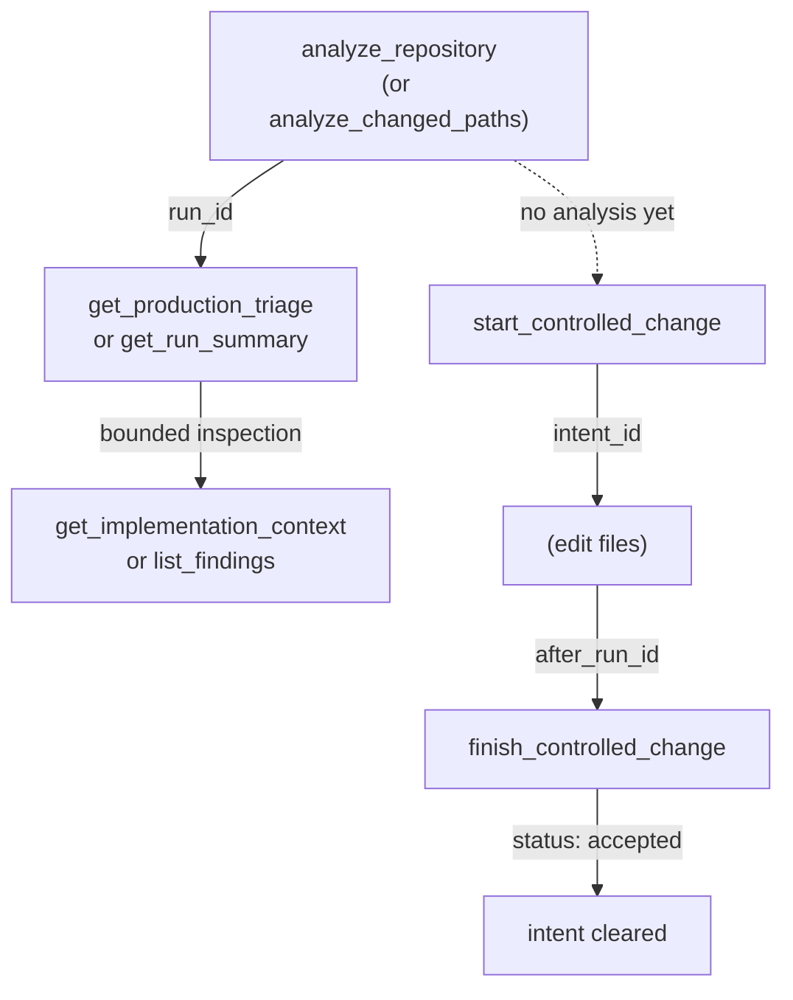

## What it is

CodeClone's MCP interface exposes analysis, change control, and engineering memory as deterministic, workspace-aware tools. The MCP server runs alongside your development process, maintaining a single active change-control intent and caching analysis results within the server session.

## When to use it

Use MCP when you need:
- Bounded analysis before or after code edits
- Deterministic change-control verification with scope tracking
- Implementation context for understanding dependencies and APIs
- Production-first triage views over noisy codebases

## Basic workflow

The core MCP pattern follows three phases:

Analysis caches within the MCP session. Calling `analyze_repository` again on the same root reuses the prior run unless `cache_policy='off'` is set.

## Key commands

| Task | Tool | Notes |
|------|------|-------|
| Full analysis | `analyze_repository(root="/path")` | Requires absolute root; MCP rejects relative paths like '.' |
| PR-style review | `analyze_changed_paths(root="/path", diff_ref="...")` | Analyzes only changed files; includes `next_tool` hints |
| View results | `get_production_triage(run_id=...)` | Production hotspots first; preferred for noisy repos |
| Summary | `get_run_summary(run_id=...)` | Compact snapshot of health, cache freshness, findings |
| Explore scope | `get_implementation_context(root="/path", paths=[...])` | Bounded module, call graph, and blast-radius context |
| Declare intent | `start_controlled_change(root="/path", scope={...})` | Returns `intent_id`, blast radius, budget |
| Verify patch | `finish_controlled_change(intent_id=..., after_run_id=...)` | Scope check, hygiene, verification, receipt |
| List findings | `list_findings(run_id=..., family=...)` | Use focused checks first; avoid broad filters on first pass |
| PR summary | `generate_pr_summary(run_id=..., format='markdown')` | Compact LLM-facing summary of changed-file impact |

## Common mistakes

**Relative paths**: MCP tools require absolute repository roots. Passing `.` or `./src` will be rejected. Use the full filesystem path.

**Session scope collision**: An MCP session holds exactly one active change-control intent. Calling `start_controlled_change` a second time before finishing the first one evicts the first intent with no recovery. Always call `finish_controlled_change` before starting a new change.

**Missing after-run**: Python structural patches must provide `after_run_id` to `finish_controlled_change`. Re-analyze after editing and pass the new run ID; do not reuse the before-run analysis.

**Cache assumptions**: `get_implementation_context_page` returns data from the saved session projection artifact. It does not recompute fresh context. If the result is `not_found` or `mismatch`, the page was not captured in the original analysis.

**Concurrent intents**: If foreign change-control intents overlap your declared scope, either narrow your scope or queue behind the foreign intent. The MCP server reports the overlap in the `start_controlled_change` response.

## Next steps

- Read the [engineering memory documentation](../concepts/engineering-memory.md) to persist findings across sessions.
- Use `help(topic='change_control')` or `help(topic='overview')` in MCP for workflow guidance and anti-patterns.
- Check `get_blast_radius` directly if you need detailed impact scope before committing to a change.
